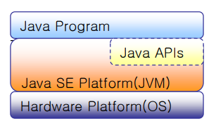

# 01. 자바(Java) 소개

## 객체지향 프로그래밍 (Object Oriented Programming) 언어이다
 
+ 자바의 역사 : 
	* 1991년 Sun Microsystems의 James Gosling에 의해 다양한 가전제품 통합 제어를 위해 최
초 고안됨(Green Project) – OAK라 명명, 프로젝트 실패
    * 1995년 인터넷의 급격한 발전과 더불어 웹에 적용할 수 있는 언어로 탈바꿈
1995년 5월 23일 Java라는 이름으로 공식 발표 – Java 1.0
개발환경 지원 – JDK 1.0(Java Development Kit)
지원 클래스 : 약 250개

    * 2015년 Java 8
	
	* 2020년 Java 15

+ C++ 기반으로 만들어진 언어이긴 하지만, C++처럼 복잡한 형태가 아닌 단순하면
서도 객체지향 개념을 완벽하게 구현할 수 있는 형태로 구성됨

  * 구조체(Struct), 공용체(Union), 포인터(Pointer)를 지원하지 않음
  
  * Garbage Collection 기능을 통한 메모리 자동 관리 등

## 현재 자바는 데스크톱 어플리케이션, 서버 정보시스템, 무선기기와 같이 서로 다른 OS에 배치되어 시스템 개발 및 실행 환경(Platform)으로 제공되고 있다.

# 02. 자바(Java) 특징

## 단순한 문법(Simple)

+ C나 C++에서 프로그래머에게 많은 혼란을 주는 요소(전처리, 포인터, 구조체, 공용체,다중상속 등)들을 제거함

## 객체지향 언어(Object Oriented Language)

+ 추상화, 캡슐화, 상속, 다형성 등과 같은 특성을 완벽하게 지원함

## 플랫폼 독립성(Platform Independence)

+ 소스코드(*.java) 컴파일을 통해 하드웨어 의존적인 바이너리 코드가 중립적인 바이트코드(*.class) 생성

+ 바이트 코드는 JVM(Java Virtual Machine:자바 실행환경)만 있으면 어떠한 시스템에 서도 이를 해석하여 실행 가능

+  “Write Once, Use Anywhere!”

# 03. 자바(Java) 프로그램 종류

+ 데스크톱 Application(Swing)
	* 워드프로세스, 메신저 등과 같이 개인용 PC에서 독립적으로 실행되어 특정한 기능을 수행하도록 작성된 프로그램(CUI/GUI)

+ 웹서버 Application (Servlet/JSP)
	* 웹 클라이언트의 HTTP 요청에 대해 HTML/XML 문서를 동적 생성하고 응답하기 위해 웹 어플리케이션서버에서 실행되는 프로그램
	
+ 스마트폰 Application(안드로이드)
	* 핸드폰 등에 내장되어 실행되는 작은 프로그램

+ 애플릿(Applet)
	* 웹 클라이언트(익스플로러, 파이어폭스 등) 내장되어 실행되는 작은 웹 프로그램
	* 웹 서버로부터 동적 다운로드

# 04. 자바(Java) 플랫폼 종류

+ Java SE(Java Platform - Standard Edition)

	* Desktop이나 Server에서 Java Application/Applet등을 개발, 배치, 실행 할 수 있는 환경을 제공(Software Platform)
	* Java SE Development Kit 다운로드 및 설치 필요
	*  https://www.oracle.com/kr/java/technologies/downloads/
	* Compiler, Interpreter, 표준 API 등 제공
		
+ Java EE(Java Platform - Enterprise Edition)
	* Java SE를 기반으로 대규모 기업용 서버를 구축하고, 실행 할 수 있는 환경을 제공
	* Java EE SDK 다운로드 및 설치 필요
    * https://www.oracle.com/java/technologies/javaee-8-sdk-downloads.html
	* Web Application Server(GlassFish)와 Servlet, JSP, JDBC, DataSource, JPA, JTA, JNDI, RMI, EJB, JMS 등 다수의 API 제공
	
+ JVM(Java Virtual Machine) 구조
	
	

    
