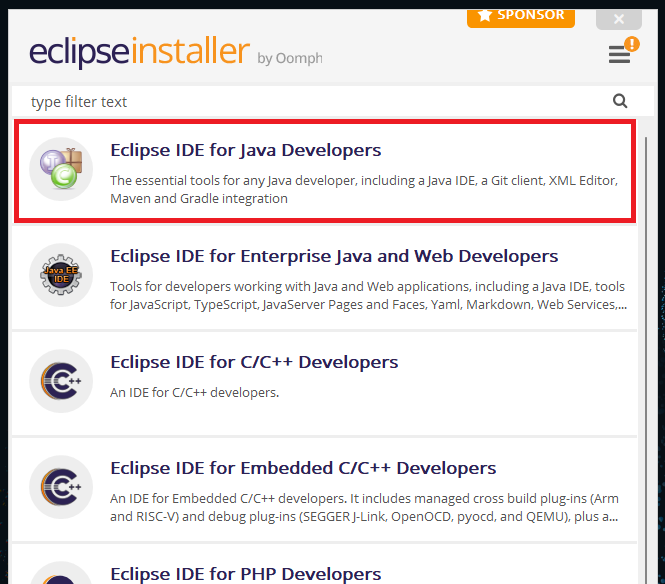
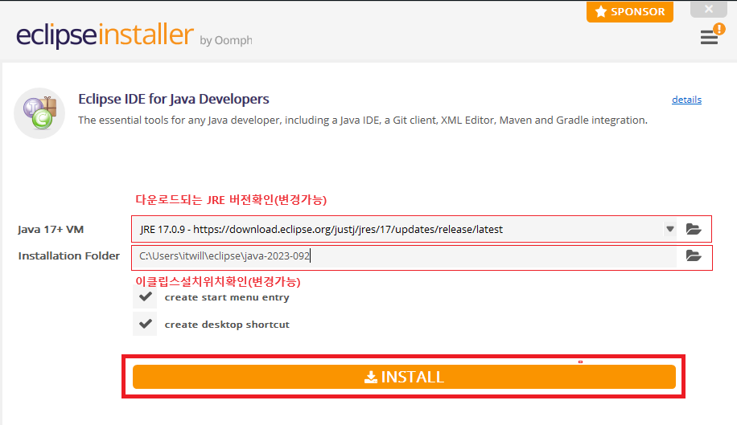
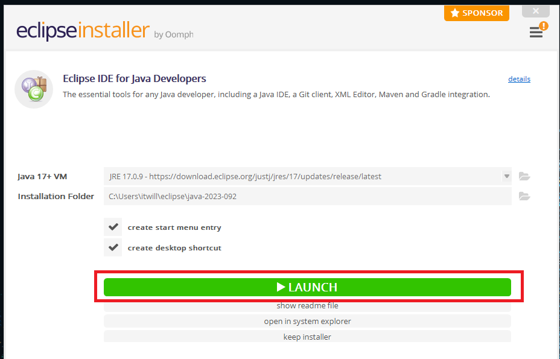
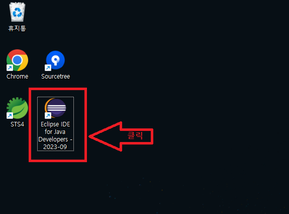
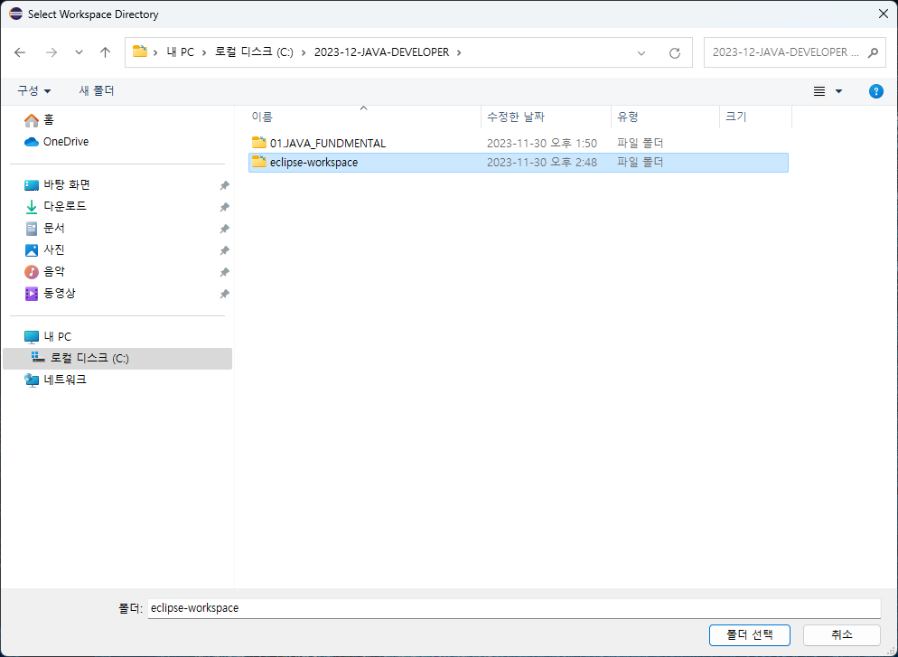
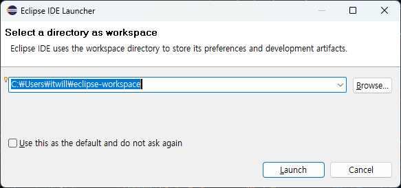
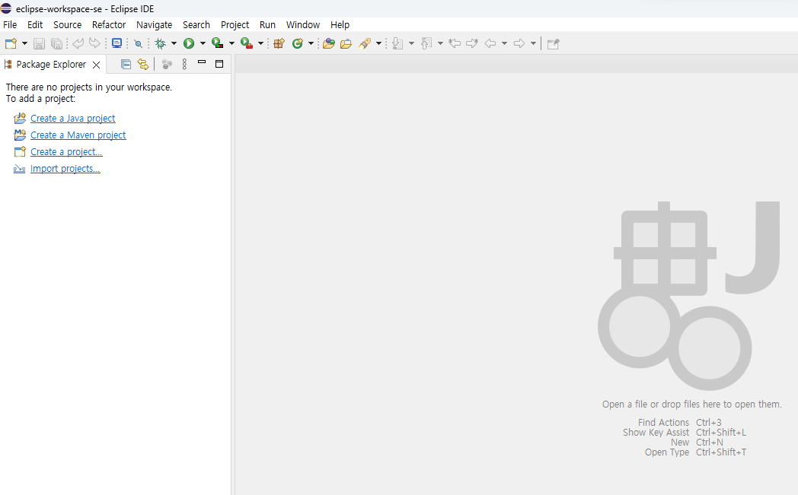

# 02. 자바 개발 및 실행환경 구축

## 1. 자바만 설치 하기

 + Java Development Kit (SE) 다운로드 및 설치
    + https://www.oracle.com/java/technologies/javase-downloads.html
     
 + Java SE API Document 보기
    + https://www.oracle.com/java/technologies/javase-jdk16-doc-downloads.html

## 2. 이클립스(IDE)와 자바 설치 하기

  + 이클립스 다운로드 및 설치
     + https://www.eclipse.org 싸이트접속
       
         
     
     + DownLoad x86_64클릭

         

     + 다운로드받은 eclipse-inst-jre-win64.exe 파일더블클릭

         
       
    
     + Eclipse IDE for Java Developers 클릭
   
          
       
    + INSTALL 클릭
   
      
      
    + LAUNCH 클릭

      + 설치화면에서바로실행
      
      

      + 설치후 바탕화면에생성된 아이콘클릭 실행
      
      

    + 이클립스에서 생성한 프로젝트들이 저장될폴더(eclipse-workspace-se)선택후  lanuch 버튼 클릭
       - browse 버튼을누른후 C 디렉토리 루트에 2023-12-JAVA-DEVELOPER 폴더생성
       - 생성된 2023-12-JAVA-DEVELOPER 폴더하위에 eclipse-workspace-se 라는 이름의 폴더를 생성한다.
         
              
       - eclipse-workspace-se 폴더선택후 lanuch 버튼 클릭
         
                

    + 이클립스실행 초기화면
      
      
