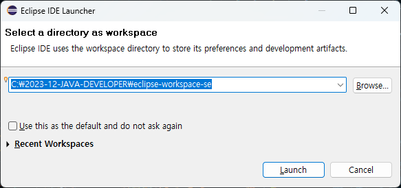
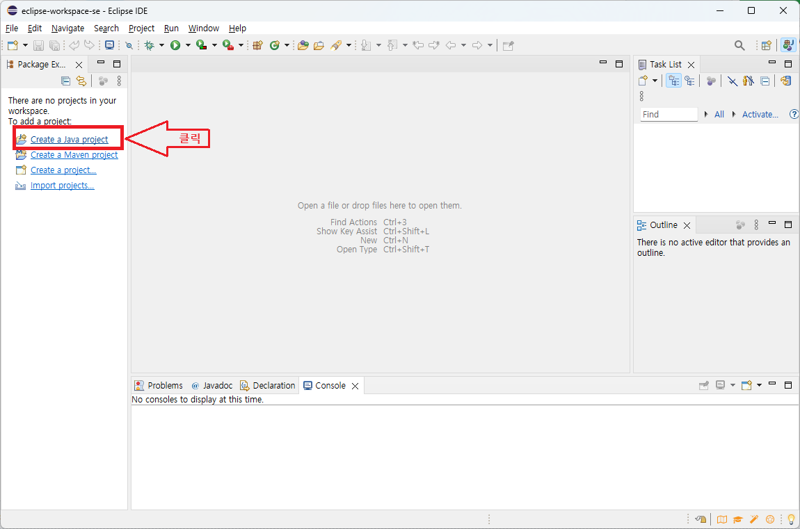
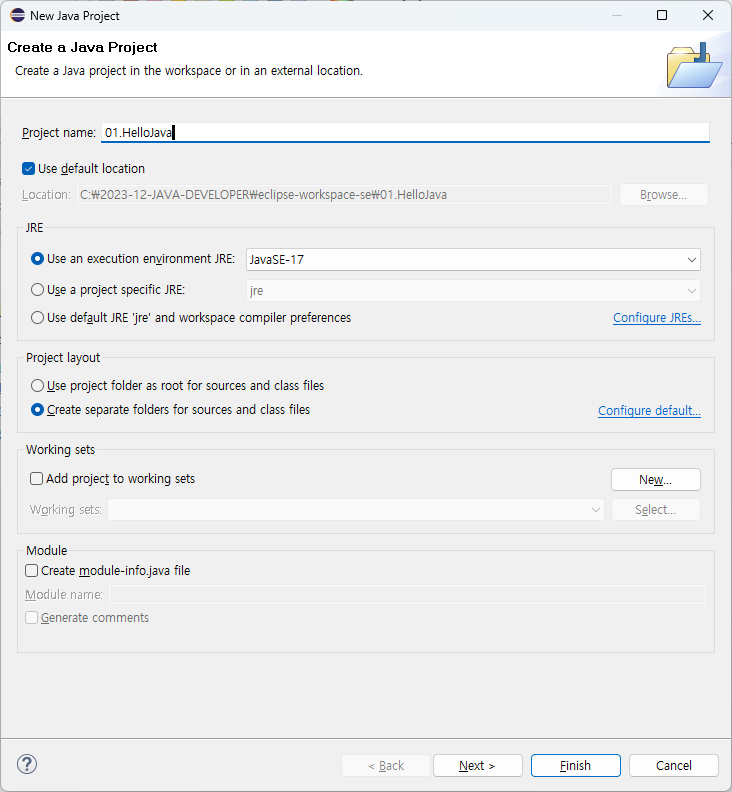
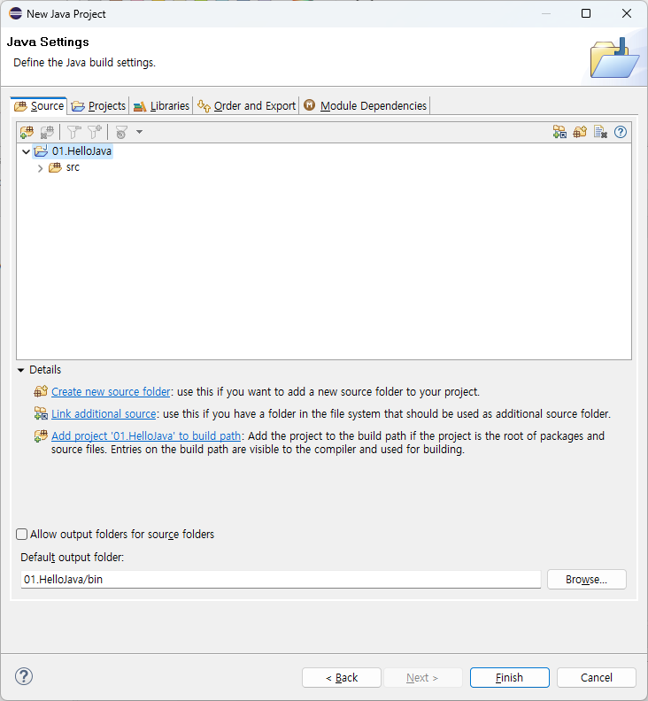
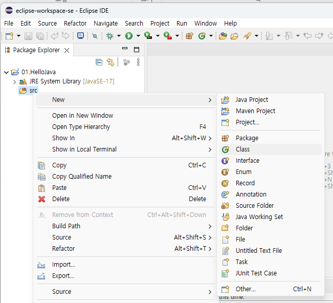
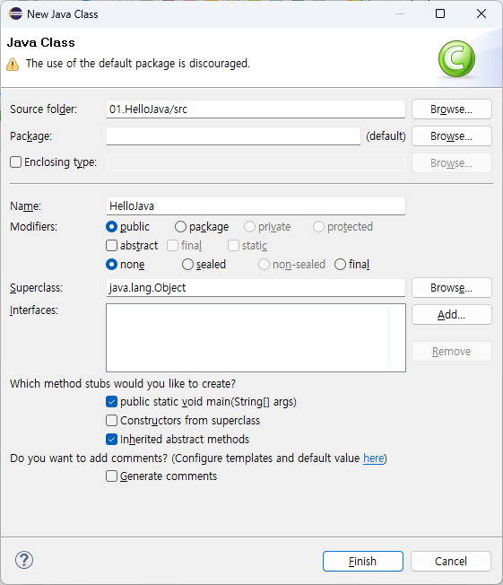
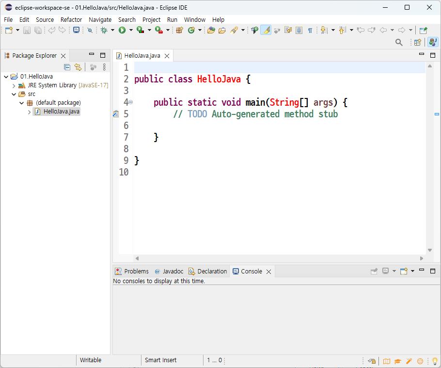

# 03. 자바 첫 프로그램 만들고 실행하기

## 이클립스 자바프로젝트생성

 * 이클립스실행
 
   

 * 자바프로젝트 생성
   
    

 * 자바프로젝트 이름입력[01.HelloJava] 후 Next 버튼 클릭
   
    

 * 자바프로젝트 구조확인후 Finish버튼 클릭
   
    

 * 자바클래스생성
   
    

 * 자바클래스이름 입력후 메인메쏘드생성체크후 Finish버튼클릭릭
   
    


 * 자바클래스이름 입력후 메인메쏘드생성체크후 Finish버튼클릭릭
   
    

##  Hello Java! 문자열을 출력하는 Desktop Application
 * 소스코드 작성시 주의 사항
   + 영문 대소문자를 구별한다
   + 저장시 파일명은 클래스명과 동일하여야 하며 확장자는 *.java 이다.
     - 예) HelloJava.java

```java
public class HelloJava {
	public static void main(String[] args){
		// 문자열 출력 명령문(주석)
		System.out.println("Hello Java!");
		System.out.println("안녕 자바!");
	}
}
```

 * 이클립스에서 자바프로그램실행
    + 실행아이콘클릭 하거나  단축키 <b>ctrl + F11</b> 누르기  
      
       
      
    


