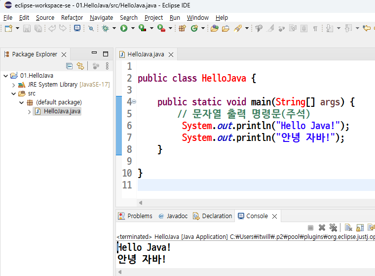

# 03. 자바클래스작성과 실행하기

## 자바 기본 구문 
 * 주석(Comment)
  + Singleline Comment  :  // 뒤에 한 라인에 대하여 주석 처리
  + Multiline  Comment  :  /* … */ 범위의 모든 라인에 대하여 주석 처리
  + Document   Comment  :  /** … */ 범위의 모든 라인에 대하여 주석 처리
    + 클래스나 메소드 앞에 사용되어지며, javadoc.exe(도큐먼트 생성툴)를 이용하여 HTML Document 생성시 주석내용이 문서에 포함된다
  + 주석 내용에 HTML 태그 사용 가능

 
 * 이클립스실행
 
   

 * 자바프로젝트 생성
   
    

 * 자바프로젝트 이름입력[01.HelloJava] 후 Next 버튼 클릭
   
    

 * 자바프로젝트 구조확인후 Finish버튼 클릭
   
    

 * 자바클래스생성
   
    

 * 자바클래스이름 입력후 메인메쏘드생성체크후 Finish버튼클릭릭
   
    


 * 자바클래스이름 입력후 메인메쏘드생성체크후 Finish버튼클릭릭
   
    

##  Hello Java! 문자열을 출력하는 Desktop Application
 * 소스코드 작성시 주의 사항
   + 영문 대소문자를 구별한다
   + 저장시 파일명은 클래스명과 동일하여야 하며 확장자는 *.java 이다.
     - 예) HelloWorld.java
   + 컴파일 : javac HelloWorld.java
   + 실 행  : java  HelloWorld
   


```java
public class HelloJava {
	public static void main(String[] args){
		// 문자열 출력 명령문(주석)
		System.out.println("Hello Java!");
		System.out.println("안녕 자바!");
	}
}
```

* 클래스 정의
  + 자바는 클래스 단위로 프로그램을 작성하기 때문에 소스파일 안에 반드시 클래스를 정의해야 한다.
  + 클래스의 이름은 첫 문자를 대문자로 시작하는 것이 관례이다
  + 클래스의 구성요소(속성, 메소드 등…)들은 { } 안에 위치한다
  + 소스파일 저장 시 파일명이 클래스명과 반드시 일치해야 한다

* main(String[] args) 메소드 정의
  + Desktop Application이 실행되려면 최소 1개 존재하여야 한다
  + 프로그램의 진입점으로 JVM에 의해 최초 호출되며
  + 메인 메소드 블록 내부에 기술된 명령문들을 순차적으로 실행한다
  + JVM은 세미콜론(;)으로 끝나는 문장을 하나의 명령문으로 인식한다
  + 주석은 프로그램 소스코드를 쉽게 이해 하기 위해서 사용하며, 컴파일 및 실행에 영향을 미치지 않는다

 * 실행결과
   
    


