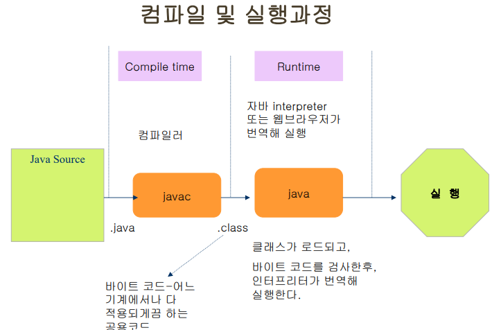

# 04. 자바 프로그램 기본 구조(Application)


## 자바 클래스 정의
 * 자바는 클래스 단위로 프로그램을 작성하기 때문에 소스파일 안에 반드시 클래스를 정의해야 한다.
 * 클래스의 이름은 첫 문자를 대문자로 시작하는 것이 관례이다
 * 클래스의 구성요소(속성, 메소드 등…)들은 { } 안에 위치한다
 * 소스파일 저장 시 파일명이 클래스명과 반드시 일치해야 한다

 * main(String[] args) 메소드 블록({ })정의
   + Desktop Application이 실행되려면 최소 1개 존재하여야 한다
   + 프로그램의 진입점으로 JVM에 의해 최초 호출되며
   + 메인 메소드 블록 내부에 기술된 명령문들을 순차적으로 실행한다
   + JVM은 세미콜론(;)으로 끝나는 문장을 하나의 명령문으로 인식한다
   + 주석은 프로그램 소스코드를 쉽게 이해 하기 위해서 사용하며, 컴파일 및 실행에 영향을 미치지 않는다.


## Application의 컴파일과 실행
 * 소스 파일 컴파일
    + DOS> javac HelloJava.java
    + 소스파일을 컴파일하고 나면 byte code로 이뤄진 실행파일(class파일)이 생성됨
 * Application 실행
    + DOS> java HelloWorld
    + 클래스 파일을 실행하기 위해서는 자바 해석기인 java.exe 를 이용해야 한다.
      실행하면 Hello Java!가 출력된다
      
      

## Application예제 소스분석 
  ```java
public class HelloJava{
/*
- public 은 접근 지정자.
- HelloWorld는 클래스명
- 파일명은 이 클래스명과 동일해야.
*/
   public static void main(String args[]){
	/*
	- main메소드는 자바 프로그램을 실행할때 JVM에서 호출되는 최초의 메소드
	- main메소드는 각 프로그램의 시작 지점인 동시에 종료 지점임.
	- 여러 클래스로 이뤄진 프로그램의 경우에는 반드시 시작클래스(주 클래스)는 main()를 갖고 있어야 한다.
	*/
   } 
}
  ```
## 자바 기본 구문 – 주석
* Singleline Comment
  + // 뒤에 한 라인에 대하여 주석 처리
* Multiline Comment
  + /* … */ 범위의 모든 라인에 대하여 주석 처리
* Document Comment
  + /** … */ 범위의 모든 라인에 대하여 주석 처리
  + 클래스나 메소드 앞에 사용되어지며, javadoc.exe(도큐먼트 생성툴)를 이용하여 HTML Document 생성시 주석내용이 문서에 포함된다.
  + 주석 내용에 HTML 태그 사용 가능


## 자바 기본 구문 – 예약어(Keyword)
 * Java의 모든 예약어는 소문자이다
```java
abstract const finally int public throw boolean continue float interface return throws break default for
long short transient byte do goto native static try catch else implements package switch volatile char
extends import private synchronized assert class final instanceof protected this enum
```


## 자바 기본 구문 – 식별자

* 식별자(Identifier)
  + 프로그램 구성요소인 변수, 상수, 배열, 메소드, 클래스 등을 구분하기 위해 사용자가 정의하는 이름
* 식별자 규칙
   + 대소문자를 구분하며, 첫 글자는 영문자나 특수문자(‘_’,’$’)로 시작되어야 한다. 
   + 첫 글자로 숫자를 사용할 수 없다. 첫 글자 외에 사용하는 것은 허용한다
   + 예약어(this, true, null 등…)는 식별자로 사용할 수 없다
   + 16비트 유니코드를 지원하므로 한글도 식별자로 사용 가능하다(비권장)
   + 아스키코드 : ANSI(American National Standards Institute: 미국규격협회)에서 제정한 8비트 문자코드로 256개의 문자를 코드화
   + 유니코드 : 유니코드(Apple, IBM, MS등의 컨소시엄)에서 제정한 16비트로 확장한 문자코드로전세계의 모든 문자를 표현하기 위한 표준 문자 코드이다.
   + 유니코드는 현재 34,168개의 글자들을 코드화 하고 있으며 최대 65,536개의 글자를 코드화 할수 있다
* 식별자 관례
   + 클래스 이름은 대문자로 시작하고, 변수, 메소드 등의 이름은 소문자로 시작하는 것이 관례이다
   + 두 단어를 조합하여 이름을 정 할 때는 조합하는 문자의 첫 글자는 대문자로 한다
   + Camel 표기법

 
