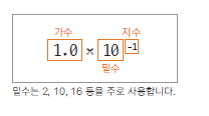

# 06. 자료형(data type) 

## 변수와 메모리
  * 변수를 선언하면 해당되는 자료형의 크기 만큼 메모리가 할당
  * 변수는 할당된 메모리를 가리키는 이름<br>
  ex> 4바이트 정수형 메모리가 score 이라는 이름으로 할당 됨
    ```java
   	int score = 65; 
     ```
    

## 기본 자료형(primitive data type)의 종류

   * 정수형(byte,short,int,long) 
      + int : 정수를 다룬다. <br>
        예) 1 , 100 , 1000
      + 주로 사용하는 것은 int와 long이며, short은 c언어와의 호환을 위해 추가되었다.  
   * 실수형(float,double) 
      + double : 실수를 다룬다.<br>
        예) 0.2 , 1.5 , 100.121
   
  * 문자형(char) 
    + char : 문자 하나를 다룰 때 사용한다. 작은따옴표( ' )를 사용해서 감싸야 한다.<br>
      예) 'A' , '가'
 
  * 문자열형(String)		
    + String : 문자열을 다룬다. 큰따옴표를 사용해야 한다. <br> 
      예) "hello java"
 
  * 논리형(boolean)
     + boolean : 불리언 타입이라 한다. true , false 값만 사용할 수 있다. 주로 참과 거짓을 판단하는 곳에서 사용한다.
     +  예) true , false
   
**정수 자료형**

  * byte 
     + 1바이트 단위의 자료형(-128 ~ 127 (1byte, 2⁸))
     + 동영상, 음악 파일, 실행 파일의 자료를 처리할 때 사용
  * short 
     + 2바이트 단위의 자료형(-32,768 ~ 32,767 (2byte, 2¹⁶))
     + C/C++ 언어와 호환 시 사용
  * int 
     + 4바이트 단위의 자료형(-2,147,483,648 ~ 2,147,483,647 (약 20억) (4byte, 2³²))
     + 자바에서 사용하는 정수에 대한 기본 자료 형
     + 프로그램에서 사용하는 모든 숫자(리터럴)은 int 로 저장됨
     + 32 비트를 초과하는 숫자는 long 자료형으로 처리

  * long
     + 8바이트 자료형( -9,223,372,036,854,775,808 ~ 9,223,372,036,854,775,807 (8byte, 2⁶⁴))
     + 숫자의 뒤에 알파벳 L 또는 l 을 써서 long 형임을 표시 함
      예)
        ```java
		int  num1  =  12345678900;   // 오류 
		long num2   =  12345678900;  // 오류 
		long num3   =  12345678900L; // ok
        ```

	
**실수 자료형**

  * 부동 소수점 방식
     +  실수는 정수 보다 정밀하기 때문에 정수와는 다른 방식으로 표현해야 함
     +  부동 소수점 방식으로 실수 값 0.1 표현 
       
     +  지수부와 가수부로 표현 함<br>
       예) 0.2 표현 0.4 X 2<sup>-1</sup>  정규화 하면 1.6 X 2<sup>-3</sup> 

  * float  
     -  4바이트 자료형( -3.4E38 ~ 3.4E38, 7자리 정밀도 (4byte, 2³²))
  * double 
     - 8바이트 자료형(대략 -1.7E308 ~ 1.7E308, 15자리 정밀도 (8byte, 2⁶⁴))
     - 자바에서는 실수의 기본 타입은 double을 사용 함
   

**문자 자료형**

  * char  
    + 2바이트 자료형(0 ~ 65535)
	
  * 문자도 정수로 표현
 
    + 어떤 문자를 컴퓨터 내부에서 표현하기 위해 특정 정수 값을 정의
    + A 는 65<br>
    
        

    + 문자세트 : 각 문자를 얼마로 표현할 것인지 코드 값을 모아둔 것을 문자세트(charater set)라 함 <br>
            (ex. ASCII, euc-kr, utf-8, utf-16)

 * 자바에서의 문자표현
    + 자바는 문자를  나타내기 위해 전세계 표준인 UNICODE를 사용
    + utf-16 인코딩을 사용 (모든 문자를 2바이트로 표시)


  * 문자형 변수 선언과 사용하기
    + 문자를 위한 데이터 타입
      <br> **char** ch = 'A';
    + 내부적으로 숫자료 표현되므로 숫자를 넣어도 문자가 출력될 수 있음 <br>
      char ch = 66;
  ```   
	character set: 문자를 숫자로 변환한 값의 세트
	encoding: 문자가 숫자로 변환되는 것
	decoding: 숫자에서 다시 문자로 변환되는 것
	ASCII code: 알파벳과 숫자 특수 문자등을 1바이트에 표현하는데 사용하는 문자세트
	UNICODE: 전 세계 표준으로 만든 문자 세트
	UTF-8: 1바이트에서 4바이트까지 다양하게 문자를 표현할 수 있음
	UTF-16: 2바이트로 문자를 표현 
  ```  
[한글 유니코드 표](http://www.unicode.org/charts/PDF/UAC00.pdf)
	
**논리 자료형**

 * boolean  
    - 1바이트 자료형
    - true(참), false(거짓) 두 가지만 나타냄
    - 값이 존재하는지, 배열이 비었는지, 결과가 참인지 거짓인지등을 표현
	
  
**리터럴**

  * 코드에서 개발자가 직접 적은 100 , 10.5 , true , 'A' , "Hello Java" 와 같은 고정된 값을 프로그래밍 용어로 리터럴(literal)이라 한다. 

 ```java
int a = 100; //정수 리터럴
double b = 10.5; //실수 리터럴
boolean c = true; //불리언 리터럴
char d = 'A'; //문자 하나 리터럴
String e = "Hello Java"; //문자열 리터럴 
 ```
 * 변수의 값은 변할 수 있지만 리터럴은 개발자가 직접 입력한 고정된 값이다. 따라서 리터럴 자체는 변하지 않는다.<br>
   참고: 리터럴(literal)이라는 단어의 어원이 문자 또는 글자를 의미한다   
   
**리터럴 타입 지정**

 * 정수 리터럴은 int 를 기본으로 사용한다. 따라서 int 범위까지만 표현할 수 있다. 
 * 숫자가 int 범위인 약 20억 을 넘어가면 L 을 붙여서 정수 리터럴을 long 으로 변경해야 한다.
 * 실수 리터럴은 기본이 double 형을 사용한다. 
 * float 형을 사용하려면 f 를 붙여서 float 형으로 지정해야 한다.   
