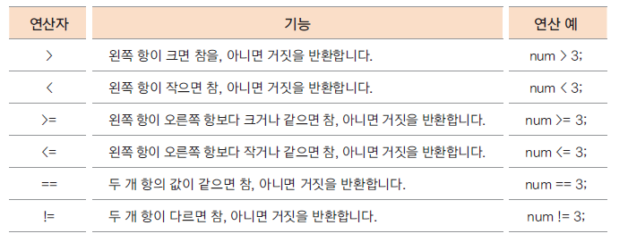
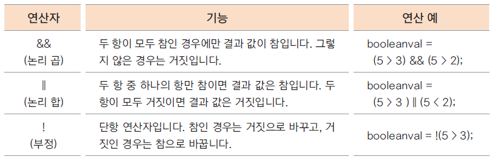

# 08. 자바의 연산자들 -2 (관계, 논리 연산자)

## 관계 연산자

- 이항 연산자

- 연산의 결과가 true(참), false(거짓)으로 반환 됨, 비교연산자 라고도 함

- 조건문, 반복문의 조건식으로 많이 사용 됨



```java


public class RealtionalOperator {

	public static void main(String[] args) {
		int a=10;
		int b=20;
		boolean result = a > b;
		System.out.println("10 > 20 -->"+result);
		result = a < b;
		System.out.println("10 < 20 -->"+result);
		result = a >= b;
		System.out.println("10 >= 20 -->"+result);
		result = a <= b;
		System.out.println("10 <= 20 -->"+result);
		result = a == b;
		System.out.println("10 == 20 -->"+result);
		result = a != b;
		System.out.println("10 != 20 -->"+result);
	}
}
```


## 논리 연산자

- 관계 연산자와 혼합하여 많이 사용 됨

- 연산의 결과가 true(참), false(거짓)으로 반환 됨



```java

public class LogicalTest {

	public static void main(String[] args) {
		
		boolean b1, b2, b3, b4;
		boolean result;
		b1 = true;
		b2 = true;
		b3 = false;
		b4 = false;
		/*
		 * 논리합(logical or) || --> false || false 인경우에만 false를 반환
		 */
		result = b1 || b2;
		System.out.println("true || true -->" + result);
		result = b1 || b3;
		System.out.println("true || false -->" + result);
		result = b3 || b1;
		System.out.println("false || true -->" + result);
		result = b3 || b4;
		System.out.println("false || false -->" + result);
		/*
		 * 논리곱(logical and) && --> true || true 인경우에만 true를 반환
		 */
		result = b1 && b2;
		System.out.println("true && true -->" + result);
		result = b1 && b3;
		System.out.println("true && false -->" + result);
		result = b3 && b1;
		System.out.println("false && true -->" + result);
		result = b3 && b4;
		System.out.println("false && false -->" + result);

	}
}
```


## 논리 연산에서 모든 항이 실행되지 않는 경우 - 단락 회로 평가 (short circuit evaluation)

- 논리 곱(&&)은 두 항의 결과가 모두 true일 때만 결과가 true

  -- 앞의 항의 결과가 false이면 뒤 항의 결과를 평가하지 않음

- 논리 합(||)은 두 항의 결과가 모두 false일 때만 결과가 false
   
  -- 앞의 항의 결과가 true이면 뒤 항의 결과를 평가하지 않음 

```java
public class ShortCircuitOperation {

	public static void main(String[] args) {
		
		int kor = 80;
		int eng = 90;
		
		boolean isPass1 = kor>=90 && eng >= 90;
		System.out.println("국어영어모두 90점이상이면 합격:"+isPass1);
		
		boolean isPass2 = kor>=90 || eng >= 90;
		System.out.println("국어영어 한과목만 90점이상이면 합격:"+isPass2);
		
		
	}
}
```


