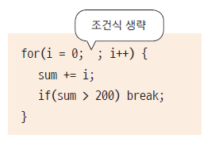
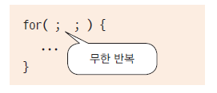

# 13. 반복문 - for 문

## for문의 수행 순서


	    
	       	       
	       for(1;2;3){
		       	//1.반복변수(선언,초기화가능)
		       	//2.반복변수의 조건검사(논리형데이타)
		       	//3.반복변수증,감(++,--)
	       }
	       
	       ex>
	       for(int i=0;i<10;i++){
	       	 stmt1;
	       }
	       ex>무한루프
	       for(;;){
	       	
	       }
	

## for문 예제 (while과 비교)

- 1부터 10사이의 정수를 출력하세요

```java


public class ForTest {

	public static void main(String[] args) {
		System.out.println("-----------while--------");
		int k=0;				//1.반복변수 초기화
		while(k<10) {				//2.반복변수비교(반복조건)
			System.out.println("k="+k);	//3.반복문
			k++;				//4.반복변수증가(감소)
		}	
		System.out.println("------------for-----------");
		for(int i=0;i < 10 ; i++) {
			System.out.println("i="+i);
		}


	}
}

```

## 각 반복문은 주로 언제 사용하나요?


## for문의 문장들은 생략가능 합니다.

- 초기화식 생략 : 이미 이전에 값이 초기화 되어 for 내부에서 값을 지정할 필요가 없는 경우

   

- 조건식 생략 : 반복 수행에 대한 조건이 수행문 내부에 있는 경우
   
   

- 증감식 생략 : 증감식에 대한 연산이 복잡하거나 다른 변수의 연산 결과값에 결정되는 경우
   
   

- 무한 반복

   


# 참고

    i+1 과 i++은 다릅니다.
    i+1 자체는 i 값이 증가되지 않습니다. 증가하기 위해서는 대입연산자를 써야합니다.
    하지만 i++은 i = i+1, i+=1 과 동일한 의미입니다.
    따라서 값을 1씩 증가하려고 한다면 i++을 사용하세요


