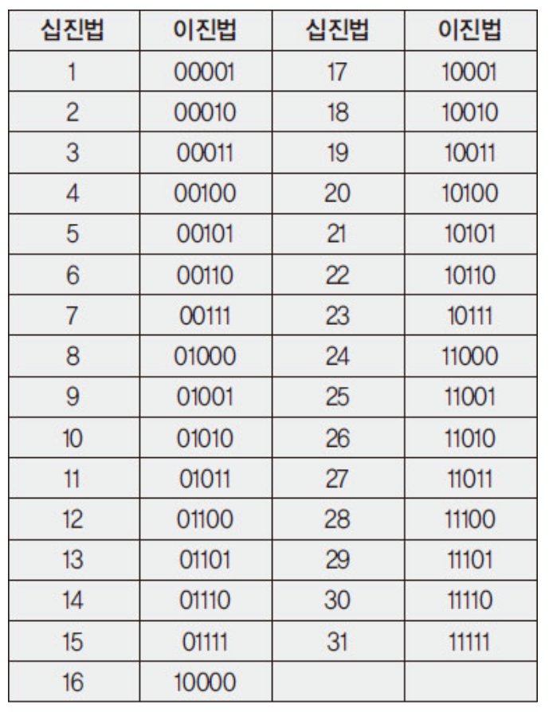
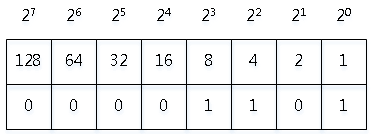

# 04. 컴퓨터에서 자료 표현하기

## 2진수로 표현
    
    0과 1로만 데이터를 저장함
    bit(1비트) : 컴퓨터가 표현하는 데이터의 최소 단위로 2진수 하나의 값을 저장할 수 있는 메모리의 크기
    byte(바이트) : 1byte = 8bit


## 2진수와 10진수



## 8비트(1바이트)로 십진수 13을  표현해 보면...
 


## 비트로 나타낼 수 있는 수의 범위는?
    한 개의 비트로 나타낼 수 있는 수 : 0 , 1 (2개)
    두 개의 비트로 나타낼 수 있는 수 : 00, 01, 10, 11 (4개)
    세 개의 비트로 나타낼 수 있는 수 : 000, 001, 010, 011, 100, 101, 110, 111 (8개)

## 2진수, 8진수, 16진수를 프로그램에서 사용하는 예제
```

public class NumberMain {

	public static void main(String[] args) {
	
		int decimalNumber = 10;
		int binaryNumber = 0B1010;
		int octalNumber = 012;
		int hexaDecimalNumber = 0XA;
		
		
		System.out.println(decimalNumber);
		System.out.println(binaryNumber);
		System.out.println(octalNumber);
		System.out.println(hexaDecimalNumber);
	}
}
```


    
