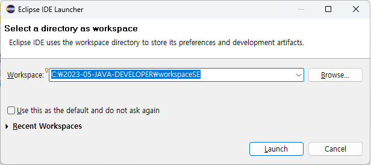
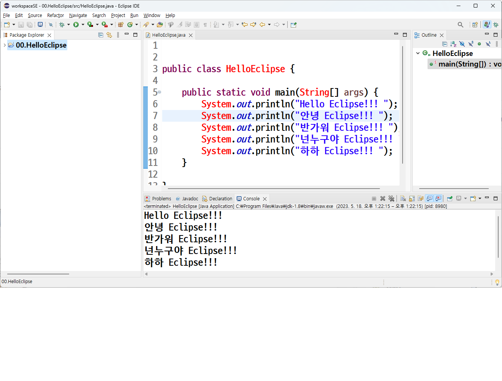

# 03. 자바 첫 프로그램 만들고 실행하기

## 이클립스 실행하기

 * workspace 설정
 
   

 * 프로젝트 만들기와 화면의 구성

   


## 첫 프로그램 "Hello, Java" 출력하기

```


public class HelloJava {

	public static void main(String[] args) {
		System.out.println("Hello, Java");
	}
}
```


