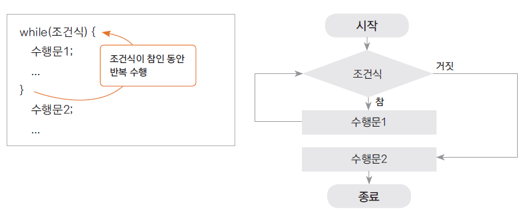

# 12. 반복문 - while문

## 조건이 참(true)인 동안 반복수행하기

- 주어진 조건에 맞는 동안(true) 지정된 수행문을 반복적으로 수행하는 제어문

- 조건이 맞지 않으면 반복하던 수행을 멈추게 됨

- 조건은 주로 반복 횟수나 값의 비교의 결과에 따라 true, false 판단 됨

- 예) 달리는 자동차, 일정 횟수 만큼 돌아가는 나사못, 특정 온도까지 가동되는 에어컨등


# while문
 
- 수행문을 수행하기 전 조건을 체크하고 그 조건의 결과가 true인 동안 반복 수행




		 stmt1;
		 while(조건문){
			 //조건문--> 논리형데이타를 반환하는 식(논리형변수,논리형리터럴) 
			stmt2;
		 }
		 stmt3;
		 흐름  
		   - stmt1 -->조건식의 데이타가 true  인동안 stmt2 반복 실행
		   - stmt1 -->조건식의 데이타가 false 이면 while block을 빠져나온다. 


# while 문 예제

- 1부터 10사이의 정수를 출력

```java


public class WhileTest {

	public static void main(String[] args) {

		System.out.println("--------- i=0 ----------");
		int i=0;//반복횟수변수
		while(i < 10) {
			System.out.println("stmt:i="+i);
			i++;
		}
	}

}
```

## 무한 반복 할 때

``` 
   while(true){

       .......
   }
```


