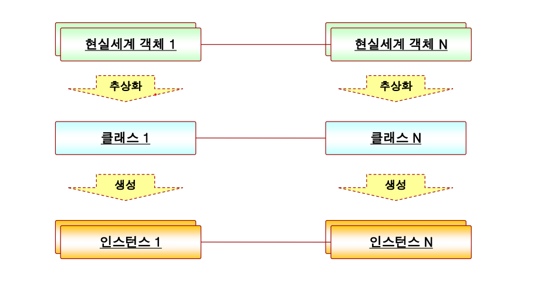
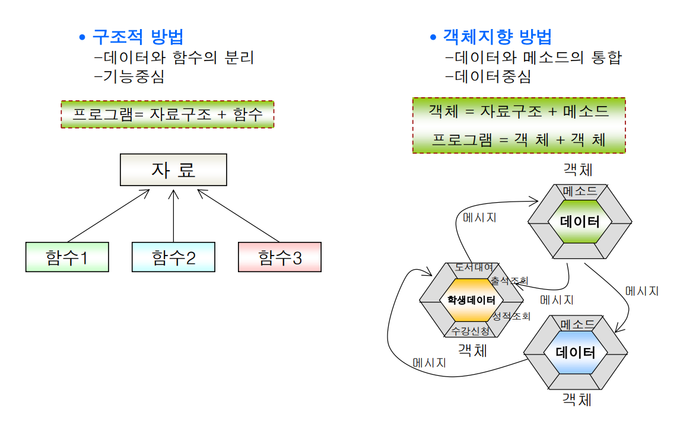
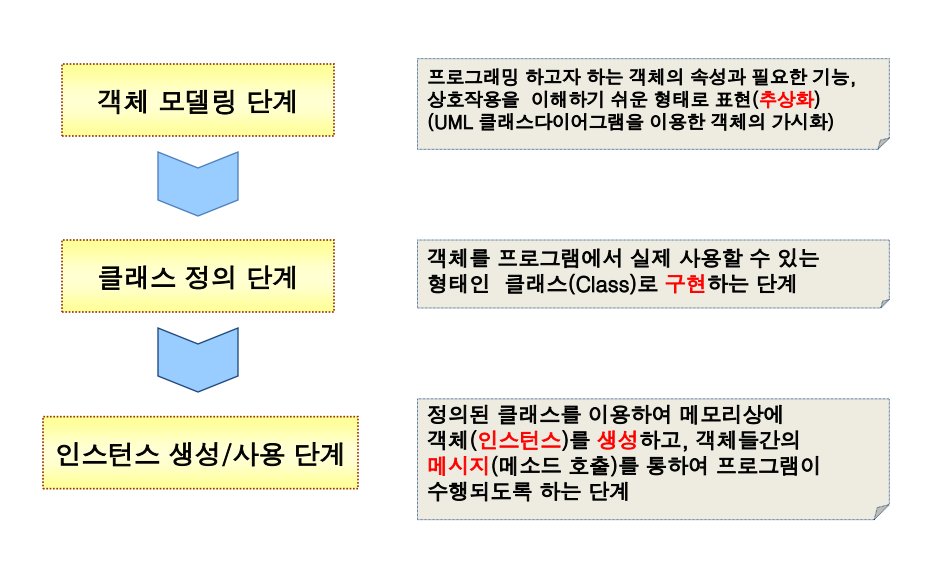
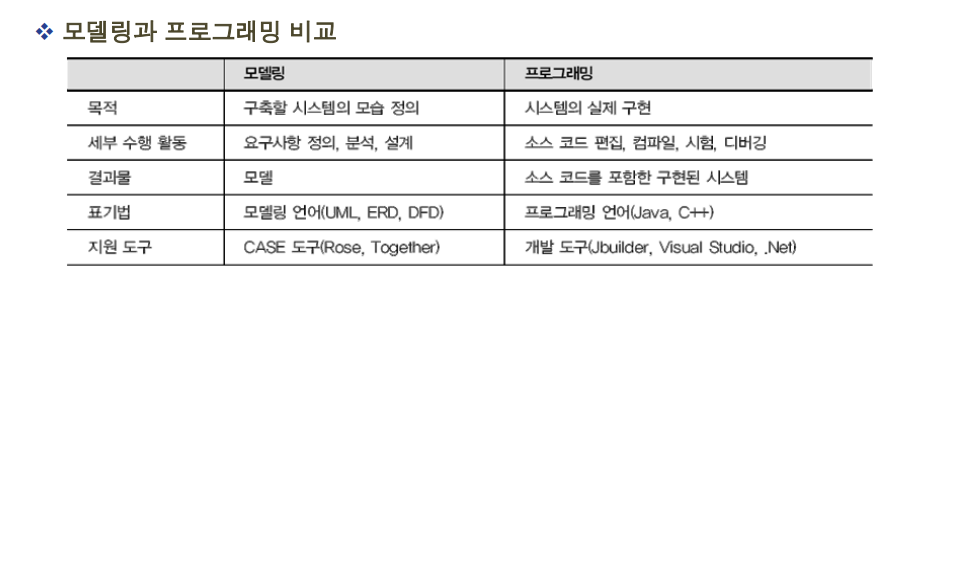
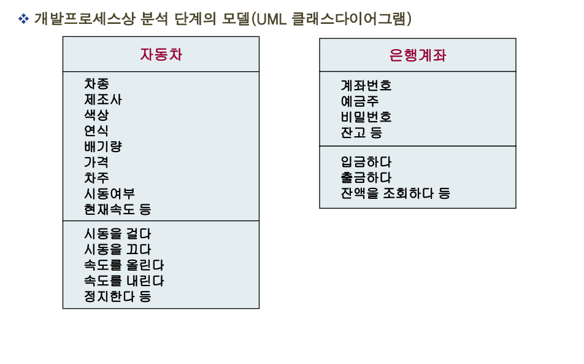
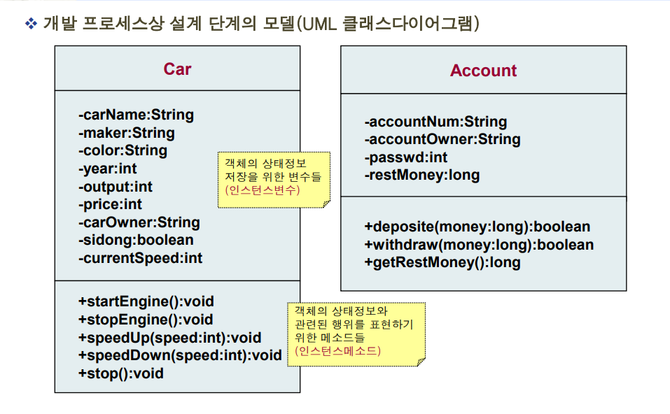
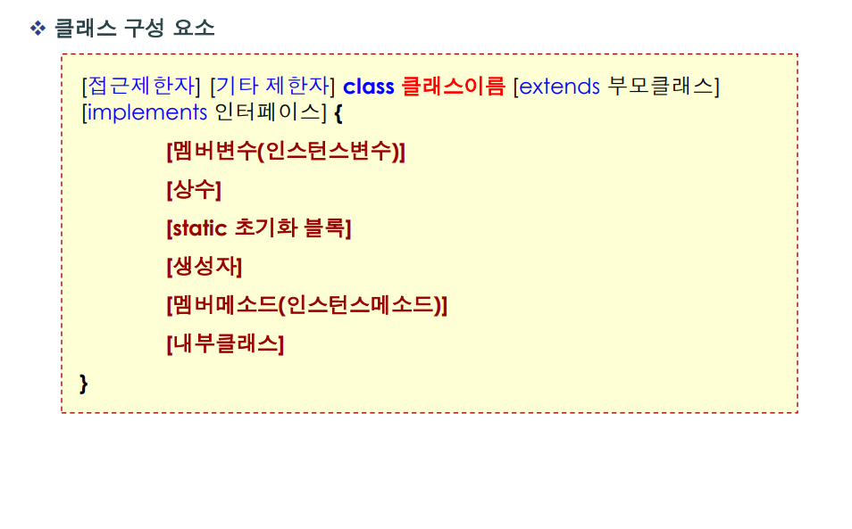

# 01.객체 지향 프로그래밍([자바객체지향프로그래밍.pdf](./image/02-00.자바객체지향프로그래밍.pdf))

### 목 차
1. 객체 지향 프로그래밍(Object Oriented Programming) 개념
2. 구조적(Structured) 프로그래밍과의 비교
3. 객체 지향 프로그래밍 절차
   + 객체 모델링
   + 클래스 정의
   + 소프트웨어 객체(Instance) 생성 및 사용
4. 클래스 구성 요소
<hr>

### 객체지향(Object Oriented) 프로그래밍 개념
 
 #### 객체 지향 프로그래밍이란?
 - 현실세계가 객체(실체 및 개념 : 명사형) 들의 상호작용에 의해 운영되듯이, 컴퓨터<br>
  프로그램도 객체라는 독립적 단위로 구성하고, 이 객체들 간의 메시지 교환을 통해<br>
  상호작용함으로 써 전체 프로그램이 운영되는 개념(현실세계의 모방) - 컴퓨터<br>
  프로그래밍 개발 패러다임의 하나

 - 객체지향 프로그래밍은 컴퓨터 프로그램을 연속적인 명령어의 목록으로 보는 시각에서<br>
   벗어나 여러 개의 독립된 단위, 즉 “객체”들의 목록으로 파악하고, 각각의 객체들이<br>
   메시지를 주고 받음으로 써 데이터를 처리하는 프로그래밍 방식이다

 - 객체 단위(중심) 프로그램 방식으로
 - 시스템 개발 프로세스 상 자연스러운 시스템 분석&설계가 용이하고
   + 요구사항 정의 → 분석 → 설계 → 구현 → 테스트/디버깅 → 배치
 - 코드 분석이 용이하며
 - 객체의 재사용을 통해 개발 생산성 증대

 - 유지 보수 및 확장이 용이하기 때문에 대규모 소프트웨어 개발에 많이 사용
<hr>

### 객체지향 기술의 기본 구성 요소
#### 현실 세계의 객체(Object)
 - 소프트웨어 개발 대상이 되는 현실세계에 실제 존재하거나 개념적인 것
   + 예) 컴퓨터, 자동차, 도서, 학생, 학과, 성적, 수강, 주문, 은행 계좌 등
 - 객체는 식별 가능하며, 자신의 특성과 정보를 상태(State)로 가지며, 이를 바탕으로 한 행위(Behavior)를 외부에 제공한다
    + 상태: 객체의 특성을 표현하는 개별적인 객체에 대한 속성(예: 학생의 이름, 학과, 학번 등)
    + 행위: 객체 자신의 상태를 바탕으로 외부에 제공하는 기능(예: 시험보기, 보고서 제출 등)

#### 클래스(Class)
 - 현실세계에 존재하는 특정 종류의 객체들이 가질 수 있는 상태정보와 행위들에 대하여 프로그램적으로 표현(정의)한<br>
   사용자 정의 데이터타입(추상화한 설계도)
 - 동일한 종류의 객체들을 일반화 시킨 개념
   + 소프트웨어 객체(Instance)를 생성할 수 있는 구조와 정보를 가짐

 - 클래스는 객체의 상태정보 저장을 위한 변수들과 행위를 구현하는 함수(메소드)들로 구성

#### 소프트웨어 객체(Instance)
 - 클래스로부터 실제로 메모리상에 할당된 것
 - 소프트웨어 객체는 자신 고유의 상태정보를 가지며, 클래스에서 정의한 기능을 수행할 수 있다

#### 메시지(Message)
 - 소프트웨어 객체들은 각각 독립적이지만, 메시지(메소드 호출)를 통해 서로 상호작용
            
<hr>

### 객체지향(Object Oriented) 프로그래밍 개념
#### 객체 지향 기술의 3대 기본 요소

<hr>

### 구조적(Structured) 프로그래밍과의 비교
#### 구조적 프로그래밍(COBOL, BASIC, C 등)
 - 데이터구조와 그 데이터를 변화시키는 함수(알고리즘)으로 구성 – 함수 중심
 - 데이터구조와 함수가 분리되어 있는 구조
 - 공장의 컨베이어벨트에서 원재료(데이터)가 여러 공정(함수)을 거처 제품(결과)이 나오는<br>
   구조와 같이 순차적 흐름을 중요시
 - 대량의 데이터를 순차적으로 처리해야 하는 경우 적합
 - 새로운 데이터의 추가나 함수 변경 시 프로그램 전체에 영향
#### 객체 지향 프로그래밍Smalltalk, Java, C++, C#)
 - 데이터와 데이터를 처리할 수 있는 메소드로 객체를 구성하고, 객체들간의 메시지 교환을<br>
   통해(상호작용) 프로그램을 구성 – 객체 중심
 - 데이터와 메소드가 통합되어 있는 구조
 - 객체 재사용을 통한 생산성 증대 및 유지보수, 확장이 용이
<hr>

### 구조적(Structured) 프로그래밍과의 비교

<hr>

### 객체 지향 프로그래밍 절차

<hr>

### 객체 모델링(Modeling) 개념 및 필요성
 #### 모델(Model)이란?
  - 대상물(실체)에 대한 정보를 제공하기 위해 이해하기 쉬운 형태로 표현한 것
    + 대상물의 정리와 가시화
    + 모델예) 지하철 노선도, 프라모델, 모델하우스 등

  - 모델링
    + 모델을 만드는 것
  - 시스템 개발 시 모델(Model)의 필요성
    + 개발 프로세스 단계(요구사항 정의, 분석, 설계)별로 모델(산출물)을 작성함으로 써 시스템을 시각적으로 표현
  - 모델은 시스템 관련 모든 당사자(고객, 도메인 전문가, 분석가(Analysis),설계가(Architect), 개발자(Engineer) 등)들의 의사소통 수단으로 사용
  - 고객의 요구사항에 대한 명확한 이해, 보다 명확한 설계와 유지보수가 용이
  - 시스템의 구조나 기능을 명세화하고, 시스템을 구축하는 안내가 될 기본 틀을 제공
<hr>

### 객체 모델링(Modeling)과 프로그래밍 비교

<hr>

### 객체 모델링(Modeling) 언어 소개
#### UML(Unified Modeling Language) 소개

 - 객체지향 분석,설계의 산출물인 모델을 표현하기 위한 통합(표준) 그래픽 언어
   + 많은 개발 방법론(객체지향 방법론, CBD 방법론 등)에서 모델링 언어로 채택
   + 도형과 기호를 사용하는 9개의 다이어그램 중심의 표기법
   + Class Diagram, Object Diagram, Use-case Diagram, Sequence Diagram, Communication<br>
     Diagram, State Diagram, Activity Diagram, Component Diagram, Deployment Diagram

 - 1990년 초반 다양한 객체지향 개발 방법론과 다양한 모델 표기법 혼재
   + 부치(Grady Booch), 럼버(James Rumbaugh), 야콥슨(Ivar Jacobson) 등
 - 1996년 Rational사(부치, 럼버, 야콥슨 합류)에서 모델 표기법과 개발 프로세스 통합(표준화)
   + UML(Unified Modeling Language), RUP(Rational Unifed Process)

 - 1997년 OMG(Object Management Group)에서 표준 모델링 언어로 채택(UML 1.1)
   + 현재 UML 2.0 은 객체지향 시스템 개발 분야에서 시스템과 관련된 산출물을 가시화하고,<br>
     명세화하고, 문서화하는데 사용되는 가장 우수한 모델링 언어로 인식
<hr>

### 모델 (Model) 샘플

<hr>

### 모델 (Model) 샘플

<hr>

### 클래스(Class) 정의

<hr>

### 클래스(Class) 정의
 #### 인스턴스 변수 선언
 - 클래스 정의 시 객체의 속성(상태정보)을 저장하기 위한 변수 선언
 - 메소드의 내부에 선언되는 지역(자동)변수와 달리 클래스 내부에 선언
 - 지역변수는 메소드 내부에서만 사용가능하지만, 인스턴스 변수는 클래스내부의 모든<br>
   인스턴스 메소드에서 사용 가능

   [접근제한자] [기타 제한자] 데이터타입 변수이름

 - 예
```java
   int age;
   private String userName;
```
<hr>

### 클래스(Class) 샘플
#### 일상생활의 급여명세서(객체)를 표현(추상화)한 클래스

 - 인스턴스 변수를 이용하여 급여명세서의 속성만 표현 – C언어의 구조체 형식

```java
 public class Payslip{
   String name; // 이름
   int salary; // 급여
   int tex; // 세금
   int homePay; // 실수령액
 }
```
<hr>

### 클래스(Class) 정의
#### 인스턴스 메소드 정의

- 클래스 정의 시 객체의 속성과 관련된 행위(기능)을 표현하기 위해 메소드 정의
 ```
    [접근제한자] [기타 제한자] 반환형 메소드이름(매개변수리스트) [throws 예외타입] {
    
    // 기능 구현(연산자, 제어문 등 사용)
    
    }
```
- 예
```java
 public double sum(int x, int y) {
   return x + y;
 }
```
<hr>

### 클래스(Class) 샘플
#### 일상생활의 급여명세서(객체)를 표현(추상화)한 클래스

 - 인스턴스 변수와 인스턴스 메소드를 이용하여 급여명세서의 속성과 기능 표현

```java
public class Payslip{
    String name; // 이름
    int salary; // 급여
    int tex; // 세금
    int homePay; // 실수령액
    // 세금계산 기능을 위한 사용자 정의 인스턴스 메소드
    public void setTex(){
         tex = (int)(salary* 0.07 + 0.5);
    }
    // 실수령액 계산 기능
    public void setHomePay(){
         homePay = salary - tex;
    }
    // 급여명세서 출력 기능
    public void print(){
         System.out.println("**************************");
         System.out.println("------ 5월 급여 내역 -----");
         System.out.println("**************************");
         System.out.println("성명: " + name);
         System.out.println("본봉: " + salary);
         System.out.println("세금: " + tex);
         System.out.println("실수령액: " + homePay);
    }
}

```
<hr>

### 소프트웨어 객체(Instance) 생성 및 사용
 #### 소프트웨어 객체(인스턴스)

 - 클래스를 정의했다고 바로 사용할 수 없고, 클래스의 인스턴스 변수나 메소드를<br>
   사용하기 위해서는 반드시 메모리에 인스턴스를 생성하여야 한다

 - JVM에 의해 클래스로부터 메모리영역에 할당된 실체
   + 설계도로부터 만들어진 실제 건축물이나 , 붕어빵 틀로부터 만들어진 붕어빵에 비유
 - new 키워드를 사용하여 인스턴스 생성
 - 하나의 설계도로부터 다수의 건축물(실체)가 만들어질 수 있듯이, 프로그램에서도<br>
   하나의 클래스로부터 다수의 인스턴스를 생성할 수 있다
```java
     // #1. 레퍼런스 변수 선언
     Account myAccount;
     // #2. 인스턴스 생성
     myAccount = new Account();
     // #3. 인스턴스 변수와 메소드 사용
     myAccount.accountNum = “111-222-333”;
     myAccount.deposite(100000);// 메소드 호출
```
