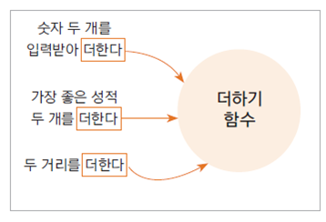
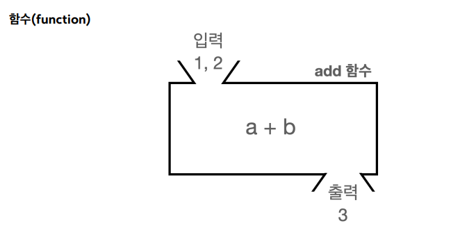
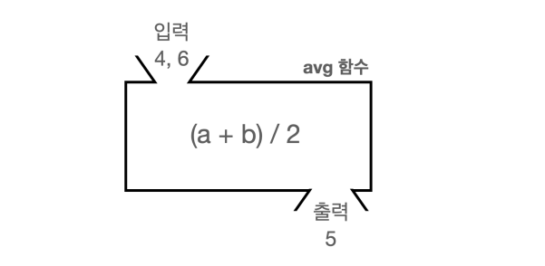

# 03. 함수와 메서드

## 함수란 (function) 

- 하나의 기능을 수행하는 일련의 코드

- 구현된(정의된) 함수는 호출하여 사용하고 호출된 함수는 기능이 끝나면 제어가 반환됨

- 함수로 구현된 하나의 기능은 여러 곳에서 동일한 방식으로 호출되어 사용될 수 있음




### 함수필요성

 - 두 숫자를 입력 받아서 더하고 출력하는 단순한 기능을 개발해보자.<br>
   먼저 1 + 2 를 수행하고, 그 다음으로 10 + 20 을 수행할 것이다
   
    ```java
  
	  public class Function1 {
			public static void main(String[] args) {
				
				// 계산1
				int a = 1;
				int b = 2;
				System.out.println(a + "+" + b + " 연산 수행");
				int sum1 = a + b;
				System.out.println("결과1 출력:" + sum1);
				
				// 계산2
				int x = 10;
				int y = 20;
				System.out.println(x + "+" + y + " 연산 수행");
				int sum2 = x + y;
				System.out.println("결과2 출력:" + sum2);
	
			}
	
	  }
   ```
  - 같은 연산을 두 번 수행한다.
  - 코드를 잘 보면 계산1 부분과, 계산2 부분이 거의 같다
  
		- 계산1
            int a = 1;
			int b = 2;
			System.out.println(a + "+" + b + " 연산 수행");
			int sum1 = a + b;
			System.out.println("결과1 출력:" + sum1);
			
		- 계산2
			int x = 10;
			int y = 20;
			System.out.println(x + "+" + y + " 연산 수행");
			int sum2 = x + y;
			System.out.println("결과2 출력:" + sum2);
			
    - 계산1, 계산2 둘 다 변수를 두 개 선언하고, 어떤 연산을 수행하는지 출력하고, 두 변수를 더해서 결과를 구한다.
    - 만약 프로그램의 여러 곳에서 이와 같은 계산을 반복해야 한다면? 같은 코드를 여러번 반복해서 작성해야 할 것이다.
    - 더 나아가서 어떤 연산을 수행하는지 출력하는 부분을 변경하거나 또는 제거하고 싶다면 해당 코드를 다 찾아다니면서 모두 수정해야 할 것이다.
    - 이런 문제를 어떻게 깔끔하게 해결할 수 있을까?
    - 잠깐 아주 간단하게 수학의 함수를 알아보자
	
		
		

### 함수 정의하기

 - 이름이 add 이고 a , b 라는 두 값을 받는 함수이다. 그리고 이 함수는 a + b 연산을 수행한다.

```java
add(a, b) = a + b
```

### 함수 사용

   ```java
	add(1,2) -> 결과:3
	add(5,6) -> 결과:11
	add(3,5) -> 결과:8 
   ```
   - 함수에 값을 입력하면, 함수가 가진 연산을 처리한 다음 결과를 출력한다. <br>
      여기서는 단순히 a+b 라는 연산을 수행한다.
   - 여러번 같은 계산을 해야 한다면 지금처럼 함수를 만들어두고(정의), 필요한 입력 값을 넣어서 해당 함수를 호출하면 된다. 그러면 계산된 결과가 나온다.
   - 함수는 마치 블랙박스와 같다. 함수를 호출할 때는 외부에서는 필요한 값만 입력하면 된다. <br>
      그러면 계산된 결과가 출력된다.
   - 같은 함수를 다른 입력 값으로 여러번 호출할 수 있다.
   - 여기서 핵심은 함수를 한번 정의해두면 계속해서 재사용할 수 있다는 점이다


### 평균함수



 - 만약 두 수의 평균을 구해야 한다면 매번 (a + b) / 2라는 공식을 사용해야 할 것이다.
   <br>이것을 함수로 만들어두면 다음과 같이 사용하면 된다

### 평균함수정의
```java
	avg(a, b) = (a + b) / 2
```
### 평균함수 사용 
```java
	avg(4,6) -> 결과:5
	avg(10,20) -> 결과:15
	avg(100,200) -> 결과:150 
```
 - 수학의 함수의 개념을 프로그래밍에 가지고 온다면 어떨까? 
 - 필요한 기능을 미리 정의해두고 필요할 때 마다 호출해서 사용할 수 있기 때문에 앞서 고민한 문제들을 해결할 수 있을 것 같다.
 - 프로그램 언어들은 오래 전 부터 이런 문제를 해결하기 위해 수학의 함수라는 개념을 차용해서 사용한다	

<hr>
	
## 메서드 (method)
 
 - 자바에서는 함수를 메서드(Method)라 한다.
 - 객체의 기능을 구현하기 위해 클래스 내부에 구현되는 함수
 - 멤버 함수 (member function)이라고도 함
 - 메서드를 구현함으로써 객체의 기능이 구현 됨
 ```java
	public class Method1 {
		public static void main(String[] args) {
			int sum1 = add(5, 10);
			System.out.println("결과1 출력:" + sum1);
			int sum2 = add(15, 20);
			System.out.println("결과2 출력:" + sum2);
		}
		//add 메서드
		public static int add(int a, int b) {
			System.out.println(a + "+" + b + " 연산 수행");
			int sum = a + b;
			return sum;
		}
	}

 ```
 


### 메서드 정의하기

- **메서드 선언(Method Declaration)** 과 **메서드 본문(Method Body)** 으로구성

   ```java
	public static int add(int a, int b) {
		 System.out.println(a + "+" + b + " 연산 수행");
		 int sum = a + b;
		 return sum;
	}
   ```

   - 이 부분이 바로 메서드이다. <br>이것을 함수를 정의하는 것과 같이, 메서드를 정의한다고 표현한다.
   - 메서드는 수학의 함수와 유사하게 생겼다. <br>함수에 값을 입력하면, 어떤 연산을 처리한 다음에 결과를 반환한다

- **메서드 선언(Method Declaration)**

   ```java
	public static int add(int a, int b)
   ```
   - 메서드의 선언 부분으로, 메서드 이름, 반환 타입, 매개변수(파라미터) 목록을 포함한다.
   - 이름 그대로 이런 메서드가 있다고 선언하는 것이다.
   - 메서드 선언 정보를 통해 다른 곳에서 해당 메서드를 호출할 수 있다.
     
     - public static
       + public : 다른 클래스에서 호출할 수 있는 메서드라는 뜻이다. 접근 제어에서 학습한다.
       + static : 객체를 생성하지 않고 호출할 수 있는 정적 메서드라는 뜻이다. 자세한 내용은 뒤에서 다룬다.
       + 두 키워드의 자세한 내용은 뒤에서 다룬다. 지금은 단순하게 메서드를 만들 때 둘을 사용해야 한다고 생각하자.
     - int add(int a, int b)
       + int : 반환 타입을 정의한다. 메서드의 실행 결과를 반환할 때 사용할 반환 타입을 지정한다.
       + add : 메서드에 이름을 부여한다. 이 이름으로 메서드를 호출할 수 있다.
       + (int a, int b) : 메서드를 호출할 때 전달하는 입력 값을 정의한다. 이 변수들은 해당 메서드 안에서만사용된다. 
       + 이렇게 메서드 선언에 사용되는 변수를 영어로 파라미터(parameter), 한글로 매개변수라 한다
      
- **메서드 본문(Method Body)**  
  ```java
	{
	 System.out.println(a + "+" + b + " 연산 수행");
	 int sum = a + b;
	 return sum;
	}
  ```
   - 메서드가 수행해야 하는 코드 블록이다.
   - 메서드를 호출하면 메서드 본문이 순서대로 실행된다.
   - 메서드 본문은 블랙박스이다. 메서드를 호출하는 곳에서는 메서드 선언은 알지만 메서드 본문은 모른다.
   - 메서드의 실행 결과를 반환하려면 return 문을 사용해야 한다. <br>
      return 문 다음에 반환할 결과를 적어주면 된다.
   - return sum : sum 변수에 들어있는 값을 반환한다

 - **메서드 호출**
    - 앞서 정의한 메서드를 호출해서 실행하려면 메서드 이름에 입력 값을 전달하면 된다.
	- 보통 메서드를 호출한다고 표현한다.
	 ```
		int sum1 = add(5, 10);
		int sum2 = add(15, 20);
	 ```
    - 메서드를 호출하면 어떻게 실행되는지 순서대로 확인해보자 
	```java
	int sum1 = add(5, 10); //add라는 메서드를 숫자 5,10을 전달하면서 호출한다.
	int sum1 = 15; //add(5, 10)이 실행된다. 실행 결과는 반환 값은 15이다.
	//sum1에 15 값이 저장된다. 
	```
      메서드를 호출하면 메서드는 계산을 끝내고 결과를 반환한다. <br>
      쉽게 이야기하자면, 메서드 호출이 끝나면 해당 메서드가 반환한 결과 값으로 치환된다.

      ```java
		//1: 메서드 호출
		int sum1 = add(5, 10);
		
		//2: 파라미터 변수 a=5, b=10이 전달되면서 메서드가 수행된다.
		public static int add(int a=5, int b=10) {
		 int sum = a + b;
		 return sum;
		}
		
		//3: 메서드가 수행된다
		public static int add(int a=5, int b=10) {
		 int sum = a(5) + b(10);
		 return sum;
		}
		
		//4: return을 사용해서 메서드 실행의 결과인 sum을 반환한다. sum에는 값 15가 들어있으므로 값 15가
		반환된다.
		public static int add(int a=5, int b=10) {
		 int sum = 15;
		 return sum(15);
		}
		
		//5: 메서드 호출 결과로 메서드에서 반환한 값 15가 나온다. 이 값을 sum1에 대입했다.
		int sum1 = 15
	```
  메서드 호출이 끝나면 더 이상 해당 메서드가 사용한 메모리를 낭비할 이유가 없다.<br>
  메서드 호출이 끝나면 메서드 정의에 사용한 파라미터 변수인 int a , int b 는 물론이고, 그 안에서 정의한 int sum 도 모두 제거된다.

### 메서드 호출과 용어정리
  메서드를 호출할 때는 다음과 같이 메서드에 넘기는 값과 매개변수(파라미터)의 타입이 맞아야 한다.<br> 
  물론 넘기는 값과 매개변수(파라미터)의 순서와 갯수도 맞아야 한다
  ```
  메서드 호출: call("hello", 20)
  메서드 정의: int call(String str, int age)
  ```
 - **용어정리**
   
    - **인수(Argument)** <br>
        여기서 "hello" , 20 처럼 넘기는 값을 영어로 Argument(아규먼트), 한글로 인수 또는 인자라 한다.<br>
        실무에서는 아규먼트, 인수, 인자라는 용어를 모두 사용한다.
        ```
        	인수라는 용어는 '인’과 '수’의 합성어로, '들어가는 수’라는 의미를 가진다.
        	즉, 메서드 내부로 들어가는 값을 의미한다. 인자도 같은 의미이다
        ```       
    - **매개변수(Parameter)** <br>
	메서드를 정의할 때 선언한 변수인 String str , int age 를 매개변수, 파라미터라 한다.<br>
	메서드를 호출할 때 인수를 넘기면, 그 인수가 매개변수에 대입된다.<br>
	실무에서는 매개변수, 파라미터 용어를 모두 사용한다.
        ```
        	매개변수, parameter는 '매개’와 '변수’의 합성어로, '중간에서 전달하는 변수’라는 의미를 가진다.
                즉, 메서드 호출부와 메서드 내부 사이에서 값을 전달하는 역할을 하는 변수라는 뜻이다
        ```       
## 매개변수와 반환타입을가진 메서드 정의방법
   메서드는 다음과 같이 정의한다.
   ```java
	public static int add(int a, int b) {
		//메서드 본문, 실행 코드
	}
	제어자 반환타입 메서드이름(매개변수 목록) {
		메서드 본문
	}
   ```
<br>
  

### 매개변수가 없거나 반환 타입이 없는 경우

```java
public class Method2 {
	public static void main(String[] args) {
		printHeader();
		System.out.println("프로그램이 동작합니다.");
		printFooter();
	}
	public static void printHeader() {
		System.out.println("= 프로그램을 시작합니다 =");
		return; //void의 경우 생략 가능
	}
	public static void printFooter() {
		System.out.println("= 프로그램을 종료합니다 =");
	}
}
```

printHeader() , printFooter() 메서드는 매개변수가 없고, 반환 타입도 없다.

 - 매개변수가 없는 경우
   - 선언: public static void printHeader() 와 같이 매개변수를 비워두고 정의하면 된다.
   - 호출: printHeader(); 와 같이 인수를 비워두고 호출하면 된다.
 - 반환 타입이 없는 경우
   - 선언: public static void printHeader() 와 같이 반환 타입을 void 로 정의하면 된다.
   - 호출: printHeader(); 와 같이 반환 타입이 없으므로 메서드만 호출하고 반환 값을 받지 않으면 된다.
   - String str = printHeader(); 반환 타입이 void 이기 때문에 이렇게 반환 값을 받으면 컴파일 오류가 발생한다.
 - **void와 return 생략**
    모든 메서드는 항상 return 을 호출해야 한다.<br>
    그런데 반환 타입 void 의 경우에는 예외로 printFooter() 와 같이 생략해도 된다.<br>
    자바가 반환 타입이 없는 경우에는 return 을 마지막줄에 넣어준다.<br>
    참고로 return 을 만나면 해당 메서드는 종료된다.<br>


  

