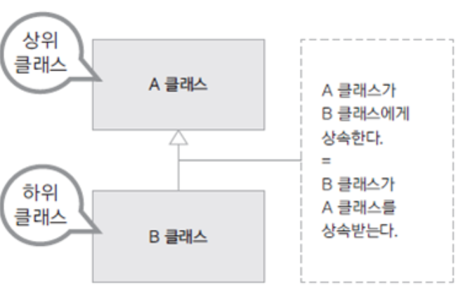
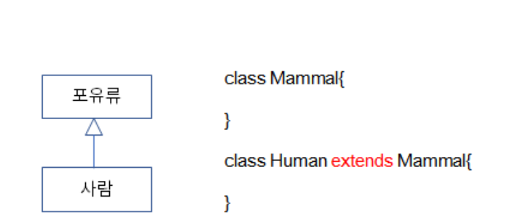
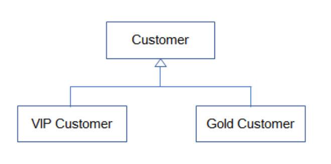
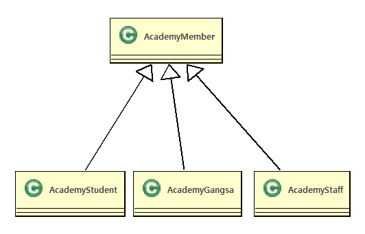

# 09. 객체 간의 관계 (상속)
  - 하나의 객체로만 만 이루어지는 객체지향프로그램은 존재하지 않는다. 
  - 객체지향프로그램은 여러 개의 객체가 서로  ***관계*** 를 맺어 기능을 수행한다.
  - 여러개의 객체와 그객체들이 관계를맺고 메세지를 교환하고 협력하여 업무를 수행한다
  - 객체지향프로그램에서 객체들의 관계는 객체를 생성하는 틀인 클래스를 작성할때 설정한다.
  - 클래스 다이어그램에서는 클래스의 관계를설정 한다.

## 클래스간의 관계
  1. ***상속***
  2. ***포함***

## 클래스의 관계 결정

  - 상속관계 : A는 B이다. (is-a)
  - 포함관계 : A는 B를 가지고 있다. (has-a)

## 상속(Inheritance) 
  
  - 새로운 클래스를 정의 할 때 이미 구현된 클래스를 상속(inheritance) 받아서 속성이나 기능을 확장하여 클래스를 구현함
  - 이미 구현된 클래스보다 더 구체적인 기능을 가진 클래스를 구현해야 할때 기존 클래스를 상속함

    

	
    - 상속하는 클래스 : 상위 클래스, parent class, base class, super class
    - 상속받는 클래스 : 하위 클래스, child class, derived class, subclass
      
	   >- 객체간의상속관계는  is a 가 성립할때 설정한다.<br>
	   >- 부모클래스(객체)의 멤버들을 자식클래스(객체)가 물려받는다.<br>
	   >- 상속을 사용하는이유는 기존에 만들어놓은 클래스의 재사용,확장을위해사용한다.<br>
	   >- 자바에서는 단일상속만이 가능하다(부모클래스가 한개만가능) <br>
	   >- 자바에서 제공되어지는 모든 클래스들은 Object 라고하는 최상위 클래스로부터 상속되어진다.<br>
	   >- 사용자정의 클래스들도 Object 클래스라는 최상위클래스를 상속 받아야한다.(생략가능)

## 상속문법

   - 상속받고자 하는 자식 클래스명 옆에 extends 키워드를 붙이고, 상속할 부모 클래스명을 적습니다.
   - extends 키워드 뒤에는 단 하나의 클래스만 올 수 있음 자바는 단일 상속(single inheritance)만을 지원함

   ```java
    public class 부모클래스{

    }
    public class 자식클래스 extends 부모클래스{

    }

   ```    
    
   ```java
    public class Parent{

    }
    public class Child extends Parent{

    }
  
   ```

  ## 상속을 구현 하는 경우

  - 상위 클래스는 하위 클래스 보다 더 일반적인 개념과 기능을 가짐
  - 하위 클래스는 상위 클래스 보다 더 구체적인 개념과 기능을 가짐
  - 하위 클래스가 상위 클래스의 속성과 기능을 확장 (extends)한다는 의미
   

  ## 상속을 활용한 멤버십 클래스 작성

   - 멤버십 시나리오

```
회사에서 고객 정보를 활용한 맞춤 서비스를 하기 위해 일반고객(Customer)과 
이보다 충성도가 높은 우수고객(VIPCustomer)에 따른 서비스를 제공하고자 함

물품을 구매 할때 적용되는 할인율과 적립되는 보너스 포인트의 비율이 다름 
여러 멤버십에 대한 각각 다양한 서비스를 제공할 수 있음
멤버십에 대한 구현을 클래스 상속을 활용하여 구현해보기
```

   - 일반 고객(Customer) 클래스 구현
   > 고객의 속성 : 고객 아이디, 고객 이름, 고객 등급, 보너스 포인트, 보너스 포인트 적립비율<br>
   > 일반 고객의 경우 물품 구매시 1%의 보너스 포인트 적립
   
 ```java
public class Customer {
	private int id;
	private String name;
	private String grade;
	private int bonusPoint;
	private double bonusRatio;
}
 ```

 - 우수 고객(VIPCustomer) 클래스 구현

   > 매출에 더 많은 기여를 하는 단골 고객<br>
   > 제품을 살때 10%를 할인해 줌<br>
   > 보너스 포인트는 제품 가격의 5%를 적립해 줌<br>
   > 담당 전문 상담원이 배정됨<br>

 ```java
public class VIPCustomer extends Customer{
	/**부모속성상속**/
	/*
	private int id;
	private String name;
	private String grade;
	private int bonusPoint;
	private double bonusRatio;
	*/
	/**자식속성추가**/
	private int agentID;
	private double salesRatio;

}

 ```

   - 상속 관계는 클래스 다이어그램에서 채워진 화살표로 표시된다.<br> 
       >자식클래스에서 부모클래스쪽으로  화살표가 그려져 있으며, 화살표가 부모 클래스 쪽으로 향한다. 
   - 다음은 '일반회원(Customer)' 클래스와 'VIP회원(VIPCustomer)' 클래스가 상속관계를 가지는 <br>
     클래스 다이어그램의 예시이다.



<br>
<hr>

# 수업예제
<hr>

 ### Academy(교육원) 관리프로그램작성

   - 객체도출
     - 아카데미학생,아카데미강사,아카데미스텝 실제객체추출
     - 아카데미학생,아카데미강사,아카데미스텝 실제객체로부터 아카데미멤버라는 가상의 객체를 추출

   - 객체관계설정
     - 아카데미학생은 아카데미멤버이다.
     - 아카데미강사는 아카데미멤버이다.
     - 아카데미스텝은 아카데미멤버이다.
  ```
        AcademyStudent has a AcademyMember
        AcademyGangsa  has a AcademyMember
        AcademyStaff   has a AcademyMember
  ```

   - 클래스 다이어그램으로 그리기



<br>
<hr>

 #### 프로그램구현
 
- AcademyMember.java

 ```java
  
public class AcademyMember extends Object{
	public int no;
	public String name;
	public AcademyMember() {}
	public AcademyMember(int no, String name) {
		this.no = no;
		this.name = name;
	}
	public void print() {
		System.out.print(this.no+"\t"+this.name+"\t");
	}
	public int getNo() {
		return no;
	}
	public void setNo(int no) {
		this.no = no;
	}
	public String getName() {
		return name;
	}
	public void setName(String name) {
		this.name = name;
	}
}
 ```

- AcademyStudent.java
  
 ```java 
public class AcademyStudent extends AcademyMember {
	/*
	public int no;
	public String name;
	public void print() {
		System.out.print(this.no+"\t"+this.name+"\t");
	}
	public int getNo() {
		return no;
	}
	public void setNo(int no) {
		this.no = no;
	}
	public String getName() {
		return name;
	}
	public void setName(String name) {
		this.name = name;
	}
	*/
	public String ban;//반
	public AcademyStudent() {
	}
	public AcademyStudent(int no,String name,String ban) {
		this.no=no;
		this.name=name;
		this.ban=ban;
	}
	
	public void studentPrint() {
		//System.out.println(this.no+"\t"+this.name+"\t");
		this.print();
		System.out.println(this.ban);
	}
	public String getBan() {
		return ban;
	}
	public void setBan(String ban) {
		this.ban = ban;
	}
}
 ```
- AcademyGangsa.java

 ```java
public class AcademyGangsa extends AcademyMember {
	public String subject;// 과목
	public AcademyGangsa() {
	}
	public AcademyGangsa(int no, String name, String subject) {
		this.no = no;
		this.name = name;
		this.subject = subject;
	}
	public void gangsaPrint() {
		this.print();
		System.out.println(this.subject);
	}
	public String getSubject() {
		return subject;
	}
	public void setSubject(String subject) {
		this.subject = subject;
	}
}
 
 ```  
- AcademyStaff.java
```java
  public class AcademyStaff extends AcademyMember{
	public String depart;//부서
	public AcademyStaff(int no,String name,String depart) {
		this.no=no;
		this.name=name;
		this.depart = depart;
	}
	public void staffPrint() {
		this.print();
		System.out.println(this.depart);
	}
	public String getDepart() {
		return depart;
	}
	public void setDepart(String depart) {
		this.depart = depart;
	}
}
```
- AcademyMemberMain.java

```java

public class AcademyMemberMain {
	public static void main(String[] args) {
		/*************************존재하지않는 객체생성*************
		AcademyMember academyMember=new AcademyMember(0, "누구게");
		academyMember.print();
		************************************************************/
		AcademyStudent st1=new AcademyStudent(1,"KIM", "LINUX");
		AcademyStudent st2=new AcademyStudent(2,"SIM", "JAVA");
		AcademyStudent st3=new AcademyStudent(3,"LIM", "OFFICE");
		
		AcademyGangsa gs1=new AcademyGangsa(4,"BOGUS", "JAVA");
		AcademyGangsa gs2=new AcademyGangsa(5,"JAMES", "OFFICE");
		
		AcademyStaff sf1=new AcademyStaff(6, "LEE", "MARKETING");
		AcademyStaff sf2=new AcademyStaff(7, "PARK", "ACCOUNTING");
		
		System.out.println("-------------Student-------------");
		/*****호출되면안되는 메쏘드호출****
		st1.print();
		***********************************/
		st1.studentPrint();
		st2.studentPrint();
		st3.studentPrint();
		System.out.println("-------------Gangsa-------------");
		gs1.gangsaPrint();
		gs2.gangsaPrint();
		System.out.println("-------------Staff-------------");
		sf1.staffPrint();
		sf2.staffPrint();
	}

}
```
- AcademyMemberArrayMain.java

 ```java
 public class AcademyMemberArrayMain {

	public static void main(String[] args) {

		AcademyStudent[] students = new AcademyStudent[3];
		AcademyGangsa[] gangsas = new AcademyGangsa[2];
		AcademyStaff[] staffs = new AcademyStaff[2];

		students[0] = new AcademyStudent(1, "KIM", "JAVA");
		students[1] = new AcademyStudent(2, "LEE", "IOS");
		students[2] = new AcademyStudent(3, "PARK", "CLOUDE");

		gangsas[0] = new AcademyGangsa(4, "김강사", "JAVA");
		gangsas[1] = new AcademyGangsa(5, "정강사", "안드로이드");
		
		staffs[0]=new AcademyStaff(6, "천상용", "마케팅");
		staffs[1]=new AcademyStaff(7, "김나영", "회계");
		
		System.out.println("---------AcademyMember전체출력----------");
		System.out.println("------------Student[for]---------------");
		for (int i = 0; i < students.length; i++) {
			AcademyStudent academyStudent = students[i];
			academyStudent.studentPrint();
		}
		System.out.println("------------Student[enhanced for]---------------");
		for (AcademyStudent academyStudent:students) {
			academyStudent.studentPrint();
		}
		System.out.println("------------Gangsa---------------");
		for (AcademyGangsa academyGangsa : gangsas) {
			academyGangsa.gangsaPrint();
		}
		System.out.println("------------Staff---------------");
		for (AcademyStaff academyStaff : staffs) {
			academyStaff.staffPrint();
		}
			
	}
}
 
 ```

- **AcademyMember&AcademyStudent객체그림**


 
   

  
  


