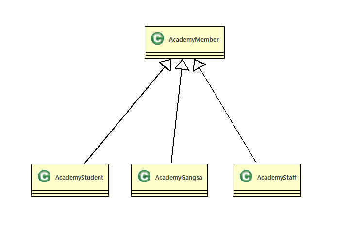

# 09. 객체 간의 관계 (상속)
  - 하나의 객체로만 만 이루어지는 객체지향프로그램은 존재하지 않는다. 
  - 객체지향프로그램은 여러 개의 객체가 서로  ***관계*** 를 맺어 기능을 수행한다.
  - 여러개의 객체와 그객체들이 관계를맺고 메세지를 교환하고 협력하여 업무를 수행한다
  - 객체지향프로그램에서 객체들의 관계는 객체를 생성하는 틀인 클래스를 작성할때 설정한다.
  - 클래스 다이어그램에서는 클래스의 관계를설정 한다.

## 클래스간의 관계
  1. ***상속***
  2. ***포함***

### 클래스의 관계 결정

  - 상속관계 : A는 B이다. (is-a)
  - 포함관계 : A는 B를 가지고 있다. (has-a)

### 상속(Inheritance) 
  
  - 객체간의포함관계는  is a 가 성립할때 설정한다.
  - 부모클래스(객체)의 멤버들을 자식클래스(객체)가 물려받는다.
  - 상속을 사용하는이유는 기존에 만들어놓은 클래스의 재사용,확장을위해사용한다.
  - 자바에서는 단일상속만이 가능하다(부모클래스가 한개만가능) 
  - 자바에서 제공되어지는 모든 클래스들은 Object 라고하는 최상위 클래스로부터 상속되어진다.
  - 사용자정의 클래스들도 Object 클래스라는 최상위클래스를 상속 받아야한다.(생략가능) 
  
#### 구현 방법
 
  - 상속받고자 하는 자식 클래스명 옆에 extends 키워드를 붙이고, 상속할 부모 클래스명을 적습니다..
  ```java
    class 부모클래스{

    }
    public class 자식클래스 extends 부모클래스{

    }

  ```    
  ```java
    class Parent{

    }
    public class Child extends Parent{

    }
  
  ```

#### 구현예시

```
  
  예를 들어, 쇼핑몰에 일반회원(Generalmember) 과 VIP회원(VIPMember) 이존재할때
  VIP회원은 일반회원이가지는속성(기능)에 추가되는 속성(기능)을 가질수있다.
  이런경우에는 일반회원(Generalmember)클래스를 상속받아 VIP회원(VIPMember)회원클래스를 작성하면
  객체생성시 일반회원이가지는속성(기능)을 상속받고 VIP회원(VIPMember)의 속성(기능)이 추가된객체를
  생성할수있다.  
  
```  
   - 구성 관계는 클래스 다이어그램에서 채워진 화살표로 표시된다.<br> 
       >자식클래스에서 부모클래스쪽으로  화살표가 그려져 있으며, 화살표가 부모 틀래스 쪽으로 향한다. 
   - 다음은 '일반회원(Generalmember)' 클래스와 'VIP회원(VIPMember)' 클래스가 상속관계를 가지는 <br>
     클래스 다이어그램의 예시이다.

  


 ### Academy(교육원) 관리프로그램작성

   - 객체도출
     - 아카데미학생,아카데미강사,아카데미스텝 실제객체추출
     - 아카데미학생,아카데미강사,아카데미스텝 실제객체로부터 아카데미멤버라는 가상의 객체를 추출

   - 객체관계설정
     - 아카데미학생은 아카데미멤버이다.
     - 아카데미강사는 아카데미멤버이다.
     - 아카데미스텝은 아카데미멤버이다.
  ```
        AcademyStudent has a AcademyMember
        AcademyGangsa  has a AcademyMember
        AcademyStaff   has a AcademyMember
  ```

   - 클래스 다이어그램으로 그리기



<br>
<hr>

 #### 프로그램구현
 
 - AcademyMember.java

  ```java
  
public abstract class AcademyMember extends Object{
	public int no;
	public String name;
	public AcademyMember() {}
	public AcademyMember(int no, String name) {
		this.no = no;
		this.name = name;
	}
	public void print() {
		System.out.print(this.no+"\t"+this.name+"\t");
	}
	public int getNo() {
		return no;
	}
	public void setNo(int no) {
		this.no = no;
	}
	public String getName() {
		return name;
	}
	public void setName(String name) {
		this.name = name;
	}
}
  ```
- AcademyStudent.java
  
```java 
public class AcademyStudent extends AcademyMember {
	/*
	public int no;
	public String name;
	public void print() {
		System.out.print(this.no+"\t"+this.name+"\t");
	}
	public int getNo() {
		return no;
	}
	public void setNo(int no) {
		this.no = no;
	}
	public String getName() {
		return name;
	}
	public void setName(String name) {
		this.name = name;
	}
	*/
	public String ban;//반
	public AcademyStudent() {
	}
	public AcademyStudent(int no,String name,String ban) {
		this.no=no;
		this.name=name;
		this.ban=ban;
	}
	
	public void studentPrint() {
		//System.out.println(this.no+"\t"+this.name+"\t");
		this.print();
		System.out.println(this.ban);
	}
	public String getBan() {
		return ban;
	}
	public void setBan(String ban) {
		this.ban = ban;
	}
}
```
- AcademyGangsa.java
 ```java
public class AcademyGangsa extends AcademyMember {
	public String subject;// 과목
	public AcademyGangsa() {
	}
	public AcademyGangsa(int no, String name, String subject) {
		this.no = no;
		this.name = name;
		this.subject = subject;
	}
	public void gangsaPrint() {
		this.print();
		System.out.println(this.subject);
	}
	public String getSubject() {
		return subject;
	}
	public void setSubject(String subject) {
		this.subject = subject;
	}
}
 
 ```  
- AcademyStaff.java
  ```java
  public class AcademyStaff extends AcademyMember{
	public String depart;//부서
	public AcademyStaff(int no,String name,String depart) {
		this.no=no;
		this.name=name;
		this.depart = depart;
	}
	public void staffPrint() {
		this.print();
		System.out.println(this.depart);
	}
	public String getDepart() {
		return depart;
	}
	public void setDepart(String depart) {
		this.depart = depart;
	}
}
  ```
 - AcademyMemberMain.java

```java

public class AcademyMemberMain {
	public static void main(String[] args) {
		/*************************존재하지않는 객체생성*************
		AcademyMember academyMember=new AcademyMember(0, "누구게");
		academyMember.print();
		************************************************************/
		AcademyStudent st1=new AcademyStudent(1,"KIM", "LINUX");
		AcademyStudent st2=new AcademyStudent(2,"SIM", "JAVA");
		AcademyStudent st3=new AcademyStudent(3,"LIM", "OFFICE");
		
		AcademyGangsa gs1=new AcademyGangsa(4,"BOGUS", "JAVA");
		AcademyGangsa gs2=new AcademyGangsa(5,"JAMES", "OFFICE");
		
		AcademyStaff sf1=new AcademyStaff(6, "LEE", "MARKETING");
		AcademyStaff sf2=new AcademyStaff(7, "PARK", "ACCOUNTING");
		
		System.out.println("-------------Student-------------");
		/*****호출되면안되는 메쏘드호출****
		st1.print();
		***********************************/
		st1.studentPrint();
		st2.studentPrint();
		st3.studentPrint();
		System.out.println("-------------Gangsa-------------");
		gs1.gangsaPrint();
		gs2.gangsaPrint();
		System.out.println("-------------Staff-------------");
		sf1.staffPrint();
		sf2.staffPrint();
	}

}
 ```

- **AcademyMember&AcademyStudent객체그림**


 
   

  
  


