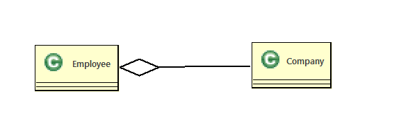

# 08. 객체 간의 관계 (포함)
  - 하나의 객체로만 만 이루어지는 객체지향프로그램은 존재하지 않는다. 
  - 객체지향프로그램은 여러 개의 객체가 서로  ***관계*** 를 맺어 기능을 수행한다.
  - 여러개의 객체와 그객체들이 관계를맺고 메세지를 교환하고 협력하여 업무를 수행한다
  - 객체지향프로그램에서 객체들의 관계는 객체를 생성하는 틀인 클래스를 작성할때 설정한다.
  - 클래스 다이어그램에서는 클래스의 관계를설정 한다.

## 클래스간의 관계
  1. 상속
  2. 포함

### 클래스의 관계 결정

  - 상속관계 : A는 B이다. (is-a)
  - 포함관계 : A는 B를 가지고 있다. (has-a)

 #### 포함(association) 
  
  - 객체간의포함관계는  has a 가 성립할때 설정한다.
  - 클래스의 멤버변수로 선언한다.

   #### 1. Aggregation(소유)
  - Aggregation) 관계는 전체 객체와 부분 객체의 관계를 나타낸다.
    소유관계는 Composition 관계와 유사하지만, 전체 객체와 부분 객체의 생명주기가 독립적이다.
    즉, 전체 객체가 파괴되더라도 부분 객체는 파괴되지 않는다.
  ```
    예를 들어, '회사(Company)' 클래스와 '직원(Employee)' 클래스가 있다고 가정해 보자.
    회사는 여러 명의 직원을 가지고 있으며, 직원은 여러 회사에서 일할 수 있다. 
    따라서 '회사(Company)' 클래스와 '직원(Employee)' 클래스는 소유관계를 가지게 된다.
    한 회사가 없어져도 해당 직원은 다른 회사에서도 사용하고 있으므로 해당 객체가 사라지지는 않는다.
    따라서 '회사(Company)' 클래스와 '직원(Employee)' 클래스는 생명주기가 서로 독립적이다.
  ```
      
  - 소유관계는 클래스 다이어그램에서 비어있는 마름모로 표시됩니다. 전체 객체 쪽에 마름모가 그려져 있으며, 
      화살표가 부분 객체 쪽으로 향한다.
  - 다음은 '회사(Company)' 클래스와 '직원(Employee)' 클래스가 소유관계를 가지는 클래스 다이어그램의 예시이다.

    
 


   2. Composition(구성)


 ##### 차를 생산하는 자동차공장 관리프로그램작성

   - 객체도출
   - 객체관계설정
  ```
  Car has a no(int)
  Car has a mode(String)
  Car has a engine(Engine)
  
   ```
   - 클래스 다이어그램으로 그리기
   - 프로그램구현 

 
   

  
  


