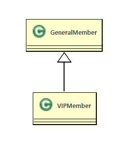
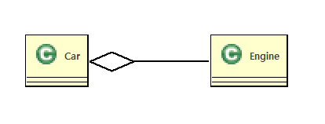
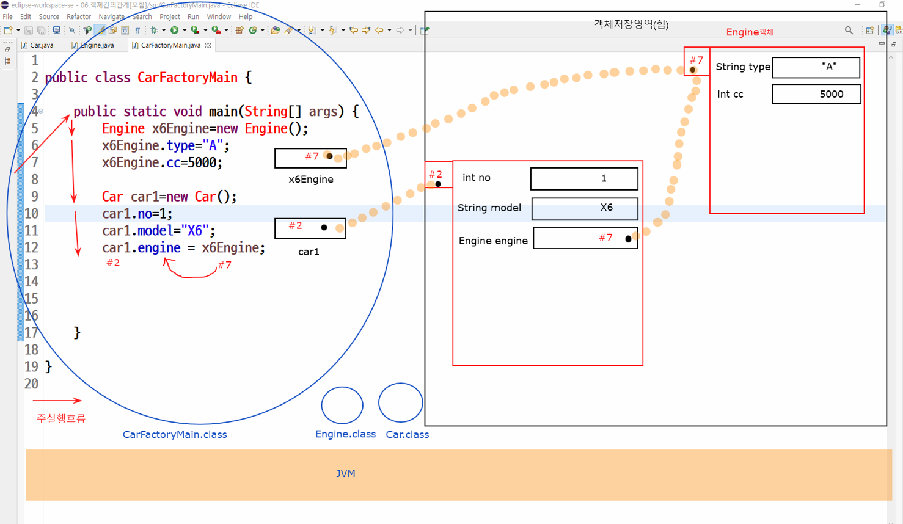

# 09. 객체 간의 관계 (상속)
  - 하나의 객체로만 만 이루어지는 객체지향프로그램은 존재하지 않는다. 
  - 객체지향프로그램은 여러 개의 객체가 서로  ***관계*** 를 맺어 기능을 수행한다.
  - 여러개의 객체와 그객체들이 관계를맺고 메세지를 교환하고 협력하여 업무를 수행한다
  - 객체지향프로그램에서 객체들의 관계는 객체를 생성하는 틀인 클래스를 작성할때 설정한다.
  - 클래스 다이어그램에서는 클래스의 관계를설정 한다.

## 클래스간의 관계
  1. ***상속***
  2. ***포함***

### 클래스의 관계 결정

  - 상속관계 : A는 B이다. (is-a)
  - 포함관계 : A는 B를 가지고 있다. (has-a)

### 상속(Inheritance) 
  
  - 객체간의포함관계는  is a 가 성립할때 설정한다.
  - 부모클래스(객체)의 멤버들을 자식클래스(객체)가 물려받는다.
  - 상속을 사용하는이유는 기존에 만들어놓은 클래스의 재사용,확장을위해사용한다.
  - 자바에서는 단일상속만이 가능하다(부모클래스가 한개만가능) 
  - 자바에서 제공되어지는 모든 클래스들은 Object 라고하는 최상위 클래스로부터 상속되어진다.
  - 사용자정의 클래스들도 Object 클래스라는 최상위클래스를 상속 받아야한다.(생략가능) 
  
#### 구현 방법
 
  - 상속받고자 하는 자식 클래스명 옆에 extends 키워드를 붙이고, 상속할 부모 클래스명을 적습니다..
  ```java
    class 부모클래스{

    }
    public class 자식클래스 extends 부모클래스{

    }

  ```    
  ```java
    class Parent{

    }
    public class Child extends Parent{

    }
  
  ```

#### 구현예시

```
  
  예를 들어, 쇼핑몰에 일반회원(Generalmember) 과 VIP회원(VIPMember) 이존재할때
  VIP회원은 일반회원이가지는속성(기능)에 추가되는 속성(기능)을 가질수있다.
  이런경우에는 일반회원(Generalmember)클래스를 상속받아 VIP회원(VIPMember)회원클래스를 작성하면
  객체생성시 일반회원이가지는속성(기능)을 상속받고 VIP회원(VIPMember)의 속성(기능)이 추가된객체를
  생성할수있다.  
  
```  
   - 구성 관계는 클래스 다이어그램에서 채워진 화살표로 표시된다.<br> 
       >자식클래스에서 부모클래스쪽으로  화살표가 그려져 있으며, 화살표가 부모 틀래스 쪽으로 향한다. 
   - 다음은 '일반회원(Generalmember)' 클래스와 'VIP회원(VIPMember)' 클래스가 상속관계를 가지는 <br>
     클래스 다이어그램의 예시이다.

  


 #### 차를 생산하는 자동차공장 관리프로그램작성

   - 객체도출
     - 차,엔진,바퀴,미션...
   - 객체관계설정
     - 차 는 엔진을 포함한다.
  ```
        Car has a no(int)
        Car has a model(String)
        Car has a engine(Engine)
  
   ```

   - 클래스 다이어그램으로 그리기




   - 프로그램구현 

   ```java
      public class Engine {
            private String type; //엔진타입
            private int cc;		//엔진배기량
      
      }
  ```

```java 
      /*
      << 객체간의관계 >>

       Car has a no(int)
       Car has a mode(String)
       Car has a engine(Engine)
      
      */
      public class Car {
          private int no;//차량번호
          private String model;//차량모델명
          private Engine engine;//차량엔진객체주소를 저장할 멤버필드
      

      }
```
- **Car&Engine포함관계객체참조**



- **Car&Engine포함관계 프린트메쏘드 실행흐름**


 
   

  
  


