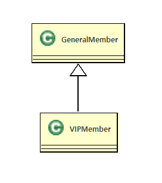
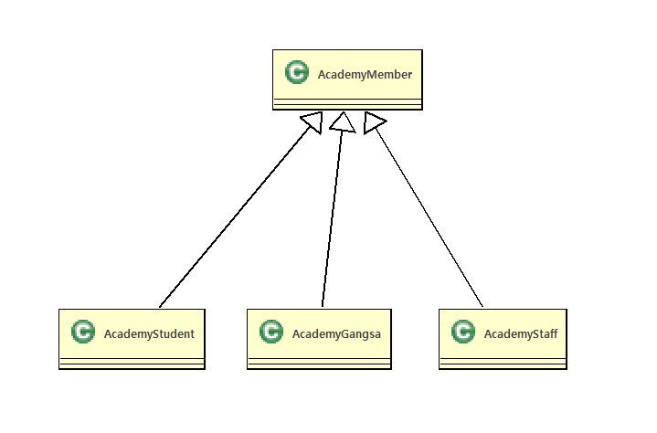

# 10. 메쏘드재정의(overriding)
  - 상속관계에서 발생하는 메쏘드의 재정의 기법이다.
  - 상위 클래스에 정의된 메서드의 구현 내용이 하위 클래스에서 구현할 내용과 맞지 않는 경우<br>
      하위 클래스에서 동일한 이름의 메서드를 재정의 할 수 있음
  - 자바의 다형성 기법중의하나이다.
  
  #### 메쏘드재정의(overriding)방법

   - 자식클래스에서 부모클래스에 정의된 메쏘드와 동일한 메쏘드 시그너처(리턴타입,메쏘드이름,매개변수목록)를<br> 
     가진 메쏘드를 자식클래스에 정의합니다.
   - 접근제한은 동일하거나 더강하게 재정의 할수있습니다.
   - 새로운 예외(Exception)을 throw 할수 없습니다.  
  
  ```java
    public class 부모클래스{
         public void 메쏘드1(){}
    }
    public class 자식클래스 extends 부모클래스{
		 public void 메쏘드1(){}
    }

  ```    

  ```java
    public class Parent{
		public void method1(){}
		public void method2(){}
    }
    public class Child extends Parent{
		
		/**재정의된메쏘드**/
		@Override
		public void method2(){}

		public void method3(){}
    }
    
	public class ParentChildMain {

		public static void main(String[] args) {
			Child child = new Child();
			child.method1();
			/**child.method2()호출시에는 자식에서 재정의된메쏘드가호출**/
			child.method2();
		    child.method3();
		}
	}

  ```
   >@overriding 애노테이션 (annotation)<br>
    > 애노테이션은 원래 주석이라는 의미<br>
    > 컴파일러에게 특별한 정보를 제공해주는 역할<br>
		


#### 구현예시

```
  
  예를 들어, 쇼핑몰에 일반회원(Generalmember) 과 VIP회원(VIPMember) 이존재할때
  VIP회원은 일반회원이가지는속성(기능)에 추가되는 속성(기능)을 가질수있다.
  이런경우에는 일반회원(Generalmember)클래스를 상속받아 VIP회원(VIPMember)회원클래스를 작성하면
  객체생성시 일반회원이가지는속성(기능)을 상속받고 VIP회원(VIPMember)의 속성(기능)이 추가된객체를
  생성할수있다.  
  
```  
   - 구성 관계는 클래스 다이어그램에서 채워진 화살표로 표시된다.<br> 
       >자식클래스에서 부모클래스쪽으로  화살표가 그려져 있으며, 화살표가 부모 틀래스 쪽으로 향한다. 
   - 다음은 '일반회원(Generalmember)' 클래스와 'VIP회원(VIPMember)' 클래스가 상속관계를 가지는 <br>
     클래스 다이어그램의 예시이다.

  


 ### Academy(교육원) 관리프로그램작성

   - 객체도출
     - 아카데미학생,아카데미강사,아카데미스텝 실제객체추출
     - 아카데미학생,아카데미강사,아카데미스텝 실제객체로부터 아카데미멤버라는 가상의 객체를 추출

   - 객체관계설정
     - 아카데미학생은 아카데미멤버이다.
     - 아카데미강사는 아카데미멤버이다.
     - 아카데미스텝은 아카데미멤버이다.
  ```
        AcademyStudent has a AcademyMember
        AcademyGangsa  has a AcademyMember
        AcademyStaff   has a AcademyMember
  ```

   - 클래스 다이어그램으로 그리기



<br>
<hr>

 #### 프로그램구현
 
- AcademyMember.java

 ```java
  
public abstract class AcademyMember extends Object{
	public int no;
	public String name;
	public AcademyMember() {}
	public AcademyMember(int no, String name) {
		this.no = no;
		this.name = name;
	}
	public void print() {
		System.out.print(this.no+"\t"+this.name+"\t");
	}
	public int getNo() {
		return no;
	}
	public void setNo(int no) {
		this.no = no;
	}
	public String getName() {
		return name;
	}
	public void setName(String name) {
		this.name = name;
	}
}
 ```

- AcademyStudent.java
  
 ```java 
public class AcademyStudent extends AcademyMember {
	/*
	public int no;
	public String name;
	public void print() {
		System.out.print(this.no+"\t"+this.name+"\t");
	}
	public int getNo() {
		return no;
	}
	public void setNo(int no) {
		this.no = no;
	}
	public String getName() {
		return name;
	}
	public void setName(String name) {
		this.name = name;
	}
	*/
	public String ban;//반
	public AcademyStudent() {
	}
	public AcademyStudent(int no,String name,String ban) {
		this.no=no;
		this.name=name;
		this.ban=ban;
	}
	
	public void studentPrint() {
		//System.out.println(this.no+"\t"+this.name+"\t");
		this.print();
		System.out.println(this.ban);
	}
	public String getBan() {
		return ban;
	}
	public void setBan(String ban) {
		this.ban = ban;
	}
}
 ```
- AcademyGangsa.java

 ```java
public class AcademyGangsa extends AcademyMember {
	public String subject;// 과목
	public AcademyGangsa() {
	}
	public AcademyGangsa(int no, String name, String subject) {
		this.no = no;
		this.name = name;
		this.subject = subject;
	}
	public void gangsaPrint() {
		this.print();
		System.out.println(this.subject);
	}
	public String getSubject() {
		return subject;
	}
	public void setSubject(String subject) {
		this.subject = subject;
	}
}
 
 ```  
- AcademyStaff.java
```java
  public class AcademyStaff extends AcademyMember{
	public String depart;//부서
	public AcademyStaff(int no,String name,String depart) {
		this.no=no;
		this.name=name;
		this.depart = depart;
	}
	public void staffPrint() {
		this.print();
		System.out.println(this.depart);
	}
	public String getDepart() {
		return depart;
	}
	public void setDepart(String depart) {
		this.depart = depart;
	}
}
```
- AcademyMemberMain.java

```java

public class AcademyMemberMain {
	public static void main(String[] args) {
		/*************************존재하지않는 객체생성*************
		AcademyMember academyMember=new AcademyMember(0, "누구게");
		academyMember.print();
		************************************************************/
		AcademyStudent st1=new AcademyStudent(1,"KIM", "LINUX");
		AcademyStudent st2=new AcademyStudent(2,"SIM", "JAVA");
		AcademyStudent st3=new AcademyStudent(3,"LIM", "OFFICE");
		
		AcademyGangsa gs1=new AcademyGangsa(4,"BOGUS", "JAVA");
		AcademyGangsa gs2=new AcademyGangsa(5,"JAMES", "OFFICE");
		
		AcademyStaff sf1=new AcademyStaff(6, "LEE", "MARKETING");
		AcademyStaff sf2=new AcademyStaff(7, "PARK", "ACCOUNTING");
		
		System.out.println("-------------Student-------------");
		/*****호출되면안되는 메쏘드호출****
		st1.print();
		***********************************/
		st1.studentPrint();
		st2.studentPrint();
		st3.studentPrint();
		System.out.println("-------------Gangsa-------------");
		gs1.gangsaPrint();
		gs2.gangsaPrint();
		System.out.println("-------------Staff-------------");
		sf1.staffPrint();
		sf2.staffPrint();
	}

}
```
- AcademyMemberArrayMain.java

 ```java
 public class AcademyMemberArrayMain {

	public static void main(String[] args) {

		AcademyStudent[] students = new AcademyStudent[3];
		AcademyGangsa[] gangsas = new AcademyGangsa[2];
		AcademyStaff[] staffs = new AcademyStaff[2];

		students[0] = new AcademyStudent(1, "KIM", "JAVA");
		students[1] = new AcademyStudent(2, "LEE", "IOS");
		students[2] = new AcademyStudent(3, "PARK", "CLOUDE");

		gangsas[0] = new AcademyGangsa(4, "김강사", "JAVA");
		gangsas[1] = new AcademyGangsa(5, "정강사", "안드로이드");
		
		staffs[0]=new AcademyStaff(6, "천상용", "마케팅");
		staffs[1]=new AcademyStaff(7, "김나영", "회계");
		
		System.out.println("---------AcademyMember전체출력----------");
		System.out.println("------------Student[for]---------------");
		for (int i = 0; i < students.length; i++) {
			AcademyStudent academyStudent = students[i];
			academyStudent.studentPrint();
		}
		System.out.println("------------Student[enhanced for]---------------");
		for (AcademyStudent academyStudent:students) {
			academyStudent.studentPrint();
		}
		System.out.println("------------Gangsa---------------");
		for (AcademyGangsa academyGangsa : gangsas) {
			academyGangsa.gangsaPrint();
		}
		System.out.println("------------Staff---------------");
		for (AcademyStaff academyStaff : staffs) {
			academyStaff.staffPrint();
		}
			
	}
}
 
 ```

- **AcademyMember&AcademyStudent객체그림**


 
   

  
  


