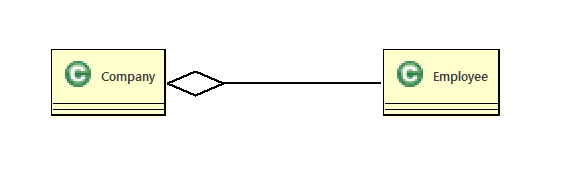
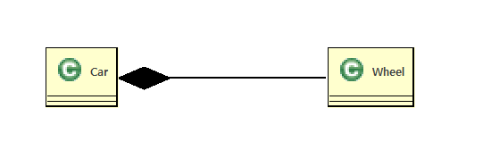
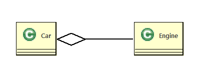
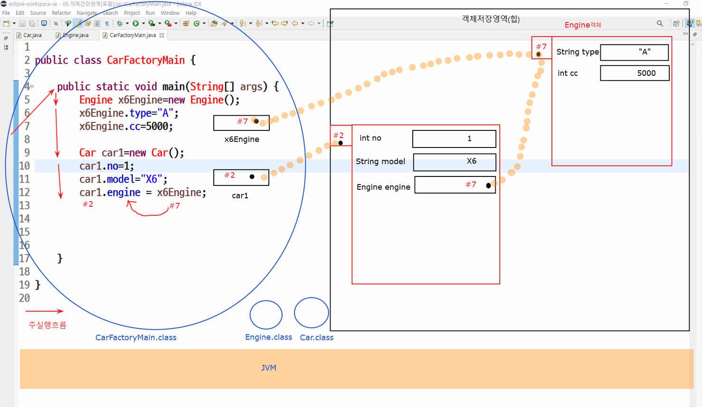
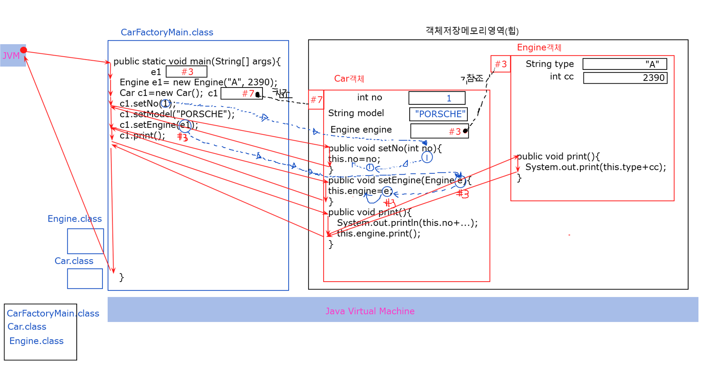
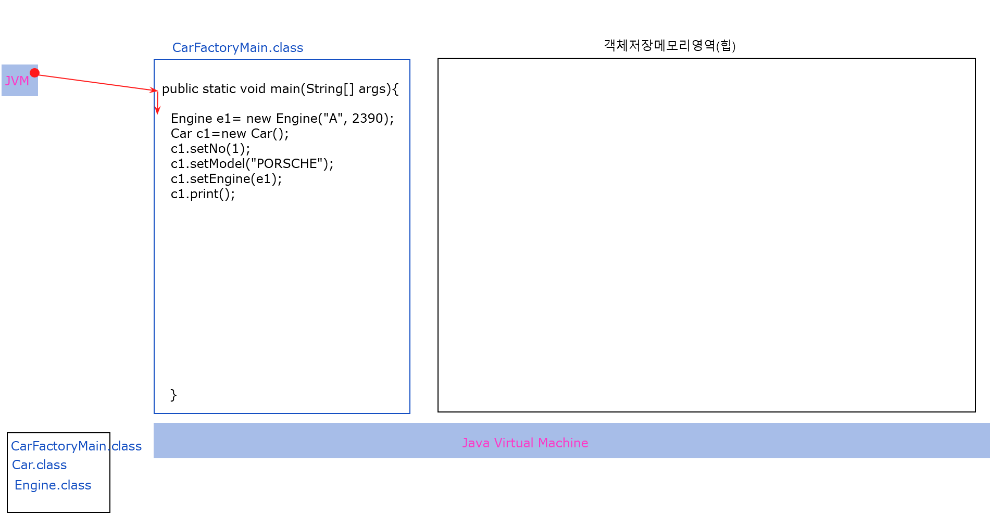
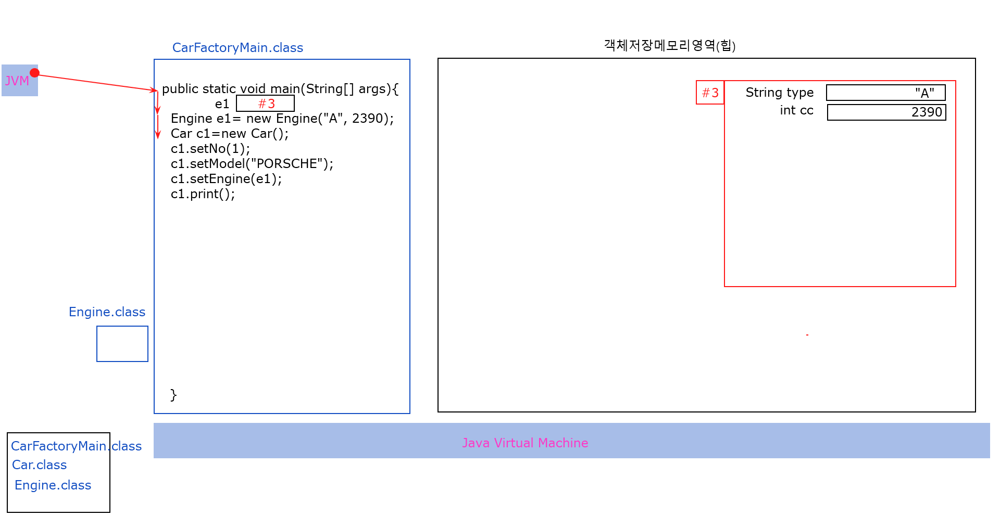
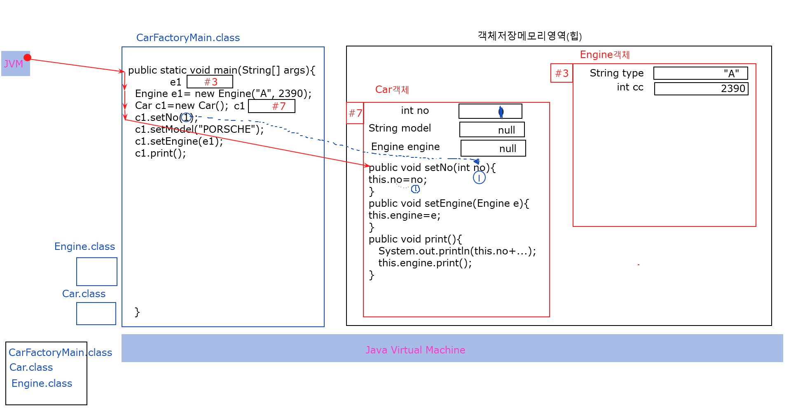
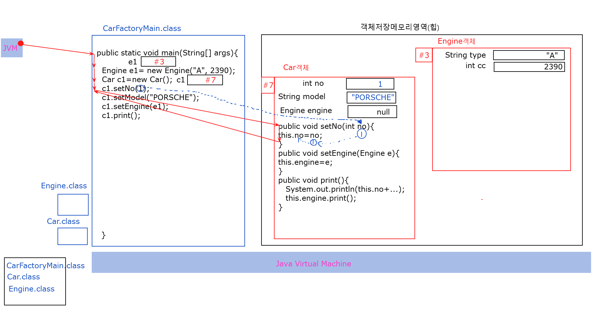
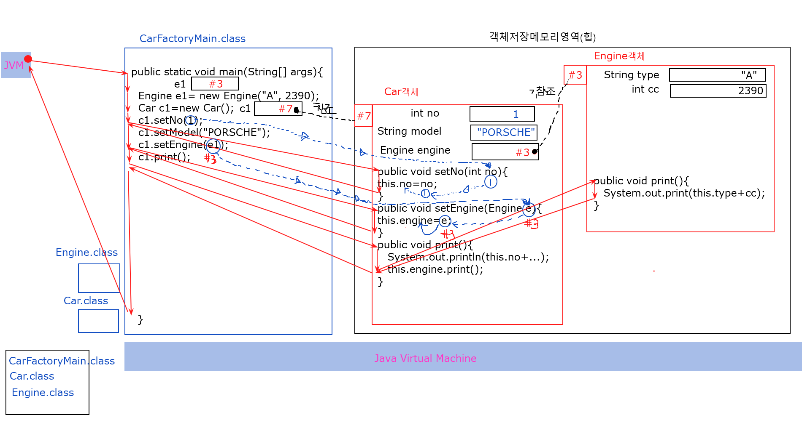

# 09. 객체 간의 관계 (상속)
  - 하나의 객체로만 만 이루어지는 객체지향프로그램은 존재하지 않는다. 
  - 객체지향프로그램은 여러 개의 객체가 서로  ***관계*** 를 맺어 기능을 수행한다.
  - 여러개의 객체와 그객체들이 관계를맺고 메세지를 교환하고 협력하여 업무를 수행한다
  - 객체지향프로그램에서 객체들의 관계는 객체를 생성하는 틀인 클래스를 작성할때 설정한다.
  - 클래스 다이어그램에서는 클래스의 관계를설정 한다.

## 클래스간의 관계
  1. ***상속***
  2. ***포함***

### 클래스의 관계 결정

  - 상속관계 : A는 B이다. (is-a)
  - 포함관계 : A는 B를 가지고 있다. (has-a)

### 상속(Inheritance) 
  
  - 객체간의포함관계는  is a 가 성립할때 설정한다.
  - 부모클래스(객체)의 멤버들을 자식클래스(객체)가 물려받는다.
  - 상속을 사용하는이유는 기존에 만들어놓은 클래스의 재사용,확장을위해사용한다.
  - 자바에서는 단일상속만이 가능하다(부모클래스가 한개만가능) 
  - 자바에서 제공되어지는 모든 클래스들은 Object 라고하는 최상위 클래스로부터 상속되어진다.
  - 사용자정의 클래스들도 Object 클래스라는 최상위클래스를 상속 받아야한다.(생략가능) 
  
 #### 형태
 
  - 상속받고자 하는 자식 클래스명 옆에 extends 키워드를 붙이고, 상속할 부모 클래스명을 적습니다..
  ```java

  ```    

#### 

  - Aggregation 관계는 전체 객체와 부분 객체의 관계를 나타낸다.<br>
     소유관계는 Composition 관계와 유사하지만, 전체 객체와 부분 객체의 생명주기가 독립적이다.<br>
     즉, 전체 객체가 파괴되더라도 부분 객체는 파괴되지 않는다.
     
   ```
      예를 들어, '회사(Company)' 클래스와 '직원(Employee)' 클래스가 있다고 가정해 보자.
      회사는 여러 명의 직원을 가지고 있으며, 직원은 여러 회사에서 일할 수 있다. 
      따라서 '회사(Company)' 클래스와 '직원(Employee)' 클래스는 소유관계를 가지게 된다.
      한 회사가 없어져도 해당 직원은 다른 회사에서도 사용하고 있으므로 해당 객체가 사라지지는 않는다.
      따라서 '회사(Company)' 클래스와 '직원(Employee)' 클래스는 생명주기가 서로 독립적이다.
   ```
      
  - 소유관계는 클래스 다이어그램에서 비어있는 마름모로 표시됩니다. <br>
    전체 객체 쪽에 마름모가 그려져 있으며, 화살표가 부분 객체 쪽으로 향한다.
  - 다음은 '회사(Company)' 클래스와 '직원(Employee)' 클래스가 소유관계를 가지는 클래스 다이어그램의 예시이다.



 


#### 2.Composition(구성)
   - 구성(Composition) 관계는 전체 객체와 부분 객체의 강한 연결 관계를 나타낸다.<br>
      구성 관계에서는 전체 객체와 부분 객체가 강하게 결합되어 있어, <br>
      전체 객체가 파괴될 때 부분 객체도 함께 파괴됩니다.<br>
      즉, 전체 객체와 부분 객체는 생명주기를 공유한다.

```
  예를 들어, '차(Car)' 클래스와 '바퀴(Wheel)' 클래스가 있다고 가정했을 때 
  하나의 차는 여러 개의 바퀴를 가지며, 
  바퀴는 차 없이는 존재할 수 없다. 
  따라서 '차(Car)' 클래스와 '바퀴(Wheel)' 클래스는 구성 관계를 가지게 된다.
  물론 이는 주관적인 관계이기 때문에 보는 차가 없어도 바퀴가 독립적으로 존재할 수 있다고 생각할 수 있다. 
  하지만 프로그램을 만들었을 때 해당 객체의 생명주기를 공유 즉 같이 생성되고 
  같이 파괴된다면 이는 구성 관계라고 볼 수 있다.
```  
   - 구성 관계는 클래스 다이어그램에서 채워진 마름모로 표시된다.<br> 
     전체 객체 쪽에 마름모가 그려져 있으며, 화살표가 부분 객체 쪽으로 향한다. 
   - 다음은 '차(Car)' 클래스와 '바퀴(Wheel)' 클래스가 구성 관계를 가지는 클래스 다이어그램의 예시이다.

   


 #### 차를 생산하는 자동차공장 관리프로그램작성

   - 객체도출
     - 차,엔진,바퀴,미션...
   - 객체관계설정
     - 차 는 엔진을 포함한다.
  ```
        Car has a no(int)
        Car has a model(String)
        Car has a engine(Engine)
  
   ```

   - 클래스 다이어그램으로 그리기




   - 프로그램구현 

   ```java
      public class Engine {
            private String type; //엔진타입
            private int cc;		//엔진배기량
      
      }
  ```

```java 
      /*
      << 객체간의관계 >>

       Car has a no(int)
       Car has a mode(String)
       Car has a engine(Engine)
      
      */
      public class Car {
          private int no;//차량번호
          private String model;//차량모델명
          private Engine engine;//차량엔진객체주소를 저장할 멤버필드
      

      }
```
- **Car&Engine포함관계객체참조**



- **Car&Engine포함관계 프린트메쏘드 실행흐름**






 
   

  
  


