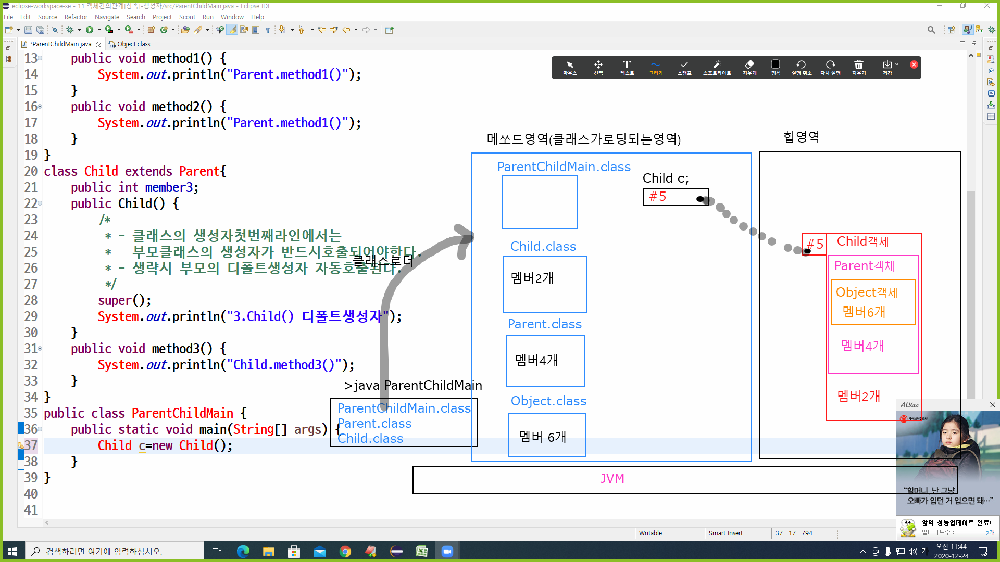

# 11. 객체의 생성(생성자)
  - 객체생성시 상속관계에있는 모든클래스를 사용해서 객체를 생성한다.
  >클래스의 재사용
  - 자식객체생성시 자식객체생성전에 부모클래스를 사용해서 부모객체를 생성하고
    부모객체를 포함한자식객체를 생성한다.  
  - 부모객체의 멤버들이 상속이 이루어지는 시점은 객체생성시에 이루어진다.

  ### 객체생성시생성자호출순서
   
   ```java
    public class Object{
		public Object(){
			
		}	

	}
	public class Parent extends Object{
		public Parent(){
			상위클래스(Object)의 생성자가 호출.
		}
	}
	public class Child extends Parent{
		public Child(){
			상위클래스(Parent)의 생성자가 호출.
		}
	}

	public class ParentChildMain{
		public static void main(String[] args){
			Child c = new Child();
		}
	}

   ```


<br>
<hr>

### 예제프로그램

```java
class Parent extends Object{
	private int member1;
	private int member2;
	public Parent() {
		/*
		 - 클래스 생성자 첫번째라인에서는 부모클래스의 생성자가반드시호출되어야한다.
		 - 부모클래스 생성자 호출을 생략할시에는 부모클래스의 디폴트생성자가 자동으로 호출된다.
		 */
		super();
		System.out.println("1.Object() 기본(디폴트)생성자");
		System.out.println("2.Parent() 기본(디폴트)생성자");
	}
	public Parent(int member1, int member2) {
		/*
		 - 클래스 생성자 첫번째라인에서는 부모클래스의 생성자가반드시호출되어야한다.
		 - 부모클래스 생성자 호출을 생략할시에는 부모클래스의 디폴트생성자가 자동으로 호출된다.
		 */
		super();
		System.out.println("1.Object()기본생성자");
		this.member1 = member1;
		this.member2 = member2;
		System.out.println("2.Parent(int member1, int member2) 생성자");
	}
	
	public void method1() {
		System.out.println("Parent.method1()");
	}
	public void method2() {
		System.out.println("Parent.method2()");
		
	}
	public void print() {
		System.out.print(this.member1+"\t"+this.member2+"\t");
	}
	
	public int getMember1() {
		return member1;
	}
	public void setMember1(int member1) {
		this.member1 = member1;
	}
	public int getMember2() {
		return member2;
	}
	public void setMember2(int member2) {
		this.member2 = member2;
	}
	
	
}
class Child extends Parent{
	public int member3;
	public Child() {
		/*
		 - 클래스 생성자 첫번째라인에서는 부모클래스의 생성자가반드시호출되어야한다.
		 - 부모클래스 생성자 호출을 생략할시에는 부모클래스의 디폴트생성자가 자동으로 호출된다.
		 */
		super();//Parent클래스--> Parent()기본생성자
		
		System.out.println("3.Child()기본생성자 호출");
	}
	public Child(int member1,int member2,int member3) {
		/*
		 - 클래스 생성자 첫번째라인에서는 부모클래스의 생성자가반드시호출되어야한다.
		 - 부모클래스 생성자 호출을 생략할시에는 부모클래스의 디폴트생성자가 자동으로호출된다.
		 */
		
		/*
		 * 매개변수를 가진 부모의 생성자를 호출할수있다.
		 * 매개변수를 가진 부모의 생성자를 호출할려면 명시적으로 호출코드를 기술하여야한다.
		 */
		/*********case1**********/
		super(member1,member2);//Parent 클래스--> Parent(int member1,int member2)생성자
		/************************/
		
		/********case2**********
		super();//Parent 클래스--> Parent()기본 생성자
		this.setMember1(member1);
		this.setMember2(member2);
		*******************/
		this.member3=member3;
		System.out.println("3.Child(int member1,int member2,int member3)생성자호출 ");
	}
	public void method3() {
		System.out.println("Child.method3()");
	}
	/*
	public void print() {
		System.out.print(this.member1+"\t"+this.member2+"\t");
	} 
	 */
	public void print() {
		//System.out.println(this.member1+"\t"+this.member2+"\t"+this.member3);
		super.print();
		System.out.println(this.member3);
	}
	public int getMember3() {
		return member3;
	}
	public void setMember3(int member3) {
		this.member3 = member3;
	}
}
public class ParentChildMain {

	public static void main(String[] args) {
		System.out.println("-------------Child()-----------------");
		Child c1=new Child();
		System.out.println("-------------Child(int member1,int member2,int member3)-----------------");
		Child c2=new Child(1,2,3);
		
	}

}

```
	
	   	 
 ### 예제그림

     
   
