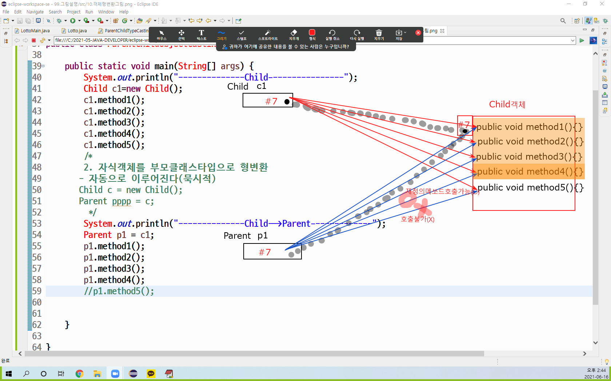

# 12. 객체형변환
  - 상속관계에있는 객체의 주소변수는 객체주소변수의 타입이 변환이가능하다.
  - 다형성을구현하기위한 기법이다.

  #### 객체주소변수의 형변환(type casting)
   - 상속관계에있는 클래스(타입) 사이에서만 가능하다.
      1. 자식클래스타입 객체의주소를 부모클래스타입 객체의 주소로 형변환
	     >주소변경절대안됨,타입만변경<br>
      2. 부모클래스타입 객체의주소를 자식클래스타입 객체의 주소로 형변환
	     >주소변경절대안됨,타입만변경<br>
        
   - 자식클래스타입 객체의주소를 부모클래스타입 객체의 주소로 형변환
       - 자동으로 이루어진다(묵시적)
 ```java
	Child c = new Child();
	Parent p = c; 

	Parent p=new Child();
 ```

   - 부모클래스타입 객체의주소를 자식클래스타입 객체의 주소로 형변환
       - 원칙적으로는 불가능하다
       - 부모의 탈을쓴 자식객체 는 가능하다.
 ```java
	Parent p=new Parent();
	Child cccc = p;(X)
	public class Parent{}
	public class Child extends Parent{}
 ```	
 
  #### 객체주소변수의 형변환방법

  ```java
  class Parent extends Object{
	public void method1() {
		System.out.println("Parent.method1()");
	}
	public void method2() {
		System.out.println("Parent.method2()");
	}
	public void method3() {
		System.out.println("Parent.method3()");
	}
	public void method4() {
		System.out.println("Parent.method4()");
	}
}
class Child extends Parent{
	/*
	public void method4() {
		System.out.println("Parent.method4()");
	}
	*/
	@Override
	public void method4() {
		System.out.println("Child.method4()--> Parent.method4()를 재정의[오버라이딩]");
	}
	public void method5() {
		System.out.println("Child.method5()");
	}
}

public class ParentChildTypeCastingMain {
	public static void main(String[] args) {
		System.out.println("---------<< Child-->Parent >>-----------");
		Child c1=new Child();
		c1.method1();
		c1.method2();
		c1.method3();
		c1.method4();//재정의된메쏘드 호출
		c1.method5();
		/*
		자식클래스타입 객체의주소를 부모클래스타입 객체의 주소로 형변환(주소변경절대안됨,타입만변경)
			- 자동으로 이루어진다(묵시적)
		 */
		Parent p1 = c1;
		if(p1==c1) {
			System.out.println(p1+"=="+c1+"[p1과 c1 의 주소가 동일하다]");
		}
		p1.method1();
		p1.method2();
		p1.method3();
		p1.method4();//재정의된메쏘드호출
		/*
		p1.method5();
		*/
		System.out.println("---------<< Parent-->Child >>-----------");
		/*
		부모클래스타입 객체의주소를 자식클래스타입 객체의 주소로 형변환(주소변경절대안됨,타입만변경)
			1. 원칙적으로는 불가능하다(case 1)
       	 */
		Parent p2=new Parent();
		/*
		<< compile error >>
		Type mismatch: cannot convert from Parent to Child
		Child c2 = p2;
		*/
		/*******************************************************************
		 강제형변환시 compile은 가능하나 실행시예외(에러)발생
		 - java.lang.ClassCastException: Parent cannot be cast to Child
			Child c2=(Child)p2;
		*******************************************************************/
		
		/*
		   2. 부모의 탈을쓴 자식객체 는 가능하다.(case 2)
		 */
		Child c3=new Child();
		Parent p3=c3;
		//Parent p3=new Child();
		System.out.println("---Child객체 Parent타입변수로호출---");
		p3.method1();
		p3.method2();
		p3.method3();
		p3.method4();//재정의된메쏘드호출
		//p3.method5();
		System.out.println("---Child객체 Child타입변수로호출---");
		Child c4 = (Child)p3;
		c4.method1();
		c4.method2();
		c4.method3();
		c4.method4();
		c4.method5();
	}
}
  ```

 #### 객체주소변수의 형변환그림

 

<br>
<hr>

### 예제

```java

public class AcademyMemberTypeCastingMain {

	public static void main(String[] args) {
		//AcademyMember am=new AcademyMember(0, "누구게");
		
		/*
		 2. 자식클래스타입 객체의주소를 부모클래스타입 객체의 주소로 형변환
       		- 자동으로 이루어진다(묵시적)
	       		Child c = new Child();
	       		Parent p = c; 
	       		
	       		Parent p=new Child();
		*/
		
		/*
		 public class AcademyStudent extends AcademyMember{}
		 public class AcademyGangsa extends AcademyMember{}
		 public class AcademyStaff extends AcademyMember{}
		
		 AcademyMember의 자식타입객체(AcademyStudent,AcademyGangsa,AcademyStaff)들은
		 AcademyMember타입의 변수에 대입가능
		
		 */
		
		AcademyStudent st1=new AcademyStudent(1, "KIM", "LINUX");
		AcademyMember m1=st1;
		AcademyMember m2=new AcademyStudent(2, "KAN", "JAVA");
		AcademyMember m3=new AcademyGangsa(3, "HONG", "OFFICE");
		AcademyMember m4=new AcademyGangsa(4, "SIM", "ANDROID");
		AcademyMember m5=new AcademyStaff(5, "LEE", "영업부");
		AcademyMember m6=new AcademyStaff(6, "JUNG", "회계부");
		System.out.println("-------AcademyMember전체 출력------");
		/*
		 - AcademyMember타입에 정의된 print 메쏘드를 호출하면
		 - AcademyMember의 자식타입객체(AcademyStudent,AcademyGangsa,AcademyStaff)의
		  	재정의된 print메쏘드가호출된다.
		 */
		m1.print();
		/*
		AcademyMember에 존재하지않는 메쏘드 호출불가능
		String ban = m1.getBan();
		*/
		m2.print();
		m3.print();
		m4.print();
		m5.print();
		m6.print();
		
		

	}

}

```

```java

public class AcademyMemberArrayTypeCastingMain {

	public static void main(String[] args) {
		
		//AcademyMember m1,m2,m3,m4,m5,m6,m7=null;
		AcademyMember[] members=new AcademyMember[7];
		
		members[0]=new AcademyStudent(1,"KIM","JAVA");
		members[1]=new AcademyStudent(2,"LIM","OFFICE");
		members[2]=new AcademyStudent(3,"MIN","DESIGN");
		members[3]=new AcademyGangsa(4,"OIM","ANDROID");
		members[4]=new AcademyGangsa(5,"PIM","IOS");
		members[5]=new AcademyStaff(6,"QIM","ACCOUNTING");
		members[6]=new AcademyStaff(7,"RIM","MARKETING");
		
		System.out.println("--AcademyMember전체출력---");
		for(int i=0;i<members.length;i++) {
			members[i].print();
		}
		
		System.out.println("-------------instanceof-------------");
		/*
		 *  연산자 -->  instanceof
		 *    - 형태    :   참조변수 instanceof 클래스이름
		 *    - 연산결과:	true or false 	
		 */
		AcademyMember am=new AcademyStudent(1,"김수로","정보처리");
		//AcademyMember am=new AcademyGangsa(1,"김수로","정보처리");
		boolean isStudent = am instanceof AcademyStudent;// am객체가 AcademyStudent클래스로 생성된객체이냐?
		if(isStudent) {
			System.out.println(">> am객체가 AcademyStudent클래스로 생성된객체이다");
			AcademyStudent tempStudent = (AcademyStudent)am;
			String tempBan=tempStudent.getBan();
			System.out.println(">>학생반:"+tempBan);
		}else {
			System.out.println(">> am객체가 AcademyStudent클래스로 생성된객체가 아니다");
		}
		System.out.println("--------------AcademyMember배열에있는 객체들중에서 AcademyStudent객체만출력----------");
		for (int i = 0; i < members.length; i++) {
			
			if(members[i] instanceof AcademyStudent) {
				members[i].print();
				
			}
		}
		System.out.println("--------------AcademyMember배열에있는 객체들중에서 AcademyGangsa객체만출력----------");
		for (int i = 0; i < members.length; i++) {
			if(members[i] instanceof AcademyGangsa) {
				members[i].print();
				
			}
		}
		System.out.println("--------------AcademyMember배열에있는 객체들중에서 AcademyStaff객체만출력----------");
		for (int i = 0; i < members.length; i++) {
			if(members[i] instanceof AcademyStaff) {
				members[i].print();
				
			}
		}
		
	}

}


```

   
   
