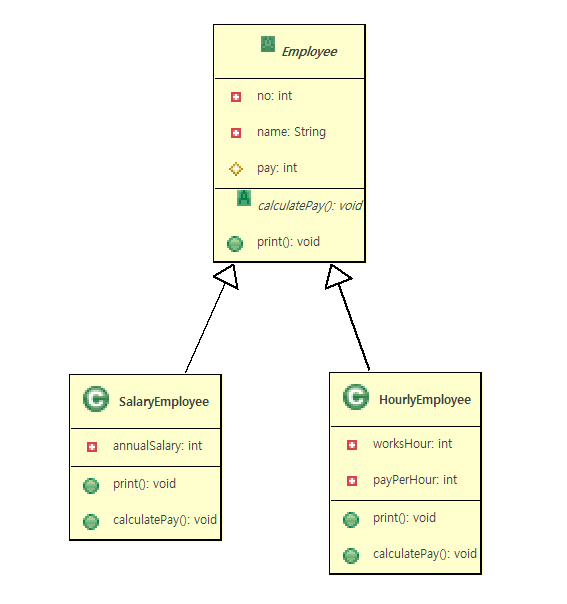

# 13. 추상 클래스(abstract class) 구현하기

## 추상 클래스란?

- 구현 코드 없이 메서드의 선언만 있는 추상 메서드(abstract method)를 포함한 클래스
>메서드 선언(declaration) : 반환타입, 메서드 이름, 매개변수로 구성<br>
>메서드 정의(definition) : 메서드 구현(implementation)과 동일한 의미 구현부(body) 를 가짐 ({ })
- 예) 
  >public int add(int x, int y); // 선언 <br>
  >public int add(int x, int y){ } // 구현부가 있음, 추상 메서드 아님
- abstract 예약어를 사용
  > public abstract int add(int x, int y); // 선언 <br>
- 추상 클래스는 new 할 수 없음 ( 인스턴스화 할 수 없음 )
   
## 추상 클래스 구현하기

- 메서드에 구현 코드가 없으면 abstract 로 선언
- abstract로 선언된 메서드를 가진 클래스는 abstract로 선언
- 모든 메서드가 구현 된 클래스라도 abstract로 선언되면 추상 클래스로 인스턴스화 할 수 없음
- 추상 클래스의 추상 메서드는 하위 클래스가 상속 하여 구현
  > 추상 클래스 내의 추상 메서드 : 하위 클래스가 구현해야 하는 메서드<br>
  > 추상 클래스 내의 구현 된 메서드 : 하위 클래스가 공통으로 사용하는 메서드 ( 필요에 따라 하위 클래스에서 재정의 함 )

 ```java
public abstract class AbstractClass {
	public void method1() {
		System.out.println("난 구상(Concrete) 메쏘드");
	}
	/** 추상(abstract)메쏘드 **/
	public abstract void method2();
	
}
 ```
 ```java
public class AbstractClassChild extends AbstractClass {
	/*
	public void method1() {
		System.out.println("난 구상(Concrete) 메쏘드");
	}
	public abstract void method2();
	 */
	@Override
	public void method2() {
		System.out.println("AbstractClassChild에서 AbstractClass의 추상메쏘드 method2 재정의[implement(구현)]");
		
	}
}
 ```

 ```java

public class AbstractClassChildMain {
	public static void main(String[] args) {
		/*
		<< Cannot instantiate the type AbstractClass >>
		AbstractClass ac=new AbstractClass();
		 */
		System.out.println("---------ac1-----------");
		AbstractClassChild acc1=new AbstractClassChild();
		acc1.method1();
		acc1.method2();
		
		AbstractClass ac1 = acc1;
		ac1.method1();
		ac1.method2();
		System.out.println("----------ac2----------");
		AbstractClass ac2=new AbstractClassChild();
		ac2.method1();
		ac2.method2();
	}
}
 ```

<br>
<hr>

### 예제 구현하기

  - 사원급여계산프로그램구현
    >월급사원과 시급사원 두개의 객체도출<br> 
	>월급사원과 시급사원의 공통속성과,기능을 추출하여 사원객체도출후 상속관계설정<br>
	>월급사원과 시급사원의 공통기능중 월급계산기능을 추출해서 사원객체에 정의<br>
	   >**사원객체에 정의한월급계산기능은 월급사원과 시급사원이 각각다르기 때문에 구현을 할수없어서 추상메쏘드로 정의**<br>    
   



```java

public abstract class Employee {
	private int no; 	//사원번호
	private String name;//사원이름
	private int pay;	//사원급여
	public Employee() {
	}
	public Employee(int no, String name) {
		super();
		this.no = no;
		this.name = name;
	}
	
	/*
	 * 급여계산
	 *   - 실제구현작업 불가능 
	 *   - 자식클래스에서 반드시 재정의해야하는메쏘드
	 *   - 재정의강제(규칙,specification)
	 */
	public abstract void calculatePay();
	
	public void print() {
		System.out.print(
						this.no+"\t"+
						this.name+"\t"+
						this.pay+"\t");
	}
	
	
	public int getNo() {
		return no;
	}
	public void setNo(int no) {
		this.no = no;
	}
	public String getName() {
		return name;
	}
	public void setName(String name) {
		this.name = name;
	}
	public int getPay() {
		return pay;
	}
	public void setPay(int pay) {
		this.pay = pay;
	}
	
	

}


```
```java
public class SalaryEmployee extends Employee {
	private int annualSalary;//연봉
	public SalaryEmployee() {
	}
	public SalaryEmployee(int no,String name,int annualSalary) {
		super(no,name);
		this.annualSalary = annualSalary;
	}
	public void print() {
		super.print();
		System.out.println(annualSalary);
	}
	@Override
	public void calculatePay() {
		/*
		int tempPay = this.annualSalary/12;
		this.setPay(tempPay);
		*/
		this.pay=this.annualSalary/12;
		
	}
	public int getAnnualSalary() {
		return annualSalary;
	}
	public void setAnnualSalary(int annualSalary) {
		this.annualSalary = annualSalary;
	}
	
}
```
```java
public class HourlyEmployee extends Employee {
	private int worksHour;// 일한시간
	private int payPerHour;// 시간당급여

	public HourlyEmployee() {
	}

	public HourlyEmployee(int no, String name, int worksHour, int payPerHour) {
		super(no, name);
		this.worksHour = worksHour;
		this.payPerHour = payPerHour;
	}

	public void print() {
		super.print();
		System.out.println(this.worksHour + "\t" + this.payPerHour);
	}

	@Override
	public void calculatePay() {
		this.setPay(this.worksHour * this.payPerHour);

	}

	public int getWorksHour() {
		return worksHour;
	}

	public void setWorksHour(int worksHour) {
		this.worksHour = worksHour;
	}

	public int getPayPerHour() {
		return payPerHour;
	}

	public void setPayPerHour(int payPerHour) {
		this.payPerHour = payPerHour;
	}

}


```

```java
public class EmployeePayPrintAbstractMain {

	public static void main(String[] args) {
		Employee[] emps= {
				new SalaryEmployee(1, "고범석", 40000000),
				new SalaryEmployee(2, "권경록", 45000000),
				new SalaryEmployee(3, "김숙현", 43000000),
				new HourlyEmployee(4, "고길동", 220, 10000),
				new HourlyEmployee(5, "김둘리", 100, 9000),
		};
		for (Employee employee : emps) {
			employee.calculatePay();
			System.out.println("--------- "+employee.getName()+" 님 급여명세표---------");
			employee.print();
			System.out.println("---------------------------------------");
			System.out.println();
		}

	}

}

```
