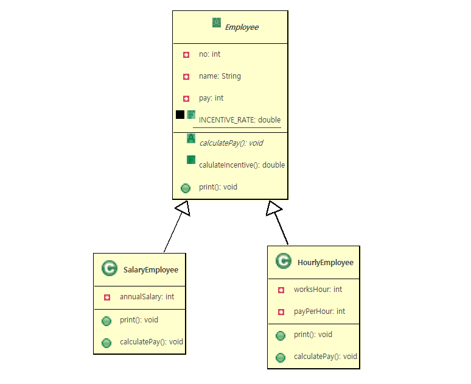

# 14. final 제한자

### final(제한자,제어자,modifier)

- final 제한자 마지막이라는 의미이며 멤버변수,메쏘드,클래스 앞에붙일수있다.
- final 제한자가붙은 멤버들은 변경금지(멤버변수),재정의금지(메쏘드),상속금지(클래스) 의 의미가된다


1. 클래스앞에 붙일경우
	 >상속금지<br>
      ```public final class Test{}```<br>
	  ```public class TestChild extens Test{} // error```
      

	  
 ```java
public final class String{

}
/*********compile error***************/
public class StringChild extends String{

}
 ```


2. 멤버 메쏘드앞에 붙일경우 
     >오버라이딩 금지<br>
      ```public final void print(){}```<br>

```java
public class FinalClass {
	public void method1() {
		System.out.println("FinalClass.method1()");
	}
	public final void method2() {
		System.out.println("FinalClass.method2()난 "
				+ "final메쏘드 재정의금지");
	}
}
```
```java
public class FinalClassChild extends FinalClass{
	@Override
	public void method1() {
		System.out.println("FinalClassChild에서 "
				+ "FinalClass.method1() 재정의");
	}
	/*
	<< Cannot override the final method from FinalClass >>
	public void method2() {}
	*/
}
```
```java
public class FinalClassChildMain {

	public static void main(String[] args) {
		FinalClassChild fcc=new FinalClassChild();
		fcc.method1();
		fcc.method2();
	}

}

```

       
3. 멤버필드(변수) 앞에붙일경우
      > 상수화된다.(변수 & 상수) ->상수이름대문자로정의함
      > 대입금지<br>
      >```public final int PORT_NUMBER=80;```

```java
public class FinalFieldClass {

	public final int PORT_NO=80;
	public final double INCENTIVE_RATE;
	/*
	 The blank final field PI may not have been initialized 
	 */
	public static final double PI=3.14;//원주율
	public static final double EARTH_RADIUS=6400;//지구지름
	
	public FinalFieldClass() {
		this.INCENTIVE_RATE=0.1;
		/*
		The final field FinalFieldClass.PORT_NO 		cannot be assigned
		The final field FinalFieldClass.INCENTIVE_RATE 	cannot be assigned
		The final field FinalFieldClass.PI 				cannot be assigned
		The final field FinalFieldClass.EARTH_RADIUS 	cannot be assigned
		
		this.PORT_NO=99;
		this.INCENTIVE_RATE=0.5;
		FinalFieldClass.PI=3.1547;
		FinalFieldClass.EARTH_RADIUS=6490;
		 */
		System.out.println(this.PORT_NO);
		System.out.println(this.INCENTIVE_RATE);
		System.out.println(FinalFieldClass.PI);
		System.out.println(FinalFieldClass.EARTH_RADIUS);
	}
}
```

```java

public class FinalFieldClassMain {
	public static void main(String[] args) {
		System.out.println("-------------ffc1------------");
		FinalFieldClass ffc1=new FinalFieldClass();
		/*
		The final field FinalFieldClass.PORT_NO 		cannot be assigned
		The final field FinalFieldClass.INCENTIVE_RATE 	cannot be assigned
		The final field FinalFieldClass.PI 				cannot be assigned
		The final field FinalFieldClass.EARTH_RADIUS 	cannot be assigned
		ffc1.PORT_NO=90;
		ffc1.INCENTIVE_RATE=0.5;
		FinalFieldClass.PI=3.146565;
		FinalFieldClass.EARTH_RADIUS=8541;
		 */
		System.out.println(ffc1.PORT_NO);
		System.out.println(ffc1.INCENTIVE_RATE);
		System.out.println(FinalFieldClass.PI);
		System.out.println(FinalFieldClass.EARTH_RADIUS);
		System.out.println("-------------ffc2------------");
		FinalFieldClass ffc2=new FinalFieldClass();
		System.out.println(ffc2.PORT_NO);
		System.out.println(ffc2.INCENTIVE_RATE);
		System.out.println(FinalFieldClass.PI);
		System.out.println(FinalFieldClass.EARTH_RADIUS);
		System.out.println("-------------Math--------------");
		/*
		The final field Math.PI cannot be assigned
		Math.PI=3.14;
		 */
		System.out.println(Math.PI);
	}
}

```
<br>
<hr>

### 예제 구현하기

  - 사원급여계산프로그램구현
    >월급사원과 시급사원 두개의 객체도출<br> 
	>월급사원과 시급사원의 공통속성과,기능을 추출하여 사원객체도출후 상속관계설정<br>
	>월급사원과 시급사원의 공통기능중 월급계산기능,인센티브계산 을 추출해서 사원객체에 정의<br>
	   >사원객체에 정의한 월급     계산기능은 월급사원과 시급사원이 각각다르기 때문에 구현을 할수없어서 추상메쏘드로 정의<br>
	   >**사원객체에 정의한 인센티브 계산기능은 모든사원이 동일하고 변경불가하기 때문에 final 메쏘드로 정의(재정의금지)**<br>       
      
   


   ```java
   public abstract class Employee {
    private int no;		//번호
    private String name;//이름
    private int pay;	//급여
     
    public final static double INCENTIVE_RATE=0.1;
    
    public Employee() {
	}
    public Employee(int no, String name) {
		super();
		this.no = no;
		this.name = name;
	}
    /*
     * 급여계산
     *   - 실제구현작업 불가능
     *   - 자식클래스에서 반드시 재정의해야하는 메쏘드
     *   - 재정의강제(규칙,specfication)
     */
	public abstract void calculatePay();
	/*
	 *인센티브계산( 급여가 200만원이 넘으면 10% 인센티브지급)
	 *	 - 모든사원들의  인센티브계산방법 동일함
	 *   - 재정의금지(회장님의 방침,변경금지) 
	 */
	public final double calulateIncentive() {
		double incentive=0.0;
		if(this.pay>2000000) {
			incentive = this.pay*Employee.INCENTIVE_RATE;
		}
		return incentive;
	}	
	public void print() {
		System.out.print(this.no+"\t"+this.name+"\t"+this.pay+"\t");
	}	
	public int getNo() {
		return no;
	}
	public void setNo(int no) {
		this.no = no;
	}
	public String getName() {
		return name;
	}
	public void setName(String name) {
		this.name = name;
	}
	public int getPay() {
		return pay;
	}
	public void setPay(int pay) {
		this.pay = pay;
	}
}

```
   

```java
public class SalaryEmployee extends Employee {
	private int annualSalary;//연봉
	public SalaryEmployee() {
	}
	public SalaryEmployee(int no,String name,int annualSalary) {
		super(no,name);
		this.annualSalary = annualSalary;
	}
	public void print() {
		super.print();
		System.out.println(annualSalary);
	}
	@Override
	public void calculatePay() {
		int tempPay = this.annualSalary/12;
		this.setPay(tempPay);
	}
	public int getAnnualSalary() {
		return annualSalary;
	}
	public void setAnnualSalary(int annualSalary) {
		this.annualSalary = annualSalary;
	}
	
	
}
```

```java
public class HourlyEmployee extends Employee {
	private int worksHour;//일한시간
	private int payPerHour;//시간당급여
	public HourlyEmployee() {
	}
	public HourlyEmployee(int no,String name,int worksHour, int payPerHour) {
		super(no,name);
		this.worksHour = worksHour;
		this.payPerHour = payPerHour;
	}

	public void print() {
		super.print();
		System.out.println(this.worksHour+"\t"+this.payPerHour);
	}
	@Override
	public void calculatePay() {
		this.setPay(this.worksHour*this.payPerHour);
		
	}
	public int getWorksHour() {
		return worksHour;
	}
	public void setWorksHour(int worksHour) {
		this.worksHour = worksHour;
	}
	public int getPayPerHour() {
		return payPerHour;
	}
	public void setPayPerHour(int payPerHour) {
		this.payPerHour = payPerHour;
	}
	
}
```

```java
public class EmployeePayPrintFinalMain {
	public static void main(String[] args) {
		Employee[] emps= {
			new SalaryEmployee(1,"KIM",45000000),	
			new SalaryEmployee(2,"GIM",80000000),	
			new SalaryEmployee(3,"VIM",20000000),	
			new HourlyEmployee(4,"HOM",100,30000),
			new HourlyEmployee(5,"GON",100,10000)
		};
		for(Employee emp:emps) {
			emp.calculatePay();
			System.out.println("---------"+emp.getName()
			+" 님 급여명세표------");
			emp.print();
			double incentive=emp.calulateIncentive();
			System.out.println("\t인센티브:"+incentive);
			System.out.println("--------------------------------");
			System.out.println();
		}
		System.out.println("사원인센브율:"+Employee.INCENTIVE_RATE);
	}
}
```
