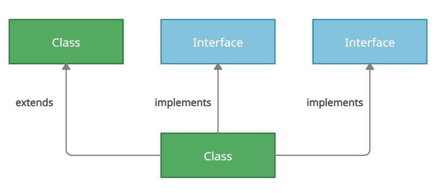
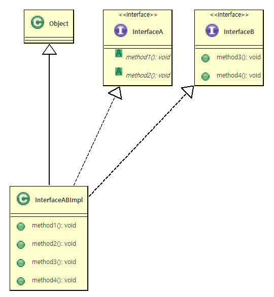
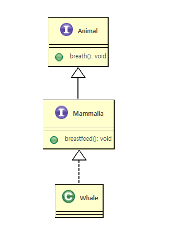
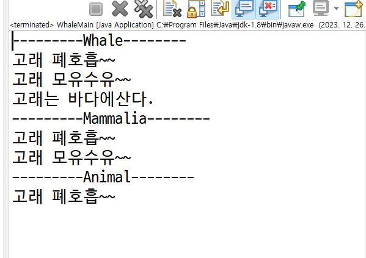
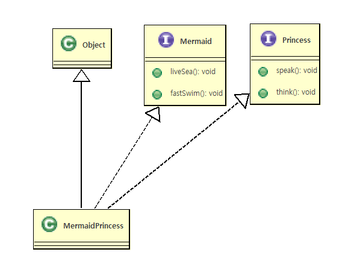
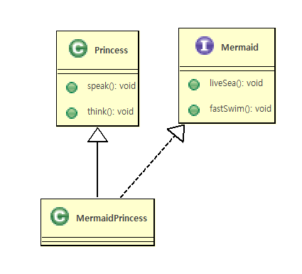
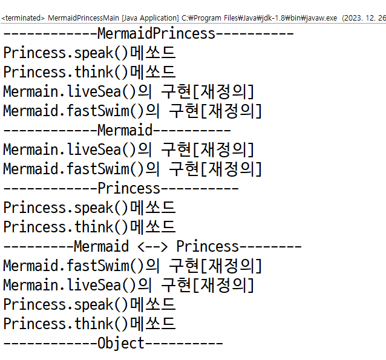
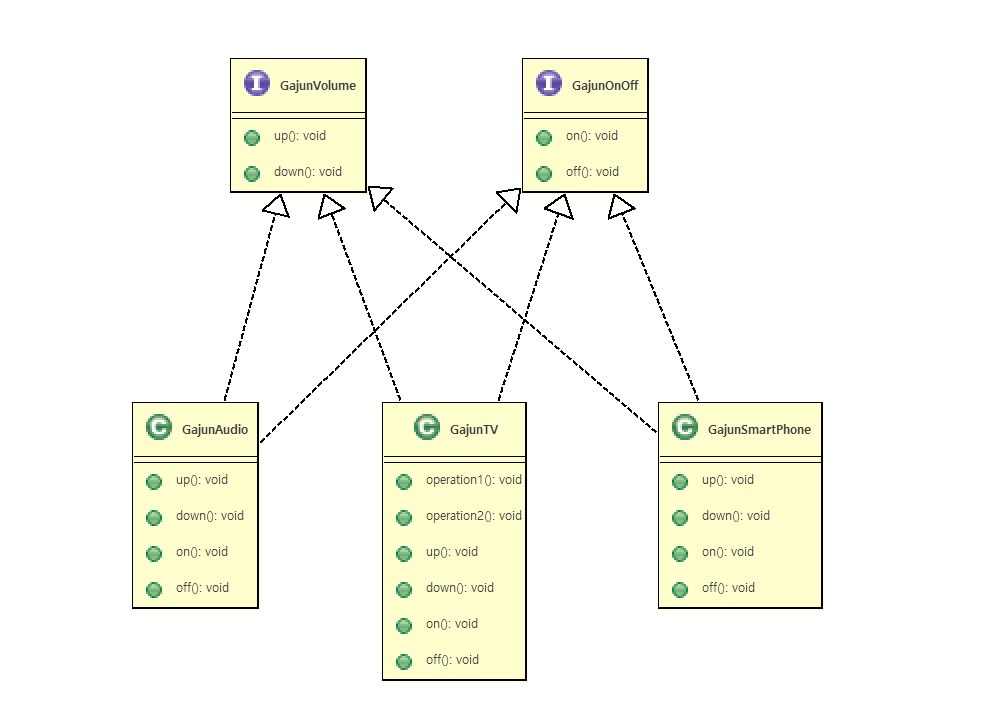

# 15. 인터페이스


### 인터페이스란?

 - 인터페이스(클래스)가진 모든 메쏘드가 추상 메서드로 선언됨 public abstract
 - 다중상속의 효과를 냄(클래스는 불가능하나 인터페이스는가능하다)

    

 - 모든 변수는 상수로 선언됨 public static final

	>클래스나 프로그램이 제공하는 기능을 명시적으로 선언<br>
    >일종의 클라이언트 코드와의 약속이며 클래스나 프로그램이 제공하는 명세(specification)<br>
    >클라이언트 프로그램은 인터페이스에 선언된 메서드 명세만 보고 이를 구현한 클래스를 사용할 수 있음<br>
    >어떤 객체가 하나의 인터페이스 타입이라는 것은 그 인터페이스가 제공하는 모든 메서드를 구현했다는 의미임<br>
    >인터페이스를 구현한 다양한 객체를 사용함 - 다형성<br>

### 인터페이스 정의와 구현

   - 정의선언
      * 인터페이스 선언은 class keyword 대신에 interface 라는 keyword를사용<br>
        ```java
		public interface 인터페이스이름{}
        ```
	  * 인터페이스는 상수필드와 추상메쏘드만을 구성멤버로가진다.
	     - 변수는 생략하더라도 public static final의 성격을 가진다.
		 - 메쏘드앞에 public abstract 를 붙히지않아도  public abstract 메쏘드가된다.

        ```java
			public interface 인터페이스명{
				
				//상수필드
				타입 상수명 = 값;
				//추상메쏘드
				타입 메쏘드명(매개변수,...);
				//디폴트메쏘드
				default 타입 메쏘드명(매개변수,...){...}
				//정적메쏘드
				static 타입 메쏘드명(매개변수,...){...}

			}
        ```

 
  - 구현클래스
  ```java
	public class 구현클래스명 implements 인터페이스명{
		//인터페이스에선언된 실체메쏘드 구현(재정의)
 	}
  ```
    
  
  - 구현예
 ```java
	public interface Test{
		int CONSTANT1 = 10;
		int CONSTANT2 = 20;
		void method1();
		void method2();
	}
 ```	
   - 인터페이스사용
      > interface를 상속(implements)받아서 추상메쏘드를 재정의(구현)한후 사용한다.
         
 ```java
	public class TestImpl implements Test{
		public void method1(){...}
		public void method2(){...}
	} 
 ```

<br>
<hr>

# 예제코드

### 여러 인터페이스 구현
  - 자바의 인터페이스는 구현 코드가 없으므로 하나의 클래스가 여러 인터페이스는 구현 할 수 있음
  - 디폴트 메서드가 중복 되는 경우는 구현 하는 클래스에서 재정의 하여야 함
  - 여러 인터페이스를 구현한 클래스는 인터페이스 타입으로 형 변환 되는 경우 해당 인터페이스에 선언된 메서드만 사용 가능 함




```java
public interface InterfaceA{
	/*
	 * interface 안에 정의되는 메쏘드는 추상메쏘드여야한다.
	 * 	- Abstract methods do not specify a body
	 */
	public abstract void method1();
	public abstract void method2();
}

```

```java
public interface InterfaceB {
	public void method3();
	public void method4();
}

```
```java

public class InterfaceABImpl extends Object implements InterfaceA,InterfaceB {
	@Override
	public void method1() {
		System.out.println("InterfaceA.method1() 구현[재정의]");
	}
	@Override
	public void method2() {
		System.out.println("InterfaceA.method2() 구현[재정의]");
	}
	@Override
	public void method3() {
		System.out.println("InterfaceB.method3() 구현[재정의]");
	}
	@Override
	public void method4() {
		System.out.println("InterfaceB.method4() 구현[재정의]");
	}
}

```

```java

public class InterfaceABImplMain {

	public static void main(String[] args) {
		System.out.println("---------InterfaceABImpl-----------");
		InterfaceABImpl abImpl=new InterfaceABImpl();
		abImpl.method1();
		abImpl.method2();
		abImpl.method3();
		abImpl.method4();
		System.out.println("---------InterfaceA-----------");
		InterfaceA ia=abImpl;
		ia.method1();
		ia.method2();
		/*
		ia.method3();
		ia.method4();
		*/
		System.out.println("---------InterfaceB-----------");
		InterfaceB ib=abImpl;
		/*
		ib.method1();
		ib.method2();
		*/
		ib.method3();
		ib.method4();
		System.out.println("---InterfaceA <--> InterfaceB----");
		InterfaceA ia2=new InterfaceABImpl();
		ia2.method1();
		ia2.method2();
		/*
		ia2.method3();
		ia2.method4();
		*/
		InterfaceB ib2 = (InterfaceB)ia2;
		/*
		ib2.method1();
		ib2.method2();
		*/
		ib2.method3();
		ib2.method4();
		
		
	}

}


```

### 인터페이스의 상속

 - 인터페이스 사이에도 상속을 사용할 수 있음
 - extends 키워드를 사용
 - 인터페이스는 다중 상속이 가능하고 구현 코드의 상속이 아니므로 타입 상속 이라고 함



```java
public interface Animal {
    public void breath();
}

```
```java
public interface Mammalia extends Animal {
    public void breastfeed();
}

```

```java
public class Whale implements Mammalia {
    
	public void live() {
		System.out.println("고래는 바다에산다.");
	}
	
	@Override
	public void breath() {
		System.out.println("고래 폐호흡~~");		
	}

	@Override
	public void breastfeed() {
		System.out.println("고래 모유수유~~");		
		
	}

}


```
```java
public class WhaleMain {

	public static void main(String[] args) {
		System.out.println("---------Whale--------");
		Whale whale=new Whale();
		whale.breath();
		whale.breastfeed();
		whale.live();
		System.out.println("---------Mammalia--------");
		Mammalia mammalia=whale;
		mammalia.breath();
		mammalia.breastfeed();
		
		System.out.println("---------Animal--------");
		Animal animal=whale;
		animal.breath();
		//animal.breastfeed();
	}

}

```



### 인터페이스를 이용한 다중상속구현




```java
public interface Mermaid {
    public void liveSea();
    public void fastSwim();

}

public interface Princess {
    public void speak();
    public void think();
}

public class MermaidPrincess extends Object implements Mermaid, Princess {
	@Override
	public void speak() {
		System.out.println("Princess.speak()의 구현[재정의]");
	}
	@Override
	public void think() {
		System.out.println("Princess.think()의 구현[재정의]");
	}
	@Override
	public void liveSea() {
		System.out.println("Mermain.liveSea()의 구현[재정의]");
	}
	@Override
	public void fastSwim() {
		System.out.println("Mermaid.fastSwim()의 구현[재정의]");
	}
}


public class MermaidPrincessMain {
	public static void main(String[] args) {
		System.out.println("------------MermaidPrincess----------");
		MermaidPrincess mp=new MermaidPrincess();
		mp.speak();
		mp.think();
		mp.liveSea();
		mp.fastSwim();
		System.out.println("------------Mermaid----------");
		Mermaid m=mp;
		/*
		m.speak();
		m.think();
		*/
		m.liveSea();
		m.fastSwim();
		System.out.println("------------Princess----------");
		Princess p=mp;
		p.speak();
		p.think();
		/*
		p.liveSea();
		p.fastSwim();
		*/
		System.out.println("---------Mermaid <--> Princess--------");
		Mermaid m2=new MermaidPrincess();
		m2.fastSwim();
		m2.liveSea();
		Princess p2=(Princess)m2;
		p2.speak();
		p2.think();
		System.out.println("------------Object----------");
		/*
		Object o = new MermaidPrincess();
		o.speak();
		o.think();
		o.liveSea();
		o.fastSwim();
		*/
	}

}


```




```java
public interface Mermaid {
    public void liveSea();
    public void fastSwim();
}

public class Princess {
	public void speak() {
		System.out.println("Princess.speak()메쏘드");
	}
	public void think() {
		System.out.println("Princess.think()메쏘드");
	}
}
public class MermaidPrincess extends Princess implements Mermaid{
	@Override
	public void liveSea() {
		System.out.println("Mermain.liveSea()의 구현[재정의]");
	}
	@Override
	public void fastSwim() {
		System.out.println("Mermaid.fastSwim()의 구현[재정의]");
	}
}


public class MermaidPrincessMain {

	public static void main(String[] args) {
		System.out.println("------------MermaidPrincess----------");
		MermaidPrincess mp=new MermaidPrincess();
		mp.speak();
		mp.think();
		mp.liveSea();
		mp.fastSwim();
		System.out.println("------------Mermaid----------");
		Mermaid m=mp;
		/*
		m.speak();
		m.think();
		*/
		m.liveSea();
		m.fastSwim();
		System.out.println("------------Princess----------");
		Princess p=mp;
		p.speak();
		p.think();
		/*
		p.liveSea();
		p.fastSwim();
		*/
		System.out.println("---------Mermaid <--> Princess--------");
		Mermaid m2=new MermaidPrincess();
		m2.fastSwim();
		m2.liveSea();
		Princess p2=(Princess)m2;
		p2.speak();
		p2.think();
		System.out.println("------------Object----------");
		/*
		Object o = new MermaidPrincess();
		o.speak();
		o.think();
		o.liveSea();
		o.fastSwim();
		*/
	}

}

```




### 가전제품공장&가전제품 검사소
  
  #### 가전제품 검사소
   - 가전제품 검사소에서는 생산된 모든가전제품은 검사한후 출고한다.
   - 가전제품 검사소에서는 가전제품을 만들때 반드시 구현해야하는 <br>
	   Specification(GajunVolume.java,GajunOnOff.java)을 가전제품공장에 제공했다.

  #### 가전제품공장
   - 가전제품공장에서 가전제품을 생산한다
   - 가전제품공장에서 가전제품을 생산할때 모든가전제품은 <br>
	  가전제품 검사소에서 제시한 Specification(GajunVolume.java,GajunOnOff.java) 을 준수하여야한다.
	  
  


```java
/*
 * 가전제품검사소에서만든 가전제품이 반드시 구현해야할기능(specification)
 */
public interface GajunVolume {
	public void up();
	public void down();
}
/*
 * 가전제품검사소에서만든 가전제품이 반드시 구현해야할기능(specification)
 */
public interface GajunOnOff {
	public void on();
	public void off();
}

public class GajunTV implements GajunOnOff,GajunVolume{
	public void operation1() {
		System.out.println("TV.operation1()");
	}
	public void operation2() {
		System.out.println("TV.operation2()");
	}
	@Override
	public void up() {
		System.out.println("TV.up()");
	}
	@Override
	public void down() {
		System.out.println("TV.down()");
	}
	@Override
	public void on() {
		System.out.println("TV.on()");
	}
	@Override
	public void off() {
		System.out.println("TV.off()");
	}
}
public class GajunAudio implements GajunOnOff,GajunVolume{
	
	@Override
	public void up() {
		System.out.println("Audio.up()");
	}
	@Override
	public void down() {
		System.out.println("Audio.down()");
	}
	@Override
	public void on() {
		System.out.println("Audio.on()");
	}
	@Override
	public void off() {
		System.out.println("Audio.off()");
	}
}

public class GajunSmartPhone implements GajunOnOff,GajunVolume{
	@Override
	public void up() {
		System.out.println("GajunSmartPhone.up()");
	}
	@Override
	public void down() {
		System.out.println("GajunSmartPhone.down()");
	}
	@Override
	public void on() {
		System.out.println("GajunSmartPhone.on()");
	}
	@Override
	public void off() {
		System.out.println("GajunSmartPhone.off()");
	}
}


public class GajunFactoryMain {

	public static void main(String[] args) {
		System.out.println("--------가전제품공장---------");
		GajunTV tv1 = new GajunTV();
		GajunTV tv2 = new GajunTV();
		GajunTV tv3 = new GajunTV();

		GajunAudio audio1 = new GajunAudio();
		GajunAudio audio2 = new GajunAudio();

		GajunSmartPhone sp1=new GajunSmartPhone();
		GajunSmartPhone sp2=new GajunSmartPhone();
		GajunSmartPhone sp3=new GajunSmartPhone();
		
		GajunOnOff gajun1 = tv1;

		GajunOnOff[] gajunArry = new GajunOnOff[8];
		gajunArry[0] = tv1;
		gajunArry[1] = tv2;
		gajunArry[2] = tv3;
		gajunArry[3] = audio1;
		gajunArry[4] = audio2;
		gajunArry[5]= sp1;
		gajunArry[6]= sp2;
		gajunArry[7]= sp3;
		System.out.println("--------가전제품검사소--------");
		/*
		 * 난 절대로 자식클래스타입을 사용안할래요 
		 * 난 부모타입[GajumOnOff,GajunVolume] 만사용할래요 
		 * 그래야 가전제품검사 프로그램을
		 * 한번만들어서 변경없이 계속사용할수있으니까요~~~
		 */
		
		GajunOnOff[] receiveGajunArray = gajunArry;
		for (int i = 0; i < receiveGajunArray.length; i++) {
			System.out.println("-----------검사시작-----------");
			receiveGajunArray[i].on();
			
			GajunVolume tempGajun=(GajunVolume)receiveGajunArray[i];
			tempGajun.up();
			tempGajun.down();
			
			receiveGajunArray[i].off();
			System.out.println("-----------검사끝출고-----------");
		}
		/**************************************************
		GajunGumsa gajunGumsa=new GajunGumsa();
		gajunGumsa.setGajuns(gajunArry);
		gajunGumsa.gumsa();
		***************************************************/
	}

}
```
  - **가전제품검사소**
	> 난 절대로 자식클래스타입을 사용안할래요<br> 
	> 난 부모타입[GajumOnOff,GajunVolume] 만사용할래요<br> 
	> 그래야 가전제품검사 프로그램을 한번만들어서 변경없이 계속사용할수있으니까요~~~<br>
    
```java
public class GajunGumsa {
	private GajunOnOff[] gajuns;
	
	public void setGajuns(GajunOnOff[] gajuns) {
		this.gajuns=gajuns;
	}
	public GajunOnOff[] getGajuns() {
		return this.gajuns;
	}
	
	
	public void gumsa() {
		if(gajuns!=null) {
			for (GajunOnOff gajunOnOff : gajuns) {
				gajunOnOff.on();
				GajunVolume gajunVolume=(GajunVolume)gajunOnOff;
				gajunVolume.up();
				gajunVolume.down();
				gajunOnOff.off();
				System.out.println("-------검사끝 출고-------");
			}
		}else {
			System.out.println("가전제품 한개도없다..");
		}
	}
	
}

```
