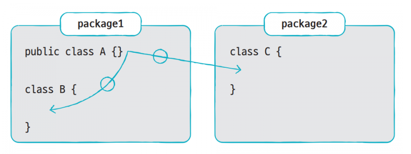

# 17.접근 제한자
 - 접근 제한자(Access Modifier)는 말 그대로 접근을 제한하기 위해 사용됩니다. 
    &nbsp;&nbsp;&nbsp;여기서 접근이란 클래스 및 인터페이스 그리고 이들이 가지고 있는 멤버의 접근을 말합니다. 
 - 어떤 경우에는 클래스와 인터페이스를 다른 패키지에서 사용하지 못하도록 막을 필요가 있습니다.  
     &nbsp;&nbsp;&nbsp;그리고 객체 생성을 막기 위해 생성자를 호출하지 못하게 하거나 필드나 메소드를 사용하지 못하도록 막아야 되는 경우도 있습니다.  
     &nbsp;&nbsp;&nbsp;이때 접근 제한자를 사용할 수 있습니다. 
### 접근 제한자종류
  - 접근 제한자는 public, protected,(default), private와 같이  네가지 종류가 있습니다.
    > public&nbsp;&nbsp;&nbsp;&nbsp;&nbsp;&nbsp;&nbsp;접근 제한자: 단어 뜻 그대로 외부 클래스가 자유롭게 사용할 수 있도록 합니다. 
    > protected 접근 제한자: 같은 패키지 또는 자식 클래스에서 사용할 수 있도록 합니다. 
    > (default)&nbsp;&nbsp;&nbsp;&nbsp;접근 제한&nbsp;&nbsp;&nbsp;: 같은 패키지에 소속된 클래스에서만 사용할 수 있도록 합니다. 
    > private&nbsp;&nbsp;&nbsp;&nbsp;&nbsp;&nbsp;접근 제한자: 단어 뜻 그대로 개인적인 것이라 외부에서 사용될 수 없도록 합니다. 

       
 

### 클래스의 접근 제한
   > 클래스를 선언할 때 해당 클래스를 같은 패키지 내에서만 사용할 것인지, 
   >   아니면 다른 패키지에서도 사용할 수 있도록 할 것인지 결정해야 합니다.  
   > 클래스는 다음과 같이 public, default 접근 제한을 가집니다. 
   
   
 
  - default 접근 제한
	>클래스를 선언할 때 public을 생략했다면 클래스는 default 접근 제한을 가집니다.  
	>클래스가 default 접근 제한을 가지면 같은 패키지에서는 아무런 제한 없이 사용할 수 있지만  
	>다른 패키지에서는 사용할 수 없도록 제한됩니다. 

	   

	

  - public 접근 제한
    >클래스를 선언할 때 public 접근 제한자를 붙였다면 클래스는 public 접근 제한을 가집니다.  
	  >클래스가 public 접근 제한을 가지면, 같은 패키지뿐만 아니라 다른 패키지에서도  
	  >  아무런 제한 없이 사용할 수 있습니다.  
	  >클래스를 다른 개발자가 사용할 수 있도록 라이브러리 클래스로 개발한다면 반드시 
    >  public 접근 제한을 갖도록 해야 합니다. 
    >인터넷으로 배포되는 라이브러리 클래스도 모두 public 접근 제한을 가지고 있습니다. 

       

  - 생성자의 접근 제한
    >객체를 생성하기 위해서는 new 연산자로 생성자를 호출합니다.  
	>하지만 생성자를 어디에서나 호출할 수 있는 것은 아닙니다.  
	>생성자가 어떤 접근 제한을 갖느냐에 따라 호출 가능 여부가 결정됩니다. 

    - 생성자는 다음과 같이 public, protected, default, private 접근 제한을 가집니다.
          

	   - public    접근 제한
          >public 접근 제한은 모든 패키지에서 아무런 제한 없이 생성자를 호출할 수 있도록 합니다. 
	   - protected 접근 제한
          > protected 접근 제한은 default 접근 제한과 마찬가지로 같은 패키지에 속하는 클래스에서 
				  생성자를 호출할 수 있도록 합니다.  
				  차이점으로 다른 패키지에 속한 클래스가 해당 클래스의 자식(child) 클래스라면 생성자를 호출할 수 있습니다.
	   - default   접근 제한 
          > default 접근 제한은 같은 패키지에서는 아무런 제한 없이 생성자를 호출할 수 있으나, 
				    다른 패키지에서는 생성자를 호출할 수 없도록 합니다. 
	   - private   접근 제한
          > private 접근 제한은 동일한 패키지이건 다른 패키지이건 상관없이 생성자를 호출하지 못하도록 제한합니다. 
				오로지 클래스 내부에서만 생성자를 호출할 수 있고 객체를 만들 수 있습니다.

### 필드와 메소드의 접근 제한
  >필드와 메소드를 선언할 때 해당 필드와 메소드를 클래스 내부에서만 사용할 것인지, 
  >패키지 내에서만 사용할 것인지, 아니면 다른 패키지에서도 사용할 수 있도록 할 것인지를 결정해야 합니다.  
  >이것은 필드와 메소드가 어떤 접근 제한을 갖느냐에 따라 결정됩니다.  
  >필드와 메소드는 다음과 같이 public, protected, default, private 접근 제한을 가질 수 있습니다. 

  

   - public    접근제한
       > public 접근 제한은 모든 패키지에서 아무런 제한 없이 필드와 메소드를 사용할 수 있도록 해줍니다. 
   - protected 접근제한
       > protected 접근 제한은 default 접근 제한과 마찬가지로 같은 패키지에 속하는 클래스에서 필드와 메소드를 사용할 수 있도록 합니다.  
		 **차이점으로 다른 패키지에 속한 클래스가 해당 클래스의 자식 클래스라면 필드와 메소드를 사용할 수 있습니다.**  

   - default   접근제한
       >필드와 메소드를 선언할 때 접근 제한자를 생략하면 default 접근 제한을 가집니다. 
    default 접근 제한은 같은 패키지에서는 아무런 제한 없이 필드와 메소드를 사용할 수 있으나 
	  다른 패키지에서는 필드와 메소드를 사용할 수 없도록 합니다.  

   - private   접근제한:
       > private 접근 제한은 동일한 패키지이건 다른 패키지이건 상관없이 필드와 메소드를 사용하지 못하도록 제한합니다. 
     오로지 클래스 내부에서만 사용할 수 있습니다.

