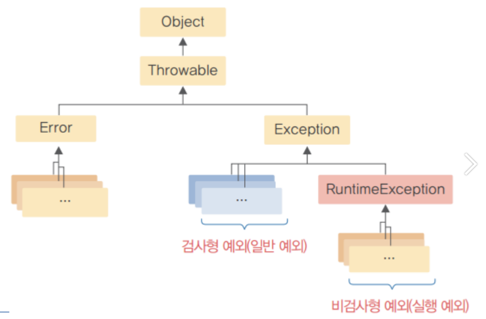
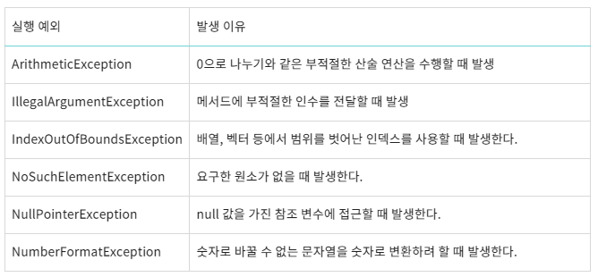
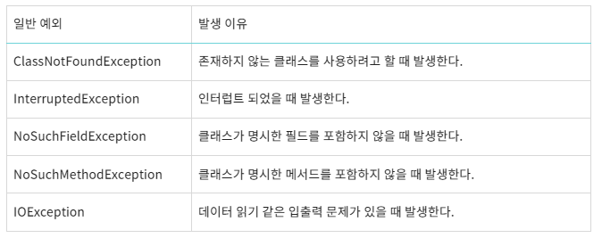
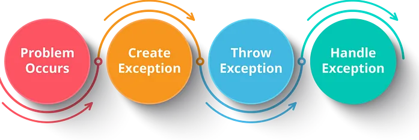
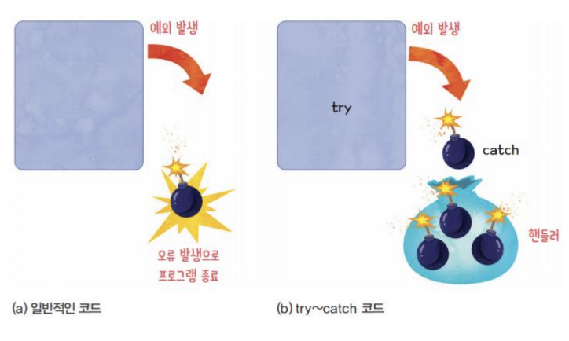
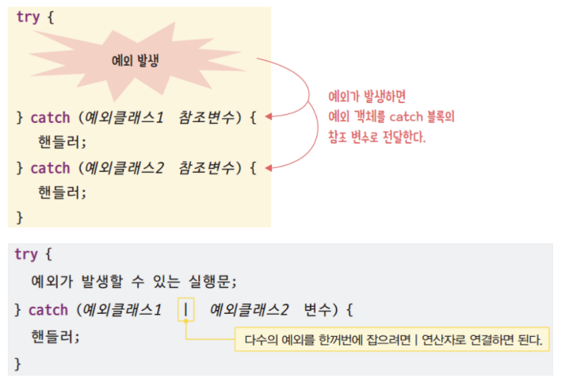
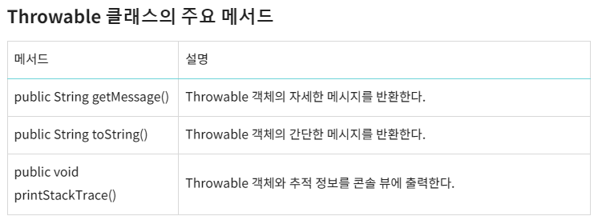
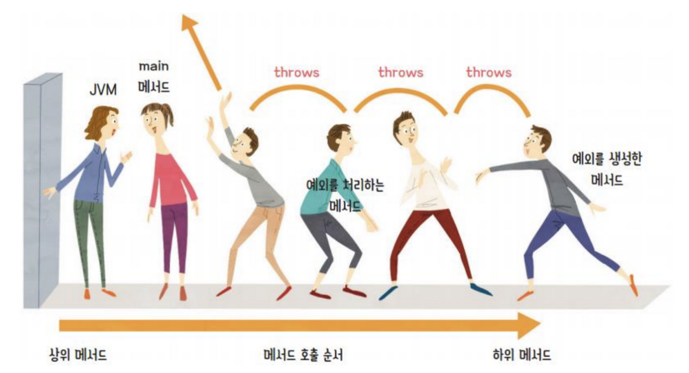

# 18. 예외(Exception)

## 프로그램에서의 오류

1.컴파일 오류(compile error)
  >프로그램 코드 작성 중 발생하는 문법적 오류
   최근에는 개발 환경(eclipse)에서 대부분의 컴파일 오류는 detection 됨

2.실행 오류(runtime error)
  >실행 중인 프로그램이 의도 하지 않은 동작(bug)을 하거나 프로그램이 중지 되는 오류<br>
   실행 오류는 비정상 종료가 되는 경우 시스템의 심각한 장애를 발생할 수 있음

### 에러와예외
  - **에러(Error)**
     >프로그램 실행시 컴퓨터 하드웨어의오작동 또는 고장으로인해 발생하는 응용프로그램실행오류<br>
	 >시스템 오류(error) : 가상 머신에서 발생, 프로그래머가 처리 할 수 없는 오류임<br> 
	 >ex)동적 메모리가 없는 경우, 스택 메모리 오버플로우등<br>
	 >에러발생시 프로그램은 곧바로 종료됨(비정상종료)<br>
     >프로그램에서 제어 할 수 없는 오류<br>

  - **예외(Exception)**
     >사용자의 잘못된 조작,개발자의 잘못된코딩으로인해 발생하는 프로그램오류를말합니다.<br>
	 >예외발생시 프로그램은 곧바로 종료됨(비정상종료)<br>
	 >예외처리(Exception Handling)를 통해 프로그램을 종료하지않고 정상실행상태유지되도록할수있음<br>
	 >예외 처리 추가하면 정상 실행 상태로 돌아갈 수 있음<br>
     >ex)읽어들이려는 파일이 존재하지 않거나, 네트웍이나 DB연결이 안되는 경우등<br>
	 >자바는 안전성이 중요한 언어로 대부분 프로그램에서 발생하는 오류에 대해 문법적으로 예외 처리를 해야함

 
### 예외와 예외클래스
  - 모든 예외 클래스의 최상위 클래스는Throwable 클래스
	```
	The Throwable class is the superclass of all errors and exceptions in the Java language.
	Only objects that are instances of this class (or one of its subclasses) 
	are thrown by the Java Virtual Machine or can be thrown by the Java throw statement. 
	```
  - Throwable 하위로 Exception과 Error클래스가존재
  - 자바에서 예외처리대상클래스가 Exception클래스임

####  예외(Exception) 종류
 
  1. 일반(컴파일 체크) 예외
    - 예외 처리를 하지 않으면 컴파일 오류가 발생하므로 꼭 처리해야하는 검사형 예외
  2. 실행 예외 (RuntimeException)
    - 개발자의 실수로 발생할 수 있으며, 예외 처리를 하지 않아도 컴파일할 수 있는 비검사형 예외

 


  1. 실행예외(RuntimeException)
     - 예외가 발생하면 JVM은 해당하는 실행 예외 객체를 생성
     - 실행 예외는 컴파일러가 예외 처리 여부를 확인하지 않음. 따라서 개발자가 예외 처리 코드의 추가 여부를 결정
	    >throw구문으로 로 자동처리되어있다.
     - 대표적인 실행 예외 예
 
	     
	       
  3. 일반예외 :반드시 처리해야한다.
     - 컴파일러는 발생할 가능성을 발견하면 컴파일 오류를 발생
     - 개발자는 예외 처리 코드를 반드시 추가
	 - 프로그램과관계 없이 일어날 가능성이 있는 Exception(network,io,db,file)
     - 대표적인 일반 예외 예
       
	  

  ####  예외(Exception) 처리방법
  ##### 예외발생흐름
  > 


   1. 잡는다.(catch)
      > 
      > 
      
	  - 구현방법

	     ```java
	     public void method(){
		 	
		     try{ 
		     	익셉션 발생예상코드;
		     }catch(Exception클래스1 e){
			 	익셉션 발생예상코드에서 Exception클래스1 이발생하면	실행하게될코드;
				익셉션객체 e를 사용;
			 }catch(Exception클래스2 e){
			 	익셉션 발생예상코드에서 Exception클래스2 가발생하면	실행하게될코드;
				익셉션객체 e를 사용;
			 }
		 }

		  public void method(){
		 	
		     try{ 
		     	익셉션 발생예상코드;
			 }catch(Exception클래스1 e1| Exception클래스2 e2){
			 	익셉션 발생예상코드에서 Exception클래스1,Exception클래스2 가발생하면
			 	실행하게될코드;
				익셉션객체 e1,e2를 사용한다.;
			 }
		 }

         ```
      - 예외객체메쏘드
          > 

   2. 던진다.(throw)
      - 예외(Exception) 던지기(throw) 메카니즘
        - 메서드에서 발생한 예외를 내부에서 처리하기가 부담스러울 때는 throws 키워드를 사용해 예외를 상위 코드 블록으로 양도 가능
        - 사용 방법->메소드에서 처리하지 않은 예외를 호출한 곳으로 떠넘김

        > 

      - 구현방법

        ```java	 
		public void method()throws Exception {

			익셉션 발생예상코드;

		}	
        ```	 	


 


      - **throw 메카니즘 구현 예제**
		```java
		import java.io.IOException;
		public class _First {
			private _Second second;

			public _First() {
				second = new _Second();
			}

			public void method1() throws NullPointerException,IOException{
				System.out.println("\t First.method1()실행");
				second.method2();
				System.out.println("\t First.method1()반환");
			return;
			}
		}
		```
		```java 
		import java.io.IOException;
		import java.net.Socket;

		public class _Second {
			public void method2() throws NullPointerException,IOException {
				System.out.println("\t\t Second.method2()실행");
				
				/***********case1(RuntimeException)***********
				 * 1.JVM 예외상황을 감지하고 예외객체(NullPointerException)생성
				* 2.JVM은 생성한예외객체를 반환방향으로 던진다.(throw)
				* 3.실행중인쓰레드는 실행을멈추고 호출한곳(반환방향)으로 이동한다. 
				* 4.JVM은 던져진예외객체의 메세지를 출력한후 쓰레드종료(shut down)
					String str=null;
					int length=str.length();
					System.out.println(length);
				*/
				/***********case2(RuntimeException)***********
				 * 1.내가예외객체생성
				* 2.내가 예외객체를 던진다.
				* 3.실행중인쓰레드는 실행을멈추고 호출한곳(반환방향)으로 이동한다. 
				* 4.JVM은 던져진예외객체의 메세지를 출력한후 쓰레드종료(shut down)
					boolean isExceptionRaised=true;
					if(isExceptionRaised) {
						NullPointerException exception=new NullPointerException("내가생성한예외객체");
						throw exception;
					}
				*/
				/***********case3(비RuntimeException)***********/
				Socket socket=new Socket("www.naver.com",8000);
				System.out.println(socket);
				System.out.println("\t\t Second.method2()반환");
				return;
			}
		}
		```
		```java
		import java.io.IOException;
		public class _FirstSecondExceptionThrowMain {
			public static void main(String[] args) throws NullPointerException,IOException{
				System.out.println("1.main실행흐름 start");
				_First first=new _First();
				System.out.println("2.main실행흐름 first.method1()호출");
				first.method1();
				System.out.println("3.main실행흐름 first.method1()호출후 반환");
				System.out.println("4.main실행흐름 JVM 반환");
				return;
			}

		}

		```

<br>
<hr>

## 예외처리예제

  ####  실행예외(RuntimeException) 처리

   >##### 1. 던지기(throw) 처리

```java
public class RuntimeExceptionThrowMain {
	/*
	* 모든메쏘드는 throws RuntimeException구문이생략되어있다
	*/
	public static void main(String[] args) /*throws RuntimeException*/{
		System.out.println("stmt1");
		/*
		예외발생예상코드
		*/
		String str=null;
		int length = str.length();
		System.out.println("length:"+length);
		/*
		1. 예외상황발생하면  NullPointerException 객체생성한후 
			예외발생 코드를 가지고있는 메쏘드를(메인메쏘드) 호출한곳으로 던진다.(throw)
		2. 현재실행흐름은 실행을멈추고 
			예외발생 코드를 가지고있는 메쏘드를(메인메쏘드) 호출한곳으로 이동
		*/
		System.out.println("stmt2");
		
		/*
		1. 예외상황발생하면  ArrayIndexOutOfBoundsException 객체생성한후 
			예외발생 코드를 가지고있는 메쏘드를(메인메쏘드) 호출한곳으로 던진다.(throw)
		2. 현재실행흐름은 실행을멈추고 
			예외발생 코드를 가지고있는 메쏘드를(메인메쏘드) 호출한곳으로 이동
		*/
		int[] intArray=new int[3];
		intArray[3]=9999;
		System.out.println("stmt3");
		return;
	}
}

```

   >#### 2. 잡기(catch) 처리


```java
import javax.swing.JOptionPane;
public class RuntimeExceptionCatchMain1 {
	public static void main(String[] args) {
		System.out.println("stmt1");
		String str=null;
		try {
			/*
			* 예외발생 예상코드
			*/
			int length=str.length();
			/*
			1. 예외상황발생하면  NullPointerException객체생성한후
				예외발생 코드를 가지고있는 메쏘드를(메인메쏘드) 호출한곳으로 던진다.(throw)
			2. 던져진 예외객체는 catch block에 선언된 변수에 대입된다.   
			3. 현재실행흐름은 예외가발생한곳에서 catch block으로 실행흐름이이동한다.
			*/
			System.out.println("length:"+length);
			
		}catch (NullPointerException exception) {
			System.out.println("---catch start[NullPointerException]----");
			String msg = exception.getMessage();
			System.out.println("NullPointerException==> msg:"+msg);
			
			str="김경호";
			int length=str.length();
			System.out.println("length:"+length);
			System.out.println("---catch end[NullPointerException]----");
		}
		
		System.out.println("stmt2");
		try {
			int[] intArray=null;
			intArray=new int[3];
			intArray[3]=9999;
			/*
			1. 예외상황발생하면  ArrayIndexOutOfBoundsException객체생성한후 
				예외발생 코드를 가지고있는 메쏘드를(메인메쏘드) 호출한곳으로 던진다.(throw)
			2. 던져진 예외객체는 catch block에 선언된 변수에 대입된다.   
			3. 현재실행흐름은 예외가발생한곳에서 catch block으로 실행흐름이이동한다.
			*/
		}catch (ArrayIndexOutOfBoundsException e) {
			System.out.println("----catch start[ArrayIndexOutOfBoundsException]---");
			System.out.println("ArrayIndexOutOfBoundsException ==>msg: "+e.getMessage());
			JOptionPane.showMessageDialog(null, "호갱님 죄송합니다 프로그램을 종료합니다. ");
			System.exit(0);
			
			System.out.println("----catch end[ArrayIndexOutOfBoundsException]-----");
		}
		System.out.println("stmt2");

	}

}

```

```java
import javax.swing.JOptionPane;
public class RuntimeExceptionCatchMain2 {
	public static void main(String[] args) {
		try {
			
			System.out.println("stmt1");
			String str = "";
			int length=str.length();
			/*
			1. 예외상황발생하면  NullPointerException객체생성한후 
				예외발생 코드를 가지고있는 메쏘드를(메인메쏘드) 호출한곳으로 던진다.(throw)
			2. 던져진 예외객체는 catch block에 선언된 변수의 타입을검사해서 타입에일치하는 
				변수에 대입된다.   
			3. 현재실행흐름은 예외가발생한곳에서 catch block으로 실행흐름이이동한다.
			*/
			System.out.println("length:" + length);
			System.out.println("stmt2");
			int[] intArray = null;
			intArray = new int[3];
			intArray[3] = 9999;
			/*
			1. 예외상황발생하면  ArrayIndexOutOfBoundsException객체생성한후 
				예외발생 코드를 가지고있는 메쏘드를(메인메쏘드) 호출한곳으로 던진다.(throw)
			2. 던져진 예외객체는 catch block에 선언된 변수의 타입을검사해서 타입에일치하는 
				변수에 대입된다.   
			3. 현재실행흐름은 예외가발생한곳에서 catch block으로 실행흐름이이동한다.
			*/
			System.out.println("stmt3");
			
		}catch (NullPointerException e) {
			System.out.println("--------catch start[NullPointerException]----");
			System.out.println("NullPointerException msg:"+e.getMessage());
			System.out.println("--------catch end  [NullPointerException]----");
		}catch (ArrayIndexOutOfBoundsException e) {
			System.out.println("--------catch start[ArrayIndexOutOfBoundsException]----");
			System.out.println("ArrayIndexOutOfBoundsException msg:"+e.getMessage());
			System.out.println("--------catch end  [ArrayIndexOutOfBoundsException]----");
		}
	}
}

```

```java
	import javax.swing.JOptionPane;
public class RuntimeExceptionCatchMain3 {
	public static void main(String[] args) {
		try {
			
			System.out.println("stmt1");
			String str = null;
			int length=str.length();
			/*
			1. 예외상황발생하면  NullPointerException객체생성한후 
				예외발생 코드를 가지고있는 메쏘드를(메인메쏘드) 호출한곳으로 던진다.(throw)
			2. 던져진 예외객체는 catch block에 선언된 변수의 타입을검사해서 타입에일치하는 
				변수에 대입된다.   
			3. 현재실행흐름은 예외가발생한곳에서 catch block으로 실행흐름이이동한다.
			*/
			System.out.println("length:" + length);
			System.out.println("stmt2");
			int[] intArray = null;
			intArray = new int[3];
			intArray[3] = 9999;
			/*
			1. 예외상황발생하면  ArrayIndexOutOfBoundsException객체생성한후 
				예외발생 코드를 가지고있는 메쏘드를(메인메쏘드) 호출한곳으로 던진다.(throw)
			2. 던져진 예외객체는 catch block에 선언된 변수의 타입을검사해서 타입에일치하는 
				변수에 대입된다.   
			3. 현재실행흐름은 예외가발생한곳에서 catch block으로 실행흐름이이동한다.
			*/
			System.out.println("stmt3");
		}catch (Exception e) {
			JOptionPane.showMessageDialog(null, "고객님 죄송합니다. 빠른시일내에 정상화 하겠습니다.");
			e.printStackTrace();
		}
	}
}
```

 ####  일반예외(RuntimeException이아닌예외) 처리

  >#### 1. 던지기(throw) 처리
  
```java
import java.io.IOException;
import java.net.Socket;
import java.net.UnknownHostException;
public class NotRuntimeExceptionThrowMain {
	public static void main(String[] args) throws Exception /* throws UnknownHostException, IOException, ClassNotFoundException*/ {
		System.out.println("stmt1");
		/*
		 * 예외발생예상코드(IOException)
		 */
		Socket socket=new Socket("www.daum.net",80);
		System.out.println(socket);
		System.out.println("stmt2");
		/*
		 * 예외발생예상코드(ClassNotFoundException)
		 */
		Class.forName("AClass");
		/*
		 * 예외발생예상코드(ArithmaticException[RuntimeException])
		 */
		int result=3/0;
		System.out.println("stmt3");
	}

}

``` 

  >#### 2. 잡기(catch) 처리

```java
import java.io.IOException;
import java.net.Socket;
import java.net.UnknownHostException;
public class NotRuntimeExceptionCatchMain1 {
	public static void main(String[] args) {
		try {
			System.out.println("stmt1");
			/*
			예외발생예상코드(IOException)
			  1.예외발생시 IOException객체생성 
			    IOException객체가 던져짐
			  2.catch블록에서 던져진객체를 잡음(catch 블록에선언된변수에 IOException객체대입)  
			  3.현재실행흐름이 예외발생코드에서 정지된후 catch블록을실행
			 */
			 
			Socket socket=new Socket("www.daum.net",80);
			System.out.println(socket);
			System.out.println("stmt2");
			/*
			 예외발생예상코드(ClassNotFoundException)
			  1.예외발생시 ClassNotFoundException객체생성 
			    ClassNotFoundException객체가 던져짐
			  2.catch블록에서 던져진객체를 잡음(catch 블록에선언된변수에 ClassNotFoundException객체대입)  
			  3.현재실행흐름이 예외발생코드에서 정지된후 catch블록을실행
			 */
			Class.forName("BClass");
			
			/*
			 * 예외발생예상코드(ArithmeticException[RuntimeException])
			   	1.예외발생시 ArithmeticException객체생성 
			    	ArithmeticException객체가 던져짐
			  	2.catch블록에서 던져진객체를 잡음(catch 블록에선언된변수에 ArithmeticException객체대입)  
			  	3.현재실행흐름이 예외발생코드에서 정지된후 catch블록을실행
			 */
			int result=3/0;
		
			System.out.println("stmt3");
		}catch(IOException e) {
			System.err.println("catch IOException msg:"+e.getMessage());
		}catch (ClassNotFoundException e) {
			System.err.println("catch ClassNotFoundException msg:"+e.getMessage());
		}catch (Exception e) {
			System.err.println("catch Exception msg:"+e.getMessage());
		}

	}

}

```

```java
import java.io.IOException;
import java.net.Socket;
import java.net.UnknownHostException;
import javax.swing.JOptionPane;

public class NotRuntimeExceptionCatchMain2 {
	public static void main(String[] args) {
		try {
			System.out.println("stmt1");
			/*
			예외발생예상코드(IOException)
			  1.예외발생시 IOException객체생성 
			    IOException객체가 던져짐
			  2.catch블록에서 던져진객체를 잡음(catch 블록에선언된변수에 IOException객체대입)  
			  3.현재실행흐름이 예외발생코드에서 정지된후 catch블록을실행
			 */
			 
			Socket socket=new Socket("www.daum.net",80);
			System.out.println(socket);
			System.out.println("stmt2");
			/*
			 예외발생예상코드(ClassNotFoundException)
			  1.예외발생시 ClassNotFoundException객체생성 
			    ClassNotFoundException객체가 던져짐
			  2.catch블록에서 던져진객체를 잡음(catch 블록에선언된변수에 ClassNotFoundException객체대입)  
			  3.현재실행흐름이 예외발생코드에서 정지된후 catch블록을실행
			 */
			Class.forName("BClass");
			
			/*
			 * 예외발생예상코드(ArithmeticException[RuntimeException])
			   	1.예외발생시 ArithmeticException객체생성 
			    	ArithmeticException객체가 던져짐
			  	2.catch블록에서 던져진객체를 잡음(catch 블록에선언된변수에 ArithmeticException객체대입)  
			  	3.현재실행흐름이 예외발생코드에서 정지된후 catch블록을실행
			 */
			int result=3/0;
			System.out.println("stmt3");
		}catch (Exception e) {
			System.err.println("catch Exception msg:"+e.getMessage());
			JOptionPane.showMessageDialog(null, "애로사항발생:"+e.getMessage());
		}

	}

}

```
 
