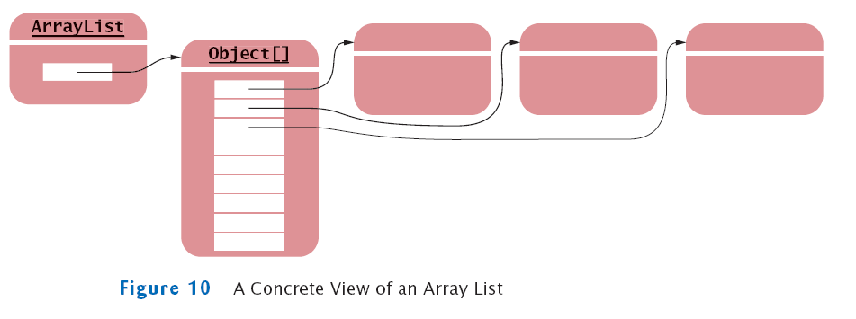

# 19. 자바에서 제공되는 자료구조 구현 클래스들 - 컬레션 프레임워크

## 컬렉션 프레임워크

- 프로그램 구현에 필요한 자료구조(Data Structure)를 구현해 놓은 JDK 라이브러리

- java.util 패키지에 구현되어 있음

- 개발에 소요되는 시간을 절약하면서 최적화 된 알고리즘을 사용할 수 있음

- 여러 구현 클래스와 인터페이스의 활용에 대한 이해가 필요함

&nbsp;&nbsp;&nbsp;


## Collection 인터페이스

- 하나의 객체를 관리하기 위한 메서드가 선언된 인터페이스의

- 하위에 List와 Set 인터페이스가 있음


&nbsp;&nbsp;&nbsp;

## List 인터페이스

- 객체를 순서에 따라 저장하고 관리하는데 필요한 메서드가 선언된 인터페이스

- 자료구조 리스트 (배열, 연결리스트)의 구현을 위한 인터페이스

- 중복을 허용함 

- ArrayList, Vector, LinkedList, Stack, Queue 등...

- ArrayList 그림

 &nbsp;&nbsp;&nbsp;

```java
package nogeneric;
public class Account {
	private int no;			//계좌번호
	private String owner;	//계좌주이름
	private int balance;	//계좌잔고
	private double iyul;    //계좌이율
	public Account() {
	}
	public Account(int no, String owner, int balance, double iyul) {
		this.no = no;
		this.owner = owner;
		this.balance = balance;
		this.iyul = iyul;
	}
	public void setAccountData(int no,String owner,int balance,double iyul) {
		this.no=no;
		this.owner=owner;
		this.balance=balance;
		this.iyul=iyul;
	}
	public void deposit(int money) {
		balance+=money;
	}
	
	public void withDraw(int money) {
		balance=balance-money;
		//this.balance-=money;
	}

	public static void headerPrint() {
		System.out.println("----------------------");
		System.out.printf("%s %s %4s %s\n","번호","이름","잔고","이율");
		System.out.println("----------------------");
	}
	
	public void print() {
		
		System.out.printf("%d %s %8d %.1f\n",
				this.no,this.owner,this.balance,this.iyul);
	}

	public int getNo() {
		return no;
	}
	public void setNo(int no) {
		this.no = no;
	}
	public String getOwner() {
		return owner;
	}
	public void setOwner(String owner) {
		this.owner = owner;
	}
	public int getBalance() {
		return balance;
	}
	public void setBalance(int balance) {
		this.balance = balance;
	}
	public double getIyul() {
		return iyul;
	}
	public void setIyul(double iyul) {
		this.iyul = iyul;
	}
	@Override
	public String toString() {
		return "Account [no=" + no + ", owner=" + owner + ", balance=" + balance + ", iyul=" + iyul + "]";
	}
}

```
```java
package nogeneric;
import java.util.ArrayList;
import java.util.Iterator;
public class ArrayListMain {
	public static void main(String[] args) {
		Account acc1=new Account(1111,"BING",33000,0.3);
		Account acc2=new Account(2222,"KING",12000,1.2);
		Account acc3=new Account(3333,"KING",89000,5.6);
		Account acc4=new Account(4444,"HING",45000,4.8);
		Account acc5=new Account(5555,"PING",99000,2.9);
	
		ArrayList accountList=new ArrayList();
		int size = accountList.size();
		System.out.println("#size:"+size);
		System.out.println("------------ 1. add[맨마지막 index 에 객체저장]--------");
		accountList.add(acc1);
		System.out.println("#size:"+accountList.size());
		accountList.add(acc2);
		accountList.add(acc3);
		accountList.add(acc4);
		accountList.add(acc5);
		System.out.println("#size:"+accountList.size());
		System.out.println(accountList);
		System.out.println("----------- 2. add(index,element)[지정된 index에객체저장]--");
		accountList.add(1,new Account(1112, "NEW", 30000, 3.3));
		System.out.println("#size:"+accountList.size());
		System.out.println(accountList);
		System.out.println("----------- 3. set(index,element)[지정된 index에객체저장]--");
		accountList.set(accountList.size()-1, new Account(9999, "NINE",90000, 9.9));
		System.out.println("#size:"+accountList.size());
		System.out.println(accountList);
		System.out.println("----------- 4. get(index)[지정된 index에객체참조변수반환]--");
		Account getAccount=(Account)accountList.get(accountList.size()-1);
		System.out.println(getAccount);
		System.out.println("----------- 5. remove(index)[지정된 index에객체삭제]--");
		Account removeAccount =(Account)accountList.remove(accountList.size()-1);
		System.out.println(removeAccount);
		System.out.println("#size:"+accountList.size());
		System.out.println(accountList);
		System.out.println("%%%%%%%%%%%%%%%%%%   업무실행  %%%%%%%%%%%%%%%%%%%");
		System.out.println("*****************1.계좌전체출력*******************");
		Account.headerPrint();
		for(int i=0;i<accountList.size();i++) {
			Object account=accountList.get(i);
			Account tempAccount=(Account)account;
			tempAccount.print();
		}
		Account.headerPrint();
		for(Object account:accountList) {
			Account acc=(Account)account;
			acc.print();
		}
		
		System.out.println("**************2.계좌번호3333번 한개찾기*****************");
		for (int i = 0; i < accountList.size(); i++) {
			Account tempAccount=(Account)accountList.get(i);
			if(tempAccount.getNo()==3333) {
				tempAccount.print();
				break;
			}
		}
		System.out.println("**************3.계좌주이름 KING인계좌 여러개찾기********");
		for (int i = 0; i < accountList.size(); i++) {
			Account tempAccount=(Account)accountList.get(i);
			if(tempAccount.getOwner().equals("KING")) {
				tempAccount.print();
			}
		}
		System.out.println("**************4.계좌번호 4444번 계좌한개삭제************");
		for (int i = 0; i < accountList.size(); i++) {
			Account tempAccount=(Account)accountList.get(i);
			if(tempAccount.getNo()==4444) {
				System.out.println(">>삭제전 size:"+accountList.size());
				Account removeAcc = (Account)accountList.remove(i);
				removeAcc.print();
				System.out.println(">>삭제후 size:"+accountList.size());
				break;
			}
		}
		System.out.println("**************5.계좌주이름 KING인계좌 여러개삭제***");
		for(int i=0;i<accountList.size();i++) {
			if(((Account)accountList.get(i)).getOwner().equals("KING")) {
				Account rAccount = (Account)accountList.remove(i);
				rAccount.print();
				i--;
			}
		}
		System.out.println("*****************1.계좌전체출력*******************");
		Account.headerPrint();
		for(int i=0;i<accountList.size();i++) {
			Account tempAccount=(Account)accountList.get(i);
			tempAccount.print();
		}
		/*%%%%%%%%%%%%%%%%%%%%%%%%%%%%%전체출력[iteration]%%%%%%%%%%%%%%%%%%%%%%%%%%%%%%*/
		System.out.println("%%%%%%%%%%%%%%%%%%전체출력[iteration]%%%%%%%%%%%%%");
		Iterator accountIterator = accountList.iterator();
		
		while(accountIterator.hasNext()) {
			Account tempAccount=(Account)accountIterator.next();
			tempAccount.print();
		}
		accountIterator.next();
		
	}

}

```


## Set 인터페이스

- 순서와 관계없이 중복을 허용하지 않고 유일한 값을 관리하는데 필요한 메서드가 선언됨 
- 아이디, 주민번호, 사번등을 관리하는데 유용
- 저장된 순서와 출력되는 순서는 다를 수 있음
- HashSet, TreeSet등...


```java
package nogeneric;
public class Car {
	private String no;	//차량번호
	private int inTime;	//입차시간
	private int outTime;//출차시간
	private int fee;	//주차요금
	public Car() {}
	public Car(String no,int inTime) {
		this.no=no;
		this.inTime=inTime;
	}
	public Car(String no, int inTime, int outTime, int fee) {
		this.no = no;
		this.inTime = inTime;
		this.outTime = outTime;
		this.fee = fee;
	}
	public void setIpChaData(String no,int inTime) {
		this.no=no;
		this.inTime=inTime;
	}
	public void setOutTime(int outTime) {
		this.outTime=outTime;
	}
	public void calculateFee() {
		this.fee = (this.outTime-this.inTime)*1000;
	}
	public void headerPrint() {
		System.out.printf("------------------------------------\n");
		System.out.printf("%s %s %s %s\n","차량번호","입차시간","출차시간","주차요금");
		System.out.printf("------------------------------------\n");
	}
	public void print() {
		System.out.printf("%7s %7d %7d %9d\n",this.no,this.inTime,this.outTime,this.fee);
	}
	/*
         차량번호가 동일한 경우 같은 차객체이므로 중복되지 않도록 Car 클래스의 equals()와 hashCode()메서드를 재정의함
        */
	@Override
	public int hashCode() {
		return no.hashCode();
	}
	@Override
	public boolean equals(Object obj) {
		if( obj instanceof Car){
			Car car = (Car)obj;
			if( this.no.equals(car.no) )
				return true;
			else 
				return false;
		}
		return false;
	}
	
	public String getNo() {
		return no;
	}
	public void setNo(String no) {
		this.no = no;
	}
	public int getInTime() {
		return inTime;
	}
	public void setInTime(int inTime) {
		this.inTime = inTime;
	}
	public int getFee() {
		return fee;
	}
	public void setFee(int fee) {
		this.fee = fee;
	}
	public int getOutTime() {
		return outTime;
	}
}
```
```java
package nogeneric;

import java.util.HashSet;
import java.util.Iterator;

public class HashSetMain {
	public static void main(String[] args) {
		Car car1=new Car("1111", 1);
		Car car2=new Car("2222", 2);
		Car car3=new Car("3333", 3);
		Car car4=new Car("4444", 4);
		Car car5=new Car("5555", 5);
		HashSet carSet=new HashSet();
		System.out.println("# set size:"+carSet.size());
		System.out.println(carSet);
		System.out.println("------------- 1.add --------------");
		carSet.add(car1);
		carSet.add(car2);
		carSet.add(car3);
		carSet.add(car4);
		carSet.add(car5);
		System.out.println("# set size:"+carSet.size());
		System.out.println(carSet);
		System.out.println("------------- 2.add[중복객체] --------------");
		/*
		 * Element의 equals메쏘드를 호출해서 중복을체크한다.
		 */
		boolean isAdd=carSet.add(car3);
		System.out.println("추가여부:"+isAdd);
		System.out.println("# set size:"+carSet.size());
		isAdd=carSet.add(new Car("4444",1));
		System.out.println("추가여부:"+isAdd);
		System.out.println("# set size:"+carSet.size());
		System.out.println(carSet);

		System.out.println("------------- 3.remove(객체) --------------");
		boolean isRemove = carSet.remove(car1);
		System.out.println("삭제여부:"+isRemove);
		System.out.println("# set size:"+carSet.size());
		System.out.println(carSet);
		System.out.println("--------------전체출력-----------------");
		System.out.println("---------------toArray()---------------");
		/*
		Object[] carObjectArray =carSet.toArray();
		for (int i = 0; i < carObjectArray.length; i++) {
			Car tempCar=(Car)carObjectArray[i];
			tempCar.print();
		}
		*/
		System.out.println("---------------enhanced for---------------");
		for (Object carObject : carSet) {
			Car tempCar=(Car)carObject;
			tempCar.print();
		}
		/*%%%%%%%%%%%%%%%%%%%%%%%%%%%%%전체출력[iteration]%%%%%%%%%%%%%%%%%%%%%%%%%%%%%%*/
		System.out.println("%%%%%%%%%%%%%%%%%%전체출력[iteration]%%%%%%%%%%%%%");
		Iterator carIterator=carSet.iterator();
		while(carIterator.hasNext()) {
			Car tempCar=(Car)carIterator.next();
			tempCar.print();
		}
	}
}
```

## Map 인터페이스
- 쌍(pair)로 이루어진 객체를 관리하는데 사용하는 메서드들이 선언된 인터페이스
- 객체는 key-value의 쌍으로 이루어짐
- key는 중복을 허용하지 않음
- HashTable, HashMap, Properties, TreeMap 등이 Map 인터페이스를 구현 함

```java
package nogeneric;
public class Car {
	private String no;	//차량번호
	private int inTime;	//입차시간
	private int outTime;//출차시간
	private int fee;	//주차요금
	
	public Car() {
		
	}
	
	public Car(String no,int inTime) {
		this.no=no;
		this.inTime=inTime;
	}
	
	public Car(String no, int inTime, int outTime, int fee) {
		this.no = no;
		this.inTime = inTime;
		this.outTime = outTime;
		this.fee = fee;
	}
	
	public void setIpChaData(String no,int inTime) {
		this.no=no;
		this.inTime=inTime;
	}

	public void setOutTime(int outTime) {
		this.outTime=outTime;
	}

	public void calculateFee() {
		this.fee = (this.outTime-this.inTime)*1000;
	}
	public void headerPrint() {
		System.out.printf("------------------------------------\n");
		System.out.printf("%s %s %s %s\n","차량번호","입차시간","출차시간","주차요금");
		System.out.printf("------------------------------------\n");
	}
	public void print() {
		System.out.printf("%7s %7d %7d %9d\n",
				this.no,
				this.inTime,
				this.outTime,
				this.fee);
	}
	
	public String getNo() {
		return no;
	}
	public void setNo(String no) {
		this.no = no;
	}
	public int getInTime() {
		return inTime;
	}
	public void setInTime(int inTime) {
		this.inTime = inTime;
	}
	public int getFee() {
		return fee;
	}
	public void setFee(int fee) {
		this.fee = fee;
	}
	public int getOutTime() {
		return outTime;
	}
}

```

```java
package nogeneric;

import java.util.HashMap;
import java.util.Iterator;
import java.util.Map.Entry;
import java.util.Set;

public class HashMapMain {

	public static void main(String[] args) {
		
		HashMap carMap=new HashMap();
		System.out.println("#map size:"+carMap.size());
		System.out.println(carMap);
		System.out.println("**************** 1.put *************");
		Car c1=new Car("1111",12);
		carMap.put("1111", c1);
		carMap.put("2222", new Car("2222", 13));
		carMap.put("3333", new Car("3333", 15));
		carMap.put("4444", new Car("4444", 16));
		carMap.put("5555", new Car("5555", 17));
		System.out.println("#map size:"+carMap.size());
		System.out.println(carMap);
		/*
		 * 키값은 중복허용안함.
		 */
		carMap.put("3333", new Car("삼삼삼삼", 20));
		System.out.println("#map size:"+carMap.size());
		System.out.println(carMap);
		
		System.out.println("************** 2.get(key) **********");
		Object getObjectCar = carMap.get("3333");
		Car getCar=(Car)getObjectCar;
		getCar.print();
		System.out.println("************** 3.remove(key) **********");
		Object removeObjectCar=carMap.remove("3333");
		Car removeCar=(Car)removeObjectCar;
		removeCar.print();
		System.out.println("#map size:"+carMap.size());
		System.out.println(carMap);
		
		System.out.println("**********전체차량출력***********");
				
		Set carEntrySet=carMap.entrySet();
		Object[] carObjectEntryArray = carEntrySet.toArray();
		for (int i=0;i<carObjectEntryArray.length;i++) {
			Entry carEntry=(Entry)carObjectEntryArray[i];
			String key=(String)carEntry.getKey();
			Car car=(Car)carEntry.getValue();
			car.print();
		}
		System.out.println("---------------------");
		for(Object entryObject :carEntrySet) {
			Entry carEntry=(Entry)entryObject;
			String key=(String)carEntry.getKey();
			Car car=(Car)carEntry.getValue();
			car.print();
		}
		/*%%%%%%%%%%%%%%%%%%%%%%%%%%%%%전체출력[iteration]%%%%%%%%%%%%%%%%%%%%%%%%%%%%%%*/
		System.out.println("%%%%%%%%%%%%%%%%%%전체출력[iteration]%%%%%%%%%%%%%");
		Set carEntrySet2=carMap.entrySet();
		Iterator carEntryIterator=carEntrySet2.iterator();
		while(carEntryIterator.hasNext()) {
			Entry carEntry=(Entry)carEntryIterator.next();
			String key = (String)carEntry.getKey();
			Car car=(Car)carEntry.getValue();
			System.out.println("key="+key);
			car.print();
		}
		System.out.println("--------- key set ----------");
		Set keySet=carMap.keySet();
		Iterator keyIterator = keySet.iterator();
		while(keyIterator.hasNext()) {
			String key=(String)keyIterator.next();
			System.out.println("key="+key);
			Car car=(Car)carMap.get(key);
			car.print();
		}
	}

}
```
<br>
<hr>

## 무엇이든 담을 수 있는 제네릭(Generic) 프로그래밍

### 제네릭 자료형 정의

- 클래스에서 사용하는 변수의 자료형이 여러개 일수 있고, 그 기능(메서드)은 동일한 경우 클래스의 자료형을 특정하지 않고<br>
  추후 해당 클래스를 사용할 때 지정 할 수 있도록 선언
- 실제 사용되는 자료형의 변환은 컴파일러에 의해 검증되므로 안정적인 프로그래밍 방식
- 컬렉션 프레임워크에서 많이 사용되고 있음

- 제네릭 타입을 사용하지 않는 경우의 예

```java
package nogeneric;

public class MyArrayList {
	private Object[] elementData;
	private int size;
	public MyArrayList() {
		elementData=new Object[0];
		size=elementData.length;
	}
	public int size() {
		return size;
	}
	public void add(Object element) {
		Object[] tempElementData=
				new Object[elementData.length+1];
		for(int i=0;i<elementData.length;i++) {
			tempElementData[i]=elementData[i];
		}
		tempElementData[tempElementData.length-1] =element; 
		this.elementData=tempElementData;
		this.size=this.elementData.length;
	}
	public Object get(int index) {
		return this.elementData[index];
	}
	
}

package nogeneric;

public class MyArrayListMain {

	public static void main(String[] args) {
		Account acc1=new Account(1111,"BING",33000,0.3);
		Account acc2=new Account(2222,"KING",12000,1.2);
		Account acc3=new Account(3333,"YING",89000,5.6);
		Account acc4=new Account(4444,"SING",45000,4.8);
		Account acc5=new Account(5555,"PING",99000,2.9);
		MyArrayList accountList=
				new MyArrayList();
		int size = accountList.size();
		System.out.println("#size:"+size);
		accountList.add(acc1);
		System.out.println("#size:"+accountList.size());
		accountList.add(acc2);
		System.out.println("#size:"+accountList.size());
		accountList.add(acc3);
		System.out.println("#size:"+accountList.size());
		accountList.add(acc4);
		System.out.println("#size:"+accountList.size());
		accountList.add(acc5);
		System.out.println("#size:"+accountList.size());
		Account getAccount=
				(Account)accountList.get(0);
		System.out.println(getAccount);
	}

}


```

- 제네릭 타입을 사용하는 경우의 예


```java
package generic;

public class MyArrayList< E > {
	private Object[] elementData;
	private int size;
	public MyArrayList() {
		elementData=new Object[0];
		size=elementData.length;
	}
	public int size() {
		return size;
	}
    //E 자료형을 인자로받아 실행하는 제네릭 메서드
	public void add(E element) {
		Object[] tempElementData=
				new Object[elementData.length+1];
		for(int i=0;i<elementData.length;i++) {
			tempElementData[i]=elementData[i];
		}
		tempElementData[tempElementData.length-1] =element; 
		this.elementData=tempElementData;
		this.size=this.elementData.length;
	}
    //E 자료형을 반환하는 제네릭 메서드
	public E get(int index) {
		return (E)this.elementData[index];
	}
	
	
}
```
  - 자료형 매개변수 E(type parameter) : 이 클래스를 사용하는 시점에 실제 사용할 자료형을 지정, <br>
    static 변수는 사용할 수 없음
  - MyArrayList : 제네릭 자료형
  - E : element, K: key, V : value 등 여러 알파벳을 의미에 따라 사용 가능

```java
package generic;
public class MyArrayListMain {
	public static void main(String[] args) {
		Account acc1=new Account(1111,"BING",33000,0.3);
		Account acc2=new Account(2222,"KING",12000,1.2);
		Account acc3=new Account(3333,"YING",89000,5.6);
		Account acc4=new Account(4444,"SING",45000,4.8);
		Account acc5=new Account(5555,"PING",99000,2.9);
		MyArrayList<Account> accountList= new MyArrayList<Account>();
		int size = accountList.size();
		System.out.println("#size:"+size);
		accountList.add(acc1);
		System.out.println("#size:"+accountList.size());
		accountList.add(acc2);
		System.out.println("#size:"+accountList.size());
		accountList.add(acc3);
		System.out.println("#size:"+accountList.size());
		accountList.add(acc4);
		System.out.println("#size:"+accountList.size());
		accountList.add(acc5);
		System.out.println("#size:"+accountList.size());
		Account getAccount=accountList.get(0);
		System.out.println(getAccount);
	}
}

```

### 다이아몬드 연산자 <>

- ArrayList<> 에서 <>를 다이아몬드 연산자라 함
- ArrayList list = new ArrayList<>();  //다이아몬든 연산자 내부에서 자료형은 생략가능 함
- 제네릭에서 자료형 추론(자바 10부터)
   ```java 
   ArrayList list = new ArrayList()  =>  var list = new ArrayList();
   ```

 
