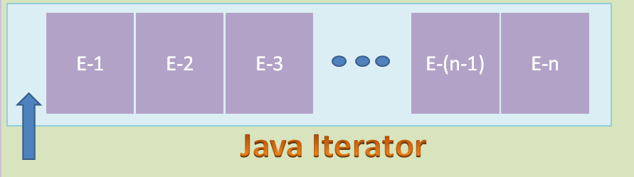
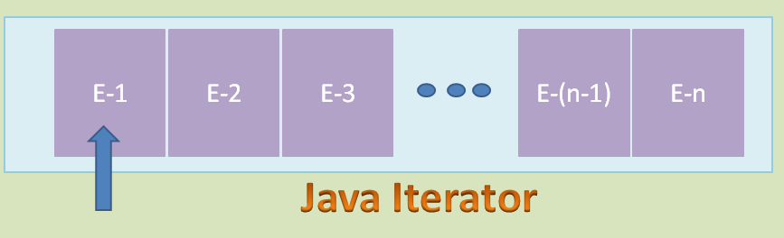
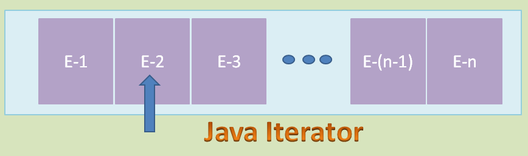
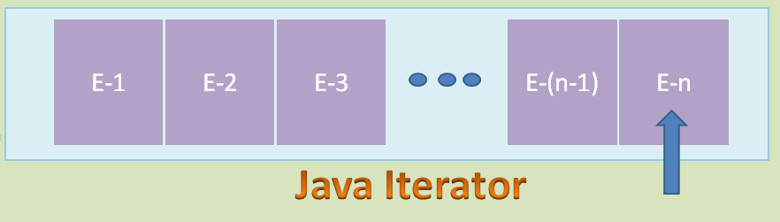
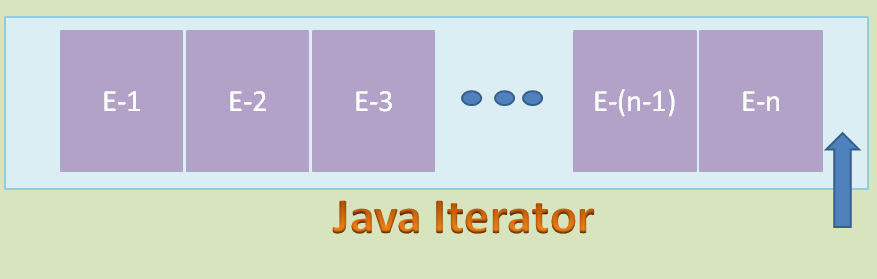
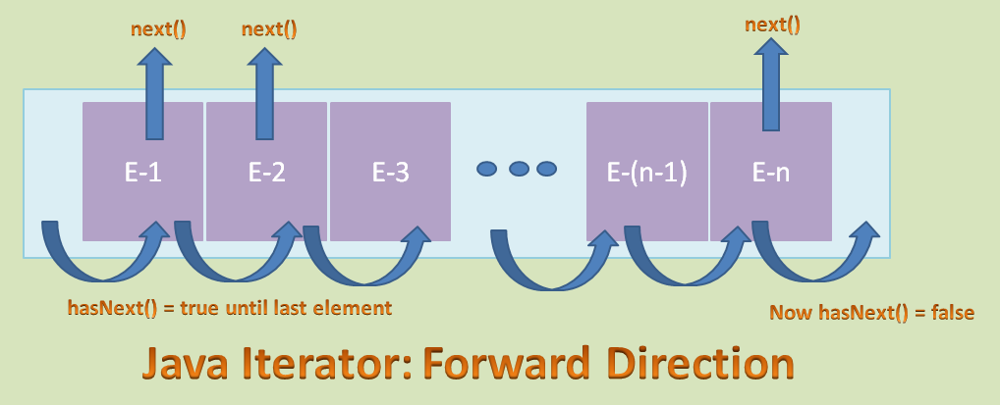

# 19. Collection 요소를 순회하는 Iterator

### 요소의 순회란?

- 컬렉션 프레임워크에 저장된 요소들을 하나씩 차례로 참조하는것
- 순서가 있는 List인터페이스의 경우는 Iterator를 사용 하지 않고 get(i) 메서드를 활용할 수 있음
- Set 인터페이스의 경우 get(i) 메서드가 제공되지 않으므로 Iterator를 활용하여 객체를 순회함

### Iterator 사용하기
- boolean hasNext() : 이후에 요소가 더 있는지를 체크하는 메서드, 요소가 있다면 true를 반환
- E next() : 다음에 있는 요소를 반환

<br>


```java
import java.util.ArrayList;
import java.util.HashMap;
import java.util.HashSet;
import java.util.Iterator;
import java.util.Set;
import java.util.Map.Entry;

public class CollectionIterationrMain {

	public static void main(String[] args) {
		Account acc1 = new Account(1111, "BING", 33000, 0.3);
		Account acc2 = new Account(2222, "KING", 12000, 1.2);
		Account acc3 = new Account(3333, "KING", 89000, 5.6);
		Account acc4 = new Account(4444, "HING", 45000, 4.8);
		Account acc5 = new Account(5555, "PING", 99000, 2.9);
		ArrayList<Account> accountList = new ArrayList<Account>();
		accountList.add(acc1);
		accountList.add(acc2);
		accountList.add(acc3);
		accountList.add(acc4);
		accountList.add(acc5);
		System.out.println("%%%%%%%%%%%%%%%%%% << List iteration >> %%%%%%%%%%%%%");
		Iterator<Account> accountIterator = accountList.iterator();
		while (accountIterator.hasNext()) {
			Account tempAccount = accountIterator.next();
			tempAccount.print();
		}

		Car car1 = new Car("1111", 1);
		Car car2 = new Car("2222", 2);
		Car car3 = new Car("3333", 3);
		Car car4 = new Car("4444", 4);
		Car car5 = new Car("5555", 5);
		HashSet<Car> carSet = new HashSet<Car>();
		carSet.add(car1);
		carSet.add(car2);
		carSet.add(car3);
		carSet.add(car4);
		carSet.add(car5);
		System.out.println("%%%%%%%%%%%%%%%%%% << Set iteration >> %%%%%%%%%%%%%");
		Iterator<Car> carIterator = carSet.iterator();
		while (carIterator.hasNext()) {
			Car tempCar = carIterator.next();
			tempCar.print();
		}

		HashMap<String, Car> carMap = new HashMap<String, Car>();
		carMap.put("1111", new Car("1111", 12));
		carMap.put("2222", new Car("2222", 13));
		carMap.put("3333", new Car("3333", 15));
		carMap.put("4444", new Car("4444", 16));
		carMap.put("5555", new Car("5555", 17));

		System.out.println("%%%%%%%%%%%%%%%%%% << Map(Set) iteration >> %%%%%%%%%%%%%");
		System.out.println("--------- Entry set ----------");
		Set<Entry<String, Car>> carEntrySet = carMap.entrySet();
		Iterator<Entry<String, Car>> carEntryIterator = carEntrySet.iterator();
		while (carEntryIterator.hasNext()) {
			Entry<String, Car> carEntry = carEntryIterator.next();
			String key = carEntry.getKey();
			Car car = carEntry.getValue();
			car.print();
		}
		System.out.println("--------- key set ----------");
		Set<String> keySet = carMap.keySet();
		Iterator<String> keyIterator = keySet.iterator();
		while (keyIterator.hasNext()) {
			String key = keyIterator.next();
			Car car = carMap.get(key);
			car.print();
		}
	}

}


```