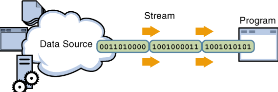
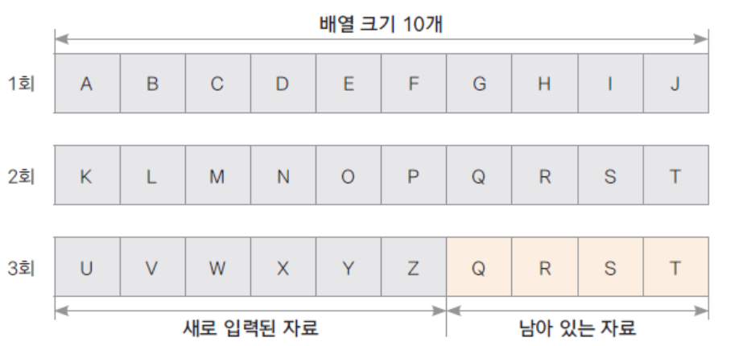
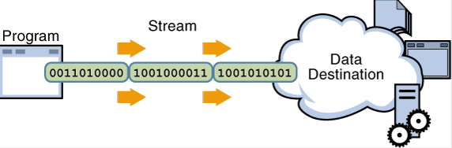
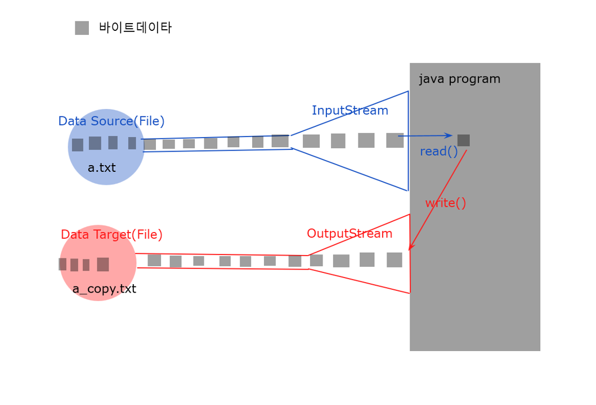

# 20. 바이트 단위 입출력 스트림

## InputStream 
   > &nbsp;&nbsp;

- 바이트 단위 입력 스트림 최상위 추상 클래스

- 많은 추상 메서드가 선언되어 있고 이를 하위 스트림이 상속받아 구현함

- 주요 하위 클래스

| 스트림 클래스 | 설명 |
| ------ | ------ |
| FileInputStream | 파일에서 바이트 단위로 자료를 읽습니다. |
| ByteArrayInputStream | byte 배열 메모리에서 바이트 단위로 자료를 읽습니다. |
| FilterInputStream | 기반 스트림에서 자료를 읽을 때 추가 기능을 제공하는 보조 스트림의 상위 클래스 |

- 주요 메서드

| 메서드 | 설명 |
| ------ | ------ |
| int read() | 입력 스트림으로부터 한 바이트의 자료를 읽습니다. 읽은 자료의 바이트 수를 반환합니다. |
| int read(byte b[]) | 입력 스트림으로 부터 b[] 크기의 자료를 b[]에 읽습니다. 읽은 자료의 바이트 수를 반환합니다. |
| int read(byte b[], int off, int len) | 입력 스트림으로 부터 b[] 크기의 자료를 b[]의 off변수 위치부터 저장하며 len 만큼 읽습니다. 읽은 자료의 바이트 수를 반환합니다. |
| void close() | 입력 스트림과 연결된 대상 리소스를 닫습니다. |


### FileInputStream 예제

- 파일에서 한 바이트씩 자료 읽기
- 파일의 끝까지 한 바이트씩 자료 읽기
- 입력스트림(InputStream)사용방법
  >1. 데이타 source 선정(파일)
  >2. 입력스트림(InputStream)객체생성(FileInputStream)
  >3. 입력스트림(InputStream)으로부터 한바이트씩  읽는다(read)
  >4. 입력스트림(InputStream)닫는다.(close) 
 

```java
package bytestream;
public class FileInputStreamMain {

	public static void main(String[] args) throws Exception {
		FileInputStream fis = new FileInputStream("fileOut.dat");
		int byteCount = 0;

		int readByte = fis.read();
		byteCount++;
		System.out.println("1.byte:" + Integer.toBinaryString(readByte));
		readByte = fis.read();
		byteCount++;
		System.out.println("2.byte:" + Integer.toBinaryString(readByte));
		readByte = fis.read();
		byteCount++;
		System.out.println("3.byte:" + Integer.toBinaryString(readByte));
		readByte = fis.read();
		byteCount++;
		System.out.println("4.byte:" + Integer.toBinaryString(readByte));
		while (true) {
			readByte = fis.read();
			if (readByte == -1)
				break;
			byteCount++;
			System.out.println(Integer.toBinaryString(readByte));
		}
		fis.close();
		System.out.println("FileInputStream.read() <----- fileOut.dat:" + byteCount + " 바이트읽음");

	}

}

```

- 파일에서 바이트 배열로 자료 읽기 ( 배열에 남아 있는 자료가 있을 수 있음에 유의 )

```java
package bytestream;
import java.io.FileInputStream;

public class FileInputStreamMain2 {

	public static void main(String[] args) throws Exception {
		FileInputStream fis = new FileInputStream("fileOut.dat");
		byte[] readByteArray = new byte[10];
		int readByteCount;
		while ((readByteCount = fis.read(readByteArray)) != -1) {
			/*for(byte b : bs){
				System.out.print((char)b);
			}*/
			for (int i = 0; i < readByteCount; i++) {
				System.out.print((char) readByteArray[i]);
			}
			System.out.println(": " + readByteCount + "바이트 읽음");
			
		}

	}
}
```
&nbsp;&nbsp;&nbsp;

## OutputStream
   > &nbsp;&nbsp;

- 바이트 단위 출력 스트림 최상위 추상 클래스
- 많은 추상 메서드가 선언되어 있고 이를 하위 스트림이 상속받아 구현함
- 주요 하위 클래스

| 스트림 클래스 | 설명 |
| ------ | ------ |
| FileOutputStream | 파일에서 바이트 단위로 자료를 씁니다. |
| ByteArrayOutputStream | byte 배열 메모리에서 바이트 단위로 자료를 씁니다. |
| FilterOutputStream | 기반 스트림에서 자료를 쓸 때 추가 기능을 제공하는 보조 스트림의 상위 클래스 |

- 주요 메서드

| 메서드 | 설명 |
| ------ | ------ |
| int write() | 한 바이트를 출력합니다. |
| int write(byte b[]) | b[] 크기의 자료를 출력합니다. |
| int write(byte b[], int off, int len) | b[] 배열에 있는 자료의 off 위치부터 len 개수만큼 자료를 출력합니다. |
| void flush() | 출력을 위해 잠시 자료가 머무르는 출력 버퍼를 강제로 비워 자료를 출력합니다. |
| void close() | 출력 스트림과 연결된 대상 리소스를 닫습니다. 출력 버퍼가 비워집니다. |


### FileOutputStream 예제

- 파일에 한 바이트씩 쓰기
- 출력스트림(OutputStream)사용방법
  >1. 데이타 목적지(target,destination) 선정(파일)
  >2. 출력스트림(OutputStream)객체생성(FileOutputStream)
  >3. 출력스트림(OutputStream)에 한바이트씩 쓴다(write)
  >4. 출력스트림(OutputStream)닫는다.(close)
  
```java
package bytestream;
public class FileOutputStreamMain {
	public static void main(String[] args) throws Exception{
		FileOutputStream fos=new FileOutputStream("fileOut.dat");
		fos.write(0b00000000000000000000000000000000);
		fos.write(1);
		fos.write(2);
		fos.write(3);
		fos.write(4);
		fos.write(0b00000000000000000000000011111111);
		
		for(int i=0;i<256;i++) {
			fos.write(i);
		}
		fos.close();
		
		System.out.println("FileOutputStream.write()--> fileOut.dat");
		
		
		
	}
}

```
- byte[] 배열에 넣고 배열을 한꺼번에 파일에 쓰기
```java
package bytestream;
import java.io.FileOutputStream;
public class FileOutputStreamMain2 {
	public static void main(String[] args) throws Exception{
		FileOutputStream fos=new FileOutputStream("fileOut2.dat");
		String writeString="byte array date write OutputStream.";
		byte[] writeBytes=writeString.getBytes();
		fos.write(writeBytes,0,writeBytes.length);
		fos.close();
		System.out.println("FileOutputStream2.write()--> fileOut2.dat");
	}
}
```


### flush() 와 close() 메서드

- 출력 버퍼를 비울때 flush() 메서드를 사용
- close() 메서드 내부에서 flush()가 호출되므로 close()메서드가 호출되면 출력 버퍼가 비워짐


## FileCopyMain
- FileInputStream 과 FileOutputStream을 사용한 파일복사
- 파일로부터 1바이트읽은뒤 다른파일로 한바이트씩 쓴다
- FileCopy
 


```java
package bytestream;

import java.io.FileInputStream;
import java.io.FileOutputStream;

public class FileCopyMain {

	public static void main(String[] args) throws Exception{
		long startTime = System.currentTimeMillis();
				
		FileInputStream fis=new FileInputStream("ChromeSetup.exe");
		FileOutputStream fos=new FileOutputStream("ChromeSetup_copy.exe");
		int byteCount=0;
		int starCount=0;
		while(true) {
			int readByte=fis.read();
			if(readByte==-1)break;
			byteCount++;
			if(byteCount%1024==0) {
				System.out.print("*");
				starCount++;
				if(starCount%50==0) {
					System.out.println();
				}
			}
			fos.write(readByte);
		}
		fis.close();
		fos.close();
		System.out.println();
		System.out.println("FileCopy:"+byteCount+" bytes copy!!");
		long endTime = System.currentTimeMillis();
		long duration = endTime-startTime;
		System.out.println(duration+ " ms...");
	}

}

```
