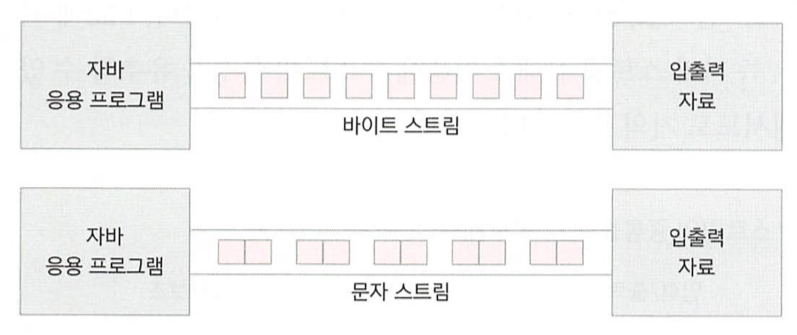

# 20. 문자 단위 입출력 스트림

## Reader

- 바이트스트림과 문자스트림 비교 
 > 
- 문자 단위 입력 스트림 최상위 추상 클래스

- 많은 추상 메서드가 선언되어 있고 이를 하위 스트림이 상속받아 구현함

- 주요 하위 클래스

| 클래스 | 설명 |
| ------ | ------ |
| FileReader | 파일에서 문자 단위로 읽는 스트림 클래스입니다. |
| InputStreamReader | 바이트 단위로 읽은 자료를 문자로 변환해주는 보조 스트림 클래스 입니다. |
| BufferedReader | 문자로 읽을 때 배열을 제공하여 한꺼번에 읽을 수 있는 기능을 제공하는 보조 스트림입니다. |

- 주요 메서드

| 메서드 | 설명 |
| ------ | ------ |
| int read() | 파일로부터 한 문자를 읽습니다. 읽은 문자를 반환합니다. |
| int read(char[] buf) | 파일로부터 buf 배열에 문자를 읽습니다. |
| int read(char[] buf, int off, int len) | 파일로부터 buf 배열의 off 위치로부터 len 개수만큼의 문자를 읽습니다. |
| void close() | 입력 스트림과 연결된 대상 리소스를 닫습니다. |

### FileReader

- 파일에서 문자 읽기
```java
package charstream;
import java.io.FileReader;
public class FileReaderMain {
	public static void main(String[] args)throws Exception {
		
		FileReader fr=new FileReader("fileWriter.txt");
		int charCount=0;
		int readChar = fr.read();
		charCount++;
		System.out.println("1.readChar:"+(char)readChar);
		readChar = fr.read();
		charCount++;
		System.out.println("2.readChar:"+(char)readChar);
		readChar = fr.read();
		charCount++;
		System.out.println("3.readChar:"+(char)readChar);
		while(true) {
			readChar=fr.read();
			if(readChar==-1)break;
			charCount++;
			System.out.print((char)readChar);
		}
		System.out.println();
		System.out.println(charCount+" 문자 읽음");
		System.out.println("FileReader.read() <--- fileWriter.txt ");
	}
}
```

## Writer

- 문자 단위 출력 스트림 최상위 추상 클래스
- 많은 추상 메서드가 선언되어 있고 이를 하위 스트림이 상속받아 구현함

- 주요 하위 클래스

| 클래스 | 설명 |
| ------ | ------ |
| FileWriter | 파일에서 문자 단위로 출력하는 스트림 클래스입니다. |
| OutputStreamWriter | 바이트 단위의 자료를 문자로 변환해 출력해주는 보조 스트림 클래스 입니다. |
| BufferedWriter | 문자로 쓸 때 배열을 제공하여 한꺼번에 쓸 수 있는 기능을 제공하는 보조 스트림입니다. |

- 주요 메서드

| 메서드 | 설명 |
| ------ | ------ |
| int write(int c) | 한 문자를 파일에 합니다. |
| int write(char[] buf) | 문자 배열 buf의 내용을 출력합니다. |
| int write(char[] buf, int off, int len) | 문자 배열 buf의 off위치에서부터 len 개수의 문자를 출력합니다. |
| int write(String str) | 문자열 str을 출력합니다. |
| int write(String str, int off, int len) | 문자열 str의 off번째 문자로부터 len 개수만큼 출력합니다. |
| int flush() | 출력하기 전에 자료가 있는 공간(출력 버퍼)을 비워 출력하도록 합니다 |
| void close() | 스트림과 연결된 리소스를 닫습니다. 출력 버퍼도 비워집니다. |


### FileWriter

- 파일에 문자 쓰기

```java
public class FileWriterMain {
	public static void main(String[] args)throws Exception {

		FileWriter fw=new FileWriter("fileWriter.txt");
		fw.write(44356);
		fw.write('A');
		fw.write('김');
		for(int i=0;i<65536;i++) {
			fw.write(i);
			if(i%100==0) {
				fw.write('\n');
			}
		}
		fw.write("\n");
		fw.write("문자열을 맘대로 막써요 !!!!");
		fw.write("\n");
		fw.write("한라인\n");
		fw.write("두라인\n");
		fw.write("세라인\n");
		fw.write("네라인\n");
		fw.write("다섯라인\n");
		fw.write("여섯라인\n");
		fw.write("일곱라인\n");
		fw.write("여덟라인\n");
		fw.write("아홉라인\n");
		fw.write("열라인\n");
		fw.write("열한라인\n");
		fw.write("열두라인\n");

		/*
		* 채워지지않은 버퍼에있는 데이타를 출력스트림에쓴다
		*/
		fw.flush();
		fw.close();
		System.out.println("FileWriter.write() -->fileWriter.txt");
	}
}
```


## 파일복사

- FileReader 과 FileWriter를 사용한 파일복사.
- 파일로부터 1문자 읽은뒤 다른파일로 한문자씩 쓴다.

```java
package charstream;
import java.io.FileReader;
import java.io.FileWriter;
public class FileWriterReaderCopyMain {
	public static void main(String[] args) throws Exception{
		FileReader fr=new FileReader("데미안.txt");
		FileWriter fw=new FileWriter("데미안[복사].txt");
		int lineCount=0;
		while(true) {
			int readChar=fr.read();
			if(readChar==-1)break;
			//System.out.print((char)readChar);
			if(readChar=='.') {
				fw.write(readChar);
				fw.write("\n");
			}else if(readChar=='-') {
				fw.write(readChar);
				fw.write(" page");
			}else if(readChar=='\n'){
				lineCount++;
				fw.write(readChar);
			}else {
				fw.write(readChar);
			}
		}
		fw.flush();
		fw.close();
		fr.close();
		System.out.println("-------FileWriterReaderCopy["+lineCount+"]--------");
	}
}
```