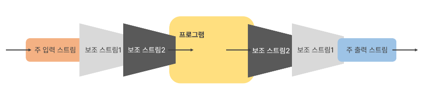

# 20. 여러가지 보조 스트림 클래스들

## 보조 스트림 
 > 
- 실제 읽고 쓰는 스트림이 아닌 보조 기능을 제공하는 스트림

- FilterInputStream과 FilterOutputStream이 보조 스트림의 상위 클래스들

- 생성자의 매개변수로 또 다른 스트림(기반 스트림이나 다른 보조 스트림)을 가짐

- Decorator Pattern으로 구현 됨

- 상위 클래스 생성자

| 생성자 | 설명 |
| ------ | ------ |
| protected FilterInputStream과(InputStream in) | 생성자의 매개변수로 InputStream을 받습니다. |
| public FilterOutputStream(OutputStream out) | 생성자의 매개변수로 OutputStream을 받습니다. |

> 

### InputStreamReader와 OutputStreamWriter
- 문자 변환 보조 스트림
- 바이트 단위로 읽거나 쓰는 자료를 문자로 변환해주는 보조 스트림

- 문자를 FileOutputStream으로 파일에 바이트로 출력하고 
- FileInputStream으로 읽은 바이트를 문자로 변환해주는 예
```java
package charstream;

import java.io.FileInputStream;
import java.io.FileOutputStream;
import java.io.InputStreamReader;
import java.io.OutputStreamWriter;

public class OutputStreamWriterInputStreamReaderMain {
	public static void main(String[] args) throws Exception {
		OutputStreamWriter osw = new OutputStreamWriter(new FileOutputStream("OutputStreamWriter.txt"));
		osw.write(44356);
		osw.write('A');
		osw.write('김');
		for (int i = 0; i < 65536; i++) {
			osw.write(i);
			if (i % 100 == 0) {
				osw.write('\n');
			}
		}
		osw.write("\n");
		osw.write("문자열을 맘대로 막써요 !!!!");
		osw.write("\n");
		osw.write("한라인\n");
		osw.write("두라인\n");
		osw.write("세라인\n");
		osw.write("네라인\n");
		osw.write("다섯라인\n");
		osw.write("여섯라인\n");
		osw.write("일곱라인\n");
		osw.write("여덟라인\n");
		osw.write("아홉라인\n");
		osw.write("열라인\n");
		osw.write("열한라인\n");
		osw.write("열두라인\n");

		/*
		 * 채워지지않은 버퍼에있는 데이타를 출력스트림에쓴다
		 */
		osw.flush();
		osw.close();
		System.out.println("OutputStreamWriter.write() -->OutputStreamWriter.txt");
		InputStreamReader isr = new InputStreamReader(new FileInputStream("OutputStreamWriter.txt"));
		int charCount = 0;
		int readChar = isr.read();
		charCount++;
		System.out.println("1.readChar:" + (char) readChar);
		readChar = isr.read();
		charCount++;
		System.out.println("2.readChar:" + (char) readChar);
		readChar = isr.read();
		charCount++;
		System.out.println("3.readChar:" + (char) readChar);
		while (true) {
			readChar = isr.read();
			if (readChar == -1)
				break;
			charCount++;
			System.out.print((char) readChar);
		}
		System.out.println();
		System.out.println(charCount + " 문자 읽음");

	}
}

```


### BufferedInputStream과 BufferedOutputStream 

- 약 8k의 배열이 제공되어 입출력이 빠르게 하는 기능이 제공되는 보조 스트림

- BufferedReader와 BufferedWriter는 문자용 입출력 보조 스트림

- BufferedInputStream과 BufferedOutputStream을 이용하여 파일 복사하는 예

```
public class BufferedStreamTest {

	public static void main(String[] args) {

		long millisecond = 0;
		try(FileInputStream fis = new FileInputStream("a.zip");
				FileOutputStream fos = new FileOutputStream("copy.zip");
				BufferedInputStream bis = new BufferedInputStream(fis);
				BufferedOutputStream bos = new BufferedOutputStream(fos)){
		
			millisecond = System.currentTimeMillis();
			
			int i;
			while( ( i = bis.read()) != -1){
				bos.write(i);
			}
			
			millisecond = System.currentTimeMillis() - millisecond;
		}catch(IOException e) {
			e.printStackTrace();
		}
		
		System.out.println("파일 복사 하는 데 " + millisecond + " milliseconds 소요되었습니다.");
	}
}
```

### DataInputStream과 DataOutputStream

- 자료가 메모리에 저장된 상태 그대로 읽거나 쓰는 스트림

- DataInputStream 메서드


- DataOutputStream 메서드


```
public class DataStreamTest {

	public static void main(String[] args) {


		try(FileOutputStream fos = new FileOutputStream("data.txt");
				DataOutputStream dos = new DataOutputStream(fos))
		{
		
			dos.writeByte(100);
			dos.writeChar('A');
			dos.writeInt(10);
			dos.writeFloat(3.14f);
			dos.writeUTF("Test");
		}catch(IOException e) {
			e.printStackTrace();
		}
		
		try(FileInputStream fis = new FileInputStream("data.txt");
				DataInputStream dis = new DataInputStream(fis))
		{
		
			System.out.println(dis.readByte());
			System.out.println(dis.readChar());
			System.out.println(dis.readInt());
			System.out.println(dis.readFloat());
			System.out.println(dis.readUTF());
		}catch (IOException e) {
			e.printStackTrace();
		}
	}
}
```


