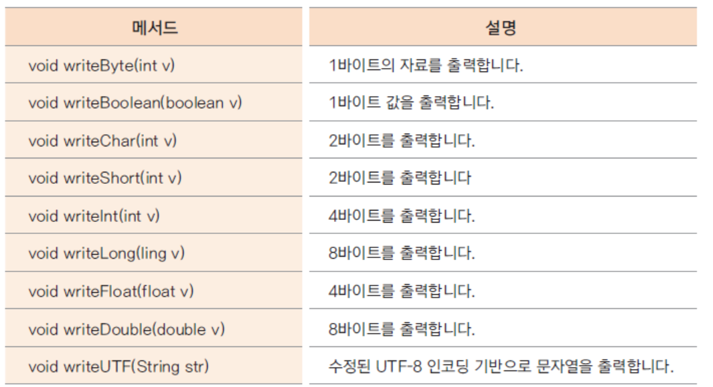

# 20. 여러가지 보조 스트림 클래스들

## 보조 스트림 
 > 
 - 실제 읽고 쓰는 스트림이 아닌 보조 기능을 제공하는 스트림
 - FilterInputStream과 FilterOutputStream이 보조 스트림의 상위 클래스들
    > 
 - 생성자의 매개변수로 또 다른 스트림(기반 스트림이나 다른 보조 스트림)을 가짐
 - Decorator Pattern으로 구현 됨
 - 상위 클래스 생성자

	| 생성자 | 설명 |
	| ------ | ------ |
	| protected FilterInputStream과(InputStream in) | 생성자의 매개변수로 InputStream을 받습니다. |
	| public FilterOutputStream(OutputStream out) | 생성자의 매개변수로 OutputStream을 받습니다. |

    > 

### BufferedInputStream과 BufferedOutputStream 

 - 약 8k의 배열이 제공되어 입출력이 빠르게 하는 기능이 제공되는 보조 스트림
     > 
     > 
 - BufferedReader와 BufferedWriter는 문자용 입출력 보조 스트림
 - BufferedInputStream과 BufferedOutputStream을 이용하여 파일 복사하는 예

    ```java
	import java.io.BufferedInputStream;
	import java.io.BufferedOutputStream;
	import java.io.FileInputStream;
	import java.io.FileOutputStream;
	public class BufferedOutputInputStreamFileCopyMain {
		public static void main(String[] args) throws Exception{
			long startTime = System.currentTimeMillis();
			BufferedInputStream bis=new BufferedInputStream(new FileInputStream("ChromeSetup.exe"));
			BufferedOutputStream bos=new BufferedOutputStream(new FileOutputStream("ChromeSetup_copy.exe"));
			int byteCount=0;
			int starCount=0;
			while(true) {
				int readByte=bis.read();
				if(readByte==-1)break;
				byteCount++;
				if(byteCount%1024==0) {
					System.out.print("*");
					starCount++;
					if(starCount%50==0) {
						System.out.println();
					}
				}
				bos.write(readByte);
			}
			bis.close();
			bos.close();
			System.out.println();
			System.out.println("BufferedOutputInputFileCopy:"+byteCount+ " bytes copy!!");
			long endTime = System.currentTimeMillis();
			long duration = endTime-startTime;
			System.out.println(duration+ " ms...");
		}
	}
    ```

### DataInputStream과 DataOutputStream
 - 자료가 메모리에 저장된 상태 그대로 읽거나 쓰는 스트림
 - 자바의 기본데이타를 바이트 출력스트림에 쉽게 쓸수있도록하는 필터스트림(DataOutputStream)
 - 자바의 기본데이타를 입력스트림으로부터 쉽게 읽을수있도록하는 필터스트림(DataInputStream)
 - DataInputStream 메서드
     > 
 - DataOutputStream 메서드
     > 
 - 보조스트림을 사용하지않도 int기본형 데이타를 읽고쓰는방법

 ```java
	import java.io.FileInputStream;
	import java.io.FileOutputStream;
	public class Javaint데이타를스트림을사용해서파일에쓰고읽는방법 {
		public static void main(String[] args) throws Exception {
			FileOutputStream fos = new FileOutputStream("intDataWriteRead1.dat");
			int witeIntData = 2147483647;
			/*
				    int witeIntData; 
	                01111111|11111111|11111111|11111111
			         (1)     (2)       (3)      (4) 
			         
			   >>24 00000000|00000000|00000000|01111111 
			                                    (1)
			   >>16 00000000|00000000|01111111|11111111
			                           (1)      (2)
			   >>8  00000000|01111111|11111111|11111111
			                  (1)      (2)      (3)
			        01111111|11111111|11111111|11111111
			         (1)      (2)      (3)      (4)  
			*/
			fos.write(witeIntData >> 24);
			fos.write(witeIntData >> 16);
			fos.write(witeIntData >> 8);
			fos.write(witeIntData >> 0);
			fos.close();
			System.out.println(">> FileOutputStream.write() ---> intDataWriteRead1.dat");
			FileInputStream fis = new FileInputStream("intDataWriteRead1.dat");
			int readIntData = 0;
			/*
			  << 24 01111111|00000000|00000000|00000000
			          (1)                          
			  << 16 00000000|11111111|00000000|00000000
			                  (2)            
			  <<  8 00000000|00000000|11111111|00000000
                                        (3)
			        00000000|00000000|00000000|11111111
                                                 (4)

              int readIntData

			       01111111|11111111|11111111|11111111
			         (1)      (2)      (3)      (4)  
			*/
			int readByte1 = fis.read() << 24;
			int readByte2 = fis.read() << 16;
			int readByte3 = fis.read() << 8;
			int readByte4 = fis.read() << 0;
			readIntData = readByte1 | readByte2 | readByte3 | readByte4;
			System.out.println(">> FileInputStream.read() <--- intDataWriteRead1.dat");
			System.out.println("\t readIntData:"+readIntData);
			/*
			* 자바의 기본데이타를 출력스트림에 쉽게 쓸수있도록하는 필터스트림
			*/
			DataOutputStream dos=new DataOutputStream(new FileOutputStream("intDataWriteRead2.dat"));
			dos.writeInt(witeIntData);
			dos.close();
			System.out.println("DataOutputStream.writeInt() ---> intDataWriteRead2.dat");
			/*
			* 자바의 기본데이타를 입력스트림으로부터 쉽게 읽을수있도록하는 필터스트림
			*/
			DataInputStream dis=new DataInputStream(new FileInputStream("intDataWriteRead2.dat"));
			readIntData=dis.readInt();
			System.out.println(">> DataOutputStream.readInt() <--- intDataWriteRead2.dat");
			System.out.println("\t readIntData:"+readIntData);
		}

	}

 ```

 - 자바의기본형 데이타를 읽고쓰는방법

 ```java
import java.io.DataInputStream;
import java.io.DataOutputStream;
import java.io.FileInputStream;
import java.io.FileOutputStream;
public class DataOutputInputStreamMain {
	public static void main(String[] args) throws Exception {
		/*
		 * 자바의 기본데이타를 출력스트림에 쉽게 쓸수있도록하는 필터스트림
		 */
		DataOutputStream dos=new DataOutputStream(new FileOutputStream("dataOut.dat"));
		int intData = 2147483647;
		dos.writeInt(intData);
		dos.writeByte(127);
		dos.writeBoolean(true);
		dos.writeChar('가');
		dos.writeDouble(3.141592);
		dos.writeUTF("오늘은 자바입출력을 공부합니다!!!");
		dos.close();
		System.out.println("DataOutputStream.writeXXX() ---> dataOut.txt");
		/*
		 * 자바의 기본데이타를 입력스트림으로부터 쉽게 읽을수있도록하는 필터스트림
		 */
		DataInputStream dis=new DataInputStream(new FileInputStream("dataOut.dat"));
		System.out.println("DataOutputStream.readXXX() <--- dataOut.dat");
		int readInt=dis.readInt();
		System.out.println("readInt:"+readInt);
		System.out.println("readByte:"+dis.readByte());
		System.out.println("readBoolean:"+dis.readBoolean());
		System.out.println("readChar:"+dis.readChar());
		System.out.println("readDouble:"+dis.readDouble());
		System.out.println("readUTF:"+dis.readUTF());
		dis.close();
	}
}
```


### PrintStream
 - 문자로 변환하여 출력하는기능을하는 필터스트림
   > 

```java
import java.io.FileOutputStream;
import java.io.PrintStream;
public class PrintStreamMain {
	public static void main(String[] args) throws Exception {
		PrintStream pout=new PrintStream(new FileOutputStream("printStream.txt"));
		pout.println(1234);
		pout.println('김');
		pout.println(true);
		pout.println(3.141592);
		pout.println("1234");
		pout.println("김");
		pout.println("true");
		pout.println("3.141592");
		System.out.println("-------PrintStream.print()----------");
	}
}
```


### InputStreamReader와 OutputStreamWriter
- 문자 변환 보조 스트림
- 바이트 단위로 읽거나 쓰는 자료를 문자로 변환해주는 보조 스트림
  > 
- 문자를 FileOutputStream으로 파일에 바이트로 출력하고 FileInputStream으로 읽은 바이트를 문자로 변환해주는 예

```java
import java.io.FileInputStream;
import java.io.FileOutputStream;
import java.io.InputStreamReader;
import java.io.OutputStreamWriter;
public class OutputStreamWriterInputStreamReaderMain {
	public static void main(String[] args) throws Exception {
		OutputStreamWriter osw = new OutputStreamWriter(new FileOutputStream("OutputStreamWriter.txt"));
		osw.write(44356);
		osw.write('A');
		osw.write('김');
		for (int i = 0; i < 65536; i++) {
			osw.write(i);
			if (i % 100 == 0) {
				osw.write('\n');
			}
		}
		osw.write("\n");
		osw.write("문자열을 맘대로 막써요 !!!!");
		osw.write("\n");
		osw.write("한라인\n");
		osw.write("두라인\n");
		osw.write("세라인\n");
		/*
		 * 채워지지않은 버퍼에있는 데이타를 출력스트림에쓴다
		 */
		osw.flush();
		osw.close();
		System.out.println("OutputStreamWriter.write() -->OutputStreamWriter.txt");
		InputStreamReader isr = new InputStreamReader(new FileInputStream("OutputStreamWriter.txt"));
		int charCount = 0;
		int readChar = isr.read();
		charCount++;
		System.out.println("1.readChar:" + (char) readChar);
		readChar = isr.read();
		charCount++;
		System.out.println("2.readChar:" + (char) readChar);
		readChar = isr.read();
		charCount++;
		System.out.println("3.readChar:" + (char) readChar);
		while (true) {
			readChar = isr.read();
			if (readChar == -1)
				break;
			charCount++;
			System.out.print((char) readChar);
		}
		System.out.println();
		System.out.println(charCount + " 문자 읽음");
		System.out.println("InputStreamReader.read() <-- OutputStreamWriter.txt");

	}
}

```


