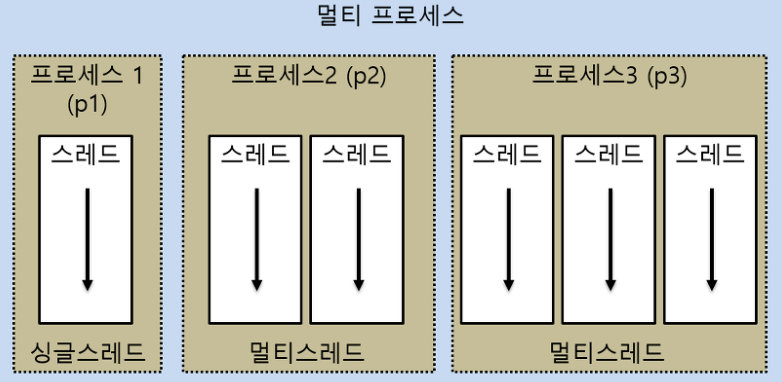
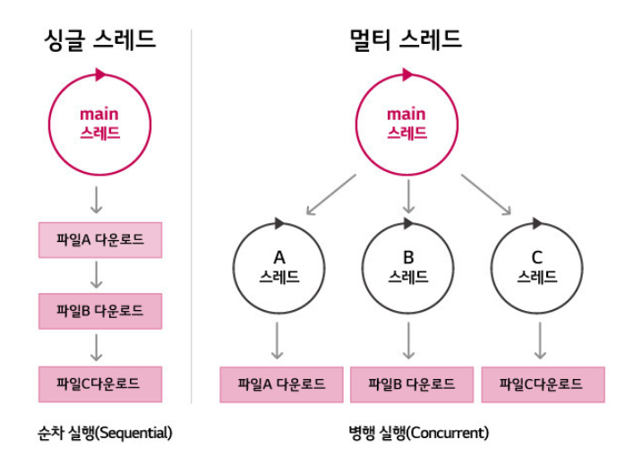

# 쓰레드

 ### 프로세스와 스레드 (Process vs Thread)

##### 프로세스란?
>프로세스(Process)는 일반적으로 cpu에 의해 메모리에 올려져 실행중인 프로그램을 말하며, 자신만의 메모리 공간을 포함한 독립적인 실행 환경을 가지고 있습니다. 우리가 사용하는 프로그램 중 일부는 여러 프로세스간 상호작용을 하는 것일수도 있습니다. 
>자바 JVM(Java Virtual Machine)은 주로 하나의 프로세스로 실행되며, 동시에 여러 작업을 수행하기 위해서 멀티 스레드를 지원하고 있습니다.  

##### 멀티프로세싱
> 두개 이상 다수의 프로세서(CPU)가 협력적으로 하나 이상의 작업(Task)을 동시에 처리하는 것이다. (병렬처리)
> 각 프로세스 간 메모리 구분이 필요하거나 독립된 주소 공간을 가져야 할 경우 사용한다. 
> 워드와 엑셀프로그램을 동시에사용
>프로세스 중 하나에 문제가 생겨도 다른 프로세스에 영향을 주지 않아, 작업속도가 느려지는 손해정도는 생기지만 정지되거나 하는 문제는 발생하지 않는다.

 
  2) 스레드란?
   >스레드(Thread)는 프로세스안에서 실질적으로 작업을 실행하는 단위를 말하며, 자바에서는 JVM(Java Virtual Machine)에 의해 관리됩니다. 프로세스에는 적어도 한개 이상의 스레드가 있으며, Main 스레드 하나로 시작하여 스레드를 추가 생성하게 되면 멀티 스레드 환경이 됩니다. 이러한 스레드들은 프로세스의 리소스를 공유하기 때문에 효율적이긴 하지만 잠재적인 문제점에 노출될 수도 있습니다. 

 3) 멀티 스레딩( Multi Thread)
   >하나의 프로세스를 다수의 실행 단위로 구분하여 자원을 공유하고 자원의 생성과 관리의 중복성을 최소화하여 수행 능력을 향상 시키는 것
   >하나의 프로그램에서 동시에 여러 개의 일을 수행할 수 있도록 해줌 (사실 분산처리를 통해 동시에 실행되는 것 처럼 보이는 것)
   

process
실행 중인 프로그램
프로그램이 실행되면 OS로 부터 메모리를 할당받아 프로세스 상태가 됨

thread
하나의 프로세스는 하나 이상의 thread를 가지게 되고, 실제 작업을 수행하는 단위는 thread임

