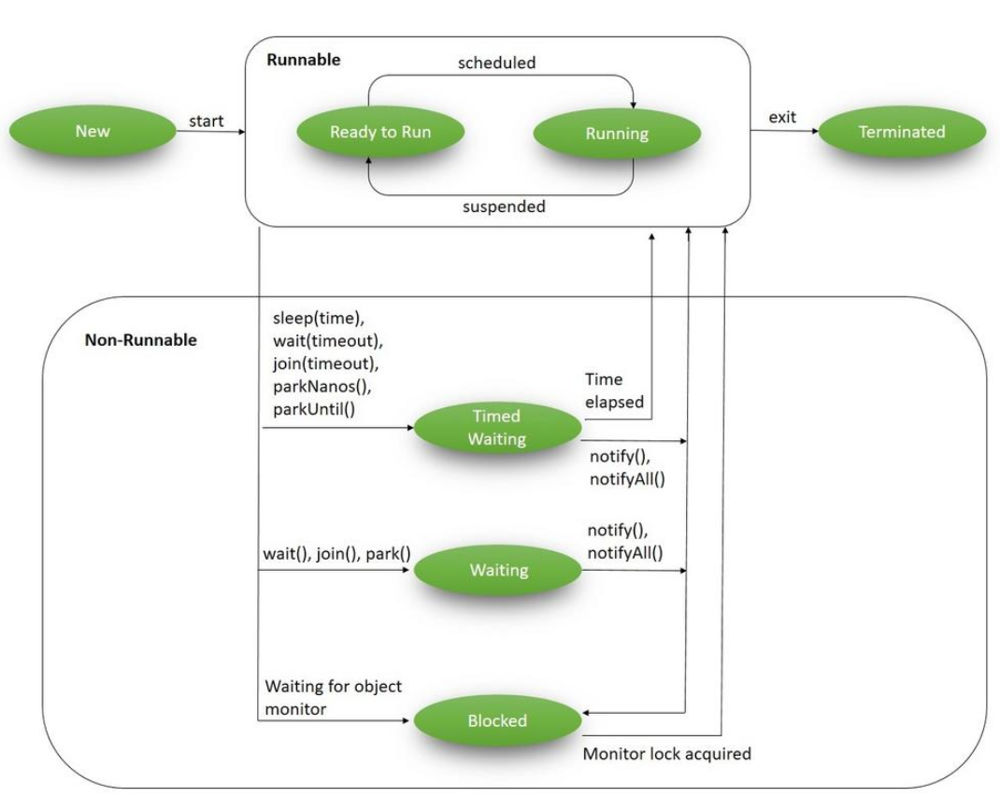
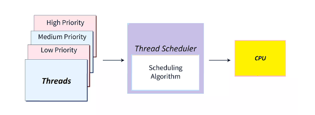
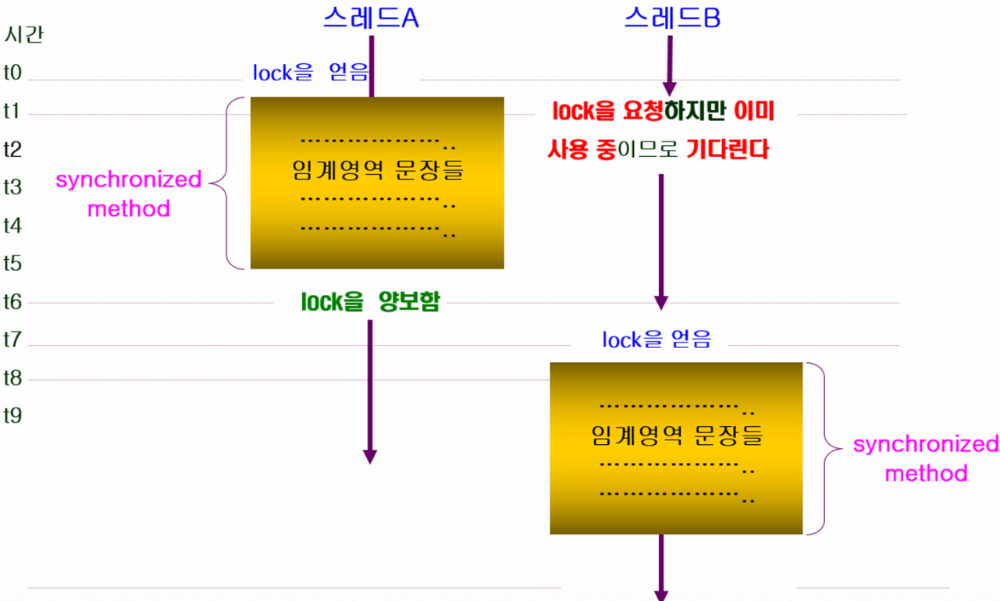
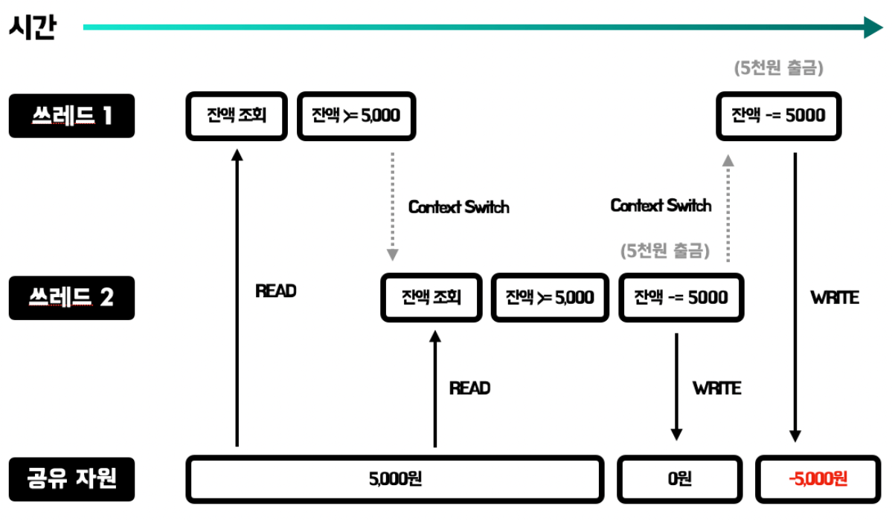
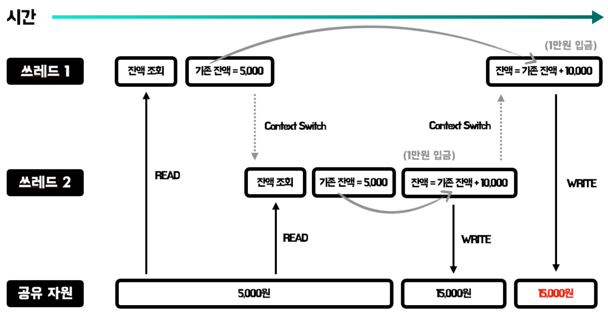
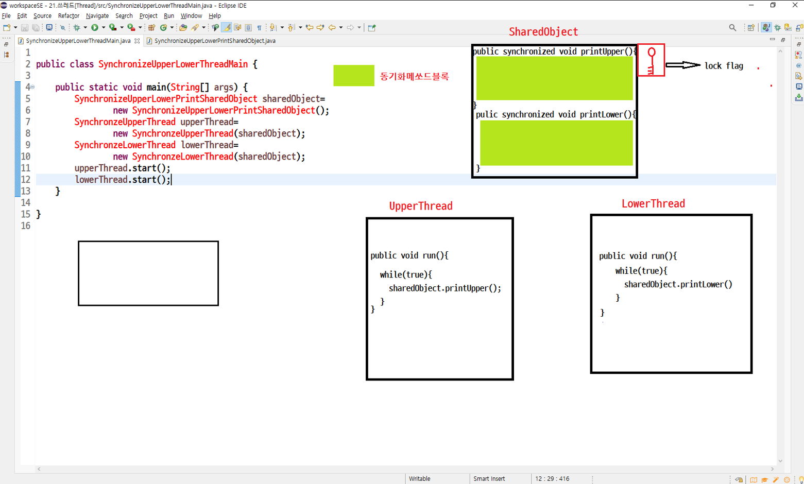

# 21. Thread 클래스의 제어

## 쓰레드 라이프 싸이클
>

## Thread 우선순위
 - Thread.MIN_PRIORITY(=1) ~ Thread.MAX_PRIORITY(=10)
 - 디폴트 우선순위 : Thread.NORMAL_PRIORITY(=5)
 - 우선 순위가 높은 Thread가 CPU의 배분을 받을 확률이 높다
 - setPriority()/getPriority()
 
   > 
 - Thread 우선순위 예제
	```java
	class ControlPriorityThread extends Thread {
		public void run() {
			int sum = 0;
			Thread t = Thread.currentThread();
			System.out.println(t.getName() + " 쓰레드[priority " + t.getPriority() + "]시작");
			for (int i = 0; i <= 1000000000; i++) {
				sum += i;
			}
			System.out.println(t.getName() + " 쓰레드[priority " + t.getPriority() + "]완료-"+sum);
		}
	}
	public class ControlPriorityThreadMain {
		public static void main(String[] args) {
			for (int i = Thread.MIN_PRIORITY; i <= Thread.MAX_PRIORITY; i++) {
				ControlPriorityThread pt = new ControlPriorityThread();
				pt.setPriority(i);
				pt.start();
			}
		}
	}
	```
## sleep()
 - 현재쓰레드를 지정시간동안 멈춘다(sleep).
 - sleep()에 의해 일시정지 상태가 된 쓰레드는 지정된 시간이 다 되거나 interrupt()가 호출되면 (interruptedException 발생),<br>
    잠에서 깨어나 실행대기 상태가 된다.

 - sleep메쏘드실행시 라이프싸이클
   > 


## join()

 - 동시에 두 개 이상의 Thread가 실행 될 때 다른 Thread의 결과를 참조 하여 실행해야 하는 경우 join() 함수를 사용
 - join() 함수를 호출한 Thread가 not-runnable 상태가 감
 - 다른 Thread의 수행이 끝나면 runnable 상태로 돌아옴
  > 

 - 1부터 50, 51부터 100 까지의 합을 구하는 두 개의 Thread를 만들어 그 결과를 확인해보세요
   ```java
	class ControlJoinThread extends Thread {
		int start;
		int end;
		int total;
		public ControlJoinThread(int start, int end) {
			this.start = start;
			this.end = end;
		}
		public int getTotal() {
			return total;
		}
		public void setTotal(int total) {
			this.total = total;
		}
		@Override
		public void run() {
			for (int i = start; i <= end; i++) {
				total += i;
			}
		}
	}

	public class ControlJoinThreadMain extends Thread {
		public static void main(String[] args) {
			try {

				ControlJoinThread thread1 = new ControlJoinThread(1, 50);
				ControlJoinThread thread2 = new ControlJoinThread(51, 100);
				thread1.start();
				thread2.start();
				/*
				* thread1.join() 메쏘드를 호출한 메인쓰레드를 thread1 쓰레드가 종료될때까지 중지시킨다.
				* thread2.join() 메쏘드를 호출한 메인쓰레드를 thread1 쓰레드가 종료될때까지 중지시킨다.
				*/
				thread1.join();
				thread2.join();

				int lastTotal = thread1.getTotal() + thread2.getTotal();
				System.out.println("thread1 total = " + thread1.getTotal());
				System.out.println("thread2 total = " + thread2.getTotal());
				System.out.println("lastTotal = " + lastTotal);
			} catch (Exception e) {
				System.out.println(e);
			}
		}

	}
	```

## interrupt()

- 다른 Thread에 예외를 발생시키는 interrupt를 보낸다.

- Thread가 join(), sleep(), wait() 함수에의해 not-runnable 상태일 때 interrupt() 메서드를 호출하면 다시 runnable 상태가 될 수 있음


## Thread 종료하기

- Thread는 할일이끝나면 자동종료
- 무한 반복의 경우에는  while(flag)의 flag 변수값을 false로 바꾸어 종료를 시킴

- Thread 자동종료하기 예제
    ```java
	public class ConstrolStopThread1 extends Thread{
		@Override
		public void run() {
			try {
				for (int i = 1; i <= 100; i++) {
					System.out.println("downloding...["+i+"%]");
					Thread.sleep(100);
				}
			} catch (Exception e) {
				e.printStackTrace();
			}
			System.out.println(Thread.currentThread().getName()+" thread 가 jvm return thread end");
			return;
		}
	}
	public class ControlStopThread1Main {
		public static void main(String[] args) throws Exception{
			System.out.println("1.main");
			
			ControlStopThread1 cst1=new ControlStopThread1();
			cst1.setName("download");
			cst1.start();
			System.out.println("9.main thread jvm return end");
		}
	}

	```

    ```
- 무한반복 Thread 종료하기 예제
    ```java
	public class ControlStopThread2 extends Thread{
		private boolean isPlay;
		public ControlStopThread2() {
			isPlay=true;
		}
		
		public boolean isPlay() {
			return isPlay;
		}

		public void setPlay(boolean isPlay) {
			this.isPlay = isPlay;
		}

		@Override
		public void run() {
			
			while(isPlay) {
				try {
					System.out.println("--------");
					System.out.println("1.game move");
					Thread.sleep((int)(Math.random()*1000)+1);
					System.out.println("2.game fight");
					Thread.sleep((int)(Math.random()*1000)+1);
					System.out.println("3.game get score!");
					Thread.sleep((int)(Math.random()*1000)+1);
					System.out.println("4.game power up!");
					Thread.sleep((int)(Math.random()*1000)+1);
					System.out.println("5.game score update!");
				}catch (Exception e) {
					// TODO: handle exception
				}
			}
			return;
		}
	}

	public class ControlStopThreadMain {
		public static void main(String[] args) throws Exception{
			System.out.println("1.main");
			ControlStopThread2 cst2=new ControlStopThread2();
			cst2.start();
			Thread.sleep(1);
			//cst2.stop();
			cst2.setPlay(false);
			System.out.println("9.main thread jvm return end");
		}
	}
    ```


##  멀티 Thread 프로그래밍에서의 동기화 (synchronize)
 > 멀티쓰레드 프로세스의 경우 여러 쓰레드가 자원을 공유해서 작업하기 때문에 서로에게 영향을 줄 수 있다.<br>
 > 이러한 일을 방지하기 위해 한 쓰레드가 진행중인 작업을 다른 쓰레드가 간섭하지 못하도록 막는 것을 <br> **쓰레드 동기화(Synchronization)** 라고 한다.

 ### critical section(임계영역)
   >두 개 이상의 thread가 동시에 접근 하는 경우 문제가 생길 수있는 영역을 critical section(임계영역) 으로설정한다.<br>
   >critical section(임계영역)은 한 순간 오직 하나의  thread 만이 들어갈 수 있고, 나머지 thread들은 대기(blocking) 상태가 된다.

 ### 동기화 (synchronization)  
  
  - 동기화는 하나의 쓰레드가 임계영역에 접근한 경우 공유자원을 lock 하여 다른 thread들의 접근을 제어
  - 자바모든 객체는 lock을 하나씩 가지고 있으며, 해당 객체의 lock을 가지고 있는 쓰레드만 임계 영역의 코드를 수행할 수 있다.<br>다른 쓰레드들은 lock을 얻을 때까지 기다린다.
  - 동기화를 잘못 구현하면 deadlock에 빠질 수 있다.
     > 
  - 동기화의 필요성 예	 
    > 

 ### 자바에서는 synchronized 메서드나 synchronized 블럭을 사용
  - synchronized 메서드
    -  메서드 앞에 synchronized를 붙여서 메서드 전체가 임계 영역으로 설정된다.
       > 쓰레드는 해당 메서드가 호출된 시점부터 해당 메서드가 포함된 객체의 lock을 얻어 작업을 수행하다가<br> 
	   > 메서드가 종료되면 lock을 반환한다.
		```java
		// 1. 메서드 전체를 임계 영역으로 지정
		public synchronized void withDraw(){
			// ...
		}
		
		```
  - synchronized 블럭		
	- 메서드 내의 코드 일부를 블럭{}으로 감싸고 블럭 앞에 'synchronized(참조변수)'를 붙이는 것이다.<br>
	  이때 참조변수는 락을 걸고자하는 객체를 참조하는 것이어야 한다.
	   >이 블럭을 synchronized블럭이라고 부르며, 쓰레드가 이 블럭 영역 안으로 들어가면 객체의 lock을 얻게되고,<br> 
	   >블럭을 벗어나면 반납한다.
   
		```java
		// 2. 특정 영역을 임계 영역으로 지정
		synchronized(모니터 객체의 참조변수){
			// ...
		}
		```

  - 동기화예제코드1
    ```java

		class SynchronizeUpperLowerPrintShareObject {
			public void printUpper() {
				synchronized (this) {
					System.out.print("A");
					System.out.print("B");
					System.out.print("C");
					System.out.print("D");
					System.out.print("E");
					System.out.print("F");
					System.out.print("G");
					System.out.print("H");
					System.out.print("I");
					System.out.print("J");
					System.out.print("K");
					System.out.print("L");
					System.out.print("M");
					System.out.print("N");
					System.out.print("O");
					System.out.print("P");
					System.out.print("Q");
					System.out.print("R");
					System.out.print("S");
					System.out.print("T");
					System.out.print("U");
					System.out.print("V");
					System.out.print("W");
					System.out.print("X");
					System.out.print("Y");
					System.out.print("Z");
					System.out.println();
				}

			}

			public void printLower() {
				synchronized (this) {
					System.out.print("a");
					System.out.print("b");
					System.out.print("c");
					System.out.print("d");
					System.out.print("e");
					System.out.print("f");
					System.out.print("g");
					System.out.print("h");
					System.out.print("i");
					System.out.print("j");
					System.out.print("k");
					System.out.print("l");
					System.out.print("m");
					System.out.print("n");
					System.out.print("o");
					System.out.print("p");
					System.out.print("q");
					System.out.print("r");
					System.out.print("s");
					System.out.print("t");
					System.out.print("u");
					System.out.print("v");
					System.out.print("w");
					System.out.print("x");
					System.out.print("y");
					System.out.print("z");
					System.out.println();
				}
			}

		}

		class SynchronizeUpperPrintThread extends Thread {
			private SynchronizeUpperLowerPrintShareObject shareObject;

			public SynchronizeUpperPrintThread(SynchronizeUpperLowerPrintShareObject shareObject) {
				this.shareObject = shareObject;
			}

			@Override
			public void run() {
				while (true) {

					try {
						shareObject.printUpper();
						Thread.sleep(300);
					} catch (InterruptedException e) {

						e.printStackTrace();
					}
				}
			}

		}

		class SynchronizeLowerPrintThread extends Thread {
			private SynchronizeUpperLowerPrintShareObject shareObject;

			public SynchronizeLowerPrintThread(SynchronizeUpperLowerPrintShareObject shareObject) {
				this.shareObject = shareObject;
			}

			@Override
			public void run() {
				while (true) {
					try {
						shareObject.printLower();
						Thread.sleep(300);
					} catch (InterruptedException e) {

						e.printStackTrace();
					}
				}
			}
		}

		public class SynchronizeUpperLowerThreadMain {

			public static void main(String[] args) {
				SynchronizeUpperLowerPrintShareObject shareObject1 = new SynchronizeUpperLowerPrintShareObject();
				// SynchronizeUpperLowerPrintShareObject shareObject2=new
				// SynchronizeUpperLowerPrintShareObject();
				SynchronizeUpperPrintThread upperThread = new SynchronizeUpperPrintThread(shareObject1);
				SynchronizeLowerPrintThread lowerThread = new SynchronizeLowerPrintThread(shareObject1);
				upperThread.start();
				lowerThread.start();

			}

		}

	```		

 

  - 동기화예제코드2
    ```java
		
	 class Bank {
		private int balance = 0;

		public void addBalance(int won) {
			/*
			* 총잔고멤버필드를 총잔고임시변수대입
			*/
			System.out.println("1.[" + Thread.currentThread().getName() + "]총잔고멤버필드를 총잔고임시변수대입");
			int tempBalance = balance;

			/*
			총잔고임시변수값과 인자로대입되는 입금액을 더해서 총잔고출력
			*/
			System.out.println("2.[" + Thread.currentThread().getName() + "]총잔고임시변수값과 인자로대입되는 입금액을 더해서 총잔고출력");
			System.out.println("3.[" + Thread.currentThread().getName() + "]" + "현재잔고 = " + tempBalance + " 입금액=" + won
					+ " 합계액=" + (tempBalance + won));
			/*
			총잔고임시변수값과 입금액을 더해서 총잔고계산후 총잔고 임시변수값에대입(누적)
			*/
			System.out
					.println("4.[" + Thread.currentThread().getName() + "]" + "총잔고임시변수값과 입금액을 더해서 총잔고계산후 총잔고 임시변수값에대입(누적)");
			tempBalance += won;
			/*
			총잔고 임시변수값을 총잔고멤버필드에대입	
			*/
			System.out.println("5.[" + Thread.currentThread().getName() + "]" + "총잔고 임시변수값을 총잔고멤버필드에대입");
			balance = tempBalance;
		}

		public int getBalance() {
			return balance;
		}

	}

	class User extends Thread {
		Bank bank;
		public User(String name, Bank bank) {
			super(name);
			this.bank = bank;
		}

		public void run() {
			for (int i = 1; i <= 30; i++)
				try {
					// Thread.sleep((int)(Math.random()*10)+1);
					bank.addBalance(10);
				} catch (Exception e) {
					// TODO Auto-generated catch block
					e.printStackTrace();
				}

		}
	}

	public class SynchronizedBankThreadMain {
		public static void main(String args[]) {
			Bank bank = new Bank();
			User user1 = new User("KIM 님쓰레드", bank);
			User user2 = new User("LEE 님쓰레드", bank);
			User user3 = new User("HIM 님쓰레드", bank);
			User user4 = new User("DIM 님쓰레드", bank);
			User user5 = new User("SIM 님쓰레드", bank);
			user1.start();
			user2.start();
			user3.start();
			user4.start();
			user5.start();
			try {
				user1.join();
				user2.join();
				user3.join();
				user4.join();
				user5.join();
			} catch (InterruptedException e) {
			}
			System.out.println("최종 잔액=" + bank.getBalance());
		}
	}
	
	```
