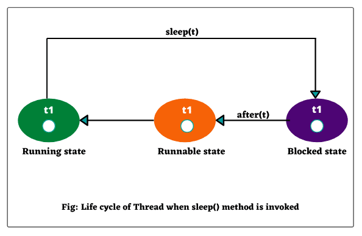
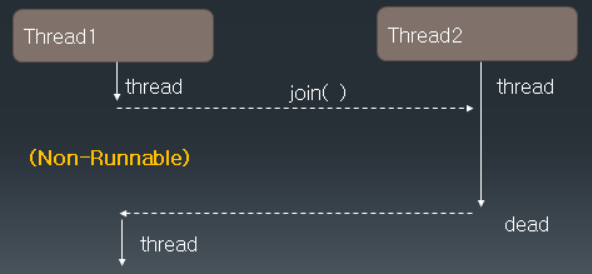
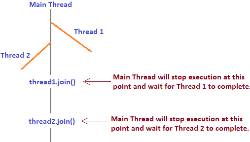

# 21. Thread 클래스의 제어

## 쓰레드 라이프 싸이클
>

## Thread 우선순위
 - Thread.MIN_PRIORITY(=1) ~ Thread.MAX_PRIORITY(=10)
 - 디폴트 우선순위 : Thread.NORMAL_PRIORITY(=5)
 - 우선 순위가 높은 Thread가 CPU의 배분을 받을 확률이 높다
 - setPriority()/getPriority()
 
   > 
 - Thread 우선순위 예제

```java
public class PriorityThread extends Thread{
	public void run(){
		int sum = 0;
		Thread t = Thread.currentThread();
		System.out.println( t + "start");
		
		for(int i =0; i<=1000000; i++){
			sum += i;
		}
		
		System.out.println( t.getPriority() + "end");
	}
}


public class PriorityTest {

	public static void main(String[] args) {

		int i;
		for(i=Thread.MIN_PRIORITY; i<= Thread.MAX_PRIORITY; i++){
			
			PriorityThread pt = new PriorityThread();
			pt.setPriority(i);
			pt.start();
		
		}
	}

}

```
## sleep()
 - 현재쓰레드를 지정시간동안 멈춘다(sleep).
 - sleep()에 의해 일시정지 상태가 된 쓰레드는 지정된 시간이 다 되거나 interrupt()가 호출되면 (interruptedException 발생),<br>
    잠에서 깨어나 실행대기 상태가 된다.

 - sleep메쏘드실행시 라이프싸이클
   > 


## join()

 - 동시에 두 개 이상의 Thread가 실행 될 때 다른 Thread의 결과를 참조 하여 실행해야 하는 경우 join() 함수를 사용
 - join() 함수를 호출한 Thread가 not-runnable 상태가 감
 - 다른 Thread의 수행이 끝나면 runnable 상태로 돌아옴
  > 

 - 1부터 50, 51부터 100 까지의 합을 구하는 두 개의 Thread를 만들어 그 결과를 확인해보세요

```java
public class JoinTest extends Thread{
	
	int start;
	int end;
	int total;
	
	public JoinTest(int start, int end){
		this.start = start;
		this.end = end;
	}
	
	public void run(){
	
		int i;
		for(i = start; i <= end; i++){
			total += i;
		}
	}
	

	public static void main(String[] args) {

		JoinTest jt1 = new JoinTest(1, 50);
		JoinTest jt2 = new JoinTest(51, 100);
		
				
		jt1.start();
		jt2.start();
		
		try{
			jt1.join();
			jt2.join();
			
		}catch (InterruptedException e) {
			System.out.println(e);
		}
		
		
		int lastTotal = jt1.total + jt2.total;
		
		System.out.println("jt1.total = " + jt1.total);
		System.out.println("jt2.total = " + jt2.total);
		
		System.out.println("lastTotal = " + lastTotal);
		
				
	}

}
```

## interrupt()

- 다른 Thread에 예외를 발생시키는 interrupt를 보낸다.

- Thread가 join(), sleep(), wait() 함수에의해 not-runnable 상태일 때 interrupt() 메서드를 호출하면 다시 runnable 상태가 될 수 있음


## Thread 종료하기

- Thread는 할일이끝나면 자동종료
- 무한 반복의 경우에는  while(flag)의 flag 변수값을 false로 바꾸어 종료를 시킴

- Thread 자동종료하기 예제
    ```java
	public class ConstrolStopThread1 extends Thread{
		@Override
		public void run() {
			try {
				for (int i = 1; i <= 100; i++) {
					System.out.println("downloding...["+i+"%]");
					Thread.sleep(100);
				}
			} catch (Exception e) {
				e.printStackTrace();
			}
			System.out.println(Thread.currentThread().getName()+" thread 가 jvm return thread end");
			return;
		}
	}
	public class ControlStopThread1Main {
		public static void main(String[] args) throws Exception{
			System.out.println("1.main");
			
			ControlStopThread1 cst1=new ControlStopThread1();
			cst1.setName("download");
			cst1.start();
			System.out.println("9.main thread jvm return end");
		}
	}

	```

    ```
- 무한반복 Thread 종료하기 예제
    ```java
	public class ControlStopThread2 extends Thread{
		private boolean isPlay;
		public ControlStopThread2() {
			isPlay=true;
		}
		
		public boolean isPlay() {
			return isPlay;
		}

		public void setPlay(boolean isPlay) {
			this.isPlay = isPlay;
		}

		@Override
		public void run() {
			
			while(isPlay) {
				try {
					System.out.println("--------");
					System.out.println("1.game move");
					Thread.sleep((int)(Math.random()*1000)+1);
					System.out.println("2.game fight");
					Thread.sleep((int)(Math.random()*1000)+1);
					System.out.println("3.game get score!");
					Thread.sleep((int)(Math.random()*1000)+1);
					System.out.println("4.game power up!");
					Thread.sleep((int)(Math.random()*1000)+1);
					System.out.println("5.game score update!");
				}catch (Exception e) {
					// TODO: handle exception
				}
			}
			return;
		}
	}

	public class ControlStopThreadMain {
		public static void main(String[] args) throws Exception{
			System.out.println("1.main");
			ControlStopThread2 cst2=new ControlStopThread2();
			cst2.start();
			Thread.sleep(1);
			//cst2.stop();
			cst2.setPlay(false);
			System.out.println("9.main thread jvm return end");
		}
	}
    ```

