# 24. 소켓프로그래밍

## 소켓(Socket)이란?
 >두 프로그램이 네트워크를 통해 서로 통신을 수행할 수 있도록 양쪽에 생성되는 링크의 단자입니다.<br>
 >두 소켓이 연결되면 서로 다른 프로세스끼리 데이터를 전달할 수 있습니다.<br>
 >결국 소켓이 구현됨으로써 네트워크 및 전송 계층의 캡슐화가 가능해집니다.<br> 
 >소켓은 원래 캘리포니아 버클리 대학 분교에서 UNIX용으로 개발되었으며,<br> 
 >UNIX에서의 입출력 메소드의 표준인 개방/읽기/쓰기/닫기 메커니즘을 따릅니다.<br> 

- 기본적으로 소켓은 통신을 위한 일종의 통로라고 생각할 수 있습니다. 
- 기본적으로 소켓은 상대방에게 데이터를 보내거나 받는 역할을 하며, 연결을 수동적으로 기다리느냐 ,<br>
  능동적으로 연결을 하느냐로 [서버] 냐 [클라이언트] 냐 구분할 수 있습니다.

## 소켓의 구성 요소
  - 소켓의 구성요소로는 프로토콜, IP 주소, 포트 번호가 있다.
 #### 프로토콜
   > 프로토콜은 데이터 전송을 위한 표준 집합 규칙이다. 주로 TCP/IP, UDP/IP 프로토콜을 사용한다.
  - TCP/IP
    >연결 설정 후 통신이 가능한 연결형 프로토콜이다.<br>
	>신뢰성있는 데이터 전송의 특징을 가지고 있다. 필요할 경우 데이터를 재전송한다.<br>
	>데이터 경계의 구분이 없는 바이트 스트림(Byte-Stream) 서비스이다.<br>
  - UDP/IP
    >연결 설정 없이 통신이 가능한 비연결형 프로토콜이다.<br>
	>TCP에 비해 신뢰성이 떨어지는 데이터 전송의 특징을 가지고 있다.<br>
	>데이터를 재 전송하지 않는다.<br>
	>데이터 경계를 구분하는 데이터그램(Datagram) 서비스이다.<br>
 #### IP 주소 (송/수신 측)
  - IP 주소는 서버 장비 또는 네트워크 장비(호스트)를 주소로 표현한 것이다.
     > 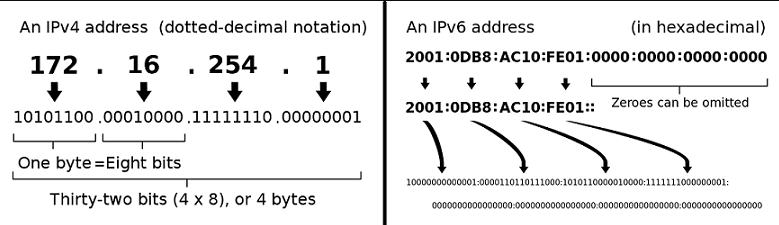
  - IP 주소는 호스트마다 하나씩 있으며 고유한 특성을 가지고있다.
     > 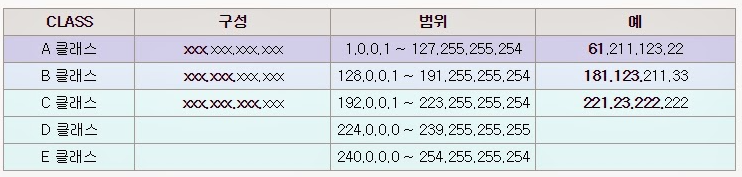

 #### 포트번호 (송/수신 측)
  - 포트 번호는 통신을 사용하는 어플리케이션을 식별하는 번호이다.
  - 포트는 65535까지 사용할 수 있지만, 사용자가 사용할 수 있는 포트는 1024 ~ 65535까지 사용할 수 있다.
  - TCP/IP port
    
    <image src='image-147.png' width='30%'/>


#### 소켓의 통신 과정
  - 아래 그림은 연결 지향형 소켓 (TCP)의 예시이다.
     <br><br><br>
    >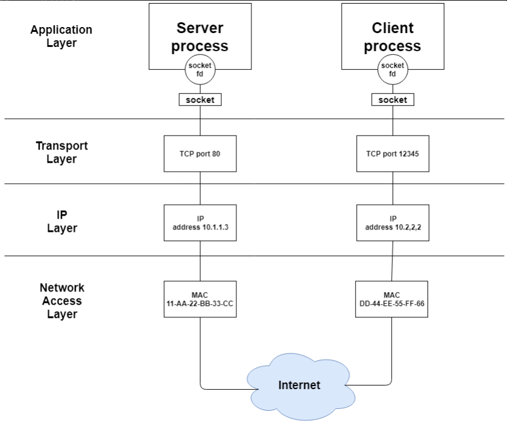
  - 아래 그림은 연결 지향형 소켓 (TCP)의 예시이다.
    >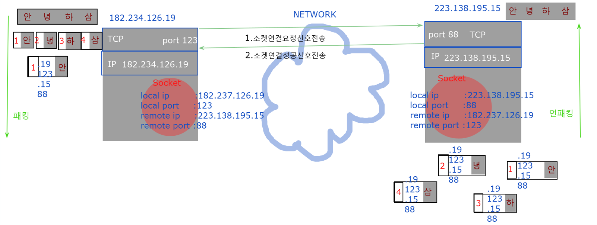

  - 프로그램과소캣 ,TCP/IP의관계
    >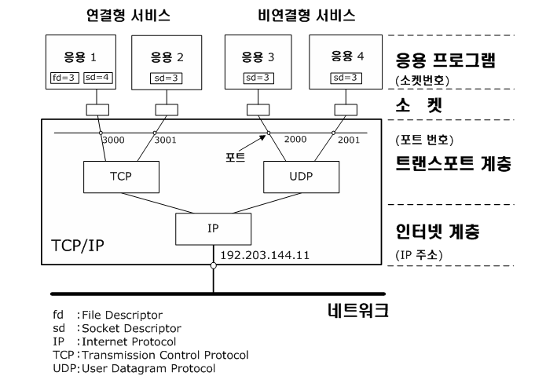
  - protocol data and headers<br>
    >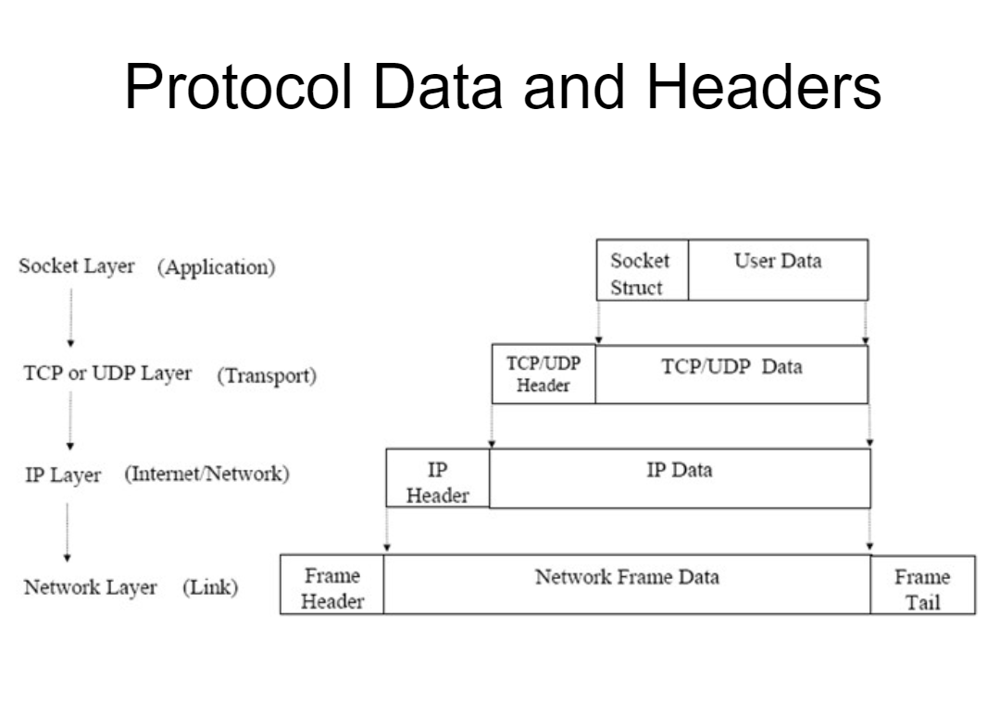
#### 소켓(TCP)과 서버소켓을 사용한  자바프로그래밍 
  - TCP(Transmission Control Protocol)은 연결지향적 프로토콜을 말한다.<br>
     연결지향 프로토콜이란 클라이언트와 서버가 연결된 상태에서 데이터를 주고받는 프로토콜을 의미한다. 
  - 클라이언트가 서버에게 연결을 요청하고, 서버가 그 요청을 수락하면 통신선로가 고정되고,<br>
     모든 데이터는 그 고정된 통신선로를 통해서 순차적으로 전달된다.<br><br> 
	 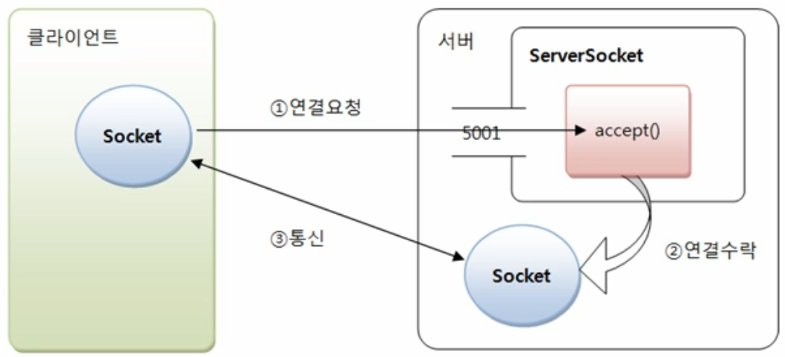
  - 이러한 TCP서버의 역할은 두 가지로 볼 수 있는데 하나는 클라이언트가 연결요청을 하면 연결을 수락하는 것이고,<br>
    다른 하나는 연결된 클라이언트와 통신하는 것이다. 
  - 자바에서는 이 역할을 대신 해주는 클래스를 따로 제공하고 있는데 그것이 바로 소켓(Socket)이란 클래스이다.
  - 소켓(socket)은 프로세스 간 통신에 사용되는 양쪽 끝 단을 의미한다.<br>쉽게 말해서 프로그램은 다른컴퓨터에 있는 프로그램과 통신하기 위해 바로 이 소켓을 이용하는데 ,<br>프로그램이 통신하기 위해 소프트웨어로 작성된 통신의 접속점이라고 할 수 있는 것이다.<br>때문에 만약 서버와, 그 서버에 접속하고자 하는 클라이언트가 있다고 한다면 <br>둘에게 모두 이 소켓이 존재해야 둘 사이의 소통이 가능하다.
 - **InetAddress (Internet Address)**
   > java.net.InetAddress 클래스는 Java에서 IP 주소를 나타내는 클래스입니다.<br> 
   이 클래스는 호스트 이름과 호스트 주소를 반환하는 중요한 메서드를 제공합니다.
   - 호스트 이름
      > 인터넷에 연결된 컴퓨터나 기기에 지정된 이름을 나타냅니다.<br> 
        예를 들면, "www.google.com"은 Google의 웹 서버의 호스트 이름입니다.
   - 호스트 주소
      >컴퓨터나 기기의 IP 주소를 나타냅니다. 예를 들면, "172.217.0.4"는 Google의 웹 서버의 IP 주소 중 하나일 수 있습니다.
   - InetAddress 클래스의 주요 메서드
   	  >getHostName(): 현재 InetAddress 객체의 호스트 이름을 반환합니다.<br>
	   getHostAddress(): 현재 InetAddress 객체의 IP 주소를 반환합니다.<br>
	   getByName(String host): 주어진 호스트 이름 또는 IP 주소에 대한 InetAddress 객체를 반환합니다.<br>
	   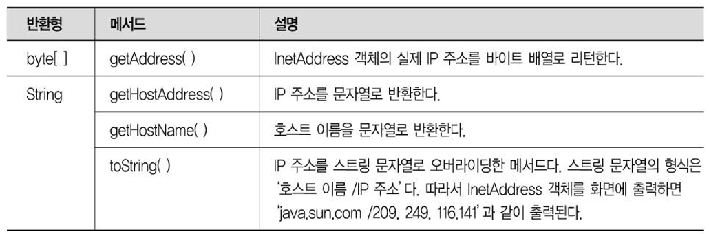
  
   - InetAddress 클래스사용예
		```java
			package client;
			import java.net.InetAddress;
			public class InetAddressMain {
				public static void main(String[] args) throws Exception {
					System.out.println("----local address(IP)----");
					InetAddress localAddress = InetAddress.getLocalHost();
					System.out.println("local host name:"+localAddress.getHostName());
					System.out.println("local host address:"+localAddress.getHostAddress());
					System.out.println("----remote address(IP)----");
					InetAddress remoteAddress = InetAddress.getByName("www.aladin.co.kr");
					System.out.println("remote host name:"+remoteAddress.getHostName());
					System.out.println("remote host address:"+remoteAddress.getHostAddress());
					InetAddress[] remoteAddresses=InetAddress.getAllByName("www.naver.com");
					for (InetAddress inetAddress : remoteAddresses) {
						System.out.println(inetAddress);
					}
				}
			}
		```

 - **Server Socket** (서버 소켓)​​
	>서버 소켓은 말그대로 서버프로그램에서만 사용되는 소켓이다.<br> 
	서버소켓은 클라이언트로부터 연결요청이 오기를 기다렸다가 연결 요청이 오면 <br>
	클라이언트와 연결을 맺고 다른 소켓을 만드는 일을 한다.<br> 
	서버 클래스에서 생성해주면 되는데 생성방법은 다음과 같다. 

	 ```java
		ServerSocket serverSocket = new ServerSocket(포트번호);
		Socket socket = serverSocket.accept();  //클라이언트로부터 연결요청이 오면 연결을 맺고 클라이언트 소켓을 생성해 리턴한다. 
	 ```
     >**accept()메소드**는 클라이언트가 연결 요청하기 전까지 블로킹 되는데, 블로킹이란 스레드가 대기상태가 된다는 뜻이다.<br> 그렇기 때문에 클라이언트가 연결요청을 하면 accept()는 클라이언트와 소통할 소켓을 만들어서 리턴하게된다. 

 - **Client Socket(클라이언트 소켓)**
     >클라이언트 소켓은 기대할 필요가 없기 때문에 바로 클라이언트 소켓을 생성한다.<br>
	 >클라이언트 프로그램에서 클라이언트 소켓은 서버 프로그램으로 연결요청을 하는 것과 
	 >데이터 전송을 하는 일을 한다. 

	 ```java
	    Socket socket = new Socket(서버 아이피번호, 서버 포트번호);
	 ```
     >이 때 서버 아이피 번호는 서버 클래스가 존재하는 컴퓨터의 아이피 번호가 필요하고,<br> 
	 >서버 포트 번호는 위의 서버소켓에서 등록해 놓은 포트번호를 적어주어야 통신이 가능하게된다. 

	```java
	package server;
	import java.net.InetAddress;
	import java.net.ServerSocket;
	import java.net.Socket;

	public class ServerSocketMain {

		public static void main(String[] args)throws Exception {
			/*
			* ServerSocket 클래스  
			*   - 클라이언트의 소켓연결요청신호를 받아서
			*     Socket을 생성하는 클래스
			*   - 서버컴퓨터의 포트(0~65535)중의 하나를 점유하고
			*     ServerSocket을 생성한다.    
			*/
			ServerSocket serverSocket=new ServerSocket(3333);
			/*
			public Socket accept() throws IOException;
				- Listens for a connection to be made to this socket and accepts it. 
					A. 3333번포트를열고 클라이언트의 소켓연결요청을 무한하게 대기한다.
						(쓰레드블록킹)
					B. 소켓연결요청이오면 소켓을 생성한다.(반환한다)
				- The method blocks until a connection is made
					A. 소켓이생성될때까지 쓰레드블록킹
				
			*/
			while(true) {
				System.out.println("0. 3333번포트를열고 클라이언트의 소켓연결요청을  처리하기위해 쓰레드가 무한하게 대기한다.");
				Socket socket=serverSocket.accept();
				System.out.println("1.클라이언트의 소켓연결요청을 처리한후 소켓반환");
				System.out.println("2 클라이언트와연결된 서버쪽 소켓:"+socket);
				System.out.println("******************************************");
				InetAddress remoteAddress = socket.getInetAddress();
				InetAddress localAddress=socket.getLocalAddress();
				System.out.println("remote ip   :"+remoteAddress.getHostAddress());
				System.out.println("remote port :"+socket.getPort());
				System.out.println("local ip   :"+localAddress.getHostAddress());
				System.out.println("remote port :"+socket.getLocalPort());
				System.out.println("******************************************");
				System.out.println("3.클라이언트와연결된 서버쪽 소켓 닫기");
				socket.close();
			}
		}

	}
	```

	```java
	//클라이언트 클래스
	package client;

	import java.net.InetAddress;
	import java.net.InterfaceAddress;
	import java.net.Socket;

	public class ClientSocketMain {

		public static void main(String[] args) throws Exception{
			/*
			Socket socket=
			new Socket("www.naver.com",80);
			System.out.println(socket);
			*/
			Socket socket=
			new Socket("192.168.15.31",8888);
			
			System.out.println(">> client 쪽 socket:"+socket);
			InetAddress remoteAddress = socket.getInetAddress();
			InetAddress localAddress=socket.getLocalAddress();
			
			System.out.println("remote ip   :"+remoteAddress.getHostAddress());
			System.out.println("remote port :"+socket.getPort());
			System.out.println("local ip   :"+localAddress.getHostAddress());
			System.out.println("remote port :"+socket.getLocalPort());
		}
	}

	```


#### DayTimeServer & DayTimeClient

```java
package server;

import java.awt.BorderLayout;
import java.awt.EventQueue;
import java.awt.Font;
import java.io.OutputStreamWriter;
import java.io.PrintWriter;
import java.net.ServerSocket;
import java.net.Socket;
import java.util.Date;

import javax.swing.JFrame;
import javax.swing.JPanel;
import javax.swing.JScrollPane;
import javax.swing.JTextArea;
import javax.swing.border.EmptyBorder;

public class DayTimeServerFrame extends JFrame {

	private JPanel contentPane;
	private JTextArea displayTA;

	private JScrollPane scrollPane;

	/**
	 * Launch the application.
	 */
	public static void main(String[] args) {
		DayTimeServerFrame frame = new DayTimeServerFrame();
		frame.setVisible(true);
	}

	/**
	 * Create the frame.
	 */
	public DayTimeServerFrame() {
		setTitle("DayTimeServer");
		setDefaultCloseOperation(JFrame.EXIT_ON_CLOSE);
		setBounds(100, 100, 572, 297);
		contentPane = new JPanel();
		contentPane.setBorder(new EmptyBorder(5, 5, 5, 5));
		contentPane.setLayout(new BorderLayout(0, 0));
		setContentPane(contentPane);

		scrollPane = new JScrollPane();
		contentPane.add(scrollPane, BorderLayout.CENTER);

		displayTA = new JTextArea();
		displayTA.setFont(new Font("나눔고딕 ExtraBold", Font.PLAIN, 16));
		displayTA.setEditable(false);
		scrollPane.setViewportView(displayTA);
		/************* 서버쓰레드시작 ******************/
		DayTimeServerThread dayTimeServerThread = new DayTimeServerThread();
		dayTimeServerThread.start();
		/*********************************************/

	}// 생성자끝
	public void displayLog(String log) {
		scrollPane.getVerticalScrollBar().setValue(scrollPane.getVerticalScrollBar().getMaximum());
		displayTA.append(log+"\n");
	}
	
	/*********************DayTimeServerThread[inner class]***********************/
	/*
	0.DayTimeServerThread:ServerSocket생성(8000)
	1.DayTimeServerThread:클라이언트연결요청대기(쓰레드대기)
	2.DayTimeServerThread:클라이언트와연결된서버쪽 소켓생성
	3.DayTimeServerThread:소켓으로부터 OutputStream생성
	4.DayTimeServerThread:소켓으로부터 생성된OutputStream에서버시간쓰기
	5.DayTimeServerThread:클라이언트와연결된서버쪽 소켓닫기
	*/
	public class DayTimeServerThread extends Thread {
		@Override
		public void run() {
			try {
				displayLog("0.DayTimeServerThread:ServerSocket생성(8000)");
				ServerSocket serverSocket=new ServerSocket(8000);
				while (true) {
					displayLog("1.DayTimeServerThread:클라이언트연결요청대기(쓰레드대기)");
					Socket socket=serverSocket.accept();
					displayLog("2.DayTimeServerThread:클라이언트와연결된서버쪽 소켓생성"+socket);
					String serverIP = socket.getLocalAddress().getHostAddress();
					PrintWriter out=
							new PrintWriter(
									new OutputStreamWriter(
											socket.getOutputStream()));
					displayLog("3.DayTimeServerThread:소켓으로부터 OutputStream생성");
					Date serverDate=new Date();
					String serverTimeStr = serverDate.toLocaleString();
					out.println("["+serverIP+"]"+serverTimeStr);
					out.flush();
					displayLog("4.DayTimeServerThread:소켓으로부터 생성된OutputStream에서버시간쓰기");
					socket.close();
					displayLog("5.DayTimeServerThread:클라이언트와연결된서버쪽 소켓닫기");
				}
			}catch (Exception e) {
				System.out.println(e.getMessage());
			}
			
		}
	}
	/****************************************************************/

}
package client;


public class DayTimeClientFrame extends JFrame {

	private JPanel contentPane;
	private JButton requestServerTimeButton;
	private JLabel timeDispayLabel;

	/**
	 * Launch the application.
	 */
	public static void main(String[] args) {
		EventQueue.invokeLater(new Runnable() {
			public void run() {
				try {
					DayTimeClientFrame frame = new DayTimeClientFrame();
					frame.setVisible(true);
				} catch (Exception e) {
					e.printStackTrace();
				}
			}
		});
	}

	/**
	 * Create the frame.
	 */
	public DayTimeClientFrame() {
		setTitle("DayTimeClient");
		setDefaultCloseOperation(JFrame.EXIT_ON_CLOSE);
		setBounds(100, 100, 450, 300);
		contentPane = new JPanel();
		contentPane.setBorder(new EmptyBorder(5, 5, 5, 5));

		setContentPane(contentPane);
		contentPane.setLayout(new BorderLayout(0, 0));
		
		requestServerTimeButton = new JButton("Request Server Time");
		requestServerTimeButton.addActionListener(new ActionListener() {
			public void actionPerformed(ActionEvent e) {
				/******************************************/
				try {
					/*
					 * 1.Socket생성
					 */
					Socket socket=
							new Socket("192.168.15.31",8000);
					/*
					 * 2.Socket으로부터 InputStream얻기
					 *    - InputStream얻기
					 *    - InputStream[byte stream] 을 Reader[character stream]로 변경하는
					 * 			브릿지스트림(InputStreamReader) 을사용해서 변경
					 */
					InputStream in=socket.getInputStream();
					InputStreamReader  isr=new InputStreamReader(in,"UTF-8");
					BufferedReader br=new BufferedReader(isr);
					String serverTime=br.readLine();
					//System.out.println(serverTime);
					timeDispayLabel.setText(serverTime);
					socket.close();
					
				}catch (Exception e1) {
					System.out.println(e1.getMessage());
				}
				/******************************************/
			}
		});
		contentPane.add(requestServerTimeButton, BorderLayout.SOUTH);
		
		timeDispayLabel = new JLabel("12:00");
		timeDispayLabel.setForeground(Color.BLUE);
		timeDispayLabel.setHorizontalAlignment(SwingConstants.CENTER);
		timeDispayLabel.setFont(new Font("굴림", Font.BOLD, 20));
		contentPane.add(timeDispayLabel, BorderLayout.CENTER);
	}
}
``` 

#### EchoServer & EchoClient


 > 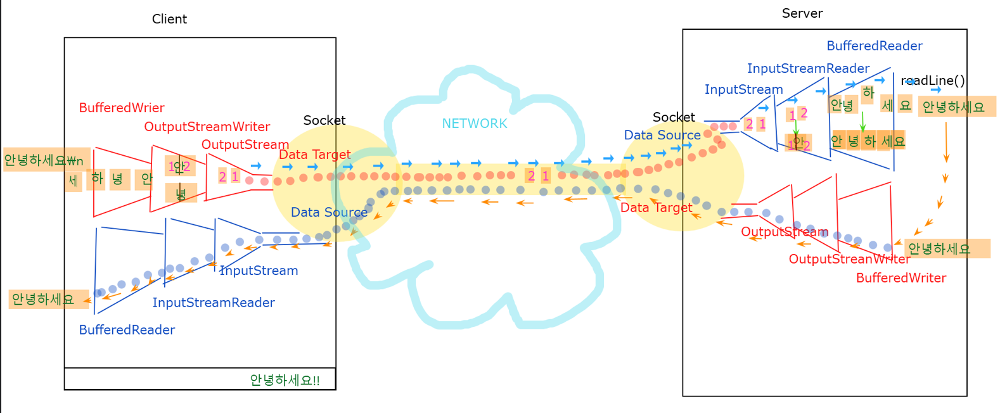

```java
package server;
public class EchoServerFrame extends JFrame {
	private JPanel contentPane;
	private JScrollPane scrollPane;
	private JTextArea displayTA;
	

	/**
	 * Create the frame.
	 */
	public EchoServerFrame() {
		setTitle("EchoServer");
		setDefaultCloseOperation(JFrame.EXIT_ON_CLOSE);
		setBounds(100, 100, 567, 408);
		contentPane = new JPanel();
		contentPane.setBorder(new EmptyBorder(5, 5, 5, 5));
		contentPane.setLayout(new BorderLayout(0, 0));
		setContentPane(contentPane);

		scrollPane = new JScrollPane();
		contentPane.add(scrollPane, BorderLayout.CENTER);

		displayTA = new JTextArea();
		displayTA.setFont(new Font("나눔고딕코딩", Font.BOLD, 16));
		scrollPane.setViewportView(displayTA);
		/********* EchoServerThread start ********/
		EchoServerThread echoServerThread=new EchoServerThread();
		echoServerThread.start();
		/*****************************************/
		
	}//생성자끝
	public void displayLog(String log) {
		displayTA.append(log+"\n");
		scrollPane.getVerticalScrollBar().setValue(scrollPane.getVerticalScrollBar().getMaximum());
	}
	/********************EchoServerThread start[member inner class] **************************/
	/*
	 0.EchoServerThread:ServerSocket생성(9999)
     1.EchoServerThread:클라이언드연결요청쓰레드가대기
	 2.EchoServerThread:클라이언드와연결된 서버쪽소켓
	 3.EchoServerThread:서버쪽소켓으로부터 입력,출력스트림생성
	 4.EchoServerThread:입력스트림을사용해서 클라이언트전송데이타읽기
	 5.EchoServerThread:클라이언트로부터읽은데이타
	 6.EchoServerThread:클라이언트에 데이타쓰기
	 7.EchoServerThread:클라이언드와연결된 서버쪽소켓닫기
	*/ 
	public class EchoServerThread extends Thread{
		@Override
		public void run() {
			try {
				displayLog("EchoServer start....");
				displayLog("0.EchoServerThread:ServerSocket생성(9999)");
				ServerSocket serverSocket=new ServerSocket(9999);
				while(true) {
					displayLog("1.EchoServerThread:클라이언드연결요청쓰레드가대기");
					Socket socket=serverSocket.accept();
					displayLog("2.EchoServerThread:클라이언드와연결된 서버쪽소켓:"+socket);
					PrintWriter out=
							new PrintWriter(
									new OutputStreamWriter(
											socket.getOutputStream()));
					BufferedReader in=
							new BufferedReader(
									new InputStreamReader(
											socket.getInputStream()));
					displayLog("3.EchoServerThread:서버쪽소켓으로부터 입력,출력스트림생성");
					String echoStr = in.readLine();
					displayLog("4.EchoServerThread:입력스트림을사용해서 클라이언트전송데이타읽기");
					displayLog("5.EchoServerThread:클라이언트로부터읽은데이타:["+socket.getInetAddress().getHostAddress()+"("+socket.getPort()+")]"+echoStr);
					out.println("Server:"+echoStr);
					out.flush();
					displayLog("6.EchoServerThread:클라이언트에 데이타쓰기");
					socket.close();
					displayLog("7.EchoServerThread:클라이언드와연결된 서버쪽소켓닫기");
					
				}
			}catch (Exception e) {
				System.out.println(e.getMessage());
				
			}
			
		}
	}
	/********************EchoServerThread end**************************/	
	public static void main(String[] args) {
			EchoServerFrame frame = new EchoServerFrame();
			frame.setVisible(true);
	}
}

package client;
public class EchoClientFrame extends JFrame {

	private JPanel contentPane;
	private JTextField echoTF;
	private JScrollPane scrollPane;
	private JTextArea displayTA;

	/**
	 * Launch the application.
	 */
	public static void main(String[] args) {
		EventQueue.invokeLater(new Runnable() {
			public void run() {
				try {
					EchoClientFrame frame = new EchoClientFrame();
					frame.setVisible(true);
					frame.echoTF.requestFocus();
				} catch (Exception e) {
					e.printStackTrace();
				}
			}
		});
	}

	/**
	 * Create the frame.
	 */
	public EchoClientFrame() {
		setTitle("EchoClientFrame");
		setDefaultCloseOperation(JFrame.EXIT_ON_CLOSE);
		setBounds(100, 100, 965, 332);
		contentPane = new JPanel();
		contentPane.setBorder(new EmptyBorder(5, 5, 5, 5));
		contentPane.setLayout(new BorderLayout(0, 0));
		setContentPane(contentPane);
		
		echoTF = new JTextField();
		echoTF.addActionListener(new ActionListener() {
			public void actionPerformed(ActionEvent e) {
				
				/**************************************/
				try {
					String echoStr=echoTF.getText();
					if(echoStr==null || echoStr.trim().equals("")) {
						echoTF.setText("");
						echoTF.requestFocus();
						return;
					} 
					echoTF.setText("");
					echoTF.requestFocus();
					
					/*
					 * 1.Socket생성
					 */
					Socket socket=new Socket("192.168.15.31",9999);	
					/*
					 * 2.서버로문자데이타쓰기
					 * 		- OutputStream 얻기
					 * 		- OutputStream(byte) --> Writer(char)로 변경(OutputStreamWriter)
					 */
					OutputStream out = socket.getOutputStream();
					OutputStreamWriter osw=new OutputStreamWriter(out,"UTF-8");
					PrintWriter pw=new PrintWriter(osw);
					pw.println(echoStr);
					pw.flush();
					
					
					/*
					 * 3.서버에서 전송되는 데이타 읽기
					 * 		- InputStream 얻기
					 * 		- InputStream(byte) --> Reader(char)로 변경
					 */
					InputStream in=socket.getInputStream();
					InputStreamReader isr=new InputStreamReader(in,"UTF-8");
					BufferedReader br=new BufferedReader(isr);
					String serverEchoStr=br.readLine();
					
					displayTA.append(serverEchoStr+"\n");
					
					
				}catch (Exception e1) {
					System.out.println(e1.getMessage());
				}
				/*************************************/
			}
		});
		echoTF.setFont(new Font("D2Coding", Font.BOLD, 18));
		
		contentPane.add(echoTF, BorderLayout.SOUTH);
		echoTF.setColumns(10);
		
		scrollPane = new JScrollPane();
		contentPane.add(scrollPane, BorderLayout.CENTER);
		
		displayTA = new JTextArea();
		displayTA.setFont(new Font("D2Coding", Font.BOLD, 17));
		displayTA.setEditable(false);
		scrollPane.setViewportView(displayTA);
		echoTF.requestFocus();
		
		
		
	}
}
  ```

#### ChatServer & ChatClient

 > 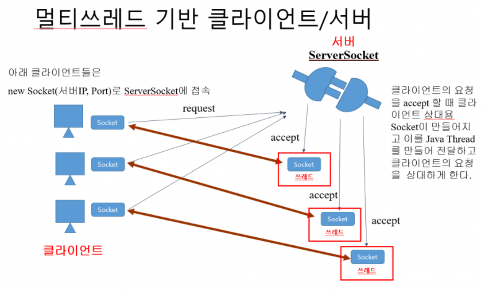
 > 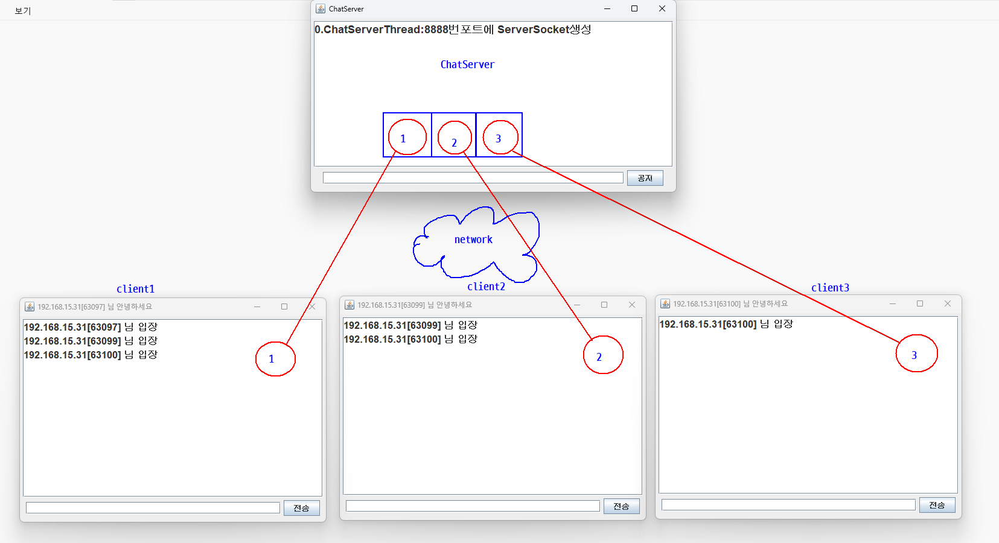
