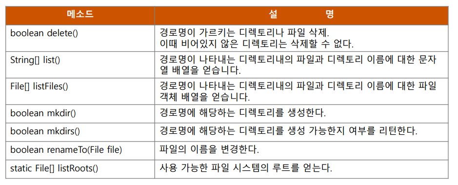

 

# 자바 입출력 Programming
 
 
 
 

 

### **프로그램 입/출력 정의**

• **입력(Input)**

  – 데이타소스(키보드, 파일, 메모리, 네트워크 등)로부터 데이터 읽기

• **출력(Output)**

  – 데이타타겟(콘솔, 파일, 메모리, 네트워크 등)에 데이터 쓰기

 

 

### **Stream 특징**

- **흐르는 물! 또는 빨대 등에 비유될 수 있다.**

  - 목적지로부터 일련의 데이터(바이트)를 읽고, 쓰기 위한 중간자 역할 용도

  - 입출력 대상이나 목적지에 상관없이 스트림에서 데이터를 읽고,
쓰기만 하면 된다. 
  - Stream API는 입출력의 일관성 제공

- **스트림은 단방향이다.**

  - Stream API는 데이터 읽기 용도의 입력스트림 클래스들과 쓰기 용도의 출력스트림 클래스들을 별도로 제공한다

- **스트림은 FIFO(First In First Out) 구조이다.**

  - 먼저 출력한 데이터를 먼저 읽어 들인다

 

 

 

### **스트림(Stream) 특징**

 

 

### **스트림(Stream) 분류**

- **데이터 목적지에 따라 여러 종류의 스트림 클래스 제공된다.**
  - 입출력 프로그램을 작성하는 개발자는 데이터 목적지에 맞는 스트림 객체를 생성하고 
   메소드를 이용하여 읽기/쓰기를 처리 하면 된다.

- **입출력 방향에 따른 분류**

  - 입력스트림(InputStream, FileInputStream 등)

  - 출력스트림(OutputStream, FileOutputStream 등)

- **입출력 데이터 종류에 따른 분류**

  - 바이트(byte)스트림: 데이터를 원시의 바이트 단위 그대로 읽고 쓰기

  - 문자(character)스트림: 바이트 데이터를 문자로 가공(인코딩/디코딩)

 

 

### **스트림(Stream) 구분**

 - **입출력 스트림의 용도에 따른 분류**

   - 노드 (Node)스트림: 단순한 입출력만 담당

   - 필터(Filter)스트림: 스트림의 데이터를 조작

 
 

 

### **스트림 APIs(java.io.*)**

 - 바이트(byte) 스트림 : 1바이트 단위 입출력
  

 

### ** 바이트 스트림(InputStream/OutputStream)**

- **데이터를 1바이트 단위로 일고, 쓰기 위한 스트림 클래스**

- **추상클래스로 존재하는 InputStream/OutputStream 이하 여러 개의 서브클래스 존재**

- **입력(InputStream) 기본 메소드**

  - int read();

  - int read(byte[] buffer);

  - int read(byte[] buffer, int offset, int length);

- **출력(OutputStream) 기본 메소드**

  - void write(int c);

  - void write(byte[] buffer);

  - void write(byte[] buffer, int offset, int length);

 

 

### **InputStream 클래스 상세**

 - **InputStream 클래스는 입력스트림(바이트)의 최상위 추상 클래스**

 - **추상이기 때문에 new 키워드를 통해서 객체를 생성할 수 없으나 입력에 관련된 기본적인 메소드를 정의하고 있다.**

 

 

### **OutputStream 클래스 상세**

- **OutputStream 클래스는 출력스트림(바이트)의 최상위 추상 클래스**

- **추상이기 때문에 new 키워드를 통해서 객체를 생성할 수 없으나 출력에 관련된 기본적인 메소드를 정의하고 있다.**

 
 

 

### **InputStream 확장 클래스들**

- **입력 스트림**

 

 

### **OutputStream 확장 클래스들**

 - **출력 스트림**

 

 

### **FileInputStream 클래스 상세**

- **시스템의 파일로부터 순차적인 방법으로 데이터를 한바이트씩 읽어올 수 있다.**

- **지정한 파일이 존재하지 않을 경우 IOException이 발생한다.**

- **InputStream의 서브클래스로서 InputStream의 기본적인 메소드를 재사용하거나, 재정의하여 사용하고 있다.**

 

 

### **File 클래스 상세**

 - **파일 및 디렉토리에 대한 기본 정보(크기, 변경날짜 등)를 제공하거나,관리할 수 있는 기능만 제공할 뿐,**
   **파일 내용에 대한 접근은 제공하지 않는다.**

 - **파일의 복사, 이름 변경 등의 조작을 할 경우에만 사용되며, 파일 데이터를 입출력 하기 위해서는** 
   **File 입출력 스트림이나 RandomAccessFile 로 해줘야 한다.**

 

 

### **File 클래스 상세**

 - **File 클래스가 제공하는 주요 메소드**

 

 

### **File 클래스 상세**

- **File 클래스가 제공하는 주요 메소드**

 

 

### **File 클래스 상세**

- **File 클래스가 제공하는 주요 메소드**

 

 

### **FileOutputStream 클래스 상세**

 - **바이트 데이터를 파일에 저장하기 위해 사용되는 스트림 클래스이다.**

 - **지정한 파일이 이미 존재할 경우 그 파일에 덮어쓰게 된다.**

 - **OutputStream의 서브클래스로서 OutputStream의 기본적인 메소드를 재사용하거나, 재정의하여 사용하고 있다.**

 

 

### **FilterInputStream 클래스**

 - **일반 노드 스트림은 바이트 단위로 데이터를 읽고, 쓰는 기능만 제공**

 - **기존 노드 스트림에 특정 기능을 가진 필터 스트림을 연결해서 원하는 동작을지원.**
   **(효율성, 다양한 타입으로 읽고 쓰기, 다중연결, 되돌림, 라인넘버링 등)**

 

 

### **DataInputStream/DataOutputStream 클래스**

 - **바이트 단위의 입출력 기능뿐만 아니라, 자바에서 제공하는 기본 데이**
   **터 타입별로 직접 읽고 쓸 수 있는 기능을 제공하는 필터스트림**

 - **DataInput, DataOutput 인터페이스 구현 클래스**

 - **생성자 및 주요 메소드**

   - **API Document 참조**

 
 
 

 

BufferedInputStream/OutputStream 클래스

• **입출력의 효율성을 높이기 위해 버퍼(바이트 배열)를 내장한 필터 스트림 클**

**래스이다.**

• **BufferedInputStream을 사용하면 읽기 동작이 있을 때 마다 목적지로부터**

**한바이트씩 읽는 것이 아니라, 미리 버퍼(512byte)에 담아논 데이터를 읽어**

**들이므로 효율적이다.**

• **BufferedOutputStream 클래스는 데이터를 출력할 때, 먼저 내장한 내부 버**

**퍼에 출력이 되고, 버퍼가 꽉 차거나, flush(), close() 메소드가 호출될 때 내**

**부 버퍼의 내용이 출력되게 된다.**

**생성자/메소드**

**설**

**명**

BufferedInputStream(InputStre 주어진 바이트 입력 스트림에 대한 BufferedInputStream 객체 생성

am in) 내부 버퍼의 크기는 디폴트 512 바이트로 설정된다.

BufferedInputStream(InputStre 주어진 바이트 입력 스트림에 대한 BufferedInputStream 객체 생성

am in, int bufferSize) 내부 버퍼의 크기는 주어진 bufferSize로 설정된다.

BufferedOutputStream(Output 주어진 바이트 출력 스트림에 대한 BufferedOutputStream 객체 생성

Stream out) 내부 버퍼의 크기는 디폴트 512 바이트로 설정된다.

BufferedOutputStream(Output 내부 버퍼의 크기는 주어진 bufferSize로 설정된다.

Stream out, int bufferSize)

**-21-**

 

PrintStream 클래스

• **System.out을 통해서 도스 콘솔(표준출력)로 출력하기 위해 주로 사**

**용된다.**

• **디버깅용으로 사용**

• **기본 데이터 타입들을 OS의 문자 인코딩 방식에 맞춰 텍스트 형식으**

**로 변환하여 출력하는 여러 종류의 메소드를 제공하고 있다.**

**-22-**

 

문자 스트림(Reader/Writer)

• **문자(character) 스트림: 2바이트 단위 문자 인코딩/디코딩 처리**

BufferedReader

CharArrayReader

InputStreamReader

FilterReader

LineNumberReader

FileReader

**<<abstract>>**

**Reader**

PushbackReader

PipedReader

StringReader

BufferedWriter

CharArrayWriter

OutputStreamWriter

FilterWriter

FileWriter

**<<abstract>>**

**Writer**

PipedWriter

StringWriter

PrintWriter

**-23-**

 

문자 스트림(Reader/Writer)

• **특별한 문자 인코딩에 상관없이 프로그램 작성 가능**

– 읽기: 바이트 입력스트림으로 부터 바이트를 읽혀들여 유니코드에 해당

하는 문자로 변환

– 쓰기: 인코딩에 따라 문자들을 바이트로 변환하고, 바이트 출력 스트림에

쓰기

• **Reader/Writer(추상클래스) 이하 여러 개의 서브클래스 존재**

• **입력(Reader)**

– int read();

– int read(char[] buffer);

– int read(char[] buffer, int offset, int length);

• **출력(Writer)**

– void write(int c);

– void write(char[] buffer);

– void write(char[] buffer, int offset, int length);

**-24-**

 

Reader 확장 클래스들

• **입력 스트림**

**문자 스트림 클래스**

**용**

**도**

Reader

문자 입력 스트림을 위한 추상클래스

BufferedReader

LineNumberReader

CharArrayReader

InputStreamReader

FileReader

문자 버퍼 입력, 라인 해석 가능 클래스

문자 입력 시, 라인 번호를 유지

문자 배열에서 읽어 들임

바이트 스트림을 문자 스트림으로 변환해 주는 브리지 스트림

파일에서 바이트를 읽어 들여 문자 스트림으로 변환

필터 적용 문자 입력을 위한 추상클래스

읽어들인 문자를 되돌림

FilterReader

PushbackReader

PipedReader

PipedWriter에서 읽어 들임

StringReader

문자열에서 읽어 들임

**-25-**

 

Writer 확장 클래스들

• **출력 스트림**

**문자 스트림 클래스**

**용**

**도**

Writer

문자 출력 스트림을 위한 추상클래스

문자 스트림에 버퍼 출력

BufferedWriter

CharArrayWriter

FilterWriter

문자 스트림에 문자 배열 출력

필터 적용 문자 출력을 위한 추상클래스

문자스트림을 바이트 스트림으로 변환해 주는 브리지 스트림

문자스트림을 바이트 파일로 변환

Writer에 값과 객체를 프린트

OutputStreamWriter

FileWriter

PrintWriter

PipedWriter

StringWriter

PipedReader에 출력

문자열 출력

**-26-**

