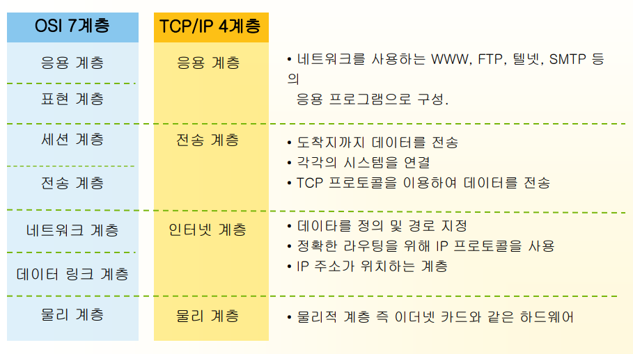
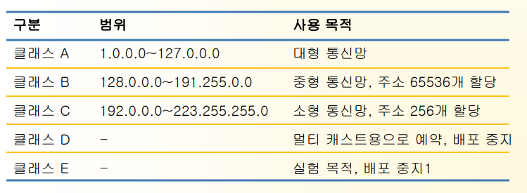
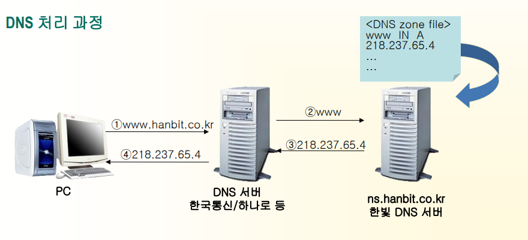
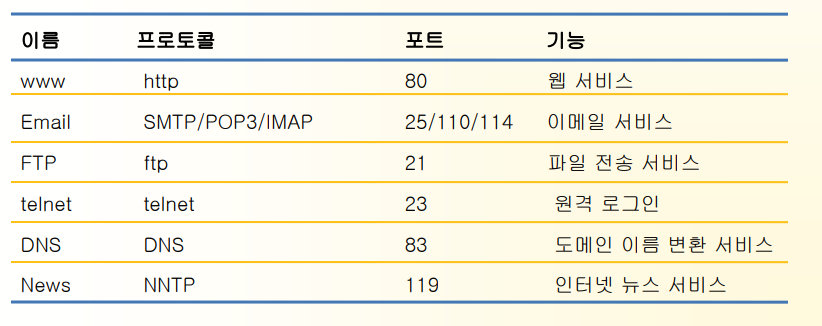

 

# 인 터 넷 과 웹
 
 
 
 
 
 
 

 

## 인터넷과 웹 프로그래밍>> 네트워크

### **TCP/IP**

 

 

## 인터넷과 웹 프로그래밍>> 네트워크

### **IP** 주소
 - 네트워크에 연결된 컴퓨터를 구분하기 위해 사용
 - 4개로 구분된 10진수를 사용함.
 - 사설 IP는 NAT(Network Access Translator) 등을 이용해서 인터넷 접속 시 
   공인 IP로 매핑됨(일부 인터넷 서비스에 제약이 있을 수 있음)
 - IP 주소 부족 문제를 해결하기 위해 IPV6를 사용.

 

 

## 인터넷과 웹 프로그래밍>> 네트워크

### **도메인 이름**
- IP 주소를 알기 쉬운 이름으로 바꾼 것
- DNS(Domain Name System) 서버가 필요함.

#### **DNS** 처리 과정

 

 

## 인터넷과 웹 프로그래밍>> 인터넷과 웹 서버 서비스

### **인터넷과 www**
- 인터넷은 TCP/IP 기반의 네트워크가 전세계적으로 확대되어 하나로 연결된
  ‘네트워크의 네트워크’
- 인터넷 = www가 아님. www는 인터넷 기반의 서비스 중 하나

 

 

인터넷과 웹 프로그래밍>>인터넷과 웹 서버 서비스

웹 서버와 클라이언트

**•** 서버: 네트워크에서 서비스를 제공하는 컴퓨터

**•** 클라이언트: 네트워크에서 서비스를 제공받는 컴퓨터

최근 클라이언트와 서버의 하드웨어적인 구분이 없어지고 있음

운영체제 지원

폴더공유

운영체제 지원

WWW 클라이언트

웹 브라우저

파일 서버

프린터

프린터 서버

클라이언트

웹 서버 S/W

웹 서버

 

인터넷과 웹 프로그래밍>>인터넷과 웹 서버 서비스

**HTTP(Hyper Text Tranfer Protocol)**

**•**

**•**

**•**

**•**

프로토콜: 네트워크에 연결된 컴퓨터가 서로 통신(대화)하기 위한 규약

HTTP는 www 서비스를 위한 통신 규약

웹 서버와 클라이언트는 HTTP를 이용해 통신

HTTP 동작 원리

 

인터넷과 웹 프로그래밍>>웹 프로그래밍 기술

**HTML**과 클라이언트 스크립트 기술

**•**

**•**

**•**

HTML: www 서비스를 표현하기 위해 사용하는 언어

www를 통해 서비스하는 모든 내용은 HTML로 표현되어야 함

HTML은 텍스트 파일로 정적인 정보만 처리 가능

à 동적으로 변하는 정보를 처리할 수 없음)

**•**

동적인 컨텐츠 처리하기 위해 CGI, Fast CGI, PHP, ASP, JSP 등의 기술이 사용

클라이언트 스크립트

☼ 자바스크립트가 대표적.

☼ 웹 브라우저가 스크립트 해석의 주체

☼ 웹 브라우저 핸들링은 가능하지만 서버 연동은 불가능

 

인터넷과 웹 프로그래밍>>웹 프로그래밍 기술

CGI(Common Gatewary Interface)

**•**

**•**

초기 웹 프로그래밍에 사용된 기술

프로세스 단위로 실행되기 때문에 사용자가 증가하면 급격히 성능 저하

**a.cgi**

http://xxx.xxx.xxx/cgi-bin/a.cgi

프로세스

프로세스

http://xxx.xxx.xxx/cgi-bin/a.cgi

**a.cgi**

사용자 증가에 따른

시스템 성능의 급격한 저하

 

인터넷과 웹 프로그래밍>>웹 프로그래밍 기술

서버 스크립트 기술

**•**

**•**

**•**

HTML과 스크립트 언어를 함께 사용할 수 있는 기술로 웹 서버에서 해석.

데이터베이스 연동 처리 등 다양한 구현이 가능

별도의 컴파일 과정없이 HTML 태그 수정 가능

 

인터넷과 웹 프로그래밍>>웹 프로그래밍 기술

서버 스크립트 기술

서버 스크립트로 구현한 예(JSP)]

<%@ page contentType="text/html;charset=euc-kr" %>

<HTML>

<HEAD><TITLE>Hello World</TITLE></HEAD>

<BODY><H2>Hello World : 헬로월드</H2>

오늘의 날짜와 시간은 : <%= new java.util.Date( ) %>

è asp 의 경우 <%=now %>

</BODY>

</HTML>

 

인터넷과 웹 프로그래밍>>웹 프로그래밍 기술

서버 스크립트 기술

서블릿으로 구현한 예

public class CMemberTest extends HttpServlet {

public void doGet(HttpServletRequest request, HttpServletResponse response)

throws ServletException, IOException {

response.setContentType("text/html; charset=EUC\_KR");

PrintWriter out = response.getWriter();

out.println("<HTML><HEAD><TITLE>로그인</TITLE></HEAD></HTML>");

out.println**<BODY><H2>Hello World :** 헬로월드**</H2>**");

out.println(“오늘의 날짜와 시간은 : “+new java.util.Date());

out.println("</BODY></HTML>");

}

}

 

자바와 서블릿 그리고 JSP

자바

**•** 썬마이크로시스템즈에서 개발한 객체 지향 언어

**•** 운영체제와 하드웨어의 독립적(휴대폰에서 매킨토시까지)

서블릿

**•** 서블릿은 자바 언어로 웹 프로그래밍 하기 위해 개발된 기술

**•** 자바의 모든 기능 사용 가능

**•** 멀티스레드 방식의 서버 운영으로 인해 빠른 처리 속도 보장

