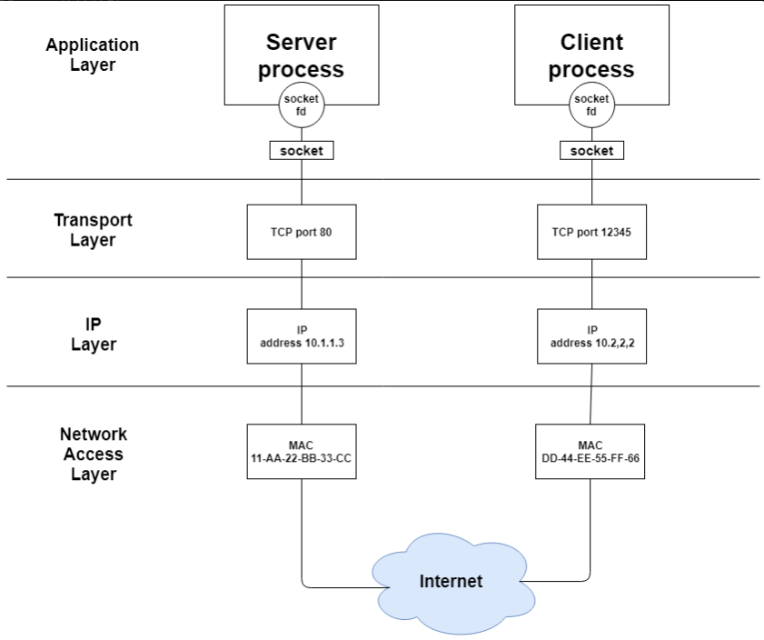
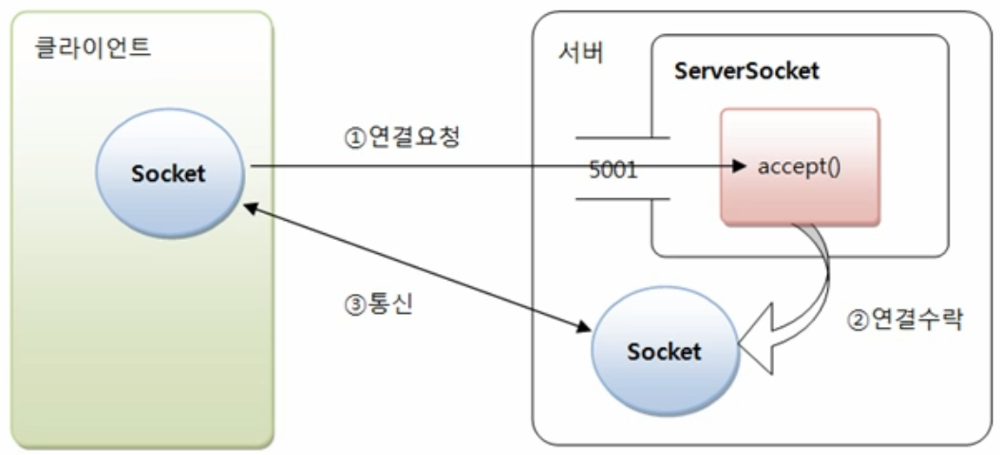

# 24. 소켓프로그래밍

## 소켓(Socket)이란?
 >두 프로그램이 네트워크를 통해 서로 통신을 수행할 수 있도록 양쪽에 생성되는 링크의 단자입니다.
 >두 소켓이 연결되면 서로 다른 프로세스끼리 데이터를 전달할 수 있습니다.<br>
 >결국 소켓이 구현됨으로써 네트워크 및 전송 계층의 캡슐화가 가능해집니다.<br> 
 >소켓은 원래 캘리포니아 버클리 대학 분교에서 UNIX용으로 개발되었으며,<br> 
 >UNIX에서의 입출력 메소드의 표준인 개방/읽기/쓰기/닫기 메커니즘을 따릅니다.<br> 

- 기본적으로 소켓은 통신을 위한 일종의 통로라고 생각할 수 있습니다. 
- 기본적으로 소켓은 상대방에게 데이터를 보내거나 받는 역할을 하며, 
  연결을 수동적으로 기다리느냐 , 능동적으로 연결을 하느냐로 [서버 ] 냐 [ 클라이언트] 냐 구분할 수 있습니다.

## 소켓의 구성 요소
  - 소켓의 구성요소로는 프로토콜, IP 주소, 포트 번호가 있다.
   #### 프로토콜
   > 프로토콜은 데이터 전송을 위한 표준 집합 규칙이다. 주로 TCP/IP, UDP/IP 프로토콜을 사용한다.
  - TCP/IP
    >연결 설정 후 통신이 가능한 연결형 프로토콜이다.<br>
	>신뢰성있는 데이터 전송의 특징을 가지고 있다. 필요할 경우 데이터를 재전송한다.<br>
	>데이터 경계의 구분이 없는 바이트 스트림(Byte-Stream) 서비스이다.<br>
  - UDP/IP
    >연결 설정 없이 통신이 가능한 비연결형 프로토콜이다.<br>
	>TCP에 비해 신뢰성이 떨어지는 데이터 전송의 특징을 가지고 있다.<br>
	>데이터를 재 전송하지 않는다.<br>
	>데이터 경계를 구분하는 데이터그램(Datagram) 서비스이다.<br>
 #### IP 주소 (송/수신 측)
  - IP 주소는 서버 장비 또는 네트워크 장비(호스트)를 주소로 표현한 것이다. 
  - IP 주소는 호스트마다 하나씩 있으며 고유한 특성을 가지고있다.
 #### 포트번호 (송/수신 측)
  - 포트 번호는 통신을 사용하는 어플리케이션을 식별하는 번호이다.
  - 포트는 65535까지 사용할 수 있지만, 사용자가 사용할 수 있는 포트는 1024 ~ 65535까지 사용할 수 있다.
 #### 소켓의 통신 과정
  - 아래 그림은 연결 지향형 소켓 (TCP)의 예시이다.
     <br><br><br>
     


 #### 소켓(TCP)과 서버소켓을 사용한  자바프로그래밍 

  - TCP(Transmission Control Protocol)은 연결지향적 프로토콜을 말한다. 
    연결지향 프로토콜이란 클라이언트와 서버가 연결된 상태에서 데이터를 주고받는 프로토콜을 의미한다. 
  - 클라이언트가 서버에게 연결을 요청하고, 서버가 그 요청을 수락하면 통신선로가 고정되고, 
    모든 데이터는 그 고정된 통신선로를 통해서 순차적으로 전달된다. 
	
  - 이러한 TCP서버의 역할은 두 가지로 볼 수 있는데 하나는 클라이언트가 연결요청을 하면 연결을 수락하는 것이고,
    다른 하나는 연결된 클라이언트와 통신하는 것이다. 
  - 자바에서는 이 역할을 대신 해주는 클래스를 따로 제공하고 있는데 그것이 바로 소켓(Socket)이란 클래스이다.
  - 소켓(socket)은 프로세스 간 통신에 사용되는 양쪽 끝 단을 의미한다. 
    쉽게 말해서 프로그램은 다른컴퓨터에 있는 프로그램과 통신하기 위해 바로 이 소켓을 이용하는데 , 
	프로그램이 통신하기 위해 소프트웨어로 작성된 통신의 접속점이라고 할 수 있는 것이다. 
    때문에 만약 서버와, 그 서버에 접속하고자 하는 클라이언트가 있다고 한다면 그 둘에게 모두 이 소켓이 존재해야 둘 사이의 소통이 가능하다.   	

 -	**ServerSocket(서버 소켓)**​​

: 서버 소켓은 말그대로 서버프로그램에서만 사용되는 소켓이다. 서버소켓은 클라이언트로부터 연결요청이 오기를 기다렸다가 연결 요청이 오면 클라이언트와 연결을 맺고 다른 소켓을 만드는 일을 한다. 서버 클래스에서 생성해주면 되는데 생성방법은 다음과 같다. 
```java
ServerSocket serverSocket = new ServerSocket(포트번호);
Socket socket = server.accept();  //클라이언트로부터 연결요청이 오면 연결을 맺고 클라이언트 소켓을 생성해 리턴한다. 
```
accept()메소드는 클라이언트가 연결 요청하기 전까지 블로킹 되는데, 블로킹이란 스레드가 대기상태가 된다는 뜻이다. 그렇기 때문에 클라이언트가 연결요청을 하면 accept()는 클라이언트와 소통할 소켓을 만들어서 리턴하게된다. 

 - **Client Socket(클라이언트 소켓)**
 : 클라이언트 소켓은 기대할 필요가 없기 때문에 바로 클라이언트 소켓을 생성한다. 클라이언트 프로그램에서 클라이언트 소켓은 서버 프로그램으로 연결요청을 하는 것과 데이터 전송을 하는 일을 한다. 

 ```java
 Socket socket = new Socket(서버 아이피번호, 서버 포트번호);
 ```

 이 때 서버 아이피 번호는 서버 클래스가 존재하는 컴퓨터의 아이피 번호가 필요하고, 서버 포트 번호는 위의 서버소켓에서 등록해 놓은 포트번호를 적어주어야 통신이 가능하게된다. 

 ```java
 //서버 클래스
 import java.io.IOException;
import java.net.InetSocketAddress;
import java.net.ServerSocket;
import java.net.Socket;

public class Server {
	public static void main(String[] args) {
		try {
			ServerSocket serverSocket = new ServerSocket(9500); // 포트번호를 9500번으로 지정
			while (true) {
				System.out.println("연결을 기다리는 중...");
				Socket socket = serverSocket.accept();
				InetSocketAddress isa = (InetSocketAddress) socket.getRemoteSocketAddress();
				System.out.println("연결 수락됨" + isa.getHostName());
			}
		} catch (IOException e) {
		}
	}
}
 
 ```

 ```java
 //클라이언트 클래스
import java.net.Socket;
public class ProtocolClient {
	public static void main(String[] args) {
		try {
			Socket socket = new Socket("172.30.1.28", 9500);
			System.out.println("연결성공");
		} catch (Exception e) {
			e.printStackTrace();
		}
	}
}
 ```