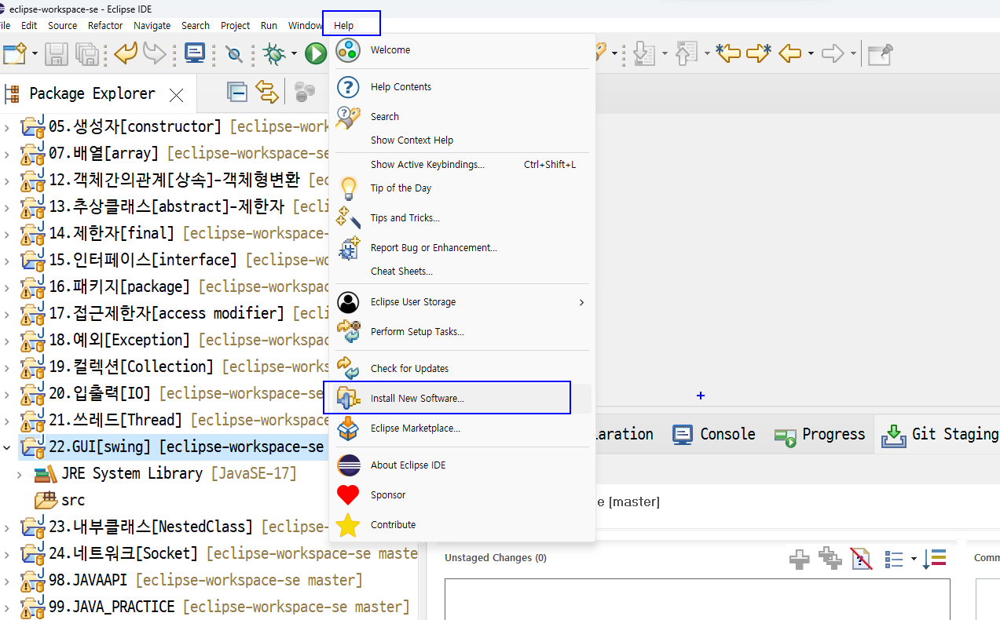
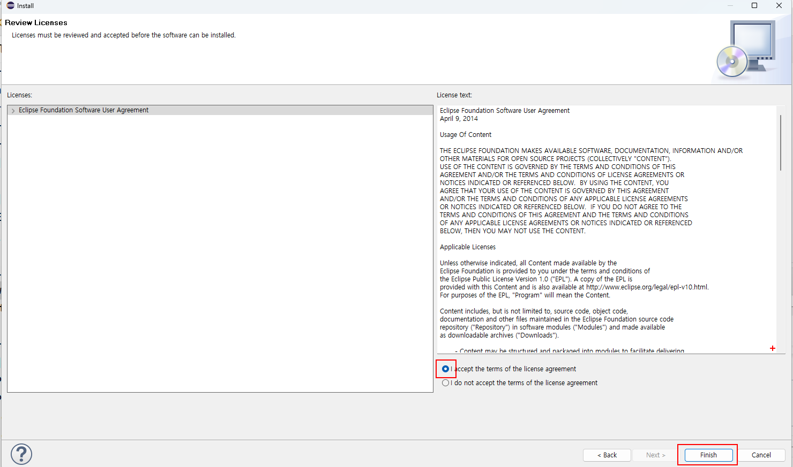

## intro

* 강사(김경호)메일주소
   * guard884@gmail.com

* todo
   * github가입
   * chrome 다운로드
   * font D2코딩체
   * 파일탐색기 메뉴--> 표시-->보기 -->파일확장명,숨긴항목체크
   * c: 드라이브에 2023-12-JAVA-DEVELOPER 이름폴더생성


* 문서공유
  * 문서
    + [구글드라이브](https://drive.google.com/drive/folders/1bTqyPV9LQt8vly7V_bixG2kpu6THkB7w?usp=sharing)
  * 개발툴
    + [프로그램](https://drive.google.com/drive/folders/1ZKorZjj1WoJybMocCmomdpRW3Fhy7g8D?usp=sharing)
  
  * GITHUB아이디
    + [GITHUB아이디](https://docs.google.com/spreadsheets/d/12CtD8kfUAPEzuMrKnuuY7dXbSTz2O5NxcCaWqn2xk0I/edit#gid=0)

* GITHUB 가입 
   + [GITHUB 가입](https://docs.google.com/document/d/1_Gb8dwQX6gxToSQ_ehPVc3GzlLSa8_-jz_xxfWlAnS4/edit?usp=sharing)


* 크롬부라우져설치
  * https://www.google.com/chrome/
 

* D2코딩체다운설치
   * https://github.com/naver/d2codingfont/releases

* NotePad++ 다운설치
   * https://notepad-plus-plus.org/downloads/


* JDK
  * http://www.oracle.com/index.html
  * https://www.oracle.com/java/technologies/downloads/#java8-windows

* 이클립스
  * https://www.eclipse.org/downloads/packages/release


 ## 이클립스 플러그인
 
   ### window builder
   - https://github.com/eclipse-windowbuilder/windowbuilder
   - [https://download.eclipse.org/windowbuilder/updates/nightly/latest](https://download.eclipse.org/windowbuilder/updates/nightly/latest)

      - Help -->   Install New SoftWear
        
      - Add click  
        
      - Add Repository
        ```
        Name     :WindowBuilder<br>
        Location:https://download.eclipse.org/windowbuilder/updates/nightly/latest
        ```
        
        
        
        
        

  ### properties editor
     * http://propedit.sourceforge.jp/eclipse/updates/
 
  ### UML,ERD
   * http://takezoe.github.io/amateras-update-site/
   * https://github.com/takezoe/amateras-modeler
   * <b><< eclipse.ini 파일의 마지막에 추가>></b>
      ```
       --add-opens=java.desktop/java.beans=ALL-UNNAMED
      ```
      
   * 이클립스 UML,ERD 플러그인설치 <br>
      <a href='https://github.com/2023-12-JAVA-DEVELOPER-149/01.JAVA_FUNDMENTAL/blob/master/%5B%EC%9D%B4%ED%81%B4%EB%A6%BD%EC%8A%A4%ED%94%8C%EB%9F%AC%EA%B7%B8%EC%9D%B8%5DUML%26ERD.md'>
이클립스 UML,ERD 플러그인설치
     </a>
      
     


 * java5 api doc 한글API
   * http://cris.joongbu.ac.kr/course/java/api/index.html?overview-tree.html

 * jdk8  api doc
   * http://docs.oracle.com/javase/8/docs/api/index.html     

 * jdk16 api doc
   * https://docs.oracle.com/en/java/javase/16/docs/api/index.html 


 * 자바문서생성시인코딩설정
   >-locale ko_KR -encoding UTF-8 -charset UTF-8 -docencoding UTF-8
