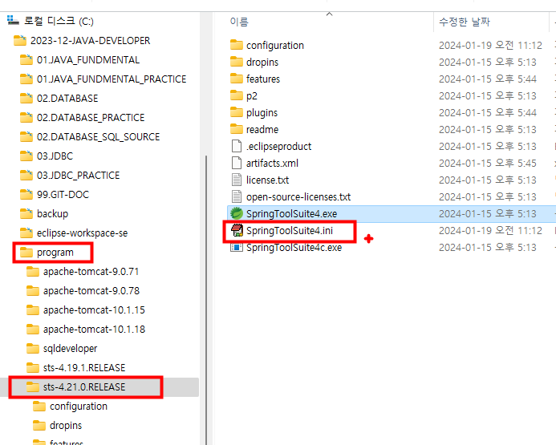

 ## UML,ERD 이클립스플러그인설치
   ### http://takezoe.github.io/amateras-update-site/
   ### https://github.com/takezoe/amateras-modeler
   ### <b> eclipse.ini(SpringToolSuite4.ini) 파일의 마지막에 추가 </b>
   
```
 --add-opens=java.desktop/java.beans=ALL-UNNAMED
```
      
  ### 이클립스 UML,ERD 플러그인설치
      
####  1.이클립스메뉴 Install New Softwear메뉴클릭


#### 2.Add버튼 클릭


#### 3.Add Repository


#### 4.Amateras Modeler선택후 클릭


#### 5.Lience agreements --> finish클릭


#### 6.Trust Authorities --> Trust Selected 클릭


#### 7.Trust Authorities --> Trust Selected 클릭


#### 8.Restart Now버튼 클릭


#### 9.eclipse.ini(SpringToolSuite4.ini) 파일 찾기





#### 10.eclipse.ini(SpringToolSuite4.ini) 파일열기

 

#### 11.eclipse.ini 맨마지막에 다음구문 추가
```
--add-opens=java.desktop/java.beans=ALL-UNNAMED
```


#### 12.이클립스 재시작(restart)
