# GITHUB 리포지터리생성

#### github 에접속후 New Repository 클릭

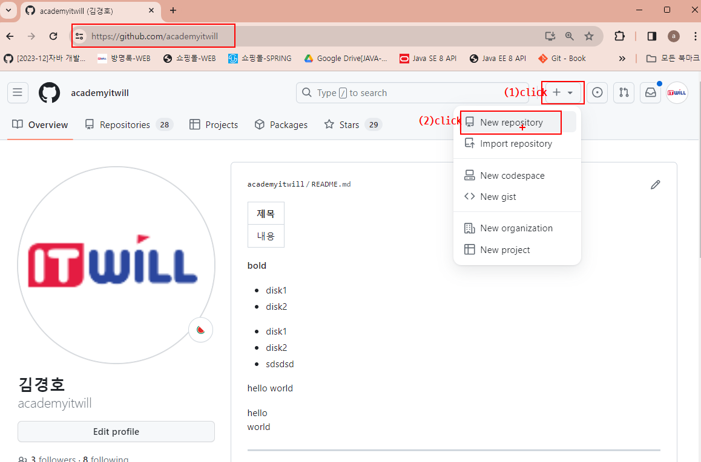

#### repository name  입력후 Create Repository버튼 클릭

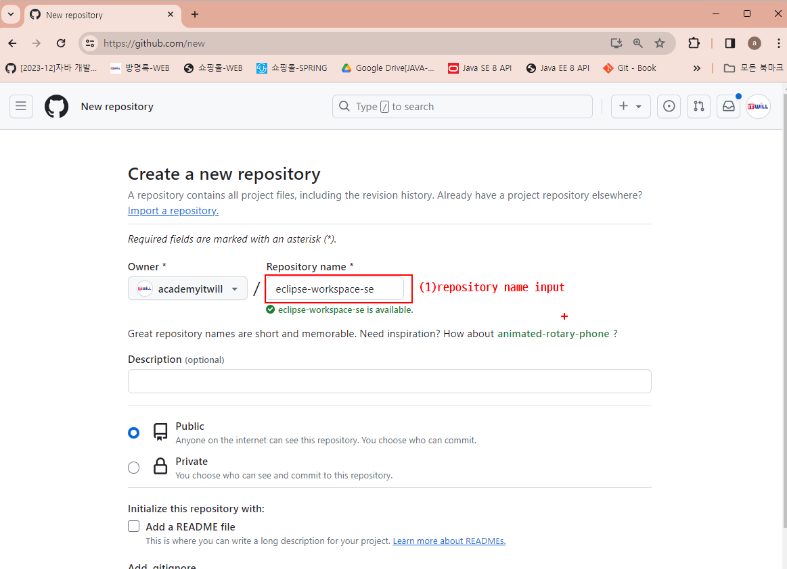

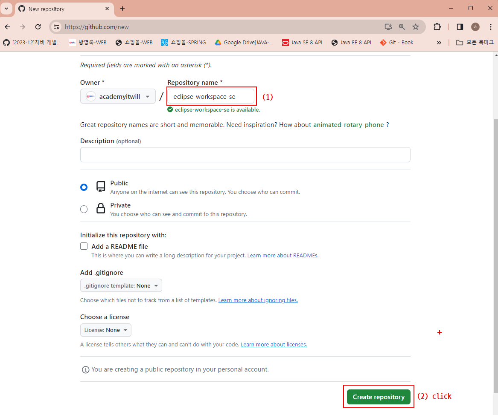

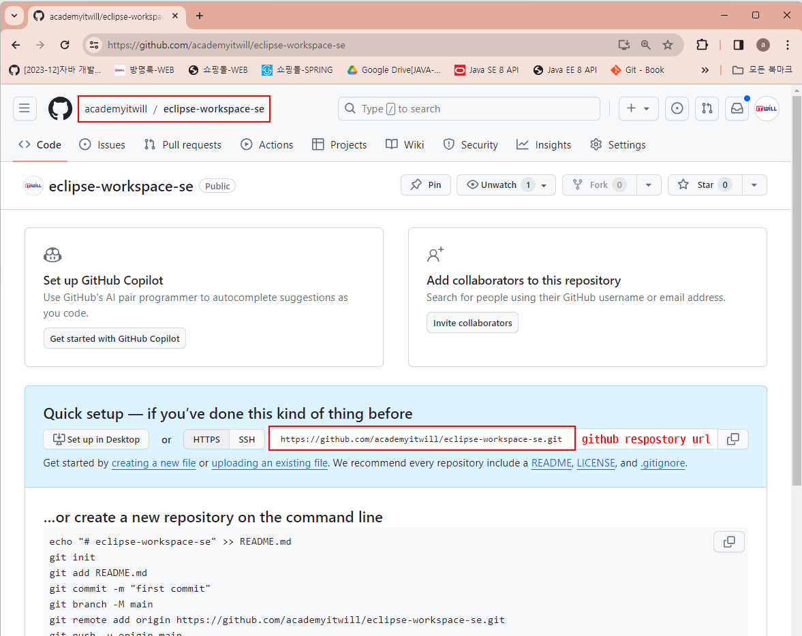

# GITHUB Access Token생성

#### github 계정아이콘 클릭후 Settings 클릭 
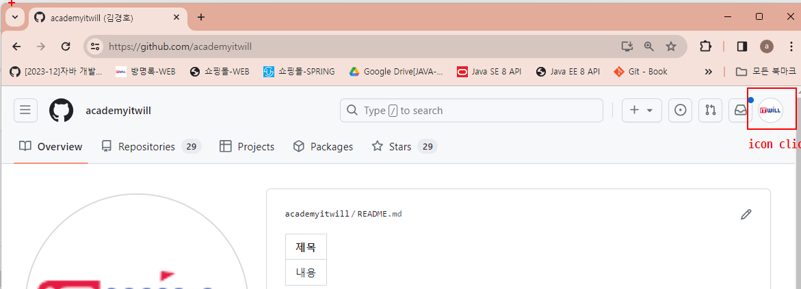

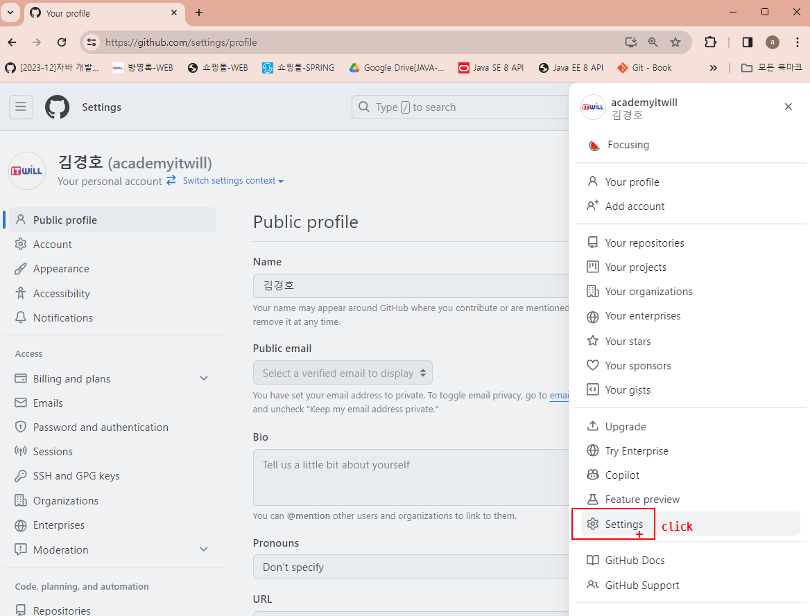

#### Developer settings click

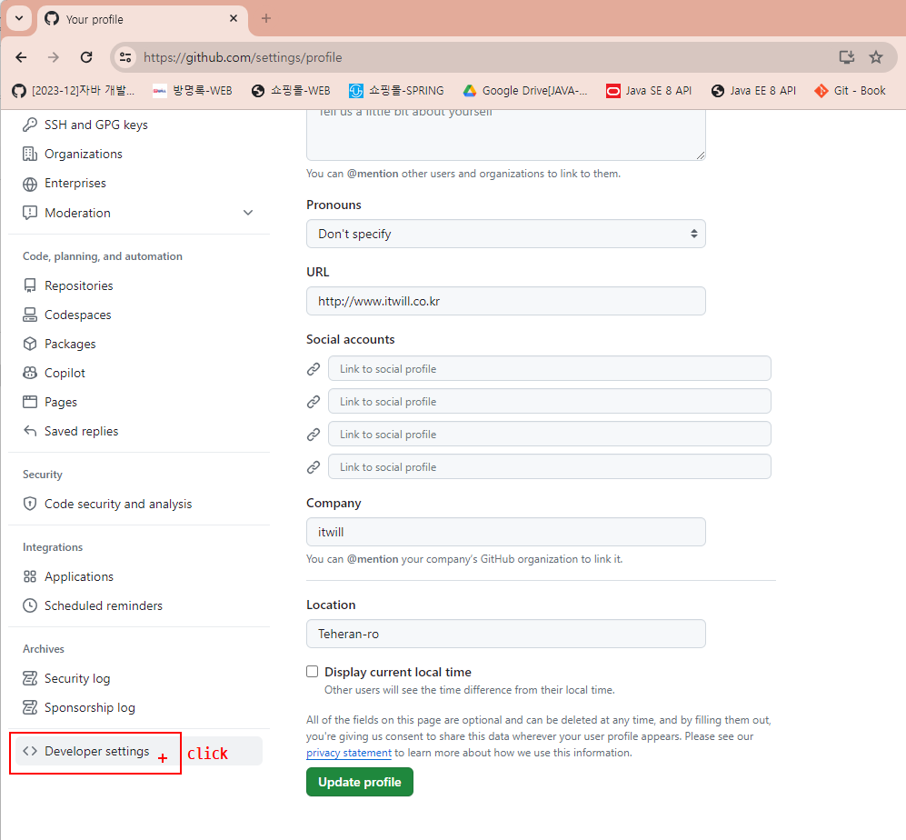

#### Personal Access tokens -> Tokens(classic)클릭

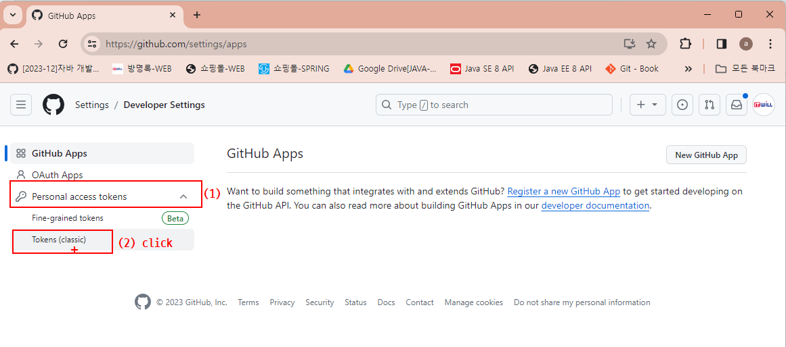

####  Access tokens -> Tokens(classic)클릭

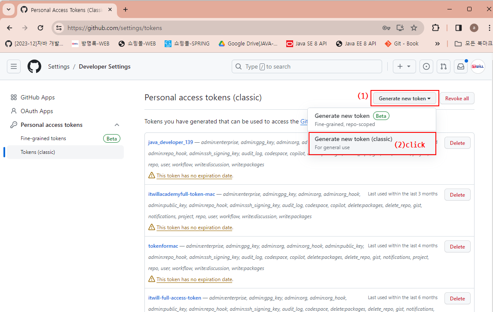

####  Note Expiration Select Scopes 전체체크

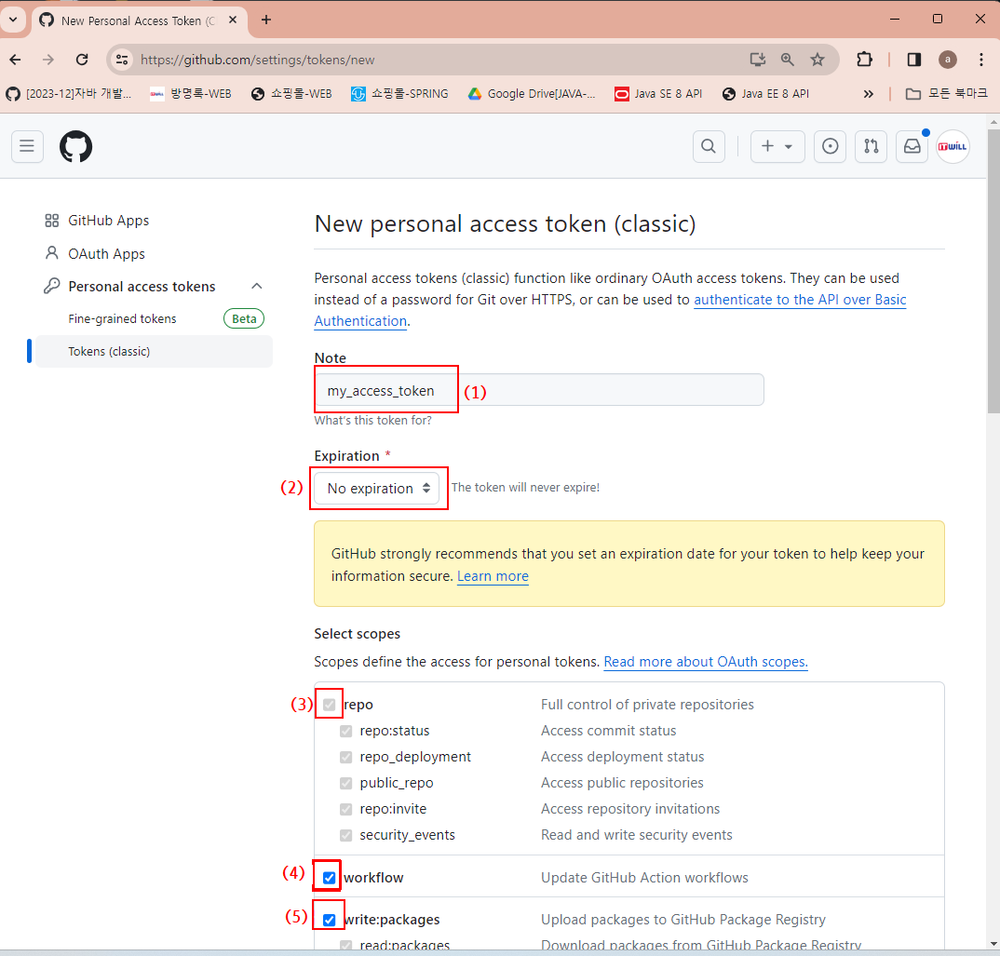

#### Generate token 버튼 click

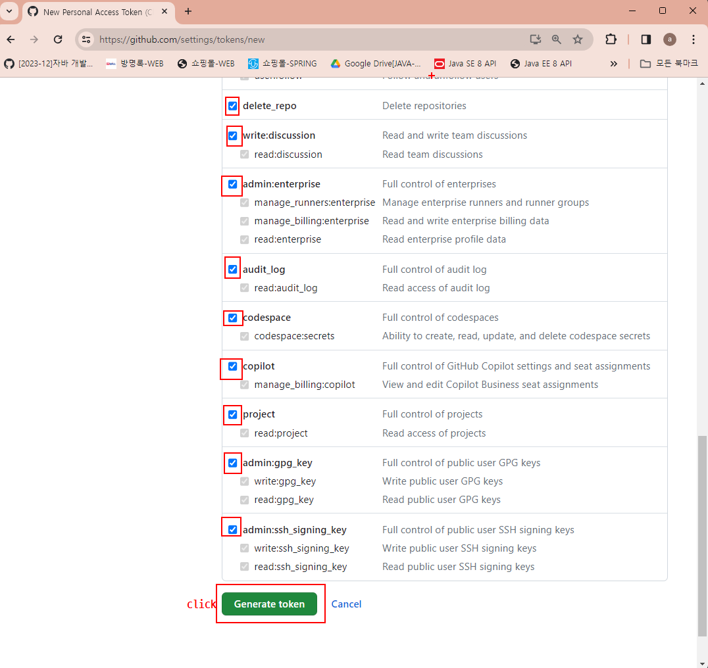

#### 토큰복사후 my_access_token.txt 파일에저장

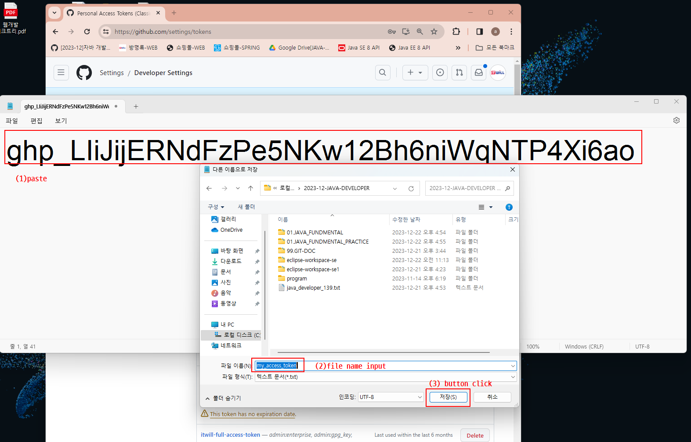
