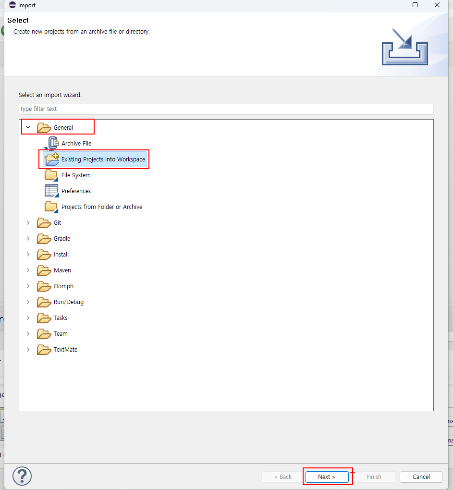
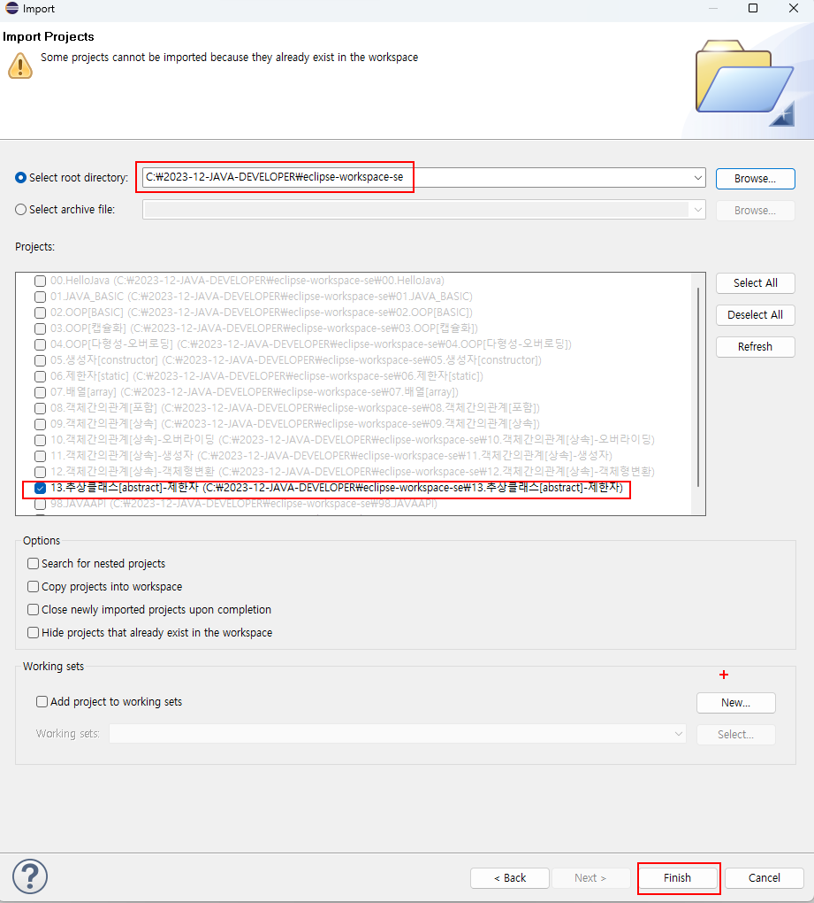
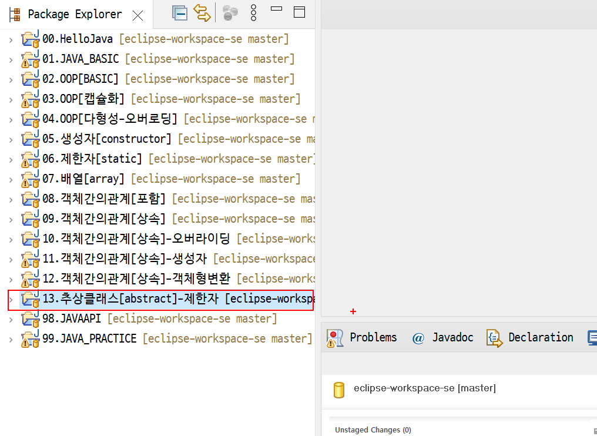

# 이클립스워크스페이스에있는프로젝트 import

 #### 이클립스워크스페이스에 import하고자하는 프로젝트 붙여넣기 

 

 #### 이클립스 Package Explorer에서 우측마우스버튼 import메뉴 클릭 
 

 #### General-> Existing Projects into WorkSpace -> Next 버튼 클릭 
 
 

 #### Select root directory --> eclipse-workspace-se 폴더선택

 

  #### Projects 에서 import 하고자하는 프로젝트 체크후 finish 버튼 클릭 

 

 #### Package Explorer 뷰에서 확인 

 

 
