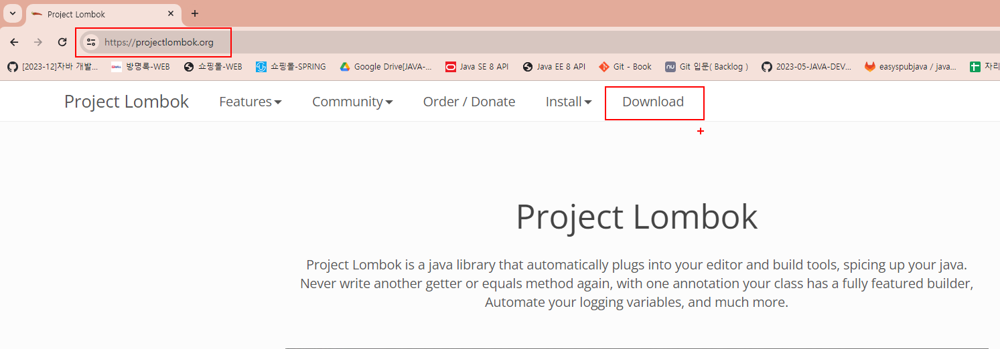
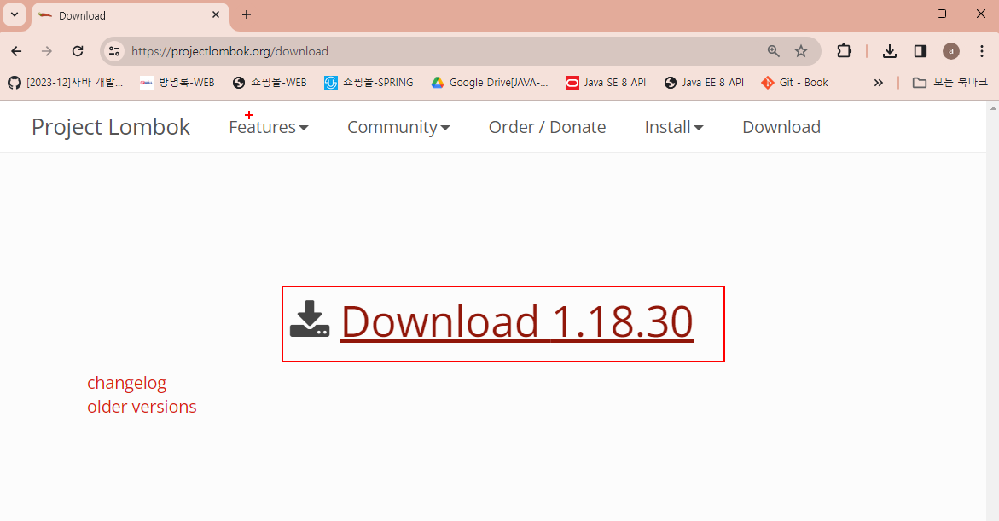
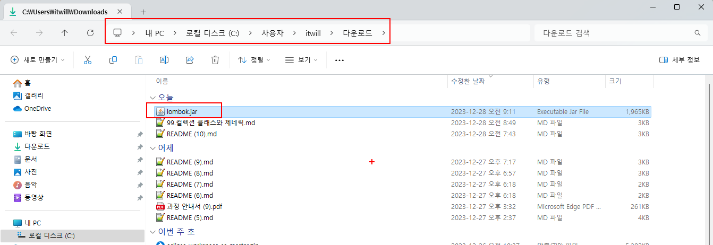
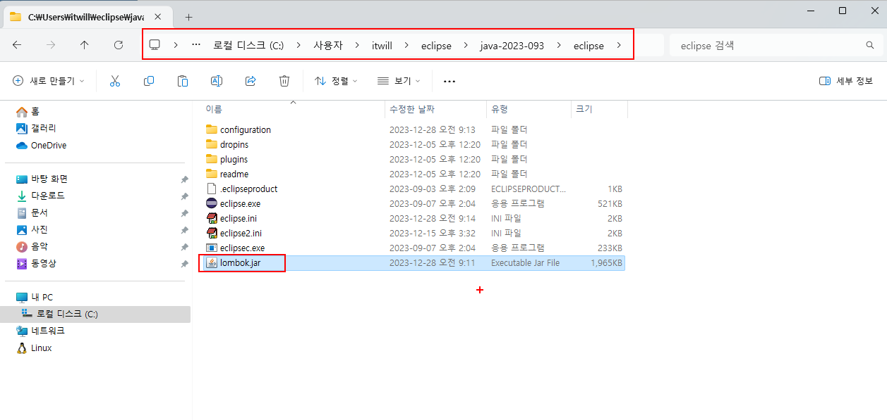
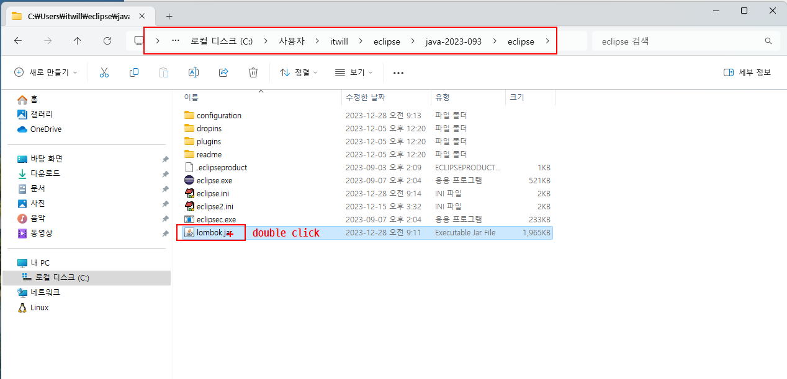
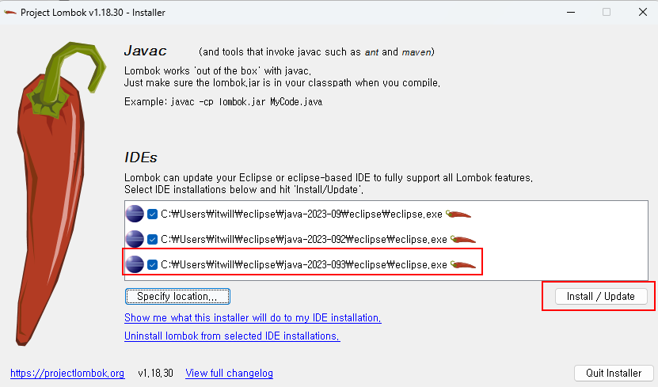
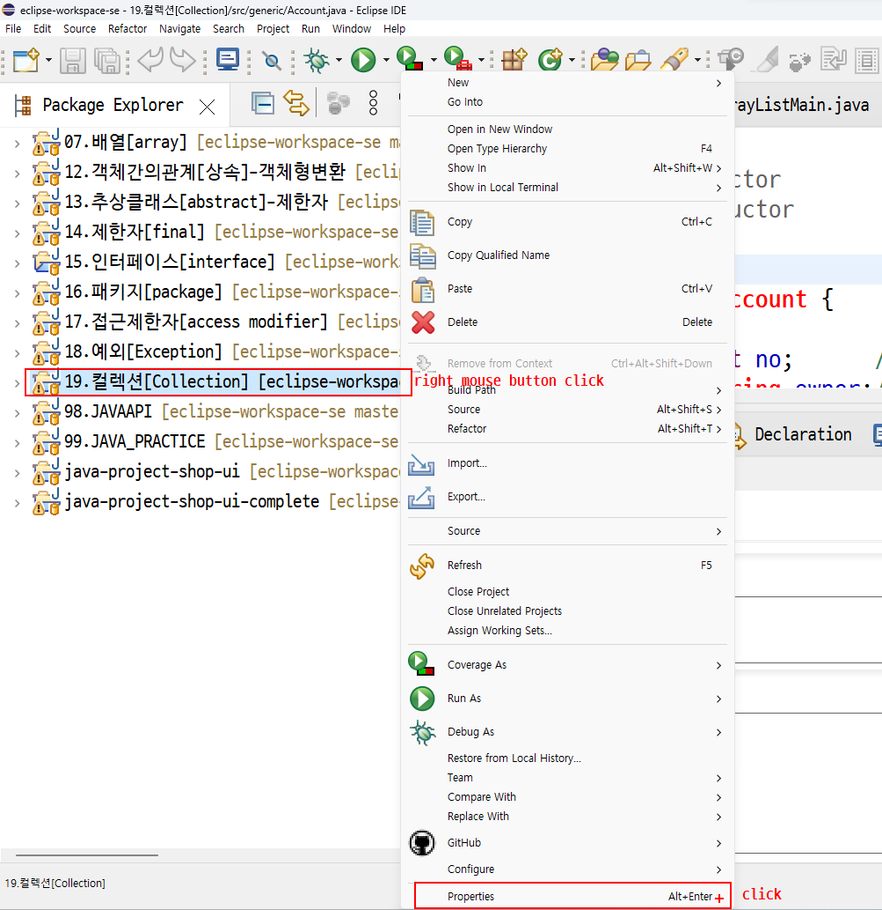
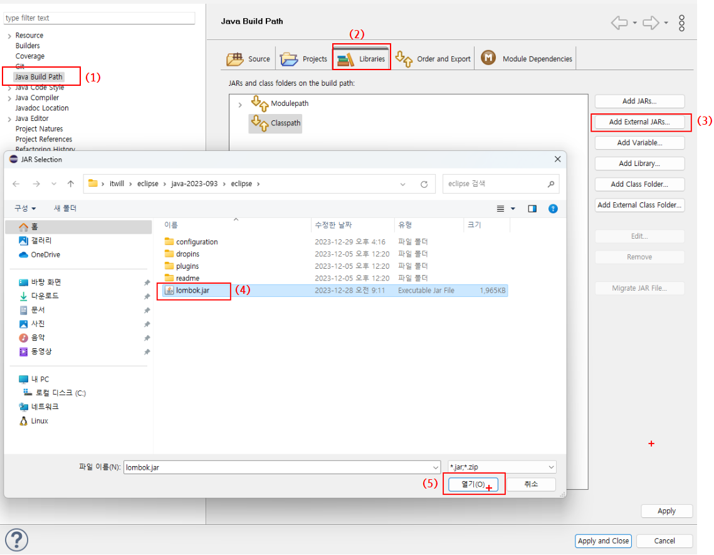
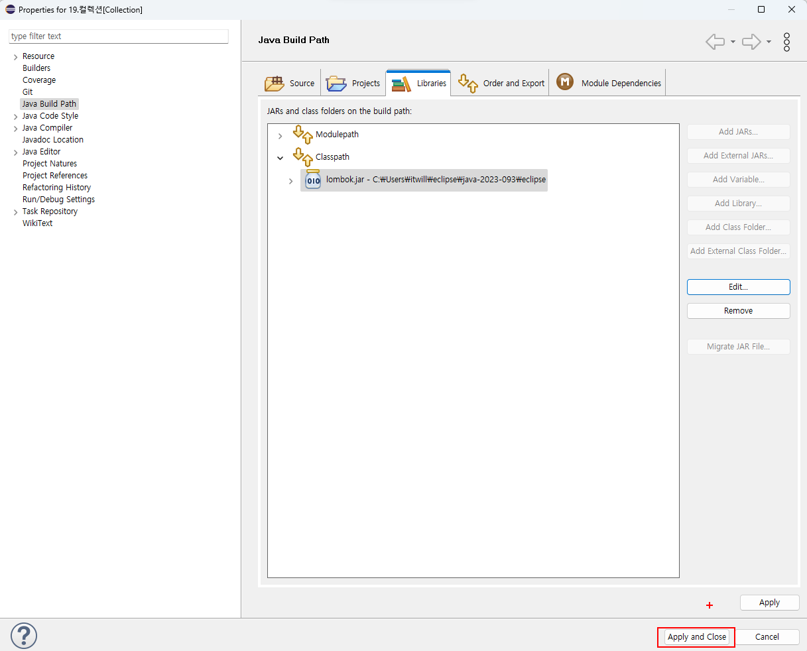
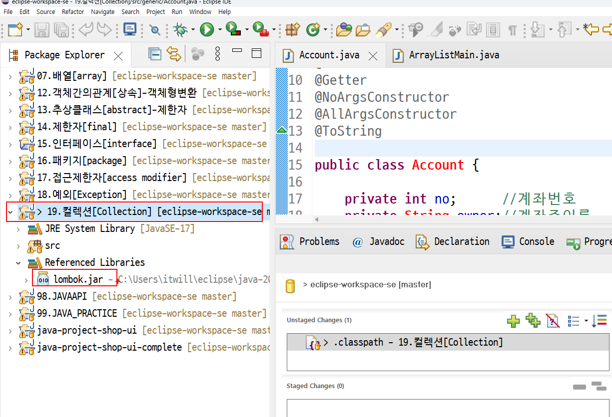

 # Lombok 롬복 이란? 
 
 
 
  > Lombok 란 Java 라이브러리로 반복되는 getter,setter,toString 등의 반복 메서드 성 코드를 줄여주는 코드 다이어트 라이브러리 이다.<br>
  > Java에서 보통 model 클래스나 Entity 같은 도메인 클래스 등에는 수많은 멤버변수가 있고 이에 대응되는 getter, setter 와 toString() 메서드,<br> 
  때에따라 멤버변수에 따른 여러개의 생성자를 만들어주게 되는데 거의 대부분 이클립스나 인텔리제이같은 IDE에서 자동생성 기능이 있지만 이 역시도 번거로운 작업이 아닐 수 없다. 뿐만 아니라 코드 자체가 반복 소스코드로 인해 복잡해지게 된다.<br> Lombok은 여러가지 @어노테이션을 제공하고 이를 기반으로 반복 소스코드를 컴파일 과정에서 생성해주는 방식으로 동작하는 <br>
  라이브러리이다.<br>
  >즉, 코딩 과정에서 롭복과 관련된 어노테이션만 보이고 getter,setter 등의 생략되지만 <br>
  >실제로 컴파일된 결과물 .class 파일에는 코드가 생성되어 있다는 말이다. 

 
 
 ## lombok설치
  

      
###  1. https://projectlombok.org/ 싸이트에서 lombok.jar파일다운로드





### 2.다운로드폴더에서 lombok.jar파일복사후 eclipse설치 디토리붙여넣기





### 3.lombok.jar파일 더블클릭



### 4.Install/Update 클릭



### 5. 프로젝트 properties



### 6.Java Build Path-->Add External JARs..--> lombok.jar 선택->열기


### 7. Apply and Close



### 8.프로젝트 Reference Libraries확인



### 9.이클립스에서 어노테이션붙인후 확인


```java
@Setter 			//setter 메쏘드추가
@Getter 			//getter 메쏘드추가
@NoArgsConstructor	//인자없는 생성자추가
@AllArgsConstructor //모든필드초기화 생성자추가
@ToString           //toString 메쏘드추가(재정의)

public class Account {
	private int no;      //계좌번호
	private String owner;//계좌주이름
	private int balance; //계좌잔고
	private double iyul; //계좌이율
	public void setAccountData(int no,String owner,int balance,double iyul) {
		this.no=no;
		this.owner=owner;
		this.balance=balance;
		this.iyul=iyul;
				
	}
	public void deposit(int money) {
		this.balance=this.balance+money;
	}
	public void withDraw(int money) {
		this.balance=this.balance-money;
	}
	public static void headerPrint() {
		System.out.println("----------------------");
		System.out.printf("%s %s %4s %3s\n","번호","이름","잔고","이율");
		System.out.println("----------------------");
	}
	public void print() {
		System.out.printf("%4d %-4s %6d %4.1f\n",this.no,this.owner,this.balance,this.iyul);
	}
}
```


