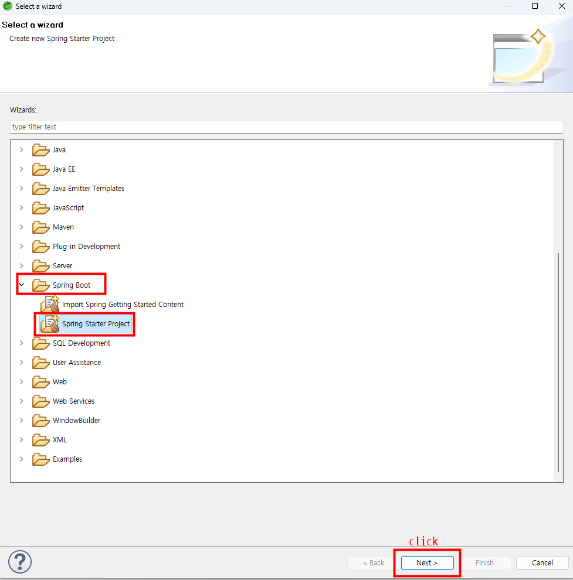
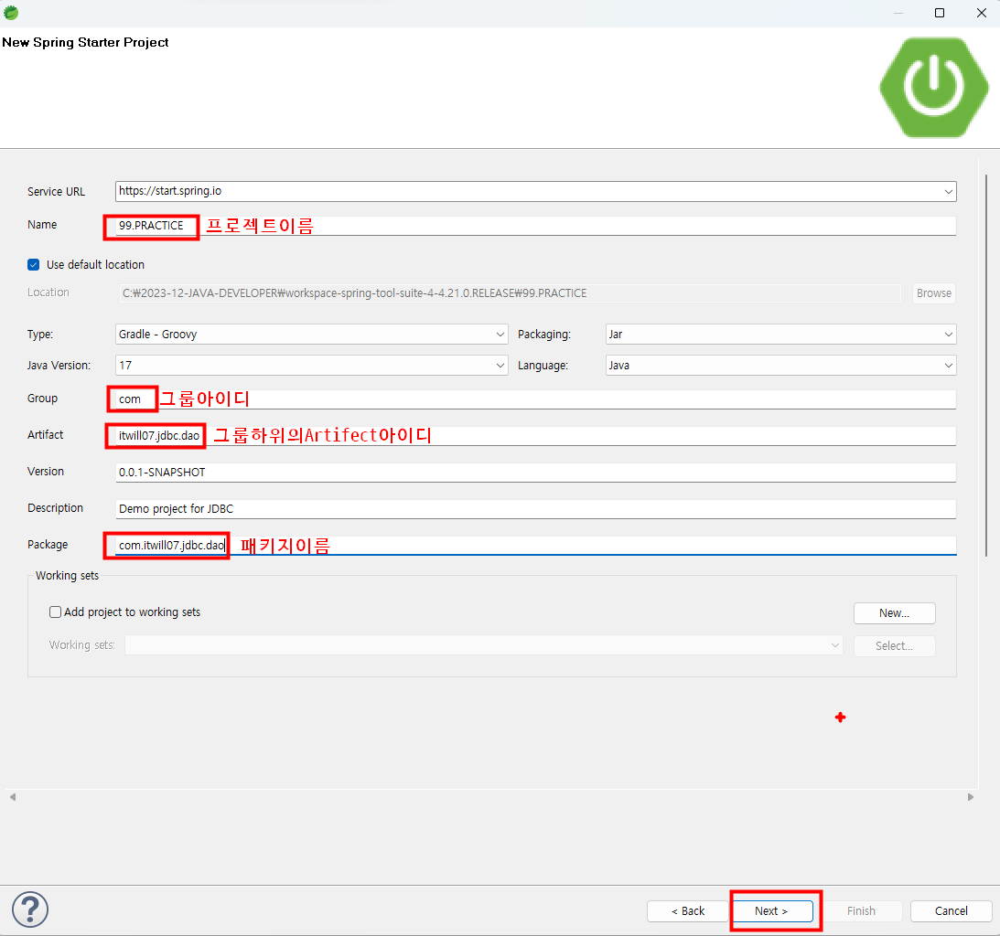
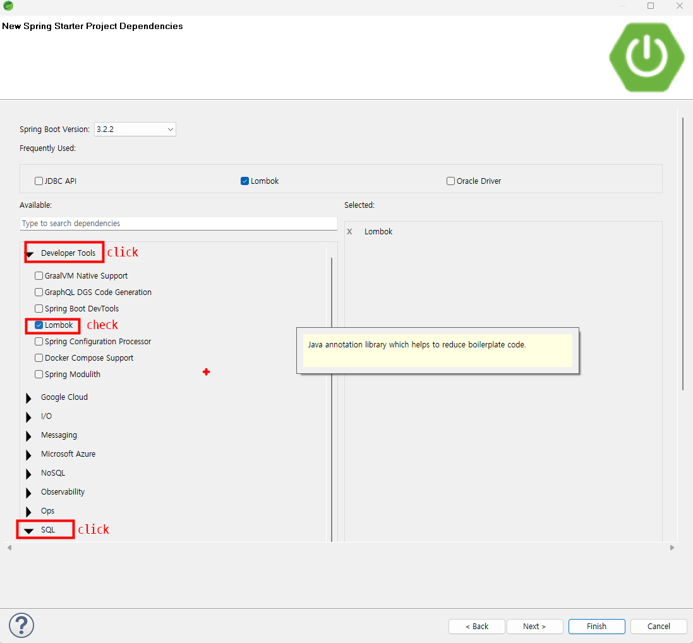
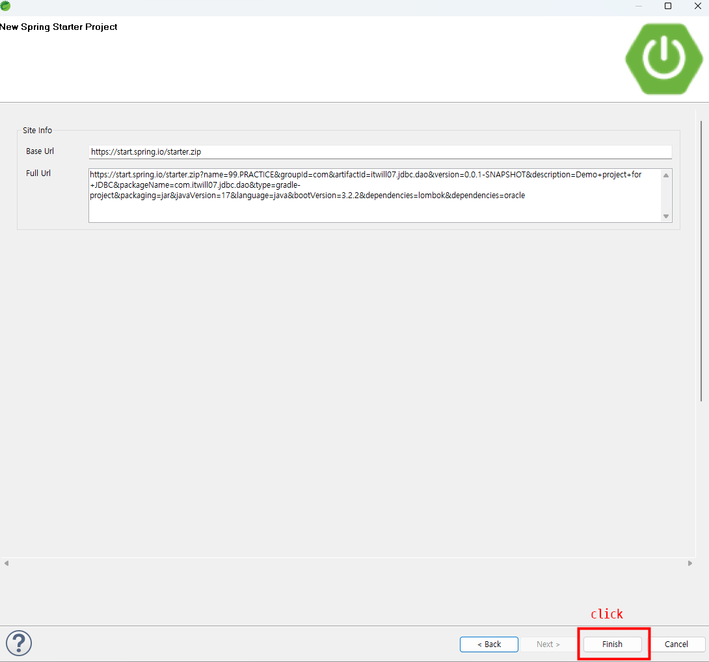
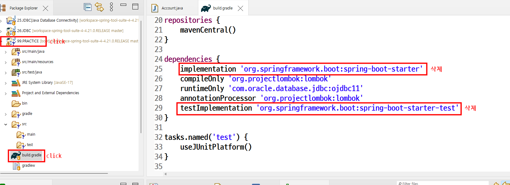
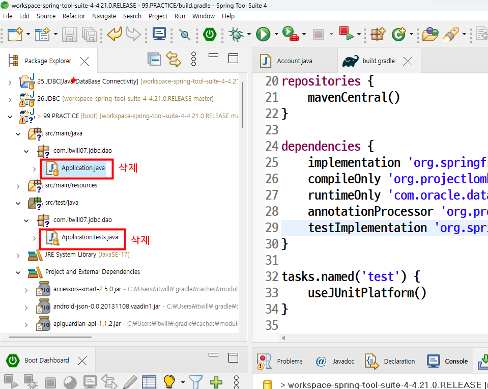
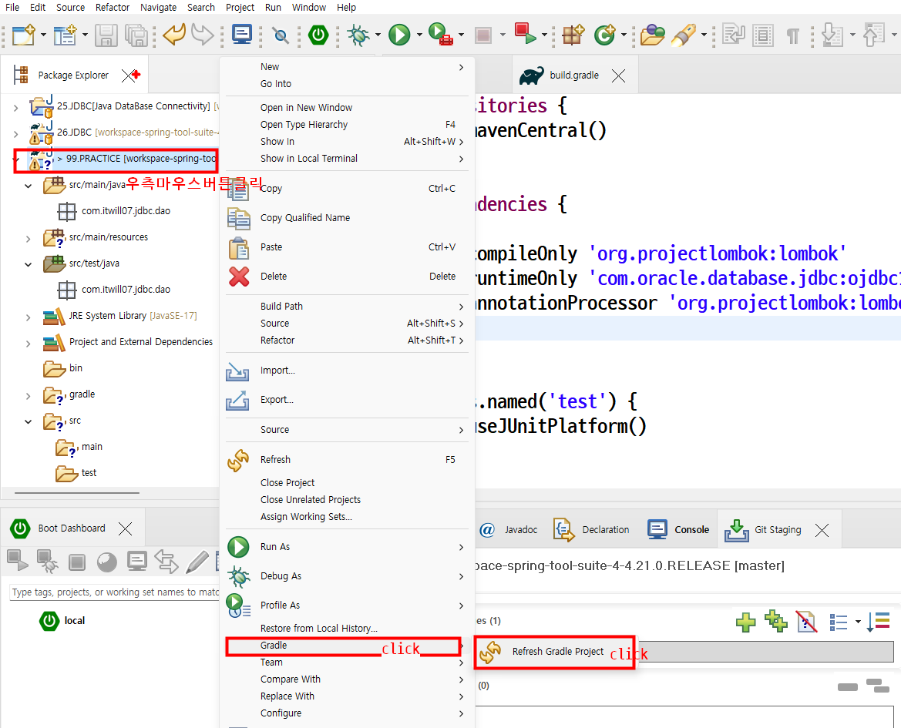
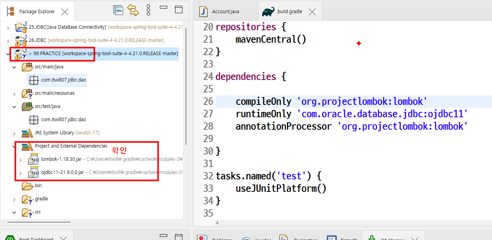

# STS 스프링부트 프로젝트생성

## 스프링부트 Gradle프로젝트생성
      
### 1. Spring Boot --> Spring Starter Project
  
### 2. 프로젝트이름 패키지이름 주기
   
### 3.라이브러리 의존성(dependency) 체크1
   
### 4.라이브러리 의존성(dependency) 체크2
   
### 5.finish  버튼클릭
   
### 6.build.gradle파일에서 spring-boot-starter 와 spring-boot-starter-test항목삭제
   
### 7.application.java파일과 ApplicationTests.java 파일삭제
      
### 8.Refresh Gradle Project
   
### 9.Project 라이브러리 Dependency 확인
   
   

