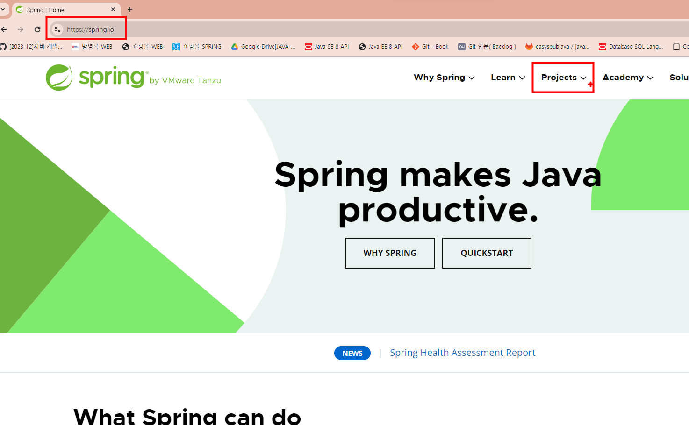
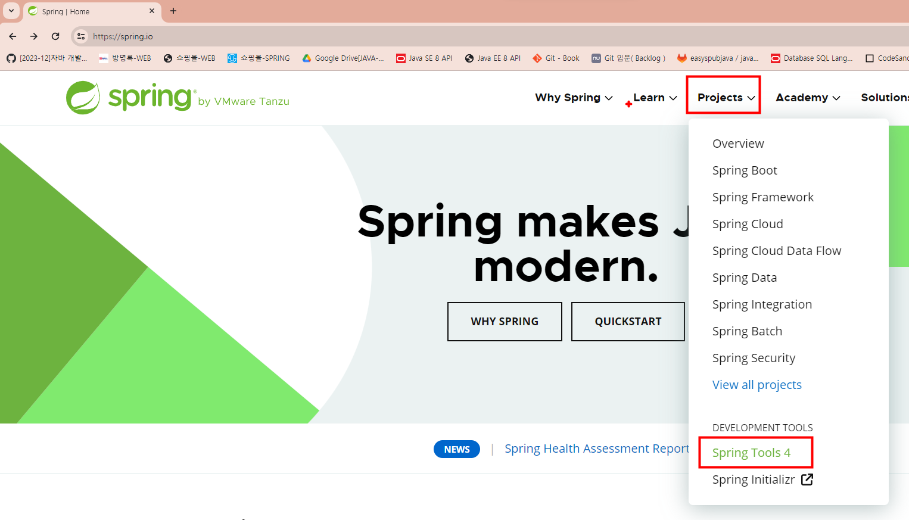
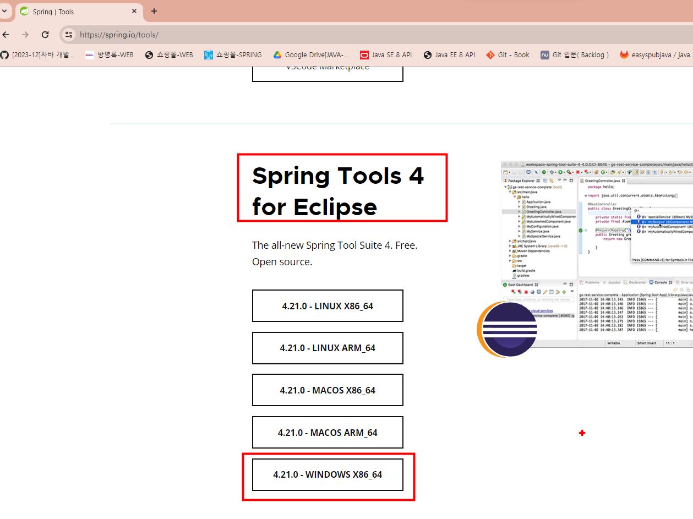
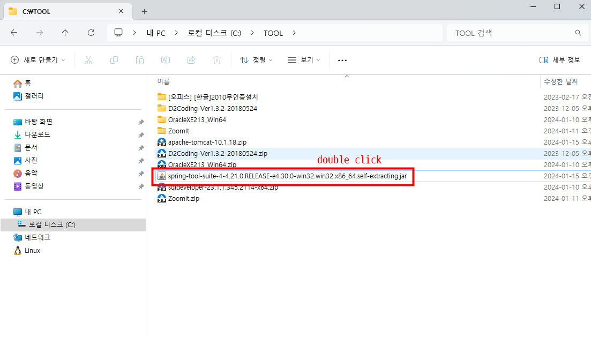
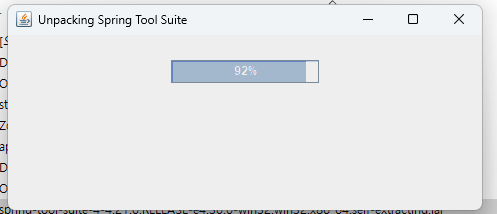
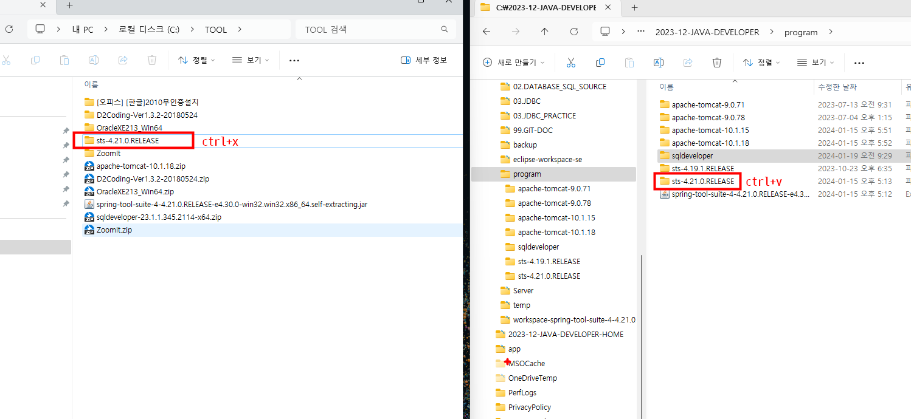
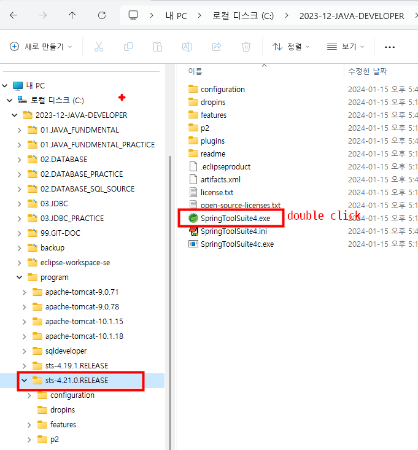
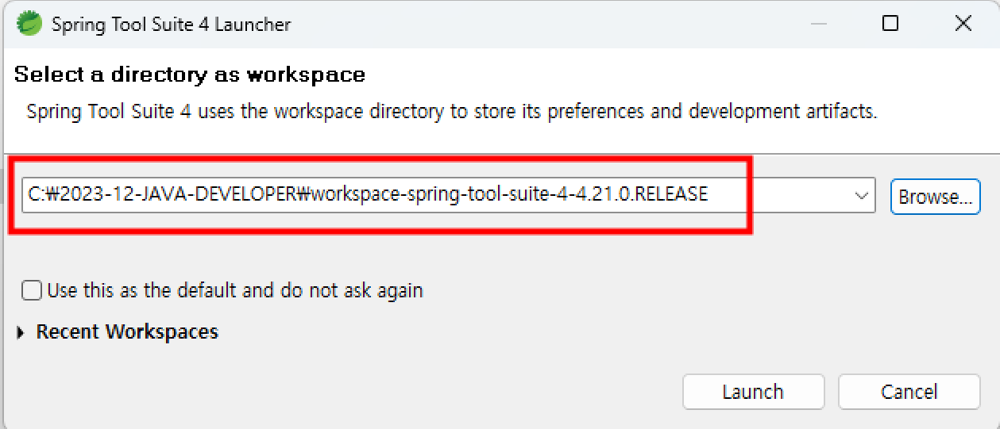
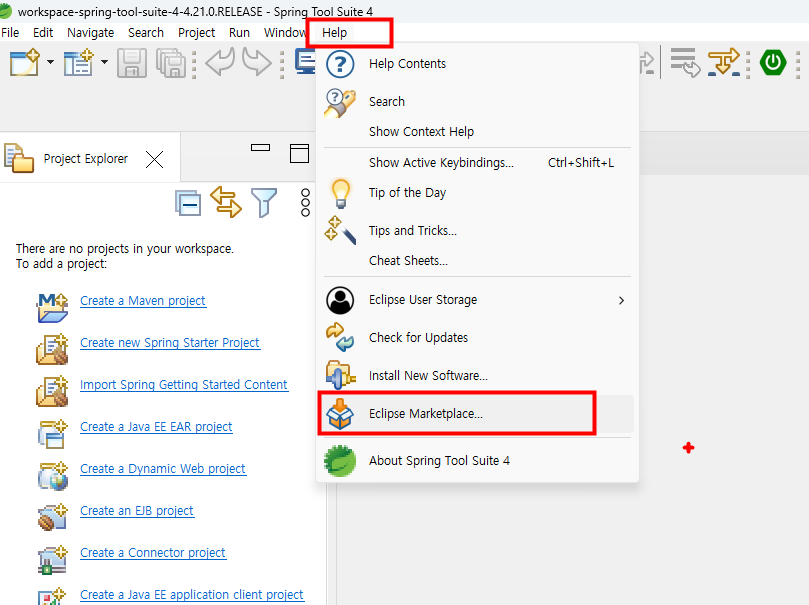
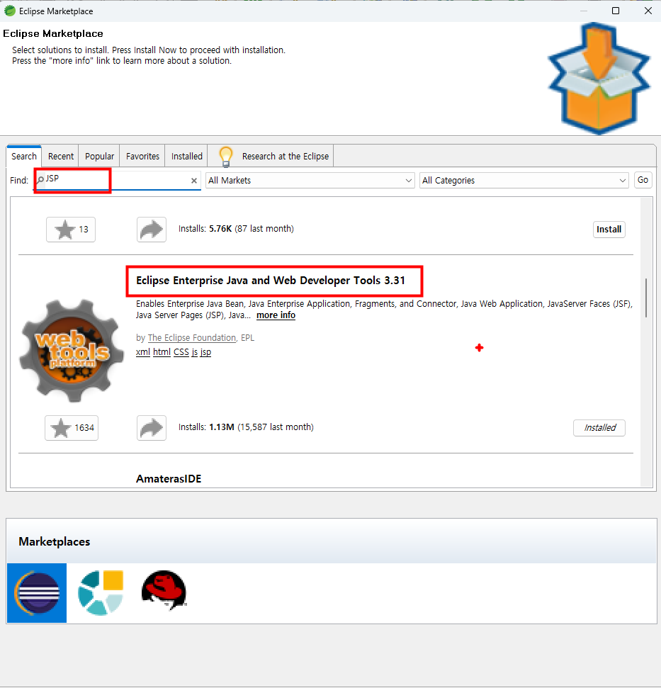

 # STS설치

 
      
###  1. https://spring.io/ 접속

### 2.Projects --> Spring Tools 4 클릭

### 3.Spring Tools4 for Eclipse --> 4.21-WINDOWS X86_64 클릭

### 4.다운로드받은 spring-tool-suite-4-4.21.0.RELEASE-e4.30.0-win32.win32.x86_64.self-extracting.jar 더블클릭

### 5.설치

### 6.압축풀린디렉토리  sts-4.21.0.RELEASE 폴더 잘라내서 프로그램폴더에 붙여넣기

### 7. SpringToolSuite4.exe 파일실행

### 8. 워크스페이스디렉토리선택[C:\2023-12-JAVA-DEVELOPER\workspace-spring-tool-suite-4-4.21.0.RELEASE]

### 9.STS 메뉴에서 Help--> Eclipse MarketPlace..선택

### 10. Find 박스에 JSP입력후 찾기  Eclipse Enterprise Java and Web Developer Tools 3.31 설치

