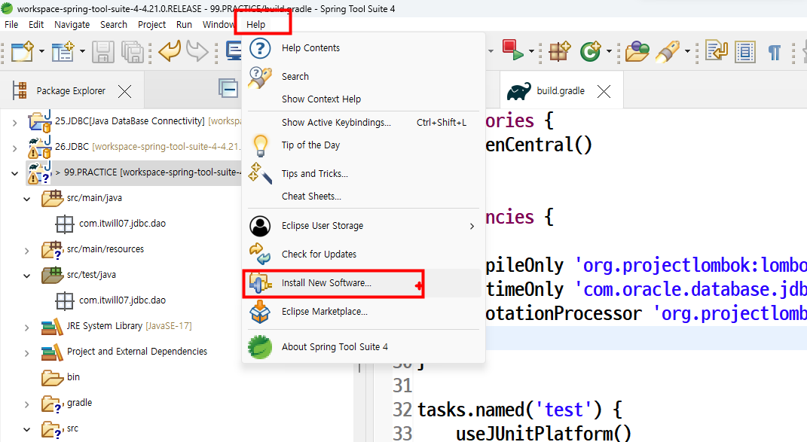
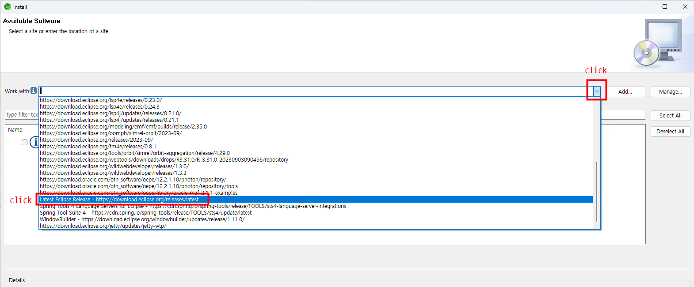
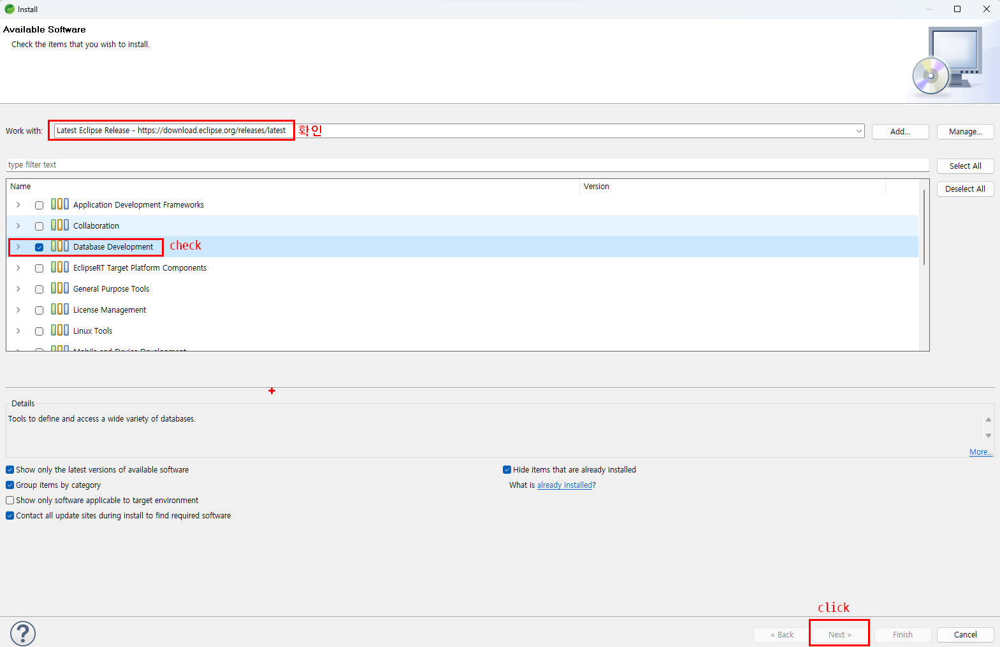

# eclipse Database Development 플러그인설치

      
### 1. STS메뉴바 --> Help --> Install New software.. 클릭
  
### 2. Latest Eclipse Release - https://download.eclipse.org/release/latest 클릭
   

### 3. Database Development 체크후 Next-->Finish
   

